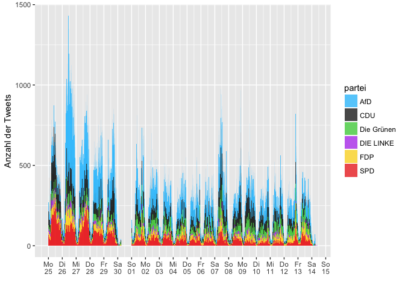
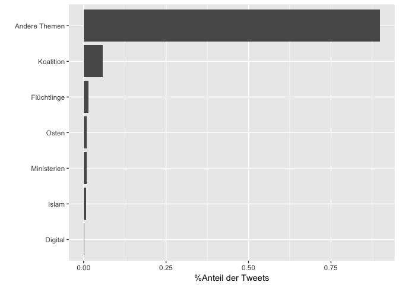
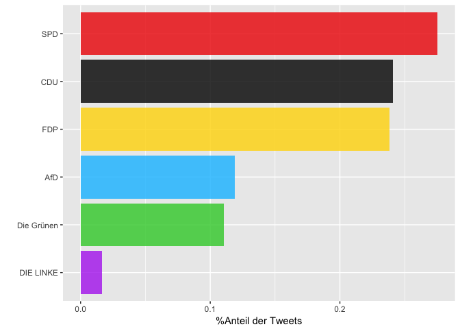
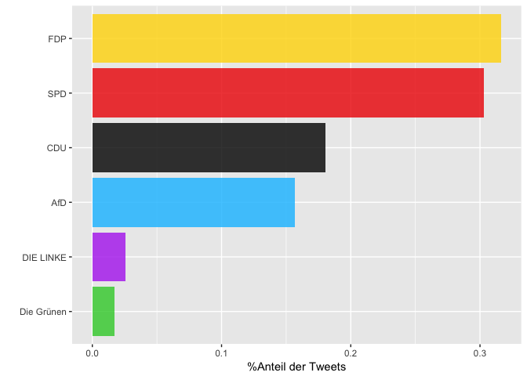
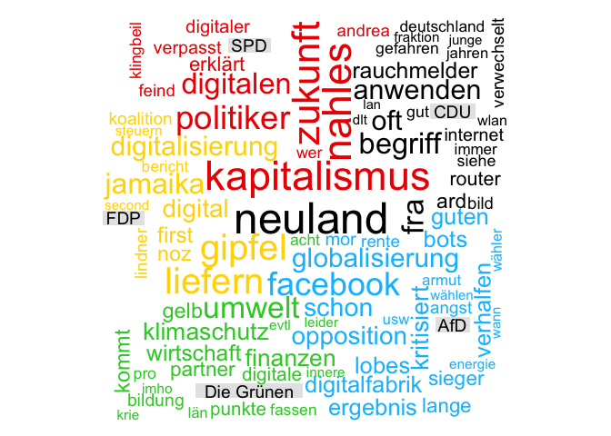
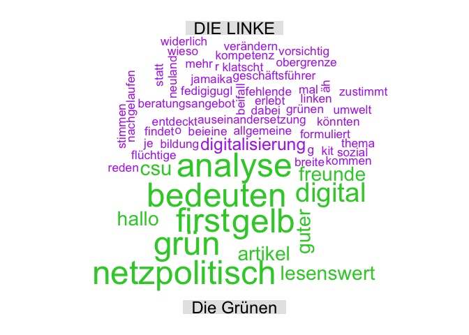
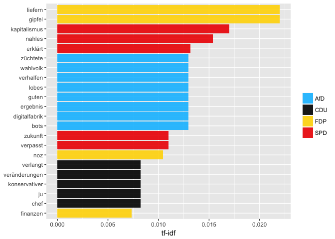

Politische Stimmung auf Twitter zum Thema Digitalisierung
================
2017-10-10

Wie sieht die politische Stimmung bei Twitter in den Tagen nach der Bundestagswahl aus?

Bei der folgenden Analyse soll vor allem das Thema Digitalisierung im Vordergrund stehen. Im Index der EU-Kommission für Digitale Wirtschaft - dem [Digital Economy and Society Index (DESI)](https://ec.europa.eu/digital-single-market/en/news/digital-economy-and-society-index-desi-2017) - belegt die [Bundesrepublik](http://ec.europa.eu/newsroom/document.cfm?doc_id=43012) 2017 nur Platz 11. Wie wird die künftige Bundesregierung mit dem Thema Digitalisierung umgehen? Auch wenn das Thema Digitalsierung im Wahlkampf eher untergeordnet schien, wurden unter anderem folgende Punkte im Zusammenhang mit der Digitalisierung besonders diskutiert:

1.  Förderung der Breitbandversorgung für ein schnelleres Netz.
2.  Schaffung eines öffentlichen Postens, der das Thema Digitalisierung vorantreibt/vertritt. Sei es in Form eines Digitalministeriums (wie es bspw. von der FDP gefordert wurde), oder durch ein "Staatsminister für Digitalpolitik" im Kanzleramt (wie es die CDU vorsieht).
3.  [Wirtschaftspolitischer und kartellrechtlicher Umgang mit digitalen Unternehmen](http://www.m-blog.info/2016/11/nachlese-zum-interdisziplinaeren-workshop-big-data-datenschutz-und-regulierung-in-hamburg/)

Welche Parteien werden am häufigsten in einem Tweet mit "Digitalisierung" genannt? Und worum geht es in diesen Tweets? Wie gewohnt, haben wir alle Tweets gesammelt, die mindestens eine der Bundestagsparteien nennen. Aus diesem Korpus haben wir alle Tweets gefiltert, die das Wort "Digital" (und "Neuland") enthalten.

\*Erläuterungen zu den einzelnen Analyseschritten finden Sie [hier](https://franziloew.github.io/politsentiment/)

### Zeitraum:

Anzahl gesamter Tweets im Zeitraum:

<!--html_preserve-->
<table class="gmisc_table" style="border-collapse: collapse; margin-top: 1em; margin-bottom: 1em;">
<tbody>
<tr style="border-top: 2px solid grey;">
<td style="border-top: 2px solid grey; border-bottom: 2px solid grey; text-align: center;">
204993
</td>
</tr>
</tbody>
</table>
<!--/html_preserve-->
Wie prominent wurde "Digitalisierung" im Vergleich zu anderen Themen besprochen?
--------------------------------------------------------------------------------

Welche Parteien werden am häufigsten in Zusammenhang mit "Digital" verwendet?
-----------------------------------------------------------------------------

Anteil der Nennung einer Partei in einem Tweet im gesamten "Digital"-Korpus.

Zum Vergleich: Der Anteil der Nennung einer Partei im gesamten Korpus:

Wordclouds
----------

Welche Wörter werden im Zusammenhang mit der Digitalisierung verwendet?

Da sowohl Bündis90/Die Grünen, als auch DIE LINKE nicht viele Tweets im Zusammenhang mit "Digitalisierung" aufweisen, haben die Wordclouds zu diesen beiden Parteien eher wenig Aussagekraft. Der Vollständigkeit halber hier trotzdem aufgeführt:

term frequency - inverse document frequency (tf-idf)
----------------------------------------------------

Welche Tweets werden am häufigsten retweeted?
---------------------------------------------

### CDU

<!--html_preserve-->
<table class="gmisc_table" style="border-collapse: collapse; margin-top: 1em; margin-bottom: 1em;">
<thead>
<tr>
<th style="border-bottom: 1px solid grey; border-top: 2px solid grey;">
</th>
<th style="border-bottom: 1px solid grey; border-top: 2px solid grey; text-align: center;">
name
</th>
<th style="border-bottom: 1px solid grey; border-top: 2px solid grey; text-align: center;">
text
</th>
<th style="border-bottom: 1px solid grey; border-top: 2px solid grey; text-align: center;">
retweet\_count
</th>
</tr>
</thead>
<tbody>
<tr>
<td style="text-align: left;">
1
</td>
<td style="text-align: left;">
netzpolitik
</td>
<td style="text-align: left;">
Lustig finde ich, dass Günther Oettinger als Wirtschafts- und Digitalminister damit gehandelt wird, dass die CDU halt niemand besseres habe.
</td>
<td style="text-align: left;">
143
</td>
</tr>
<tr>
<td style="text-align: left;">
2
</td>
<td style="text-align: left;">
budich.orgJournalist
</td>
<td style="text-align: left;">
@gesetzlos\_info das ist Digitalisierung made by "CDU", \#abwimmeln\_kostengünstig
</td>
<td style="text-align: left;">
0
</td>
</tr>
<tr>
<td style="text-align: left;">
3
</td>
<td style="text-align: left;">
Eli
</td>
<td style="text-align: left;">
Die FDP fordert ein Digital-Ministerium? Gute Idee, aber die CDU würde es wohl eher Zauberei-Ministerium nennen...… <https://t.co/YTvstuR4Qq>
</td>
<td style="text-align: left;">
0
</td>
</tr>
<tr>
<td style="text-align: left;">
4
</td>
<td style="text-align: left;">
Dominic Dierig
</td>
<td style="text-align: left;">
Rente, Pflege, Digitalisierung, Fachkräftemangel, Bildung, Niedriglohnsektor! Antwort der CDU: Heimatministerium <https://t.co/ZXgCbiEImW>
</td>
<td style="text-align: left;">
0
</td>
</tr>
<tr>
<td style="border-bottom: 2px solid grey; text-align: left;">
5
</td>
<td style="border-bottom: 2px solid grey; text-align: left;">
Deacon Blues
</td>
<td style="border-bottom: 2px solid grey; text-align: left;">
Anscheinend wird bei der \#CDU der \#Oettinger als Wirtschafts- / Digitalminister diskutiert. Wir werden uns noch nach \#Dobrindt zurücksehnen!
</td>
<td style="border-bottom: 2px solid grey; text-align: left;">
0
</td>
</tr>
</tbody>
</table>
<!--/html_preserve-->
### SPD

<!--html_preserve-->
<table class="gmisc_table" style="border-collapse: collapse; margin-top: 1em; margin-bottom: 1em;">
<thead>
<tr>
<th style="border-bottom: 1px solid grey; border-top: 2px solid grey;">
</th>
<th style="border-bottom: 1px solid grey; border-top: 2px solid grey; text-align: center;">
name
</th>
<th style="border-bottom: 1px solid grey; border-top: 2px solid grey; text-align: center;">
text
</th>
<th style="border-bottom: 1px solid grey; border-top: 2px solid grey; text-align: center;">
retweet\_count
</th>
</tr>
</thead>
<tbody>
<tr>
<td style="text-align: left;">
1
</td>
<td style="text-align: left;">
Gründerszene
</td>
<td style="text-align: left;">
Andrea \#Nahles erklärt „digitalen Kapitalismus“ zum Feind – und verpasst die Zukunft. Ein Kommentar. \#spd \#BTW17… <https://t.co/11Kx8WS9MN>
</td>
<td style="text-align: left;">
87
</td>
</tr>
<tr>
<td style="text-align: left;">
2
</td>
<td style="text-align: left;">
Frank Covfefe
</td>
<td style="text-align: left;">
Wo hat die Nahles das denn wieder aufgeschnappt? "Digitaler Kapitalismus"? Du darfst die Typen von der \#SPD echt ke… <https://t.co/cs1gOB4YFC>
</td>
<td style="text-align: left;">
54
</td>
</tr>
<tr>
<td style="text-align: left;">
3
</td>
<td style="text-align: left;">
Andreas Petzold
</td>
<td style="text-align: left;">
\#Nahles: "Der digitale Kapitalismus greift die soziale Markwirtschaft an!" Klingt voll nach SPD, ist aber Quatsch ~ @tagesthemen
</td>
<td style="text-align: left;">
24
</td>
</tr>
<tr>
<td style="text-align: left;">
4
</td>
<td style="text-align: left;">
Martin Fuchs
</td>
<td style="text-align: left;">
Find ick gut, Die \#SPD hat jetzt eine moderne & digitale interne Grassroots-Bewegung. Viel Erfolg für Parteireform!… <https://t.co/PMvEIdPwZw>
</td>
<td style="text-align: left;">
19
</td>
</tr>
<tr>
<td style="text-align: left;">
5
</td>
<td style="text-align: left;">
Meiko Haas
</td>
<td style="text-align: left;">
"Time to say goodbye" Mein Musiktipp für die \#SPD und @Ralf\_Stegner im digitalen Orbit :) <https://t.co/IB0Ghs8u7F>
</td>
<td style="text-align: left;">
9
</td>
</tr>
<tr>
<td style="border-bottom: 2px solid grey; text-align: left;">
6
</td>
<td style="border-bottom: 2px solid grey; text-align: left;">
Lars Winter
</td>
<td style="border-bottom: 2px solid grey; text-align: left;">
Ein paar Tage nach der Wahl lässt die \#SPD ihre Maske fallen. Statt Pläne für die digitale Zukunft zu präsentieren,… <https://t.co/wHeVbXI3Pf>
</td>
<td style="border-bottom: 2px solid grey; text-align: left;">
7
</td>
</tr>
</tbody>
</table>
<!--/html_preserve-->
### FDP

<!--html_preserve-->
<table class="gmisc_table" style="border-collapse: collapse; margin-top: 1em; margin-bottom: 1em;">
<thead>
<tr>
<th style="border-bottom: 1px solid grey; border-top: 2px solid grey;">
</th>
<th style="border-bottom: 1px solid grey; border-top: 2px solid grey; text-align: center;">
name
</th>
<th style="border-bottom: 1px solid grey; border-top: 2px solid grey; text-align: center;">
text
</th>
<th style="border-bottom: 1px solid grey; border-top: 2px solid grey; text-align: center;">
retweet\_count
</th>
</tr>
</thead>
<tbody>
<tr>
<td style="text-align: left;">
1
</td>
<td style="text-align: left;">
Christian Jung
</td>
<td style="text-align: left;">
Blick nach Stuttgart: \#fdp fordert ein eigenes Digitalisierungs- und Innovationsministerium. \#digitalisierung <https://t.co/WYp96ehZ5A>
</td>
<td style="text-align: left;">
2
</td>
</tr>
<tr>
<td style="text-align: left;">
2
</td>
<td style="text-align: left;">
FDP/DVP-Fraktion
</td>
<td style="text-align: left;">
"Wir brauchen ein eigenes Digitalisierungs- & Innovationsministerium" @timmkern \#fdp \#digitalisierung \#digitalbw ▶️https://t.co/pKuyOo91OU
</td>
<td style="text-align: left;">
1
</td>
</tr>
<tr>
<td style="text-align: left;">
3
</td>
<td style="text-align: left;">
Eli
</td>
<td style="text-align: left;">
Die FDP fordert ein Digital-Ministerium? Gute Idee, aber die CDU würde es wohl eher Zauberei-Ministerium nennen...… <https://t.co/YTvstuR4Qq>
</td>
<td style="text-align: left;">
0
</td>
</tr>
<tr>
<td style="text-align: left;">
4
</td>
<td style="text-align: left;">
Alexander Rackow
</td>
<td style="text-align: left;">
@AnnKristin\_S\_ Wenn \#FDP Digitalministerium, Finanzministerium & EinwanderungsG bekommt, wird sie es wohl machen &… <https://t.co/9nDsEJUdXx>
</td>
<td style="text-align: left;">
0
</td>
</tr>
<tr>
<td style="text-align: left;">
5
</td>
<td style="text-align: left;">
change your mind
</td>
<td style="text-align: left;">
\#Jamaika-Koalition: FDP (?) dementiert Bericht über Superministerium für Digitales <https://t.co/HKv4fHNZaO>
</td>
<td style="text-align: left;">
0
</td>
</tr>
<tr>
<td style="border-bottom: 2px solid grey; text-align: left;">
6
</td>
<td style="border-bottom: 2px solid grey; text-align: left;">
Kai Glasner
</td>
<td style="border-bottom: 2px solid grey; text-align: left;">
Jamaika-Koalition: FDP dementiert Bericht über Superministerium für Digitales <https://t.co/IWOi0NIRl0>
</td>
<td style="border-bottom: 2px solid grey; text-align: left;">
0
</td>
</tr>
</tbody>
</table>
<!--/html_preserve-->
### AfD

<!--html_preserve-->
<table class="gmisc_table" style="border-collapse: collapse; margin-top: 1em; margin-bottom: 1em;">
<thead>
<tr>
<th style="border-bottom: 1px solid grey; border-top: 2px solid grey;">
</th>
<th style="border-bottom: 1px solid grey; border-top: 2px solid grey; text-align: center;">
name
</th>
<th style="border-bottom: 1px solid grey; border-top: 2px solid grey; text-align: center;">
text
</th>
<th style="border-bottom: 1px solid grey; border-top: 2px solid grey; text-align: center;">
retweet\_count
</th>
</tr>
</thead>
<tbody>
<tr>
<td style="text-align: left;">
1
</td>
<td style="text-align: left;">
Jens
</td>
<td style="text-align: left;">
euch ist schon klar, dass der Erfolg der AFD durch die gesellschaftlichen Entwicklungen der digitalen Revolution erleichtert wurde, oder?
</td>
<td style="text-align: left;">
5
</td>
</tr>
<tr>
<td style="text-align: left;">
2
</td>
<td style="text-align: left;">
AfDFraktion\_NRW
</td>
<td style="text-align: left;">
100 Tage Schwarz-Gelb in \#NRW: Und die Digitalisierung? @twittschler \#AfD \#LtNRW <https://t.co/9IPudhHyit>
</td>
<td style="text-align: left;">
5
</td>
</tr>
<tr>
<td style="text-align: left;">
3
</td>
<td style="text-align: left;">
Stuttgarter Zeitung
</td>
<td style="text-align: left;">
\#SPD, \#FDP und \#AfD: Opposition kritisiert Digitalisierungs-Strategie <https://t.co/DolI1Rj7DT> <https://t.co/SWXIt9Cg78>
</td>
<td style="text-align: left;">
4
</td>
</tr>
<tr>
<td style="text-align: left;">
4
</td>
<td style="text-align: left;">
Deutscher Kulturrat
</td>
<td style="text-align: left;">
Gerade erschienen! Der kulturpolitische Wochenreport (40. KW): \#Bundeskulturministerium, \#AfD, \#Digitalisierung… <https://t.co/LwTrhcGwwT>
</td>
<td style="text-align: left;">
4
</td>
</tr>
<tr>
<td style="text-align: left;">
5
</td>
<td style="text-align: left;">
Deutscher Kulturrat
</td>
<td style="text-align: left;">
Der kulturpolitische Wochenreport (39. KW) \#AfD, \#Digitalisierung, \#Umweltbildung, \#Bundestagskulturausschuss:… <https://t.co/204yaeTPDB>
</td>
<td style="text-align: left;">
3
</td>
</tr>
<tr>
<td style="border-bottom: 2px solid grey; text-align: left;">
6
</td>
<td style="border-bottom: 2px solid grey; text-align: left;">
Lorenz Okon
</td>
<td style="border-bottom: 2px solid grey; text-align: left;">
Realitätsverweigerung = glauben, dass die \#AfD in \#Sachsen die \#CDU überholt hat, weil die Menschen Angst vor \#Digitalisierung haben. \#Petry
</td>
<td style="border-bottom: 2px solid grey; text-align: left;">
2
</td>
</tr>
</tbody>
</table>
<!--/html_preserve-->
### Die Linke

<!--html_preserve-->
<table class="gmisc_table" style="border-collapse: collapse; margin-top: 1em; margin-bottom: 1em;">
<thead>
<tr>
<th style="border-bottom: 1px solid grey; border-top: 2px solid grey;">
</th>
<th style="border-bottom: 1px solid grey; border-top: 2px solid grey; text-align: center;">
name
</th>
<th style="border-bottom: 1px solid grey; border-top: 2px solid grey; text-align: center;">
text
</th>
<th style="border-bottom: 1px solid grey; border-top: 2px solid grey; text-align: center;">
retweet\_count
</th>
</tr>
</thead>
<tbody>
<tr>
<td style="text-align: left;">
1
</td>
<td style="text-align: left;">
Aki Alexandra Nofftz
</td>
<td style="text-align: left;">
Widerlich, wie von \#CSU bis \#LINKE der \#AfD nachgelaufen wird. Dabei wird \#Digitalisierung mehr verändern, als es \#Flüchtige je könnten …
</td>
<td style="text-align: left;">
2
</td>
</tr>
<tr>
<td style="text-align: left;">
2
</td>
<td style="text-align: left;">
CROATIA\_SPOCK 🇭🇷
</td>
<td style="text-align: left;">
Hallo Freunde der \#Digitalisierung \#FDP \#SPD \#CDU \#AfD \#Gruene \#Linke Guter Artikel ! Lesenswert !

<https://t.co/7ucfdFxQqE>
</td>
<td style="text-align: left;">
0
</td>
</tr>
<tr>
<td style="text-align: left;">
3
</td>
<td style="text-align: left;">
Christian Stein
</td>
<td style="text-align: left;">
@BenjaminDThomas Wenn \#CSU mal nicht zustimmt, dann kommen fehlende Stimmen von \#SPD oder \#Linke Nur o. Obergrenze wird es ein \#fedigigugl
</td>
<td style="text-align: left;">
0
</td>
</tr>
<tr>
<td style="text-align: left;">
4
</td>
<td style="text-align: left;">
Sam
</td>
<td style="text-align: left;">
Wieso reden alle über Jamaika und nicht über R2G2? Bildung und Digital der FDP, Umwelt der Grünen und Sozial der Linken mit SPD als Kit
</td>
<td style="text-align: left;">
0
</td>
</tr>
<tr>
<td style="text-align: left;">
5
</td>
<td style="text-align: left;">
(((Monika Belz)))
</td>
<td style="text-align: left;">
@sozialpirat wo klatscht die Linke Beifall? Mit dem Thema findet bei @dieLinke eine breite Auseinandersetzung statt \#Digitalisierung
</td>
<td style="text-align: left;">
0
</td>
</tr>
<tr>
<td style="border-bottom: 2px solid grey; text-align: left;">
6
</td>
<td style="border-bottom: 2px solid grey; text-align: left;">
Torsten Sommer
</td>
<td style="border-bottom: 2px solid grey; text-align: left;">
@bengie\_d @Korallenherz Wie war jetzt die allgemeine Kompetenz in der Digitalisierung bei dieLinke?
</td>
<td style="border-bottom: 2px solid grey; text-align: left;">
0
</td>
</tr>
</tbody>
</table>
<!--/html_preserve-->
### Bündnis 90/Die Grünen

<!--html_preserve-->
<table class="gmisc_table" style="border-collapse: collapse; margin-top: 1em; margin-bottom: 1em;">
<thead>
<tr>
<th style="border-bottom: 1px solid grey; border-top: 2px solid grey;">
</th>
<th style="border-bottom: 1px solid grey; border-top: 2px solid grey; text-align: center;">
name
</th>
<th style="border-bottom: 1px solid grey; border-top: 2px solid grey; text-align: center;">
text
</th>
<th style="border-bottom: 1px solid grey; border-top: 2px solid grey; text-align: center;">
retweet\_count
</th>
</tr>
</thead>
<tbody>
<tr>
<td style="text-align: left;">
1
</td>
<td style="text-align: left;">
MARKANT DJpool Antje
</td>
<td style="text-align: left;">
Analyse: Digital first?

Was schwarz-gelb-grün \#netzpolitisch bedeuten könnte

CDU \#CSU \#FDP \#Gruene
========================

. <https://t.co/Byc0gA7OF2>
</td>
<td style="text-align: left;">
1
</td>
</tr>
<tr>
<td style="border-bottom: 2px solid grey; text-align: left;">
2
</td>
<td style="border-bottom: 2px solid grey; text-align: left;">
CROATIA\_SPOCK 🇭🇷
</td>
<td style="border-bottom: 2px solid grey; text-align: left;">
Hallo Freunde der \#Digitalisierung \#FDP \#SPD \#CDU \#AfD \#Gruene \#Linke Guter Artikel ! Lesenswert !

<https://t.co/7ucfdFxQqE>
</td>
<td style="border-bottom: 2px solid grey; text-align: left;">
0
</td>
</tr>
</tbody>
</table>
<!--/html_preserve-->
