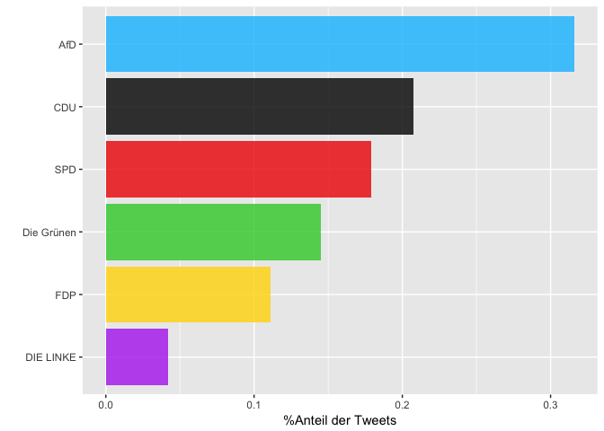
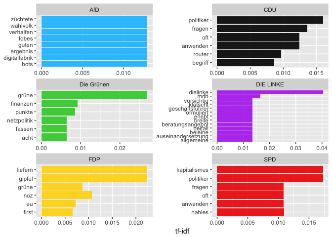

Politische Stimmung auf Twitter zum Thema Digitalisierung
================
2017-10-17

Wie sieht die politische Stimmung bei Twitter in den Tagen nach der Bundestagswahl aus?

Bei der folgenden Analyse soll vor allem das Thema Digitalisierung im Vordergrund stehen. Im Index der EU-Kommission für Digitale Wirtschaft - dem [Digital Economy and Society Index (DESI)](https://ec.europa.eu/digital-single-market/en/news/digital-economy-and-society-index-desi-2017) - belegt die [Bundesrepublik](http://ec.europa.eu/newsroom/document.cfm?doc_id=43012) 2017 nur Platz 11. Wie wird die künftige Bundesregierung mit dem Thema Digitalisierung umgehen? Auch wenn das Thema Digitalsierung im Wahlkampf eher untergeordnet schien, wurden unter anderem folgende Punkte im Zusammenhang mit der Digitalisierung besonders diskutiert:

1.  Förderung der Breitbandversorgung für ein schnelleres Netz.
2.  Schaffung eines öffentlichen Postens, der das Thema Digitalisierung vorantreibt/vertritt. Sei es in Form eines Digitalministeriums (wie es bspw. von der FDP gefordert wurde), oder durch ein "Staatsminister für Digitalpolitik" im Kanzleramt (wie es die CDU vorsieht).
3.  [Wirtschaftspolitischer und kartellrechtlicher Umgang mit digitalen Unternehmen](http://www.m-blog.info/2016/11/nachlese-zum-interdisziplinaeren-workshop-big-data-datenschutz-und-regulierung-in-hamburg/)

Welche Parteien werden am häufigsten in einem Tweet mit "Digitalisierung" genannt? Und worum geht es in diesen Tweets? Wir gewohnt, haben wir alle Tweets gesammelt, die mindestens eine der Bundestagsparteien nennen. Aus diesem Korpus haben wir alle Tweets gefiltert, die das Wort "Digital" (und "Neuland") enthalten.

\*Erläuterungen zu den einzelnen Analyseschritten finden Sie [hier](https://franziloew.github.io/politsentiment/)

### Zeitraum:

Anzahl gesamter Tweets im Zeitraum:

<!--html_preserve-->
<table class="gmisc_table" style="border-collapse: collapse; margin-top: 1em; margin-bottom: 1em;">
<tbody>
<tr style="border-top: 2px solid grey;">
<td style="border-top: 2px solid grey; border-bottom: 2px solid grey; text-align: center;">
321851
</td>
</tr>
</tbody>
</table>
<!--/html_preserve-->
Wie prominent wurde "Digitalisierung" im Vergleich zu anderen Themen besprochen?
--------------------------------------------------------------------------------

Welche Parteien werden am häufigsten in Zusammenhang mit "Digital" verwendet?
-----------------------------------------------------------------------------

Anteil der Nennung einer Partei in einem Tweet im gesamten "Digital"-Korpus.

Zum Vergleich: Der Anteil der Nennung einer Partei im gesamten Korpus:

Wordclouds
----------

Welche Wörter werden im Zusammenhang mit der Digitalisierung verwendet?

term frequency - inverse document frequency (tf-idf)
----------------------------------------------------

Welche Tweets werden am häufigsten retweeted?
---------------------------------------------

### CDU

<!--html_preserve-->
<table class="gmisc_table" style="border-collapse: collapse; margin-top: 1em; margin-bottom: 1em;">
<thead>
<tr>
<th style="border-bottom: 1px solid grey; border-top: 2px solid grey;">
</th>
<th style="border-bottom: 1px solid grey; border-top: 2px solid grey; text-align: center;">
name
</th>
<th style="border-bottom: 1px solid grey; border-top: 2px solid grey; text-align: center;">
text
</th>
<th style="border-bottom: 1px solid grey; border-top: 2px solid grey; text-align: center;">
retweet\_count
</th>
</tr>
</thead>
<tbody>
<tr>
<td style="text-align: left;">
1
</td>
<td style="text-align: left;">
netzpolitik
</td>
<td style="text-align: left;">
Lustig finde ich, dass Günther Oettinger als Wirtschafts- und Digitalminister damit gehandelt wird, dass die CDU halt niemand besseres habe.
</td>
<td style="text-align: left;">
143
</td>
</tr>
<tr>
<td style="text-align: left;">
2
</td>
<td style="text-align: left;">
Dominic Dierig
</td>
<td style="text-align: left;">
Rente, Pflege, Digitalisierung, Fachkräftemangel, Bildung, Niedriglohnsektor! Antwort der CDU: Heimatministerium <https://t.co/ZXgCbiEImW>
</td>
<td style="text-align: left;">
0
</td>
</tr>
<tr>
<td style="text-align: left;">
3
</td>
<td style="text-align: left;">
Deacon Blues
</td>
<td style="text-align: left;">
Anscheinend wird bei der \#CDU der \#Oettinger als Wirtschafts- / Digitalminister diskutiert. Wir werden uns noch nach \#Dobrindt zurücksehnen!
</td>
<td style="text-align: left;">
0
</td>
</tr>
<tr>
<td style="text-align: left;">
4
</td>
<td style="text-align: left;">
budich.orgJournalist
</td>
<td style="text-align: left;">
@gesetzlos\_info das ist Digitalisierung made by "CDU", \#abwimmeln\_kostengünstig
</td>
<td style="text-align: left;">
0
</td>
</tr>
<tr>
<td style="border-bottom: 2px solid grey; text-align: left;">
5
</td>
<td style="border-bottom: 2px solid grey; text-align: left;">
Eli
</td>
<td style="border-bottom: 2px solid grey; text-align: left;">
Die FDP fordert ein Digital-Ministerium? Gute Idee, aber die CDU würde es wohl eher Zauberei-Ministerium nennen...… <https://t.co/YTvstuR4Qq>
</td>
<td style="border-bottom: 2px solid grey; text-align: left;">
0
</td>
</tr>
</tbody>
</table>
<!--/html_preserve-->
### SPD

<!--html_preserve-->
<table class="gmisc_table" style="border-collapse: collapse; margin-top: 1em; margin-bottom: 1em;">
<thead>
<tr>
<th style="border-bottom: 1px solid grey; border-top: 2px solid grey;">
</th>
<th style="border-bottom: 1px solid grey; border-top: 2px solid grey; text-align: center;">
name
</th>
<th style="border-bottom: 1px solid grey; border-top: 2px solid grey; text-align: center;">
text
</th>
<th style="border-bottom: 1px solid grey; border-top: 2px solid grey; text-align: center;">
retweet\_count
</th>
</tr>
</thead>
<tbody>
<tr>
<td style="text-align: left;">
1
</td>
<td style="text-align: left;">
Gründerszene
</td>
<td style="text-align: left;">
Andrea \#Nahles erklärt „digitalen Kapitalismus“ zum Feind – und verpasst die Zukunft. Ein Kommentar. \#spd \#BTW17… <https://t.co/11Kx8WS9MN>
</td>
<td style="text-align: left;">
87
</td>
</tr>
<tr>
<td style="text-align: left;">
2
</td>
<td style="text-align: left;">
Frank Covfefe
</td>
<td style="text-align: left;">
Wo hat die Nahles das denn wieder aufgeschnappt? "Digitaler Kapitalismus"? Du darfst die Typen von der \#SPD echt ke… <https://t.co/cs1gOB4YFC>
</td>
<td style="text-align: left;">
54
</td>
</tr>
<tr>
<td style="text-align: left;">
3
</td>
<td style="text-align: left;">
Andreas Petzold
</td>
<td style="text-align: left;">
\#Nahles: "Der digitale Kapitalismus greift die soziale Markwirtschaft an!" Klingt voll nach SPD, ist aber Quatsch ~ @tagesthemen
</td>
<td style="text-align: left;">
24
</td>
</tr>
<tr>
<td style="text-align: left;">
4
</td>
<td style="text-align: left;">
Martin Fuchs
</td>
<td style="text-align: left;">
Find ick gut, Die \#SPD hat jetzt eine moderne & digitale interne Grassroots-Bewegung. Viel Erfolg für Parteireform!… <https://t.co/PMvEIdPwZw>
</td>
<td style="text-align: left;">
19
</td>
</tr>
<tr>
<td style="text-align: left;">
5
</td>
<td style="text-align: left;">
Herr Wirt
</td>
<td style="text-align: left;">
Die SPD und Andrea Nahles haben ein neues Feindbild: Die Digitalisierung.

Ich bin gespannt, wann sie das Internet… <https://t.co/4o1aPULHBJ>
</td>
<td style="text-align: left;">
9
</td>
</tr>
<tr>
<td style="border-bottom: 2px solid grey; text-align: left;">
6
</td>
<td style="border-bottom: 2px solid grey; text-align: left;">
Meiko Haas
</td>
<td style="border-bottom: 2px solid grey; text-align: left;">
"Time to say goodbye" Mein Musiktipp für die \#SPD und @Ralf\_Stegner im digitalen Orbit :) <https://t.co/IB0Ghs8u7F>
</td>
<td style="border-bottom: 2px solid grey; text-align: left;">
9
</td>
</tr>
</tbody>
</table>
<!--/html_preserve-->
### FDP

<!--html_preserve-->
<table class="gmisc_table" style="border-collapse: collapse; margin-top: 1em; margin-bottom: 1em;">
<thead>
<tr>
<th style="border-bottom: 1px solid grey; border-top: 2px solid grey;">
</th>
<th style="border-bottom: 1px solid grey; border-top: 2px solid grey; text-align: center;">
name
</th>
<th style="border-bottom: 1px solid grey; border-top: 2px solid grey; text-align: center;">
text
</th>
<th style="border-bottom: 1px solid grey; border-top: 2px solid grey; text-align: center;">
retweet\_count
</th>
</tr>
</thead>
<tbody>
<tr>
<td style="text-align: left;">
1
</td>
<td style="text-align: left;">
Christian Jung
</td>
<td style="text-align: left;">
Blick nach Stuttgart: \#fdp fordert ein eigenes Digitalisierungs- und Innovationsministerium. \#digitalisierung <https://t.co/WYp96ehZ5A>
</td>
<td style="text-align: left;">
2
</td>
</tr>
<tr>
<td style="text-align: left;">
2
</td>
<td style="text-align: left;">
FDP/DVP-Fraktion
</td>
<td style="text-align: left;">
"Wir brauchen ein eigenes Digitalisierungs- & Innovationsministerium" @timmkern \#fdp \#digitalisierung \#digitalbw ▶️https://t.co/pKuyOo91OU
</td>
<td style="text-align: left;">
1
</td>
</tr>
<tr>
<td style="text-align: left;">
3
</td>
<td style="text-align: left;">
Eli
</td>
<td style="text-align: left;">
Die FDP fordert ein Digital-Ministerium? Gute Idee, aber die CDU würde es wohl eher Zauberei-Ministerium nennen...… <https://t.co/YTvstuR4Qq>
</td>
<td style="text-align: left;">
0
</td>
</tr>
<tr>
<td style="text-align: left;">
4
</td>
<td style="text-align: left;">
Alexander Rackow
</td>
<td style="text-align: left;">
@AnnKristin\_S\_ Wenn \#FDP Digitalministerium, Finanzministerium & EinwanderungsG bekommt, wird sie es wohl machen &… <https://t.co/9nDsEJUdXx>
</td>
<td style="text-align: left;">
0
</td>
</tr>
<tr>
<td style="text-align: left;">
5
</td>
<td style="text-align: left;">
change your mind
</td>
<td style="text-align: left;">
\#Jamaika-Koalition: FDP (?) dementiert Bericht über Superministerium für Digitales <https://t.co/HKv4fHNZaO>
</td>
<td style="text-align: left;">
0
</td>
</tr>
<tr>
<td style="border-bottom: 2px solid grey; text-align: left;">
6
</td>
<td style="border-bottom: 2px solid grey; text-align: left;">
Kai Glasner
</td>
<td style="border-bottom: 2px solid grey; text-align: left;">
Jamaika-Koalition: FDP dementiert Bericht über Superministerium für Digitales <https://t.co/IWOi0NIRl0>
</td>
<td style="border-bottom: 2px solid grey; text-align: left;">
0
</td>
</tr>
</tbody>
</table>
<!--/html_preserve-->
### AfD

<!--html_preserve-->
<table class="gmisc_table" style="border-collapse: collapse; margin-top: 1em; margin-bottom: 1em;">
<thead>
<tr>
<th style="border-bottom: 1px solid grey; border-top: 2px solid grey;">
</th>
<th style="border-bottom: 1px solid grey; border-top: 2px solid grey; text-align: center;">
name
</th>
<th style="border-bottom: 1px solid grey; border-top: 2px solid grey; text-align: center;">
text
</th>
<th style="border-bottom: 1px solid grey; border-top: 2px solid grey; text-align: center;">
retweet\_count
</th>
</tr>
</thead>
<tbody>
<tr>
<td style="text-align: left;">
1
</td>
<td style="text-align: left;">
AfD\_Support
</td>
<td style="text-align: left;">
Hessen, Land des langsamen Internets -
======================================

\#AfD fordert Anspruch auf Teilhabe am digitalen Leben/digitaler Wirtschaf… <https://t.co/XDfA5sLplQ>
</td>
<td style="text-align: left;">
45
</td>
</tr>
<tr>
<td style="text-align: left;">
2
</td>
<td style="text-align: left;">
AfDFraktion\_NRW
</td>
<td style="text-align: left;">
100 Tage Schwarz-Gelb in \#NRW: Und die Digitalisierung? @twittschler \#AfD \#LtNRW <https://t.co/9IPudhHyit>
</td>
<td style="text-align: left;">
5
</td>
</tr>
<tr>
<td style="text-align: left;">
3
</td>
<td style="text-align: left;">
Jens
</td>
<td style="text-align: left;">
euch ist schon klar, dass der Erfolg der AFD durch die gesellschaftlichen Entwicklungen der digitalen Revolution erleichtert wurde, oder?
</td>
<td style="text-align: left;">
5
</td>
</tr>
<tr>
<td style="text-align: left;">
4
</td>
<td style="text-align: left;">
Deutscher Kulturrat
</td>
<td style="text-align: left;">
Gerade erschienen! Der kulturpolitische Wochenreport (40. KW): \#Bundeskulturministerium, \#AfD, \#Digitalisierung… <https://t.co/LwTrhcGwwT>
</td>
<td style="text-align: left;">
4
</td>
</tr>
<tr>
<td style="text-align: left;">
5
</td>
<td style="text-align: left;">
Stuttgarter Zeitung
</td>
<td style="text-align: left;">
\#SPD, \#FDP und \#AfD: Opposition kritisiert Digitalisierungs-Strategie <https://t.co/DolI1Rj7DT> <https://t.co/SWXIt9Cg78>
</td>
<td style="text-align: left;">
4
</td>
</tr>
<tr>
<td style="border-bottom: 2px solid grey; text-align: left;">
6
</td>
<td style="border-bottom: 2px solid grey; text-align: left;">
Deutscher Kulturrat
</td>
<td style="border-bottom: 2px solid grey; text-align: left;">
Der kulturpolitische Wochenreport (39. KW) \#AfD, \#Digitalisierung, \#Umweltbildung, \#Bundestagskulturausschuss:… <https://t.co/204yaeTPDB>
</td>
<td style="border-bottom: 2px solid grey; text-align: left;">
3
</td>
</tr>
</tbody>
</table>
<!--/html_preserve-->
### Die Linke

<!--html_preserve-->
<table class="gmisc_table" style="border-collapse: collapse; margin-top: 1em; margin-bottom: 1em;">
<thead>
<tr>
<th style="border-bottom: 1px solid grey; border-top: 2px solid grey;">
</th>
<th style="border-bottom: 1px solid grey; border-top: 2px solid grey; text-align: center;">
name
</th>
<th style="border-bottom: 1px solid grey; border-top: 2px solid grey; text-align: center;">
text
</th>
<th style="border-bottom: 1px solid grey; border-top: 2px solid grey; text-align: center;">
retweet\_count
</th>
</tr>
</thead>
<tbody>
<tr>
<td style="text-align: left;">
1
</td>
<td style="text-align: left;">
Bernhard Rohleder
</td>
<td style="text-align: left;">
Podium bei der \#agenda2018 zu Wirtschaft, Verkehr, Digitales: MdB Müller von der AfD und MdB Ernst von den Linken.… <https://t.co/qUmdxz5aGC>
</td>
<td style="text-align: left;">
2
</td>
</tr>
<tr>
<td style="text-align: left;">
2
</td>
<td style="text-align: left;">
Aki Alexandra Nofftz
</td>
<td style="text-align: left;">
Widerlich, wie von \#CSU bis \#LINKE der \#AfD nachgelaufen wird. Dabei wird \#Digitalisierung mehr verändern, als es \#Flüchtige je könnten …
</td>
<td style="text-align: left;">
2
</td>
</tr>
<tr>
<td style="text-align: left;">
3
</td>
<td style="text-align: left;">
Torsten Sommer
</td>
<td style="text-align: left;">
@bengie\_d @Korallenherz Wie war jetzt die allgemeine Kompetenz in der Digitalisierung bei dieLinke?
</td>
<td style="text-align: left;">
0
</td>
</tr>
<tr>
<td style="text-align: left;">
4
</td>
<td style="text-align: left;">
Torsten Sommer
</td>
<td style="text-align: left;">
@bengie\_d @Korallenherz DieLinke...für Digitalisierung...äh....habe ich anders erlebt. Vorsichtig formuliert.
</td>
<td style="text-align: left;">
0
</td>
</tr>
<tr>
<td style="text-align: left;">
5
</td>
<td style="text-align: left;">
CROATIA\_SPOCK 🇭🇷
</td>
<td style="text-align: left;">
Hallo Freunde der \#Digitalisierung \#FDP \#SPD \#CDU \#AfD \#Gruene \#Linke Guter Artikel ! Lesenswert !

<https://t.co/7ucfdFxQqE>
</td>
<td style="text-align: left;">
0
</td>
</tr>
<tr>
<td style="border-bottom: 2px solid grey; text-align: left;">
6
</td>
<td style="border-bottom: 2px solid grey; text-align: left;">
Christian Stein
</td>
<td style="border-bottom: 2px solid grey; text-align: left;">
@BenjaminDThomas Wenn \#CSU mal nicht zustimmt, dann kommen fehlende Stimmen von \#SPD oder \#Linke Nur o. Obergrenze wird es ein \#fedigigugl
</td>
<td style="border-bottom: 2px solid grey; text-align: left;">
0
</td>
</tr>
</tbody>
</table>
<!--/html_preserve-->
### Bündnis 90/Die Grünen

<!--html_preserve-->
<table class="gmisc_table" style="border-collapse: collapse; margin-top: 1em; margin-bottom: 1em;">
<thead>
<tr>
<th style="border-bottom: 1px solid grey; border-top: 2px solid grey;">
</th>
<th style="border-bottom: 1px solid grey; border-top: 2px solid grey; text-align: center;">
name
</th>
<th style="border-bottom: 1px solid grey; border-top: 2px solid grey; text-align: center;">
text
</th>
<th style="border-bottom: 1px solid grey; border-top: 2px solid grey; text-align: center;">
retweet\_count
</th>
</tr>
</thead>
<tbody>
<tr>
<td style="text-align: left;">
1
</td>
<td style="text-align: left;">
Absinthkoenigin
</td>
<td style="text-align: left;">
Und ich hoffe, \#Jamaika treibt den \#Klimaschutz und die \#Digitalisierung voran! \#FDP \#GRÜNE
</td>
<td style="text-align: left;">
1
</td>
</tr>
<tr>
<td style="text-align: left;">
2
</td>
<td style="text-align: left;">
Gegen Überwachung
</td>
<td style="text-align: left;">
Digital first? Was eine schwarz-gelb-grüne Koalition netzpolitisch bedeuten könnte - jetzt in unserem \#Newsletter <https://t.co/rFV8mC3oIr>
</td>
<td style="text-align: left;">
1
</td>
</tr>
<tr>
<td style="text-align: left;">
3
</td>
<td style="text-align: left;">
JoernPL
</td>
<td style="text-align: left;">
@DerSevenlive in der Tat sehr spannend! Wir leiten das gerne an grünen Digitalminister @RobertHabeck weiter! cc @KonstantinNotz
</td>
<td style="text-align: left;">
0
</td>
</tr>
<tr>
<td style="text-align: left;">
4
</td>
<td style="text-align: left;">
H▲nnover lustvoll ®
</td>
<td style="text-align: left;">
\#LTWNDS17 - \#Grüne \#CDU \#FDP\* - \*verweigert \#Pflegekammer! Was wollen d. evtl \#Jamaika-Partner bei \#Digitalisierung <https://t.co/6zn2jUuzRh>
</td>
<td style="text-align: left;">
0
</td>
</tr>
<tr>
<td style="text-align: left;">
5
</td>
<td style="text-align: left;">
CIOwirtschaft
</td>
<td style="text-align: left;">
CDU/CSU, FDP und die Grünen: Was die potenziellen Jamaika-Partner bei Digitalisierung wollen <https://t.co/CxJ8aJSRnU> <https://t.co/S4zf7npmp3>
</td>
<td style="text-align: left;">
0
</td>
</tr>
<tr>
<td style="border-bottom: 2px solid grey; text-align: left;">
6
</td>
<td style="border-bottom: 2px solid grey; text-align: left;">
Marco
</td>
<td style="border-bottom: 2px solid grey; text-align: left;">
In der 🇯🇲 Koalition wird jede Partei ein Thema kriegen CDU: Vollbeschäftigung CSU: Innere Sicherheit FDP: Digitalisierung Grüne: Klimaschutz
</td>
<td style="border-bottom: 2px solid grey; text-align: left;">
0
</td>
</tr>
</tbody>
</table>
<!--/html_preserve-->
