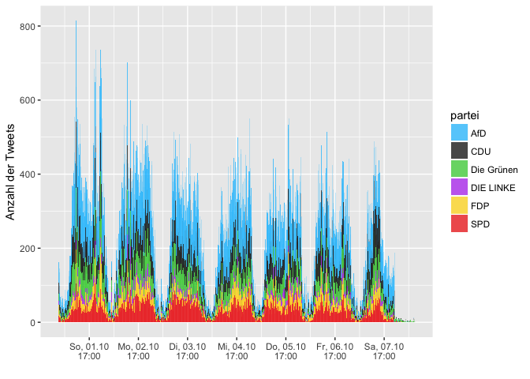
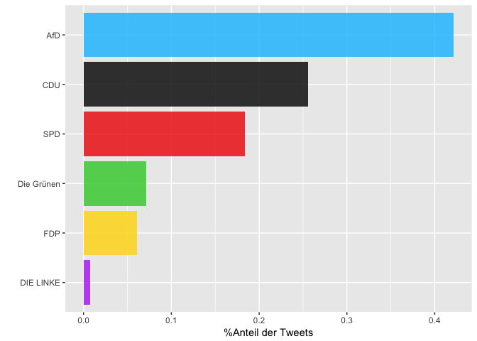
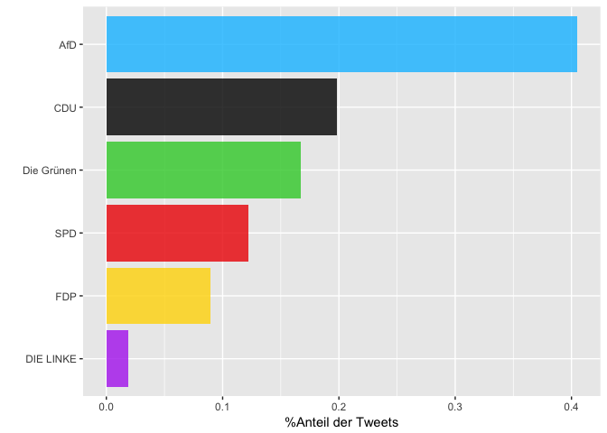
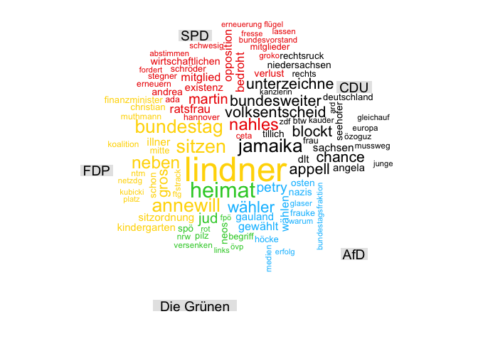
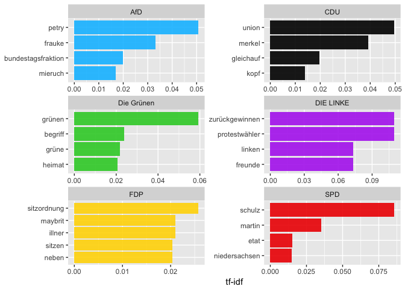
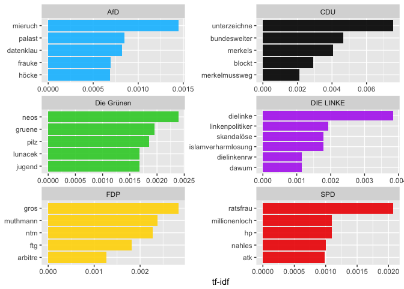

Politische Stimmung im Social Web nach der Bundestagswahl 2017
================
2017-10-17

### 01.Oktober 2017 - 07.Oktober 2017

Erläuterungen zu den einzelnen Analyseschritten finden Sie [hier](https://franziloew.github.io/politsentiment/)

Den R-Code finden Sie hier [hier](https://github.com/franziloew/politsentiment/tree/master/Rmd_files)

Anzahl gesamter Tweets:

<!--html_preserve-->
<table class="gmisc_table" style="border-collapse: collapse; margin-top: 1em; margin-bottom: 1em;">
<tbody>
<tr style="border-top: 2px solid grey;">
<td style="border-top: 2px solid grey; border-bottom: 2px solid grey; text-align: center;">
291398
</td>
</tr>
</tbody>
</table>
<!--/html_preserve-->
#### Anzahl der gesamten Tweets nach Datum

#### Von welchen Plattformen werden die meisten Tweets gesendet?

2. Wer retweeted wen?
---------------------

### Welche der Tweets wurden am häufigsten Retweeted?

<!--html_preserve-->
<table class="gmisc_table" style="border-collapse: collapse; margin-top: 1em; margin-bottom: 1em;">
<thead>
<tr>
<th style="border-bottom: 1px solid grey; border-top: 2px solid grey;">
</th>
<th style="border-bottom: 1px solid grey; border-top: 2px solid grey; text-align: center;">
name
</th>
<th style="border-bottom: 1px solid grey; border-top: 2px solid grey; text-align: center;">
text
</th>
<th style="border-bottom: 1px solid grey; border-top: 2px solid grey; text-align: center;">
retweet\_count
</th>
</tr>
</thead>
<tbody>
<tr>
<td style="text-align: left;">
1
</td>
<td style="text-align: left;">
Scharfrichter
</td>
<td style="text-align: left;">
Vor 70 Jahren gehörte auch die CDU zur Antifa. <https://t.co/AEO6Tzcifu>
</td>
<td style="text-align: left;">
811
</td>
</tr>
<tr>
<td style="text-align: left;">
2
</td>
<td style="text-align: left;">
Buettscher
</td>
<td style="text-align: left;">
Der diesjährige Nobelpreis für Physik geht an die AfD.

Die Partei wird für ihre Zeitreise ins Jahr 1933 geehrt.
</td>
<td style="text-align: left;">
707
</td>
</tr>
<tr>
<td style="text-align: left;">
3
</td>
<td style="text-align: left;">
ZDF heute-show
</td>
<td style="text-align: left;">
Ein weiterer \#AfD-Abgeordneter verlässt die Bundestagsfraktion. Wir fanden die AfD übrigens schon scheiße, bevor es cool wurde.
</td>
<td style="text-align: left;">
481
</td>
</tr>
<tr>
<td style="text-align: left;">
4
</td>
<td style="text-align: left;">
Michael Seyfert
</td>
<td style="text-align: left;">
Intendant d.\#Friedrichstadtpalast will keine \#AfD Wähler. Heute Abend da mit entspr.TShirt. WIR LASSEN UNS DEN ÖFFE… <https://t.co/5lcVj9ET1U>
</td>
<td style="text-align: left;">
430
</td>
</tr>
<tr>
<td style="text-align: left;">
5
</td>
<td style="text-align: left;">
Prof. Jörg Meuthen
</td>
<td style="text-align: left;">
Würden Sie sich - ehrliche Antwort bitte - bei diesem Anblick wirklich wohl und heimisch in 🇩🇪fühlen? \#AfD <https://t.co/EyvtDdDEsn>
</td>
<td style="text-align: left;">
423
</td>
</tr>
<tr>
<td style="border-bottom: 2px solid grey; text-align: left;">
6
</td>
<td style="border-bottom: 2px solid grey; text-align: left;">
🔱NORWEGER🔱
</td>
<td style="border-bottom: 2px solid grey; text-align: left;">
Bilder die im deutschen Staatsfernsehen nicht sehen sind - Wiederaufbau der syrischen Stadt Aleppo! \#CDU \#SPD… <https://t.co/bwmzBKs2NI>
</td>
<td style="border-bottom: 2px solid grey; text-align: left;">
409
</td>
</tr>
</tbody>
</table>
<!--/html_preserve-->
3. Über welche Partei wird am meisten getweeted?
------------------------------------------------

#### Anzahl der Tweets großer Nachrichtendienste

Tweets insgesamt: <!--html_preserve-->
<table class="gmisc_table" style="border-collapse: collapse; margin-top: 1em; margin-bottom: 1em;">
<tbody>
<tr style="border-top: 2px solid grey;">
<td style="border-top: 2px solid grey; border-bottom: 2px solid grey; text-align: center;">
774
</td>
</tr>
</tbody>
</table>
<!--/html_preserve-->

### Anzahl der Tweets anderer User-Accounts

Tweets insgesamt: <!--html_preserve-->
<table class="gmisc_table" style="border-collapse: collapse; margin-top: 1em; margin-bottom: 1em;">
<tbody>
<tr style="border-top: 2px solid grey;">
<td style="border-top: 2px solid grey; border-bottom: 2px solid grey; text-align: center;">
62028
</td>
</tr>
</tbody>
</table>
<!--/html_preserve-->

4.Wordclouds
------------

### Nachrichten-Dienste

### Andere User-Accounts

5. term frequency - inverse document frequency (tf-idf)
-------------------------------------------------------

### Nachrichtendienste

#### Andere User-Accounts

6. Sentiment Analyse
--------------------

#### Nachrichtenportale

##### Anzahl negativer Sentiment-Wörter

##### Anzahl positiver Sentiment-Wörter

#### Gewichtete Analyse

#### Was sind die Tweets mit den negativsten/positivsten Werten?

##### CDU

<!--html_preserve-->
<table class="gmisc_table" style="border-collapse: collapse; margin-top: 1em; margin-bottom: 1em;">
<thead>
<tr>
<th style="border-bottom: 1px solid grey; border-top: 2px solid grey;">
</th>
<th style="border-bottom: 1px solid grey; border-top: 2px solid grey; text-align: center;">
partei
</th>
<th style="border-bottom: 1px solid grey; border-top: 2px solid grey; text-align: center;">
word
</th>
<th style="border-bottom: 1px solid grey; border-top: 2px solid grey; text-align: center;">
text
</th>
<th style="border-bottom: 1px solid grey; border-top: 2px solid grey; text-align: center;">
Wert
</th>
</tr>
</thead>
<tbody>
<tr>
<td style="text-align: left;">
1
</td>
<td style="text-align: left;">
CDU
</td>
<td style="text-align: left;">
falsch
</td>
<td style="text-align: left;">
Richtungsstreit in der Union: "Die These, wir müssten nach rechts rücken, ist völlig falsch"... <https://t.co/A6medTYrMh>
</td>
<td style="text-align: left;">
-0.7618
</td>
</tr>
<tr>
<td style="text-align: left;">
2
</td>
<td style="text-align: left;">
CDU
</td>
<td style="text-align: left;">
trennen
</td>
<td style="text-align: left;">
Niedersachsen-Wahltrend - Kurz vor Niedersachsen-Wahl: CDU und SPD trennen 0,3 Prozent - Grüne drittstärkste Kraft <https://t.co/BPTKdIKgqo>
</td>
<td style="text-align: left;">
-0.5033
</td>
</tr>
<tr>
<td style="text-align: left;">
3
</td>
<td style="text-align: left;">
CDU
</td>
<td style="text-align: left;">
trennen
</td>
<td style="text-align: left;">
Niedersachsen-Wahltrend - Kurz vor Niedersachsen-Wahl: CDU und SPD trennen 0,3 Prozent - Grüne drittstärkste Kraft <https://t.co/ocFV5OScWC>
</td>
<td style="text-align: left;">
-0.5033
</td>
</tr>
<tr>
<td style="text-align: left;">
4
</td>
<td style="text-align: left;">
CDU
</td>
<td style="text-align: left;">
fürchten
</td>
<td style="text-align: left;">
Vertreter von \#CDU, \#SPD und \#Grünen fürchten eine weitere Eskalation in der spanischen Region \#Katalonien. <https://t.co/cVRalE1zxI>
</td>
<td style="text-align: left;">
-0.3545
</td>
</tr>
<tr>
<td style="text-align: left;">
5
</td>
<td style="text-align: left;">
CDU
</td>
<td style="text-align: left;">
heftig
</td>
<td style="text-align: left;">
D​er ehemalige sächsische Ministerpräsident Biedenkopf hat die sächsische \#CDU nach dem Wahl-Debakel heftig kriti... <https://t.co/CGEMcslAXR>
</td>
<td style="text-align: left;">
-0.1819
</td>
</tr>
<tr>
<td style="border-bottom: 2px solid grey; text-align: left;">
6
</td>
<td style="border-bottom: 2px solid grey; text-align: left;">
CDU
</td>
<td style="border-bottom: 2px solid grey; text-align: left;">
hart
</td>
<td style="border-bottom: 2px solid grey; text-align: left;">
\#Biedenkopf übt harte Kritik an der sächsischen \#CDU. Besonders hart trifft es ihren Vorsitzenden \#Tillich. <https://t.co/JqJyCmjwQb>
</td>
<td style="border-bottom: 2px solid grey; text-align: left;">
-0.1483
</td>
</tr>
</tbody>
</table>
<!--/html_preserve-->
<!--html_preserve-->
<table class="gmisc_table" style="border-collapse: collapse; margin-top: 1em; margin-bottom: 1em;">
<thead>
<tr>
<th style="border-bottom: 1px solid grey; border-top: 2px solid grey;">
</th>
<th style="border-bottom: 1px solid grey; border-top: 2px solid grey; text-align: center;">
partei
</th>
<th style="border-bottom: 1px solid grey; border-top: 2px solid grey; text-align: center;">
word
</th>
<th style="border-bottom: 1px solid grey; border-top: 2px solid grey; text-align: center;">
text
</th>
<th style="border-bottom: 1px solid grey; border-top: 2px solid grey; text-align: center;">
Wert
</th>
</tr>
</thead>
<tbody>
<tr>
<td style="text-align: left;">
1
</td>
<td style="text-align: left;">
CDU
</td>
<td style="text-align: left;">
gut
</td>
<td style="text-align: left;">
Gerade gut gelesen: Gegen Merkel: Rebellion am rechten CDU-Rand <https://t.co/KpkEADBFWV> <https://t.co/dbqFF5C5fD>
</td>
<td style="text-align: left;">
0.3716
</td>
</tr>
<tr>
<td style="text-align: left;">
2
</td>
<td style="text-align: left;">
CDU
</td>
<td style="text-align: left;">
schaffen
</td>
<td style="text-align: left;">
Politik: Merkel: CDU sollte Einigung in Flüchtlingspolitik mit CSU schaffen <https://t.co/fJYTRhBapB>
</td>
<td style="text-align: left;">
0.004
</td>
</tr>
<tr>
<td style="text-align: left;">
3
</td>
<td style="text-align: left;">
CDU
</td>
<td style="text-align: left;">
schaffen
</td>
<td style="text-align: left;">
Merkel - CDU sollte Einigung in Flüchtlingspolitik mit CSU schaffen <https://t.co/jFVU2CjTuc> <https://t.co/5bEwEJXnp5>
</td>
<td style="text-align: left;">
0.004
</td>
</tr>
<tr>
<td style="text-align: left;">
4
</td>
<td style="text-align: left;">
CDU
</td>
<td style="text-align: left;">
abstimmen
</td>
<td style="text-align: left;">
Koalitionsverhandlungen: Merkel will CDU-Parteitag über Jamaika abstimmen lassen <https://t.co/3TBDQhODD2> <https://t.co/WlQjQXnnRJ>
</td>
<td style="text-align: left;">
0.004
</td>
</tr>
<tr>
<td style="text-align: left;">
5
</td>
<td style="text-align: left;">
CDU
</td>
<td style="text-align: left;">
abstimmen
</td>
<td style="text-align: left;">
Merkel kündigt bei der \#JU \#Jamaika-Verhandlungen an, \#CDU-Basis soll über Koalitionsvertrag abstimmen:
==========================================================================================================

<https://t.co/mSjKQlOfej>
</td>
<td style="text-align: left;">
0.004
</td>
</tr>
<tr>
<td style="border-bottom: 2px solid grey; text-align: left;">
6
</td>
<td style="border-bottom: 2px solid grey; text-align: left;">
CDU
</td>
<td style="border-bottom: 2px solid grey; text-align: left;">
abstimmen
</td>
<td style="border-bottom: 2px solid grey; text-align: left;">
Koalitionsverhandlungen: Merkel will CDU-Parteitag über Jamaika abstimmen lassen... <https://t.co/TyfRGg0gXi>
</td>
<td style="border-bottom: 2px solid grey; text-align: left;">
0.004
</td>
</tr>
</tbody>
</table>
<!--/html_preserve-->
##### SPD

<!--html_preserve-->
<table class="gmisc_table" style="border-collapse: collapse; margin-top: 1em; margin-bottom: 1em;">
<thead>
<tr>
<th style="border-bottom: 1px solid grey; border-top: 2px solid grey;">
</th>
<th style="border-bottom: 1px solid grey; border-top: 2px solid grey; text-align: center;">
partei
</th>
<th style="border-bottom: 1px solid grey; border-top: 2px solid grey; text-align: center;">
word
</th>
<th style="border-bottom: 1px solid grey; border-top: 2px solid grey; text-align: center;">
text
</th>
<th style="border-bottom: 1px solid grey; border-top: 2px solid grey; text-align: center;">
Wert
</th>
</tr>
</thead>
<tbody>
<tr>
<td style="text-align: left;">
1
</td>
<td style="text-align: left;">
SPD
</td>
<td style="text-align: left;">
fehlen
</td>
<td style="text-align: left;">
Hunderttausende Euro fehlen: Die SPD muss massiv sparen <https://t.co/R2HaJT0Qwg>
</td>
<td style="text-align: left;">
-0.5365
</td>
</tr>
<tr>
<td style="text-align: left;">
2
</td>
<td style="text-align: left;">
SPD
</td>
<td style="text-align: left;">
drohen
</td>
<td style="text-align: left;">
Finanzmittel der AfD könnten helfen - Millionenloch im SPD-Etat: Sozialdemokraten drohen weitreichende Konsequenzen <https://t.co/iCtCkw5vCe>
</td>
<td style="text-align: left;">
-0.3503
</td>
</tr>
<tr>
<td style="text-align: left;">
3
</td>
<td style="text-align: left;">
SPD
</td>
<td style="text-align: left;">
drohen
</td>
<td style="text-align: left;">
Finanzmittel der AfD könnten helfen - Millionenloch im SPD-Etat: Sozialdemokraten drohen weitreichende Konsequenzen <https://t.co/iik25GOguz>
</td>
<td style="text-align: left;">
-0.3503
</td>
</tr>
<tr>
<td style="text-align: left;">
4
</td>
<td style="text-align: left;">
SPD
</td>
<td style="text-align: left;">
kritisch
</td>
<td style="text-align: left;">
Wohnungen in Hof - Innenstadt-SPD beäugt Privatisierung im Bahnhofsviertel kritisch <https://t.co/fJ8aCuX2R7>
</td>
<td style="text-align: left;">
-0.203
</td>
</tr>
<tr>
<td style="text-align: left;">
5
</td>
<td style="text-align: left;">
SPD
</td>
<td style="text-align: left;">
attackieren
</td>
<td style="text-align: left;">
Mögliche Koalition: SPD und Linke attackieren Jamaika-Parteien <https://t.co/yd0Lyaap9y> <https://t.co/qi5rkITmfn>
</td>
<td style="text-align: left;">
-0.0048
</td>
</tr>
<tr>
<td style="border-bottom: 2px solid grey; text-align: left;">
6
</td>
<td style="border-bottom: 2px solid grey; text-align: left;">
SPD
</td>
<td style="border-bottom: 2px solid grey; text-align: left;">
attackieren
</td>
<td style="border-bottom: 2px solid grey; text-align: left;">
Mögliche Koalition: SPD und Linke attackieren Jamaika-Parteien... <https://t.co/RIW5dEc0yT>
</td>
<td style="border-bottom: 2px solid grey; text-align: left;">
-0.0048
</td>
</tr>
</tbody>
</table>
<!--/html_preserve-->
<!--html_preserve-->
<table class="gmisc_table" style="border-collapse: collapse; margin-top: 1em; margin-bottom: 1em;">
<thead>
<tr>
<th style="border-bottom: 1px solid grey; border-top: 2px solid grey;">
</th>
<th style="border-bottom: 1px solid grey; border-top: 2px solid grey; text-align: center;">
partei
</th>
<th style="border-bottom: 1px solid grey; border-top: 2px solid grey; text-align: center;">
word
</th>
<th style="border-bottom: 1px solid grey; border-top: 2px solid grey; text-align: center;">
text
</th>
<th style="border-bottom: 1px solid grey; border-top: 2px solid grey; text-align: center;">
Wert
</th>
</tr>
</thead>
<tbody>
<tr>
<td style="text-align: left;">
1
</td>
<td style="text-align: left;">
SPD
</td>
<td style="text-align: left;">
verdient
</td>
<td style="text-align: left;">
Schulz wagt es, komplett blankzuziehen. Schulz verdient Respekt – und den halben Nannenpreis <https://t.co/MEs1Q7Erg2>
</td>
<td style="text-align: left;">
0.3612
</td>
</tr>
<tr>
<td style="text-align: left;">
2
</td>
<td style="text-align: left;">
SPD
</td>
<td style="text-align: left;">
heil
</td>
<td style="text-align: left;">
Die SPD muss sich nach den Worten von Generalsekretär Heil auch personell verändern. <https://t.co/e4Wgfa4Rdf>
</td>
<td style="text-align: left;">
0.3414
</td>
</tr>
<tr>
<td style="text-align: left;">
3
</td>
<td style="text-align: left;">
SPD
</td>
<td style="text-align: left;">
gefeiert
</td>
<td style="text-align: left;">
Erster Auftritt nach der \#BTW17: Der \#SPD-Vorsitzende Martin \#Schulz wird in \#Cuxhaven gefeiert. <https://t.co/AYFDEAqYrM>
</td>
<td style="text-align: left;">
0.3403
</td>
</tr>
<tr>
<td style="text-align: left;">
4
</td>
<td style="text-align: left;">
SPD
</td>
<td style="text-align: left;">
mächtig
</td>
<td style="text-align: left;">
Wahl-Krimi in Niedersachsen - SPD holt in Umfragen plötzlich mächtig auf <https://t.co/bcsDL5h3T7>
</td>
<td style="text-align: left;">
0.2277
</td>
</tr>
<tr>
<td style="text-align: left;">
5
</td>
<td style="text-align: left;">
SPD
</td>
<td style="text-align: left;">
kraftvoll
</td>
<td style="text-align: left;">
Wie kraftvoll ist Schulz? SPD-Wahlkampf in Niedersachsen <https://t.co/fyHhTBPVSX> <https://t.co/yr81xYBg9w>
</td>
<td style="text-align: left;">
0.2214
</td>
</tr>
<tr>
<td style="border-bottom: 2px solid grey; text-align: left;">
6
</td>
<td style="border-bottom: 2px solid grey; text-align: left;">
SPD
</td>
<td style="border-bottom: 2px solid grey; text-align: left;">
zuversichtlich
</td>
<td style="border-bottom: 2px solid grey; text-align: left;">
Martin Schulz hat sich beim SPD-Wahlkampfauftritt für die \#Landtagswahl in Niedersachsen zuversichtlich gezeigt <https://t.co/mNUpKLFkmy>
</td>
<td style="border-bottom: 2px solid grey; text-align: left;">
0.2179
</td>
</tr>
</tbody>
</table>
<!--/html_preserve-->
##### FDP

<!--html_preserve-->
<table class="gmisc_table" style="border-collapse: collapse; margin-top: 1em; margin-bottom: 1em;">
<thead>
<tr>
<th style="border-bottom: 1px solid grey; border-top: 2px solid grey;">
</th>
<th style="border-bottom: 1px solid grey; border-top: 2px solid grey; text-align: center;">
partei
</th>
<th style="border-bottom: 1px solid grey; border-top: 2px solid grey; text-align: center;">
word
</th>
<th style="border-bottom: 1px solid grey; border-top: 2px solid grey; text-align: center;">
text
</th>
<th style="border-bottom: 1px solid grey; border-top: 2px solid grey; text-align: center;">
Wert
</th>
</tr>
</thead>
<tbody>
<tr>
<td style="text-align: left;">
1
</td>
<td style="text-align: left;">
FDP
</td>
<td style="text-align: left;">
fürchten
</td>
<td style="text-align: left;">
FDP muss schon erste parlamentarische Niederlage fürchten - <https://t.co/X8EasxsABB>
</td>
<td style="text-align: left;">
-0.3545
</td>
</tr>
<tr>
<td style="text-align: left;">
2
</td>
<td style="text-align: left;">
FDP
</td>
<td style="text-align: left;">
fürchten
</td>
<td style="text-align: left;">
Bundestag: FDP muss schon die erste parlamentarische Niederlage fürchten <https://t.co/02sz0vXUU8> <https://t.co/Jt9mqEdFfN>
</td>
<td style="text-align: left;">
-0.3545
</td>
</tr>
<tr>
<td style="text-align: left;">
3
</td>
<td style="text-align: left;">
FDP
</td>
<td style="text-align: left;">
fürchten
</td>
<td style="text-align: left;">
FDP muss schon erste parlamentarischer Niederlage fürchten <https://t.co/nU6GtuN0ja> <https://t.co/p1y5WCg5nP>
</td>
<td style="text-align: left;">
-0.3545
</td>
</tr>
<tr>
<td style="text-align: left;">
4
</td>
<td style="text-align: left;">
FDP
</td>
<td style="text-align: left;">
genervt
</td>
<td style="text-align: left;">
TV-Kolumne "Maybrit Illner" - Lindner macht Witz auf Kosten der Grünen - Göring-Eckardt reagiert genervt <https://t.co/uJTXpeosUx>
</td>
<td style="text-align: left;">
-0.0237
</td>
</tr>
<tr>
<td style="text-align: left;">
5
</td>
<td style="text-align: left;">
FDP
</td>
<td style="text-align: left;">
genervt
</td>
<td style="text-align: left;">
TV-Kolumne "Maybrit Illner" - Lindner macht Witz auf Kosten der Grünen - Göring-Eckardt reagiert genervt <https://t.co/Tc63Maphiv>
</td>
<td style="text-align: left;">
-0.0237
</td>
</tr>
<tr>
<td style="border-bottom: 2px solid grey; text-align: left;">
6
</td>
<td style="border-bottom: 2px solid grey; text-align: left;">
FDP
</td>
<td style="border-bottom: 2px solid grey; text-align: left;">
klar
</td>
<td style="border-bottom: 2px solid grey; text-align: left;">
Jetzt ist klar, wann sich der neue \#Bundestag zum ersten Mal trifft. \#FDP weigert sich aber, neben \#AfD zu sitzen. <https://t.co/5VOcbbZLEq>
</td>
<td style="border-bottom: 2px solid grey; text-align: left;">
0.004
</td>
</tr>
</tbody>
</table>
<!--/html_preserve-->
<!--html_preserve-->
<table class="gmisc_table" style="border-collapse: collapse; margin-top: 1em; margin-bottom: 1em;">
<thead>
<tr>
<th style="border-bottom: 1px solid grey; border-top: 2px solid grey;">
</th>
<th style="border-bottom: 1px solid grey; border-top: 2px solid grey; text-align: center;">
partei
</th>
<th style="border-bottom: 1px solid grey; border-top: 2px solid grey; text-align: center;">
word
</th>
<th style="border-bottom: 1px solid grey; border-top: 2px solid grey; text-align: center;">
text
</th>
<th style="border-bottom: 1px solid grey; border-top: 2px solid grey; text-align: center;">
Wert
</th>
</tr>
</thead>
<tbody>
<tr>
<td style="text-align: left;">
1
</td>
<td style="text-align: left;">
FDP
</td>
<td style="text-align: left;">
klar
</td>
<td style="text-align: left;">
Jetzt ist klar, wann sich der neue \#Bundestag zum ersten Mal trifft. \#FDP weigert sich aber, neben \#AfD zu sitzen. <https://t.co/5VOcbbZLEq>
</td>
<td style="text-align: left;">
0.004
</td>
</tr>
<tr>
<td style="text-align: left;">
2
</td>
<td style="text-align: left;">
FDP
</td>
<td style="text-align: left;">
frei
</td>
<td style="text-align: left;">
„Mein rechter rechter Platz ist frei...“ \#AfD \#FDP \#Bundestag \#Politik <https://t.co/9rn8KKuAd4>
</td>
<td style="text-align: left;">
0.004
</td>
</tr>
<tr>
<td style="text-align: left;">
3
</td>
<td style="text-align: left;">
FDP
</td>
<td style="text-align: left;">
genervt
</td>
<td style="text-align: left;">
TV-Kolumne "Maybrit Illner" - Lindner macht Witz auf Kosten der Grünen - Göring-Eckardt reagiert genervt <https://t.co/uJTXpeosUx>
</td>
<td style="text-align: left;">
-0.0237
</td>
</tr>
<tr>
<td style="text-align: left;">
4
</td>
<td style="text-align: left;">
FDP
</td>
<td style="text-align: left;">
genervt
</td>
<td style="text-align: left;">
TV-Kolumne "Maybrit Illner" - Lindner macht Witz auf Kosten der Grünen - Göring-Eckardt reagiert genervt <https://t.co/Tc63Maphiv>
</td>
<td style="text-align: left;">
-0.0237
</td>
</tr>
<tr>
<td style="text-align: left;">
5
</td>
<td style="text-align: left;">
FDP
</td>
<td style="text-align: left;">
fürchten
</td>
<td style="text-align: left;">
FDP muss schon erste parlamentarische Niederlage fürchten - <https://t.co/X8EasxsABB>
</td>
<td style="text-align: left;">
-0.3545
</td>
</tr>
<tr>
<td style="border-bottom: 2px solid grey; text-align: left;">
6
</td>
<td style="border-bottom: 2px solid grey; text-align: left;">
FDP
</td>
<td style="border-bottom: 2px solid grey; text-align: left;">
fürchten
</td>
<td style="border-bottom: 2px solid grey; text-align: left;">
Bundestag: FDP muss schon die erste parlamentarische Niederlage fürchten <https://t.co/02sz0vXUU8> <https://t.co/Jt9mqEdFfN>
</td>
<td style="border-bottom: 2px solid grey; text-align: left;">
-0.3545
</td>
</tr>
</tbody>
</table>
<!--/html_preserve-->
##### Die Grünen

<!--html_preserve-->
<table class="gmisc_table" style="border-collapse: collapse; margin-top: 1em; margin-bottom: 1em;">
<thead>
<tr>
<th style="border-bottom: 1px solid grey; border-top: 2px solid grey;">
</th>
<th style="border-bottom: 1px solid grey; border-top: 2px solid grey; text-align: center;">
partei
</th>
<th style="border-bottom: 1px solid grey; border-top: 2px solid grey; text-align: center;">
word
</th>
<th style="border-bottom: 1px solid grey; border-top: 2px solid grey; text-align: center;">
text
</th>
<th style="border-bottom: 1px solid grey; border-top: 2px solid grey; text-align: center;">
Wert
</th>
</tr>
</thead>
<tbody>
<tr>
<td style="text-align: left;">
1
</td>
<td style="text-align: left;">
Die Grünen
</td>
<td style="text-align: left;">
schmerzen
</td>
<td style="text-align: left;">
Hamburger Grünen-Chef: "Es wird auf jeder Seite Schmerzen geben" <https://t.co/lXlhM74aXW> <https://t.co/nF7fmW1sIa>
</td>
<td style="text-align: left;">
-0.3251
</td>
</tr>
<tr>
<td style="text-align: left;">
2
</td>
<td style="text-align: left;">
Die Grünen
</td>
<td style="text-align: left;">
vergeuden
</td>
<td style="text-align: left;">
Die \#Grünen sollten ihre Energie nicht im Außenamt oder Umweltministerium vergeuden. <https://t.co/USECcycCQK>
</td>
<td style="text-align: left;">
-0.1836
</td>
</tr>
<tr>
<td style="text-align: left;">
3
</td>
<td style="text-align: left;">
Die Grünen
</td>
<td style="text-align: left;">
exklusiv
</td>
<td style="text-align: left;">
F.A.Z. exklusiv: Grünen-Politiker Habeck will Begriff Heimat nicht AfD überlassen <https://t.co/gT68I5tyvv>
</td>
<td style="text-align: left;">
0.004
</td>
</tr>
<tr>
<td style="text-align: left;">
4
</td>
<td style="text-align: left;">
Die Grünen
</td>
<td style="text-align: left;">
exklusiv
</td>
<td style="text-align: left;">
F.A.Z. exklusiv: Grünen-Politiker Habeck will Begriff Heimat nicht AfD überlassen <https://t.co/pE8IKI0UiX>
</td>
<td style="text-align: left;">
0.004
</td>
</tr>
<tr>
<td style="text-align: left;">
5
</td>
<td style="text-align: left;">
Die Grünen
</td>
<td style="text-align: left;">
exklusiv
</td>
<td style="text-align: left;">
F.A.Z. exklusiv: Grünen-Politiker Habeck will Begriff Heimat nicht AfD überlassen <https://t.co/egImZ4jk6b>
</td>
<td style="text-align: left;">
0.004
</td>
</tr>
<tr>
<td style="border-bottom: 2px solid grey; text-align: left;">
6
</td>
<td style="border-bottom: 2px solid grey; text-align: left;">
Die Grünen
</td>
<td style="border-bottom: 2px solid grey; text-align: left;">
verteidigen
</td>
<td style="border-bottom: 2px solid grey; text-align: left;">
„Der Bundestag ist kein Jagdrevier, sondern Zentrum einer soliden Demokratie, die es zu verteidigen lohnt.“ \#Grüne <https://t.co/K5ctnrhZ7r>
</td>
<td style="border-bottom: 2px solid grey; text-align: left;">
0.004
</td>
</tr>
</tbody>
</table>
<!--/html_preserve-->
<!--html_preserve-->
<table class="gmisc_table" style="border-collapse: collapse; margin-top: 1em; margin-bottom: 1em;">
<thead>
<tr>
<th style="border-bottom: 1px solid grey; border-top: 2px solid grey;">
</th>
<th style="border-bottom: 1px solid grey; border-top: 2px solid grey; text-align: center;">
partei
</th>
<th style="border-bottom: 1px solid grey; border-top: 2px solid grey; text-align: center;">
word
</th>
<th style="border-bottom: 1px solid grey; border-top: 2px solid grey; text-align: center;">
text
</th>
<th style="border-bottom: 1px solid grey; border-top: 2px solid grey; text-align: center;">
Wert
</th>
</tr>
</thead>
<tbody>
<tr>
<td style="text-align: left;">
1
</td>
<td style="text-align: left;">
Die Grünen
</td>
<td style="text-align: left;">
schenken
</td>
<td style="text-align: left;">
Aktion in Dortmund - Grünen wollen DSW21-Chef Viererticket schenken – und landen beim Pförtner <https://t.co/mDIEbq2M9r>
</td>
<td style="text-align: left;">
0.204
</td>
</tr>
<tr>
<td style="text-align: left;">
2
</td>
<td style="text-align: left;">
Die Grünen
</td>
<td style="text-align: left;">
schenken
</td>
<td style="text-align: left;">
Dortmund - Grünen wollen DSW21-Chef Viererticket schenken – und landen beim Pförtner <https://t.co/oNsZIv8urC>
</td>
<td style="text-align: left;">
0.204
</td>
</tr>
<tr>
<td style="text-align: left;">
3
</td>
<td style="text-align: left;">
Die Grünen
</td>
<td style="text-align: left;">
schenken
</td>
<td style="text-align: left;">
Dortmund - Grünen wollen DSW21-Chef Viererticket schenken – und landen beim Pförtner <https://t.co/MUT5uWmLok>
</td>
<td style="text-align: left;">
0.204
</td>
</tr>
<tr>
<td style="text-align: left;">
4
</td>
<td style="text-align: left;">
Die Grünen
</td>
<td style="text-align: left;">
exklusiv
</td>
<td style="text-align: left;">
F.A.Z. exklusiv: Grünen-Politiker Habeck will Begriff Heimat nicht AfD überlassen <https://t.co/gT68I5tyvv>
</td>
<td style="text-align: left;">
0.004
</td>
</tr>
<tr>
<td style="text-align: left;">
5
</td>
<td style="text-align: left;">
Die Grünen
</td>
<td style="text-align: left;">
exklusiv
</td>
<td style="text-align: left;">
F.A.Z. exklusiv: Grünen-Politiker Habeck will Begriff Heimat nicht AfD überlassen <https://t.co/pE8IKI0UiX>
</td>
<td style="text-align: left;">
0.004
</td>
</tr>
<tr>
<td style="border-bottom: 2px solid grey; text-align: left;">
6
</td>
<td style="border-bottom: 2px solid grey; text-align: left;">
Die Grünen
</td>
<td style="border-bottom: 2px solid grey; text-align: left;">
exklusiv
</td>
<td style="border-bottom: 2px solid grey; text-align: left;">
F.A.Z. exklusiv: Grünen-Politiker Habeck will Begriff Heimat nicht AfD überlassen <https://t.co/egImZ4jk6b>
</td>
<td style="border-bottom: 2px solid grey; text-align: left;">
0.004
</td>
</tr>
</tbody>
</table>
<!--/html_preserve-->
##### AfD

<!--html_preserve-->
<table class="gmisc_table" style="border-collapse: collapse; margin-top: 1em; margin-bottom: 1em;">
<thead>
<tr>
<th style="border-bottom: 1px solid grey; border-top: 2px solid grey;">
</th>
<th style="border-bottom: 1px solid grey; border-top: 2px solid grey; text-align: center;">
partei
</th>
<th style="border-bottom: 1px solid grey; border-top: 2px solid grey; text-align: center;">
word
</th>
<th style="border-bottom: 1px solid grey; border-top: 2px solid grey; text-align: center;">
text
</th>
<th style="border-bottom: 1px solid grey; border-top: 2px solid grey; text-align: center;">
Wert
</th>
</tr>
</thead>
<tbody>
<tr>
<td style="text-align: left;">
1
</td>
<td style="text-align: left;">
AfD
</td>
<td style="text-align: left;">
falsch
</td>
<td style="text-align: left;">
Nach Anklage wegen Meineids: Ex-AfD-Politikerin \#Petry spricht von irrtümlichen Äußerungen. Bewusst falsch ausgesagt habe sie nicht.
</td>
<td style="text-align: left;">
-0.7618
</td>
</tr>
<tr>
<td style="text-align: left;">
2
</td>
<td style="text-align: left;">
AfD
</td>
<td style="text-align: left;">
gefährlich
</td>
<td style="text-align: left;">
Warum der rhetorische Rechtsruck der großen Parteien gefährlich ist - und der AfD in die Hände spielt <https://t.co/07DjNBHhRE>
</td>
<td style="text-align: left;">
-0.6366
</td>
</tr>
<tr>
<td style="text-align: left;">
3
</td>
<td style="text-align: left;">
AfD
</td>
<td style="text-align: left;">
kämpfen
</td>
<td style="text-align: left;">
Gestohlene Plakate und Wahlkampfpannen: In kaum einem Bundesland muss die \#AfD so kämpfen wie in \#Niedersachsen: <https://t.co/LqaTIBJ7ao>
</td>
<td style="text-align: left;">
-0.3467
</td>
</tr>
<tr>
<td style="text-align: left;">
4
</td>
<td style="text-align: left;">
AfD
</td>
<td style="text-align: left;">
kämpfen
</td>
<td style="text-align: left;">
Kriegserklärung von ganz rechts: Liberale der \#AfD organisieren sich, doch die Gegner kämpfen, berichtet @tilsteff <https://t.co/n6NCFGzqMh>
</td>
<td style="text-align: left;">
-0.3467
</td>
</tr>
<tr>
<td style="text-align: left;">
5
</td>
<td style="text-align: left;">
AfD
</td>
<td style="text-align: left;">
kämpfen
</td>
<td style="text-align: left;">
Kriegserklärung von ganz rechts: Liberale der \#AfD organisieren sich, doch die Gegner kämpfen, berichtet @tilsteff <https://t.co/MZbjOZibce>
</td>
<td style="text-align: left;">
-0.3467
</td>
</tr>
<tr>
<td style="border-bottom: 2px solid grey; text-align: left;">
6
</td>
<td style="border-bottom: 2px solid grey; text-align: left;">
AfD
</td>
<td style="border-bottom: 2px solid grey; text-align: left;">
widerlegen
</td>
<td style="border-bottom: 2px solid grey; text-align: left;">
Neue Studie - Russlanddeutsche haben alle AfD gewählt? Forscher widerlegen weitverbreitete These <https://t.co/CvR3K9IsNQ>
</td>
<td style="border-bottom: 2px solid grey; text-align: left;">
-0.3452
</td>
</tr>
</tbody>
</table>
<!--/html_preserve-->
<!--html_preserve-->
<table class="gmisc_table" style="border-collapse: collapse; margin-top: 1em; margin-bottom: 1em;">
<thead>
<tr>
<th style="border-bottom: 1px solid grey; border-top: 2px solid grey;">
</th>
<th style="border-bottom: 1px solid grey; border-top: 2px solid grey; text-align: center;">
partei
</th>
<th style="border-bottom: 1px solid grey; border-top: 2px solid grey; text-align: center;">
word
</th>
<th style="border-bottom: 1px solid grey; border-top: 2px solid grey; text-align: center;">
text
</th>
<th style="border-bottom: 1px solid grey; border-top: 2px solid grey; text-align: center;">
Wert
</th>
</tr>
</thead>
<tbody>
<tr>
<td style="text-align: left;">
1
</td>
<td style="text-align: left;">
AfD
</td>
<td style="text-align: left;">
zufrieden
</td>
<td style="text-align: left;">
Im Bundestag will niemand neben der AfD sitzen. Aber wenn sie rechtsaußen Platz nimmt, sind alle zufrieden <https://t.co/Ts5MDtrgfn>
</td>
<td style="text-align: left;">
0.393
</td>
</tr>
<tr>
<td style="text-align: left;">
2
</td>
<td style="text-align: left;">
AfD
</td>
<td style="text-align: left;">
zufrieden
</td>
<td style="text-align: left;">
Im Bundestag will niemand neben der AfD sitzen. Aber wenn sie rechtsaußen Platz nimmt, sind alle zufrieden <https://t.co/cobGfU8TBs>
</td>
<td style="text-align: left;">
0.393
</td>
</tr>
<tr>
<td style="text-align: left;">
3
</td>
<td style="text-align: left;">
AfD
</td>
<td style="text-align: left;">
gut
</td>
<td style="text-align: left;">
Die \#AfD hat im Osten gut abgeschnitten. Irgendwie spielt das Geld dabei eine Rolle. Irgendwie aber auch nicht. <https://t.co/2TuAjHyQKr>
</td>
<td style="text-align: left;">
0.3716
</td>
</tr>
<tr>
<td style="text-align: left;">
4
</td>
<td style="text-align: left;">
AfD
</td>
<td style="text-align: left;">
groß
</td>
<td style="text-align: left;">
Unser Kolumnist glaubt nicht, dass die Medien die \#AfD groß gemacht haben <https://t.co/dVYNry1PY4>
</td>
<td style="text-align: left;">
0.3694
</td>
</tr>
<tr>
<td style="text-align: left;">
5
</td>
<td style="text-align: left;">
AfD
</td>
<td style="text-align: left;">
wertvoll
</td>
<td style="text-align: left;">
AfD will \#Petry verklagen, weil sie Mitgliederdaten kopiert habe. Daten könnten für neue Partei wertvoll sein.
===============================================================================================================

<https://t.co/16ep6vGNOe>
</td>
<td style="text-align: left;">
0.357
</td>
</tr>
<tr>
<td style="border-bottom: 2px solid grey; text-align: left;">
6
</td>
<td style="border-bottom: 2px solid grey; text-align: left;">
AfD
</td>
<td style="border-bottom: 2px solid grey; text-align: left;">
modern
</td>
<td style="border-bottom: 2px solid grey; text-align: left;">
Laut einer Studie zeigt der \#AfD-Erfolg „neue Konfliktlinien der Demokratie“ auf. Die Rechten finden unter Modern... <https://t.co/WYj3TMqoba>
</td>
<td style="border-bottom: 2px solid grey; text-align: left;">
0.2287
</td>
</tr>
</tbody>
</table>
<!--/html_preserve-->
### Andere Nutzer

#### Ungewichtete Analyse

##### Anzahl negativer Sentiment-Wörter

##### Anzahl positiver Sentiment-Wörter

#### Gewichtete Analyse

#### Was sind die Tweets mit den negativsten Werten?

##### CDU

<!--html_preserve-->
<table class="gmisc_table" style="border-collapse: collapse; margin-top: 1em; margin-bottom: 1em;">
<thead>
<tr>
<th style="border-bottom: 1px solid grey; border-top: 2px solid grey;">
</th>
<th style="border-bottom: 1px solid grey; border-top: 2px solid grey; text-align: center;">
partei
</th>
<th style="border-bottom: 1px solid grey; border-top: 2px solid grey; text-align: center;">
word
</th>
<th style="border-bottom: 1px solid grey; border-top: 2px solid grey; text-align: center;">
text
</th>
<th style="border-bottom: 1px solid grey; border-top: 2px solid grey; text-align: center;">
Wert
</th>
</tr>
</thead>
<tbody>
<tr>
<td style="text-align: left;">
1
</td>
<td style="text-align: left;">
CDU
</td>
<td style="text-align: left;">
unnötig
</td>
<td style="text-align: left;">
@moppelkind @c\_lindner finde es so mega unnötig. afd. cdu. fdp. spd. grüne. linke. ende. fertig. sitzordnung geschaffen.
</td>
<td style="text-align: left;">
-0.9463
</td>
</tr>
<tr>
<td style="text-align: left;">
2
</td>
<td style="text-align: left;">
CDU
</td>
<td style="text-align: left;">
unnötig
</td>
<td style="text-align: left;">
Die \#CDU darf sich nicht von der \#AfD treiben lassen. Ein \#Rechtsruck ist völlig unnötig. Was wir brauchen ist eine Politik für Arbeitnehmer
</td>
<td style="text-align: left;">
-0.9463
</td>
</tr>
<tr>
<td style="text-align: left;">
3
</td>
<td style="text-align: left;">
CDU
</td>
<td style="text-align: left;">
unnötig
</td>
<td style="text-align: left;">
Frau \#Merkel führt eine schwache Erfolgsstory unnötig fort. Wir werden das Vakuum füllen und BRD zu Wohlstand führen! \#AfD \#CDU
</td>
<td style="text-align: left;">
-0.9463
</td>
</tr>
<tr>
<td style="text-align: left;">
4
</td>
<td style="text-align: left;">
CDU
</td>
<td style="text-align: left;">
unnötig
</td>
<td style="text-align: left;">
@AfD\_Bayern @Holger\_Lucius schmeißt diese Hexe endlich raus,die ist samt Amt,unnötig wie ein Kropf.Merkel haut schon genug Milliarden raus
</td>
<td style="text-align: left;">
-0.9463
</td>
</tr>
<tr>
<td style="text-align: left;">
5
</td>
<td style="text-align: left;">
CDU
</td>
<td style="text-align: left;">
unnötig
</td>
<td style="text-align: left;">
@DerSPIEGEL MIt dem Plagiat der AfD hat die Union diese perversen Positionen nur unnötig bestätigt.
</td>
<td style="text-align: left;">
-0.9463
</td>
</tr>
<tr>
<td style="border-bottom: 2px solid grey; text-align: left;">
6
</td>
<td style="border-bottom: 2px solid grey; text-align: left;">
CDU
</td>
<td style="border-bottom: 2px solid grey; text-align: left;">
schädlich
</td>
<td style="border-bottom: 2px solid grey; text-align: left;">
RT @KlausDFrank: @CDU @jensspahn @Junge\_Union Die politische Führung in der CDU ist schädlich für das Land. Die Marionetten setzen immer no…
</td>
<td style="border-bottom: 2px solid grey; text-align: left;">
-0.9269
</td>
</tr>
</tbody>
</table>
<!--/html_preserve-->
<!--html_preserve-->
<table class="gmisc_table" style="border-collapse: collapse; margin-top: 1em; margin-bottom: 1em;">
<thead>
<tr>
<th style="border-bottom: 1px solid grey; border-top: 2px solid grey;">
</th>
<th style="border-bottom: 1px solid grey; border-top: 2px solid grey; text-align: center;">
partei
</th>
<th style="border-bottom: 1px solid grey; border-top: 2px solid grey; text-align: center;">
word
</th>
<th style="border-bottom: 1px solid grey; border-top: 2px solid grey; text-align: center;">
text
</th>
<th style="border-bottom: 1px solid grey; border-top: 2px solid grey; text-align: center;">
Wert
</th>
</tr>
</thead>
<tbody>
<tr>
<td style="text-align: left;">
1
</td>
<td style="text-align: left;">
CDU
</td>
<td style="text-align: left;">
gelungen
</td>
<td style="text-align: left;">
@ThomasSigmundHB @handelsblatt @ArminLaschet Gelungen war, dass Laschet den CDU-Schmutz-Dossier-Finken Reul mit einem Ministeramt belohnte!
</td>
<td style="text-align: left;">
1
</td>
</tr>
<tr>
<td style="text-align: left;">
2
</td>
<td style="text-align: left;">
CDU
</td>
<td style="text-align: left;">
perfekt
</td>
<td style="text-align: left;">
@MariaSterkl Mit PiS, 3Seas und den CEE🇪🇺Staaten haben wir dann den Block zur Rettung Europas perfekt. CSU/CDU setz… <https://t.co/Pqtw1dXGsw>
</td>
<td style="text-align: left;">
0.7299
</td>
</tr>
<tr>
<td style="text-align: left;">
3
</td>
<td style="text-align: left;">
CDU
</td>
<td style="text-align: left;">
perfekt
</td>
<td style="text-align: left;">
@fr Unpassend, nicht so wie die Farbe Schwarz perfekt zur CDU Fraktion passt! Beitrag zu Seiberts feiger Katalonien Stellungnahme?!?
</td>
<td style="text-align: left;">
0.7299
</td>
</tr>
<tr>
<td style="text-align: left;">
4
</td>
<td style="text-align: left;">
CDU
</td>
<td style="text-align: left;">
wunderbar
</td>
<td style="text-align: left;">
RT @DjJEM: \#panorama mit dem AFD Schock kann man wunderbar von Merkels US Deepstate gesprengten sozialen Schere ablenken😎 @diezeit @nachden…
</td>
<td style="text-align: left;">
0.7234
</td>
</tr>
<tr>
<td style="text-align: left;">
5
</td>
<td style="text-align: left;">
CDU
</td>
<td style="text-align: left;">
wunderbar
</td>
<td style="text-align: left;">
\#panorama mit dem AFD Schock kann man wunderbar von Merkels US Deepstate gesprengten sozialen Schere ablenken😎… <https://t.co/WrXOm64DeC>
</td>
<td style="text-align: left;">
0.7234
</td>
</tr>
<tr>
<td style="border-bottom: 2px solid grey; text-align: left;">
6
</td>
<td style="border-bottom: 2px solid grey; text-align: left;">
CDU
</td>
<td style="border-bottom: 2px solid grey; text-align: left;">
wunderbar
</td>
<td style="border-bottom: 2px solid grey; text-align: left;">
RT @DjJEM: @EuropeanBerlin @andikynast @NordMdb @dieLinke \#panorama mit dem AFD Schock kann man wunderbar von Merkels US Deepstate gespreng…
</td>
<td style="border-bottom: 2px solid grey; text-align: left;">
0.7234
</td>
</tr>
</tbody>
</table>
<!--/html_preserve-->
##### SPD

<!--html_preserve-->
<table class="gmisc_table" style="border-collapse: collapse; margin-top: 1em; margin-bottom: 1em;">
<thead>
<tr>
<th style="border-bottom: 1px solid grey; border-top: 2px solid grey;">
</th>
<th style="border-bottom: 1px solid grey; border-top: 2px solid grey; text-align: center;">
partei
</th>
<th style="border-bottom: 1px solid grey; border-top: 2px solid grey; text-align: center;">
word
</th>
<th style="border-bottom: 1px solid grey; border-top: 2px solid grey; text-align: center;">
text
</th>
<th style="border-bottom: 1px solid grey; border-top: 2px solid grey; text-align: center;">
Wert
</th>
</tr>
</thead>
<tbody>
<tr>
<td style="text-align: left;">
1
</td>
<td style="text-align: left;">
SPD
</td>
<td style="text-align: left;">
unnötig
</td>
<td style="text-align: left;">
Das Parlament ist auch kein Ort um jemandem auf die "Fresse" zu hauen. \#unnötig \#lammert \#SPD \#AfD \#DerSPIEGEL <https://t.co/lkPY5ofP48>
</td>
<td style="text-align: left;">
-0.9463
</td>
</tr>
<tr>
<td style="text-align: left;">
2
</td>
<td style="text-align: left;">
SPD
</td>
<td style="text-align: left;">
schädlich
</td>
<td style="text-align: left;">
@Thewenth @Aufzeigen2015 @welt Tja. In der Regierung schädlich (s. \#NetzDG), in der Opposition handzahm - die \#sPD… <https://t.co/NQ150qhAJG>
</td>
<td style="text-align: left;">
-0.9269
</td>
</tr>
<tr>
<td style="text-align: left;">
3
</td>
<td style="text-align: left;">
SPD
</td>
<td style="text-align: left;">
schwach
</td>
<td style="text-align: left;">
@spdbt @RNDnewsroom Dieses "Groß denken" klingt wie "Stark gegen den Schrank gelaufen und schwach wieder abgeprallt" \#Nahles \#SPD
</td>
<td style="text-align: left;">
-0.9206
</td>
</tr>
<tr>
<td style="text-align: left;">
4
</td>
<td style="text-align: left;">
SPD
</td>
<td style="text-align: left;">
schwach
</td>
<td style="text-align: left;">
RT @EnricoTokar: Übrigens wenn Linke und AFD relativ schwach sind, dann ist die SPD stark. \#justsaying <https://t.co/Rxycz1pqQN>
</td>
<td style="text-align: left;">
-0.9206
</td>
</tr>
<tr>
<td style="text-align: left;">
5
</td>
<td style="text-align: left;">
SPD
</td>
<td style="text-align: left;">
schwach
</td>
<td style="text-align: left;">
Übrigens wenn Linke und AFD relativ schwach sind, dann ist die SPD stark. \#justsaying <https://t.co/Rxycz1pqQN>
</td>
<td style="text-align: left;">
-0.9206
</td>
</tr>
<tr>
<td style="border-bottom: 2px solid grey; text-align: left;">
6
</td>
<td style="border-bottom: 2px solid grey; text-align: left;">
SPD
</td>
<td style="border-bottom: 2px solid grey; text-align: left;">
schwach
</td>
<td style="border-bottom: 2px solid grey; text-align: left;">
schulz hat mit der spd in d afd-hochburgen dermassen schwach abgeschnitten, dass \#tillich d weg fuer de maiziere endlich frei machen sollte!
</td>
<td style="border-bottom: 2px solid grey; text-align: left;">
-0.9206
</td>
</tr>
</tbody>
</table>
<!--/html_preserve-->
<!--html_preserve-->
<table class="gmisc_table" style="border-collapse: collapse; margin-top: 1em; margin-bottom: 1em;">
<thead>
<tr>
<th style="border-bottom: 1px solid grey; border-top: 2px solid grey;">
</th>
<th style="border-bottom: 1px solid grey; border-top: 2px solid grey; text-align: center;">
partei
</th>
<th style="border-bottom: 1px solid grey; border-top: 2px solid grey; text-align: center;">
word
</th>
<th style="border-bottom: 1px solid grey; border-top: 2px solid grey; text-align: center;">
text
</th>
<th style="border-bottom: 1px solid grey; border-top: 2px solid grey; text-align: center;">
Wert
</th>
</tr>
</thead>
<tbody>
<tr>
<td style="text-align: left;">
1
</td>
<td style="text-align: left;">
SPD
</td>
<td style="text-align: left;">
gelungen
</td>
<td style="text-align: left;">
@CDU @Junge\_Union Es ist uns in einem Jahr noch nie gelungen, die SPD aus 2 Landesregierungen und der Bundesregierung zu werfen.:)
</td>
<td style="text-align: left;">
1
</td>
</tr>
<tr>
<td style="text-align: left;">
2
</td>
<td style="text-align: left;">
SPD
</td>
<td style="text-align: left;">
gelungen
</td>
<td style="text-align: left;">
@SPIEGELONLINE Das ist Ihnen im Falle der \#SPD aber erstaunlich gut gelungen.
</td>
<td style="text-align: left;">
1
</td>
</tr>
<tr>
<td style="text-align: left;">
3
</td>
<td style="text-align: left;">
SPD
</td>
<td style="text-align: left;">
gelungen
</td>
<td style="text-align: left;">
@hajoschumacher Geniale Eigen-PR. Aktion gelungen. Es menschelt wieder in der SPD.
</td>
<td style="text-align: left;">
1
</td>
</tr>
<tr>
<td style="text-align: left;">
4
</td>
<td style="text-align: left;">
SPD
</td>
<td style="text-align: left;">
perfekt
</td>
<td style="text-align: left;">
Wieso gibt es Sticker Packs über SPD Politiker und warum sind die so perfekt
</td>
<td style="text-align: left;">
0.7299
</td>
</tr>
<tr>
<td style="text-align: left;">
5
</td>
<td style="text-align: left;">
SPD
</td>
<td style="text-align: left;">
spannend
</td>
<td style="text-align: left;">
\#Innenansichten von \#Schulz: über \#Wahn, \#Show und \#Wahrheit des früheren \#SPD-\#Kanzlerkandidaten. Spannend! <https://t.co/Aqjew6rCQx>
</td>
<td style="text-align: left;">
0.7165
</td>
</tr>
<tr>
<td style="border-bottom: 2px solid grey; text-align: left;">
6
</td>
<td style="border-bottom: 2px solid grey; text-align: left;">
SPD
</td>
<td style="border-bottom: 2px solid grey; text-align: left;">
spannend
</td>
<td style="border-bottom: 2px solid grey; text-align: left;">
SPANNEND: Schulz verwandelt die SPD jetzt in einen Trümmerhaufen <https://t.co/mAsUoTGzk0>
</td>
<td style="border-bottom: 2px solid grey; text-align: left;">
0.7165
</td>
</tr>
</tbody>
</table>
<!--/html_preserve-->
##### FDP

<!--html_preserve-->
<table class="gmisc_table" style="border-collapse: collapse; margin-top: 1em; margin-bottom: 1em;">
<thead>
<tr>
<th style="border-bottom: 1px solid grey; border-top: 2px solid grey;">
</th>
<th style="border-bottom: 1px solid grey; border-top: 2px solid grey; text-align: center;">
partei
</th>
<th style="border-bottom: 1px solid grey; border-top: 2px solid grey; text-align: center;">
word
</th>
<th style="border-bottom: 1px solid grey; border-top: 2px solid grey; text-align: center;">
text
</th>
<th style="border-bottom: 1px solid grey; border-top: 2px solid grey; text-align: center;">
Wert
</th>
</tr>
</thead>
<tbody>
<tr>
<td style="text-align: left;">
1
</td>
<td style="text-align: left;">
FDP
</td>
<td style="text-align: left;">
unnötig
</td>
<td style="text-align: left;">
Unnötig! So kann man bicht regieren: FDP-Flügel streiten über Zukunft des Euro <https://t.co/cVnuOVnc7m> via @SPIEGELONLINE
</td>
<td style="text-align: left;">
-0.9463
</td>
</tr>
<tr>
<td style="text-align: left;">
2
</td>
<td style="text-align: left;">
FDP
</td>
<td style="text-align: left;">
schlecht
</td>
<td style="text-align: left;">
Grüne, mit denen die FDP kungelt, gehörn auch dazu. Alles im Namen des Guten natürlich: "Über Verstorbene spricht man nicht schlecht!" und §
</td>
<td style="text-align: left;">
-0.7706
</td>
</tr>
<tr>
<td style="text-align: left;">
3
</td>
<td style="text-align: left;">
FDP
</td>
<td style="text-align: left;">
schlecht
</td>
<td style="text-align: left;">
Kann ja verstehen warum die \#FDP nicht neben der AFD sitzen wollte. Was werden die so schlecht gemacht. \#bundestag
</td>
<td style="text-align: left;">
-0.7706
</td>
</tr>
<tr>
<td style="text-align: left;">
4
</td>
<td style="text-align: left;">
FDP
</td>
<td style="text-align: left;">
schlecht
</td>
<td style="text-align: left;">
@Golzheimer @Kittypunk7 So schlecht ist das Beispiel nicht. Grün ist der Reifrock, die FDP der Minirock (hat das Di… <https://t.co/0WsSwAuvN4>
</td>
<td style="text-align: left;">
-0.7706
</td>
</tr>
<tr>
<td style="text-align: left;">
5
</td>
<td style="text-align: left;">
FDP
</td>
<td style="text-align: left;">
schlecht
</td>
<td style="text-align: left;">
@SPIEGELONLINE Die \#FDP will in der Mitte sitzen, wo sie poitisch hingehört, da 'vorne' schlecht geht. Was mit der… <https://t.co/03kU6huc5R>
</td>
<td style="text-align: left;">
-0.7706
</td>
</tr>
<tr>
<td style="border-bottom: 2px solid grey; text-align: left;">
6
</td>
<td style="border-bottom: 2px solid grey; text-align: left;">
FDP
</td>
<td style="border-bottom: 2px solid grey; text-align: left;">
schlecht
</td>
<td style="border-bottom: 2px solid grey; text-align: left;">
da staunt der sprottnik @Kittypunk7 bestimmt nicht schlecht. hat die famose fdp dazu schon ne eilmeldung raus? ;D b… <https://t.co/MROBIcQmCg>
</td>
<td style="border-bottom: 2px solid grey; text-align: left;">
-0.7706
</td>
</tr>
</tbody>
</table>
<!--/html_preserve-->
<!--html_preserve-->
<table class="gmisc_table" style="border-collapse: collapse; margin-top: 1em; margin-bottom: 1em;">
<thead>
<tr>
<th style="border-bottom: 1px solid grey; border-top: 2px solid grey;">
</th>
<th style="border-bottom: 1px solid grey; border-top: 2px solid grey; text-align: center;">
partei
</th>
<th style="border-bottom: 1px solid grey; border-top: 2px solid grey; text-align: center;">
word
</th>
<th style="border-bottom: 1px solid grey; border-top: 2px solid grey; text-align: center;">
text
</th>
<th style="border-bottom: 1px solid grey; border-top: 2px solid grey; text-align: center;">
Wert
</th>
</tr>
</thead>
<tbody>
<tr>
<td style="text-align: left;">
1
</td>
<td style="text-align: left;">
FDP
</td>
<td style="text-align: left;">
perfekt
</td>
<td style="text-align: left;">
@shinjirarenaai kann man csu nicht mit fdp kreuzen es wäre perfekt
</td>
<td style="text-align: left;">
0.7299
</td>
</tr>
<tr>
<td style="text-align: left;">
2
</td>
<td style="text-align: left;">
FDP
</td>
<td style="text-align: left;">
spannend
</td>
<td style="text-align: left;">
RT @DJanecek: Eine solche Debatte wäre ja durchaus spannend. Warte nur bis heute vergeblich auf Ideen und Konzepte der FDP für ökologisches…
</td>
<td style="text-align: left;">
0.7165
</td>
</tr>
<tr>
<td style="text-align: left;">
3
</td>
<td style="text-align: left;">
FDP
</td>
<td style="text-align: left;">
spannend
</td>
<td style="text-align: left;">
Im November wird es wohl spannend auf dem Landesparteitag der bayrischen \#FDP <https://t.co/HRSf9nADpv>
</td>
<td style="text-align: left;">
0.7165
</td>
</tr>
<tr>
<td style="text-align: left;">
4
</td>
<td style="text-align: left;">
FDP
</td>
<td style="text-align: left;">
spannend
</td>
<td style="text-align: left;">
Aber so richtig spannend wird es wohl wo nun Martin \#Romer, ehemals \#FDP \#Dietikon, sitzen wird und wie er politisiert. \#krzh
</td>
<td style="text-align: left;">
0.7165
</td>
</tr>
<tr>
<td style="text-align: left;">
5
</td>
<td style="text-align: left;">
FDP
</td>
<td style="text-align: left;">
spannend
</td>
<td style="text-align: left;">
illner
======

Spannend wie \#Lindner und co. plötzlich von der @AfD Themen klauen. Aber vor 1 Jahr was das alles Rächts. Und nu nicht mehr? Mmmmh
</td>
<td style="text-align: left;">
0.7165
</td>
</tr>
<tr>
<td style="border-bottom: 2px solid grey; text-align: left;">
6
</td>
<td style="border-bottom: 2px solid grey; text-align: left;">
FDP
</td>
<td style="border-bottom: 2px solid grey; text-align: left;">
freundlich
</td>
<td style="border-bottom: 2px solid grey; text-align: left;">
@FDP\_Brandenburg Liebe FDP Brandenburg, danke für Twitter. Könnt ihr meine Petition veröffentlichen? Mit freundlich… <https://t.co/qlP1NKzIx7>
</td>
<td style="border-bottom: 2px solid grey; text-align: left;">
0.6022
</td>
</tr>
</tbody>
</table>
<!--/html_preserve-->
##### Die Grünen

<!--html_preserve-->
<table class="gmisc_table" style="border-collapse: collapse; margin-top: 1em; margin-bottom: 1em;">
<thead>
<tr>
<th style="border-bottom: 1px solid grey; border-top: 2px solid grey;">
</th>
<th style="border-bottom: 1px solid grey; border-top: 2px solid grey; text-align: center;">
partei
</th>
<th style="border-bottom: 1px solid grey; border-top: 2px solid grey; text-align: center;">
word
</th>
<th style="border-bottom: 1px solid grey; border-top: 2px solid grey; text-align: center;">
text
</th>
<th style="border-bottom: 1px solid grey; border-top: 2px solid grey; text-align: center;">
Wert
</th>
</tr>
</thead>
<tbody>
<tr>
<td style="text-align: left;">
1
</td>
<td style="text-align: left;">
Die Grünen
</td>
<td style="text-align: left;">
unnötig
</td>
<td style="text-align: left;">
@cem\_oezdemir @Gruene\_Bayern Wie viele Blumen für dieses Bild unnötig getötet wurden. Unfassbar, die \#Grünen !
</td>
<td style="text-align: left;">
-0.9463
</td>
</tr>
<tr>
<td style="text-align: left;">
2
</td>
<td style="text-align: left;">
Die Grünen
</td>
<td style="text-align: left;">
unnötig
</td>
<td style="text-align: left;">
RT @ADSangines: Rücktritt unnötig. @FrickerJonas hat sich sofort umfassend entschuldigt. SIG akzeptierte. Fehlender Support der Grünen ist…
</td>
<td style="text-align: left;">
-0.9463
</td>
</tr>
<tr>
<td style="text-align: left;">
3
</td>
<td style="text-align: left;">
Die Grünen
</td>
<td style="text-align: left;">
unnötig
</td>
<td style="text-align: left;">
RT @KnooshoodKnorke: \#Grünen-Spinner gegen \#Abschiebungen,\#Söder muss ihm den Kopf waschen. Okay aber unnötig!Die Grünen sind sowieso nicht…
</td>
<td style="text-align: left;">
-0.9463
</td>
</tr>
<tr>
<td style="text-align: left;">
4
</td>
<td style="text-align: left;">
Die Grünen
</td>
<td style="text-align: left;">
unnötig
</td>
<td style="text-align: left;">
\#Grünen-Spinner gegen \#Abschiebungen,\#Söder muss ihm den Kopf waschen. Okay aber unnötig!Die Grünen sind sowieso nicht einsichtig! \#annewill
</td>
<td style="text-align: left;">
-0.9463
</td>
</tr>
<tr>
<td style="text-align: left;">
5
</td>
<td style="text-align: left;">
Die Grünen
</td>
<td style="text-align: left;">
unnötig
</td>
<td style="text-align: left;">
Rücktritt unnötig. @FrickerJonas hat sich sofort umfassend entschuldigt. SIG akzeptierte. Fehlender Support der Grünen ist unverständlich.
</td>
<td style="text-align: left;">
-0.9463
</td>
</tr>
<tr>
<td style="border-bottom: 2px solid grey; text-align: left;">
6
</td>
<td style="border-bottom: 2px solid grey; text-align: left;">
Die Grünen
</td>
<td style="border-bottom: 2px solid grey; text-align: left;">
schädlich
</td>
<td style="border-bottom: 2px solid grey; text-align: left;">
@N24 Hier zeigt sich ganz deutlich, die Grünen sind Regierungsunfähig, schädlich für unser Land und Wirtschaft
</td>
<td style="border-bottom: 2px solid grey; text-align: left;">
-0.9269
</td>
</tr>
</tbody>
</table>
<!--/html_preserve-->
<!--html_preserve-->
<table class="gmisc_table" style="border-collapse: collapse; margin-top: 1em; margin-bottom: 1em;">
<thead>
<tr>
<th style="border-bottom: 1px solid grey; border-top: 2px solid grey;">
</th>
<th style="border-bottom: 1px solid grey; border-top: 2px solid grey; text-align: center;">
partei
</th>
<th style="border-bottom: 1px solid grey; border-top: 2px solid grey; text-align: center;">
word
</th>
<th style="border-bottom: 1px solid grey; border-top: 2px solid grey; text-align: center;">
text
</th>
<th style="border-bottom: 1px solid grey; border-top: 2px solid grey; text-align: center;">
Wert
</th>
</tr>
</thead>
<tbody>
<tr>
<td style="text-align: left;">
1
</td>
<td style="text-align: left;">
Die Grünen
</td>
<td style="text-align: left;">
gelungen
</td>
<td style="text-align: left;">
@karlheppner In Teilen ist ihr das gelungen. Dank Grüne u. Linke
</td>
<td style="text-align: left;">
1
</td>
</tr>
<tr>
<td style="text-align: left;">
2
</td>
<td style="text-align: left;">
Die Grünen
</td>
<td style="text-align: left;">
gelungen
</td>
<td style="text-align: left;">
@sven\_kindler @gruene\_jugend @jamila\_anna @moritzheuberger Das ist Ihnen bisher prima gelungen. Weiter so. \#GrueneVersenken
</td>
<td style="text-align: left;">
1
</td>
</tr>
<tr>
<td style="text-align: left;">
3
</td>
<td style="text-align: left;">
Die Grünen
</td>
<td style="text-align: left;">
gelungen
</td>
<td style="text-align: left;">
RT @Gruene\_Austria: Den Grünen ist trotz Regierungsblockade 2017 einiges gelungen • Ökostromnovelle • Unimilliarde • Bildungsreform Wir kön…
</td>
<td style="text-align: left;">
1
</td>
</tr>
<tr>
<td style="text-align: left;">
4
</td>
<td style="text-align: left;">
Die Grünen
</td>
<td style="text-align: left;">
gelungen
</td>
<td style="text-align: left;">
Das werden mit Sicherheit die unterhaltsamsten Koalitionsverhandlungen - ever! Und die Grünen liefern den gelungen… <https://t.co/a4SFPxZ3fW>
</td>
<td style="text-align: left;">
1
</td>
</tr>
<tr>
<td style="text-align: left;">
5
</td>
<td style="text-align: left;">
Die Grünen
</td>
<td style="text-align: left;">
perfekt
</td>
<td style="text-align: left;">
Tage wie dieser und speziell freie Tage eignen sich perfekt für Familienausflüge ins Grüne 🙂 Der Chef überwacht... <https://t.co/gj1TCLhIsS>
</td>
<td style="text-align: left;">
0.7299
</td>
</tr>
<tr>
<td style="border-bottom: 2px solid grey; text-align: left;">
6
</td>
<td style="border-bottom: 2px solid grey; text-align: left;">
Die Grünen
</td>
<td style="border-bottom: 2px solid grey; text-align: left;">
perfekt
</td>
<td style="border-bottom: 2px solid grey; text-align: left;">
RT @NiemaMovassat: \#Palmer \#Gruene will kein Antirassist sein. Findet, wer gegen Rassismus ist, ist intolerant. Passt perfekt zur \#CSU http…
</td>
<td style="border-bottom: 2px solid grey; text-align: left;">
0.7299
</td>
</tr>
</tbody>
</table>
<!--/html_preserve-->
##### AfD

<!--html_preserve-->
<table class="gmisc_table" style="border-collapse: collapse; margin-top: 1em; margin-bottom: 1em;">
<thead>
<tr>
<th style="border-bottom: 1px solid grey; border-top: 2px solid grey;">
</th>
<th style="border-bottom: 1px solid grey; border-top: 2px solid grey; text-align: center;">
partei
</th>
<th style="border-bottom: 1px solid grey; border-top: 2px solid grey; text-align: center;">
word
</th>
<th style="border-bottom: 1px solid grey; border-top: 2px solid grey; text-align: center;">
text
</th>
<th style="border-bottom: 1px solid grey; border-top: 2px solid grey; text-align: center;">
Wert
</th>
</tr>
</thead>
<tbody>
<tr>
<td style="text-align: left;">
1
</td>
<td style="text-align: left;">
AfD
</td>
<td style="text-align: left;">
unnötig
</td>
<td style="text-align: left;">
Ich finde das die AFD spitze nur unnötiges Geld jetzt verschleudert. Das war alles vor der Zeit und jetzt unnötig nur Rache.
</td>
<td style="text-align: left;">
-0.9463
</td>
</tr>
<tr>
<td style="text-align: left;">
2
</td>
<td style="text-align: left;">
AfD
</td>
<td style="text-align: left;">
unnötig
</td>
<td style="text-align: left;">
@bexxanator @welt Danke aber das ist unnötig

Ich bin Millionär und wähle AFD

Das hilft Deutschland am meisten
</td>
<td style="text-align: left;">
-0.9463
</td>
</tr>
<tr>
<td style="text-align: left;">
3
</td>
<td style="text-align: left;">
AfD
</td>
<td style="text-align: left;">
unnötig
</td>
<td style="text-align: left;">
Und GEZ-System hat unfaire Anteile u. bietet unnötig Stoff für \#AfD & Co.!
</td>
<td style="text-align: left;">
-0.9463
</td>
</tr>
<tr>
<td style="text-align: left;">
4
</td>
<td style="text-align: left;">
AfD
</td>
<td style="text-align: left;">
unnötig
</td>
<td style="text-align: left;">
@tagesschau unnötig zu erwähnen, dass die @Tagesschau solche Schikanen gegen \#afd toll findet. Propaganda ist aber… <https://t.co/QklI6zbMwp>
</td>
<td style="text-align: left;">
-0.9463
</td>
</tr>
<tr>
<td style="text-align: left;">
5
</td>
<td style="text-align: left;">
AfD
</td>
<td style="text-align: left;">
unnötig
</td>
<td style="text-align: left;">
@raz\_u Afd sind 1. Dumm, 2. Unfähig mal zu googlen 3. Unnötig
</td>
<td style="text-align: left;">
-0.9463
</td>
</tr>
<tr>
<td style="border-bottom: 2px solid grey; text-align: left;">
6
</td>
<td style="border-bottom: 2px solid grey; text-align: left;">
AfD
</td>
<td style="border-bottom: 2px solid grey; text-align: left;">
unnötig
</td>
<td style="border-bottom: 2px solid grey; text-align: left;">
@ws\_develop Der Rechtsrutsch der "Bürgerlichen" hat die AfD nur unnötig bestätigt.
</td>
<td style="border-bottom: 2px solid grey; text-align: left;">
-0.9463
</td>
</tr>
</tbody>
</table>
<!--/html_preserve-->
<!--html_preserve-->
<table class="gmisc_table" style="border-collapse: collapse; margin-top: 1em; margin-bottom: 1em;">
<thead>
<tr>
<th style="border-bottom: 1px solid grey; border-top: 2px solid grey;">
</th>
<th style="border-bottom: 1px solid grey; border-top: 2px solid grey; text-align: center;">
partei
</th>
<th style="border-bottom: 1px solid grey; border-top: 2px solid grey; text-align: center;">
word
</th>
<th style="border-bottom: 1px solid grey; border-top: 2px solid grey; text-align: center;">
text
</th>
<th style="border-bottom: 1px solid grey; border-top: 2px solid grey; text-align: center;">
Wert
</th>
</tr>
</thead>
<tbody>
<tr>
<td style="text-align: left;">
1
</td>
<td style="text-align: left;">
AfD
</td>
<td style="text-align: left;">
gelungen
</td>
<td style="text-align: left;">
@Spekulant1 @stahlzurwahl Nein. Der AfD ist es gelungen, alles auf das Thema "Flüchtlingskrise" zu reduzieren. Das… <https://t.co/MwB34QwqWB>
</td>
<td style="text-align: left;">
1
</td>
</tr>
<tr>
<td style="text-align: left;">
2
</td>
<td style="text-align: left;">
AfD
</td>
<td style="text-align: left;">
gelungen
</td>
<td style="text-align: left;">
\#presseclub: journalisten stimmen in die kontrollverlust-rhetorik der \#afd ein. den nazis ist offenbar die umwertung der werte gelungen....
</td>
<td style="text-align: left;">
1
</td>
</tr>
<tr>
<td style="text-align: left;">
3
</td>
<td style="text-align: left;">
AfD
</td>
<td style="text-align: left;">
perfekt
</td>
<td style="text-align: left;">
RT @EspendillerM: Unser Hr. Glaser brennt für Themen der direkten Demokratie à la Schweiz. Darum passt seine Kandidatur perfekt! \#AfD http…
</td>
<td style="text-align: left;">
0.7299
</td>
</tr>
<tr>
<td style="text-align: left;">
4
</td>
<td style="text-align: left;">
AfD
</td>
<td style="text-align: left;">
perfekt
</td>
<td style="text-align: left;">
@HildeHagedorn @bodoramelow AfD ist auch nicht perfekt. Aber Leute wie du müssen mal erkennen, dass der Islam rechter ist als die AfD
</td>
<td style="text-align: left;">
0.7299
</td>
</tr>
<tr>
<td style="text-align: left;">
5
</td>
<td style="text-align: left;">
AfD
</td>
<td style="text-align: left;">
perfekt
</td>
<td style="text-align: left;">
treffender kann man die \#AfD nicht beschreiben. perfekt <https://t.co/E9f5g1SrC6>
</td>
<td style="text-align: left;">
0.7299
</td>
</tr>
<tr>
<td style="border-bottom: 2px solid grey; text-align: left;">
6
</td>
<td style="border-bottom: 2px solid grey; text-align: left;">
AfD
</td>
<td style="border-bottom: 2px solid grey; text-align: left;">
perfekt
</td>
<td style="border-bottom: 2px solid grey; text-align: left;">
RT @KnooshoodKnorke: Der Einstieg ist perfekt (mal wieder): "Die Leute haben \#AfD gewählt, weil sie ANGST VOR VERÄNDERUNG HABEN!"😂🤣😂😃😄🤣😆😇 \#…
</td>
<td style="border-bottom: 2px solid grey; text-align: left;">
0.7299
</td>
</tr>
</tbody>
</table>
<!--/html_preserve-->
