Politische Stimmung im Social Web
================
2017-10-17

### 07.Oktober 2017 - 15.Oktober 2017

Erläuterungen zu den einzelnen Analyseschritten finden Sie [hier](https://franziloew.github.io/politsentiment/)

Den R-Code finden Sie hier [hier](https://github.com/franziloew/politsentiment/tree/master/Rmd_files)

#### Anzahl der gesamten Tweets nach Datum

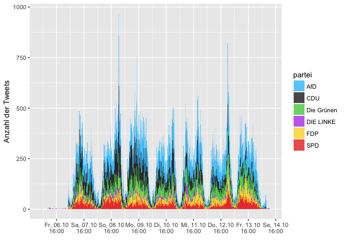

#### Von welchen Plattformen werden die meisten Tweets gesendet?

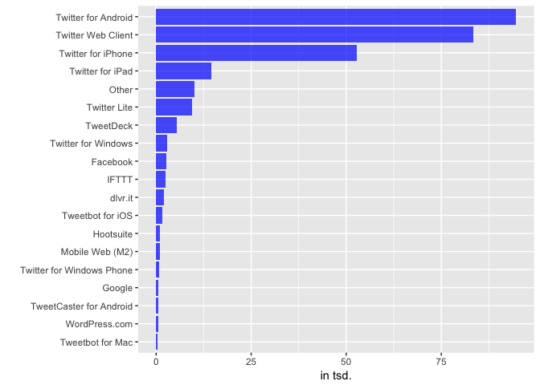

2. Wer retweeted wen?
---------------------

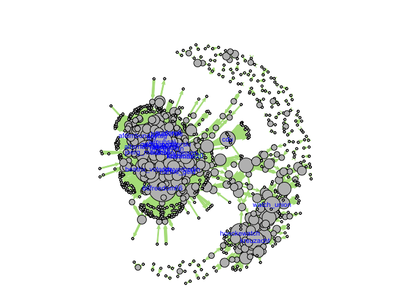

### Welche der Tweets wurden am häufigsten Retweeted?

<!--html_preserve-->
<table class="gmisc_table" style="border-collapse: collapse; margin-top: 1em; margin-bottom: 1em;">
<thead>
<tr>
<th style="border-bottom: 1px solid grey; border-top: 2px solid grey;">
</th>
<th style="border-bottom: 1px solid grey; border-top: 2px solid grey; text-align: center;">
name
</th>
<th style="border-bottom: 1px solid grey; border-top: 2px solid grey; text-align: center;">
text
</th>
<th style="border-bottom: 1px solid grey; border-top: 2px solid grey; text-align: center;">
retweet\_count
</th>
</tr>
</thead>
<tbody>
<tr>
<td style="text-align: left;">
1
</td>
<td style="text-align: left;">
Nicht Chevy Chase
</td>
<td style="text-align: left;">
Obergrenzen, die mir wichtiger wären als die für Zuwanderung:

CO2-Ausstoß Mieten Abgeordnetendiäten News über Trump & AfD Trash-TV-Formate
</td>
<td style="text-align: left;">
1902
</td>
</tr>
<tr>
<td style="text-align: left;">
2
</td>
<td style="text-align: left;">
Alternative für 🇩🇪
</td>
<td style="text-align: left;">
Diese "\#Obergrenze" ist wertlos! Wir fordern eine Aussetzung des \#Familiennachzug|s & eine Minuszuwanderung. \#AfD… <https://t.co/cKa1JtxYME>
</td>
<td style="text-align: left;">
742
</td>
</tr>
<tr>
<td style="text-align: left;">
3
</td>
<td style="text-align: left;">
Kaffeecup
</td>
<td style="text-align: left;">
AfD: Das Boot ist voll. CSU: Obervoll! Die Grünen: Fährt das Boot mit Diesel? FDP: Lindner hat Seepferdchen! SPD: Wir wollen auch ins Boot!
</td>
<td style="text-align: left;">
610
</td>
</tr>
<tr>
<td style="text-align: left;">
4
</td>
<td style="text-align: left;">
Dr. Alice Weidel
</td>
<td style="text-align: left;">
Neue Normalität in unserem Land dank der Versager in den deutschen Regierungsbänken. \#AfD \#LtwNdS <https://t.co/8ZDPE1d8TY>
</td>
<td style="text-align: left;">
575
</td>
</tr>
<tr>
<td style="text-align: left;">
5
</td>
<td style="text-align: left;">
Alternative für 🇩🇪
</td>
<td style="text-align: left;">
\#AfD-Bundessprecher Prof. @Joerg\_Meuthen konfrontiert die Altparteien im \#LtBW mit deren Doppelmoral & den unsäglic… <https://t.co/2R2m67exfV>
</td>
<td style="text-align: left;">
570
</td>
</tr>
<tr>
<td style="text-align: left;">
6
</td>
<td style="text-align: left;">
Herr Dachschaden
</td>
<td style="text-align: left;">
Faszinierend, wie sich Argumente zu Homöopathie und AfD gleichen. Tatsachen weichen Empfindungen, Wissenschaft weic… <https://t.co/lD9jAJnayK>
</td>
<td style="text-align: left;">
559
</td>
</tr>
<tr>
<td style="text-align: left;">
7
</td>
<td style="text-align: left;">
Beatrix von Storch
</td>
<td style="text-align: left;">
CDU will muslimischen Feiertag. Das ist der Unterschied zur AfD: wir sagen dazu NEIN! NEIN! NEIN! \#AfD <https://t.co/bZlz9ughOG>
</td>
<td style="text-align: left;">
555
</td>
</tr>
<tr>
<td style="text-align: left;">
8
</td>
<td style="text-align: left;">
Herzgerüchte
</td>
<td style="text-align: left;">
Die FDP gehört abgeschafft. Sie ist die eigentliche Ursache der ungesteuerten Verbreitung menschenverachtenden neol… <https://t.co/ePTOQsBpg8>
</td>
<td style="text-align: left;">
536
</td>
</tr>
<tr>
<td style="text-align: left;">
9
</td>
<td style="text-align: left;">
Erika Steinbach
</td>
<td style="text-align: left;">
Die CDU I S T eine linke Partei ‼️ <https://t.co/Z68kfDsbet>
</td>
<td style="text-align: left;">
505
</td>
</tr>
<tr>
<td style="border-bottom: 2px solid grey; text-align: left;">
10
</td>
<td style="border-bottom: 2px solid grey; text-align: left;">
Marie Laveau
</td>
<td style="border-bottom: 2px solid grey; text-align: left;">
Bin grad fassungslos. CDU BaWü lässt per Anfrage in Unis nach Teilnehmern an \#NoG20-Demos suchen. SWR.de <https://t.co/wzY80X0bnP> via @SWR4BW
</td>
<td style="border-bottom: 2px solid grey; text-align: left;">
488
</td>
</tr>
</tbody>
</table>
<!--/html_preserve-->
3. Über welche Partei wird am meisten getweeted?
------------------------------------------------

Anzahl gesamter Tweets:

<!--html_preserve-->
<table class="gmisc_table" style="border-collapse: collapse; margin-top: 1em; margin-bottom: 1em;">
<tbody>
<tr style="border-top: 2px solid grey;">
<td style="border-top: 2px solid grey; border-bottom: 2px solid grey; text-align: center;">
287407
</td>
</tr>
</tbody>
</table>
<!--/html_preserve-->

#### Anzahl der Tweets großer Nachrichtendienste

Tweets insgesamt: <!--html_preserve-->
<table class="gmisc_table" style="border-collapse: collapse; margin-top: 1em; margin-bottom: 1em;">
<tbody>
<tr style="border-top: 2px solid grey;">
<td style="border-top: 2px solid grey; border-bottom: 2px solid grey; text-align: center;">
780
</td>
</tr>
</tbody>
</table>
<!--/html_preserve-->
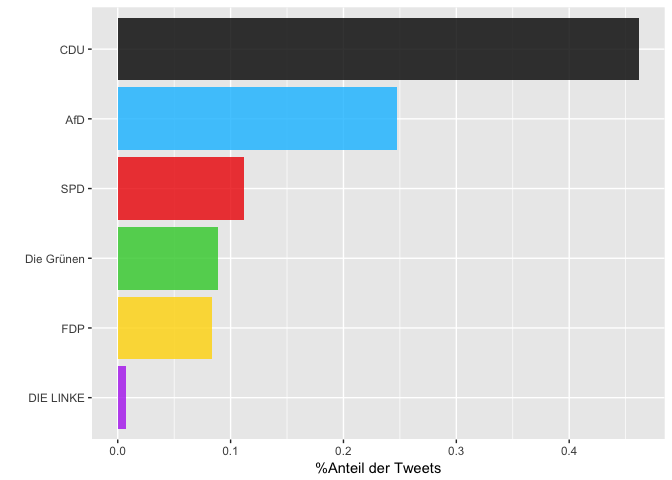

### Anzahl der Tweets anderer User-Accounts

Tweets insgesamt: <!--html_preserve-->
<table class="gmisc_table" style="border-collapse: collapse; margin-top: 1em; margin-bottom: 1em;">
<tbody>
<tr style="border-top: 2px solid grey;">
<td style="border-top: 2px solid grey; border-bottom: 2px solid grey; text-align: center;">
61384
</td>
</tr>
</tbody>
</table>
<!--/html_preserve-->
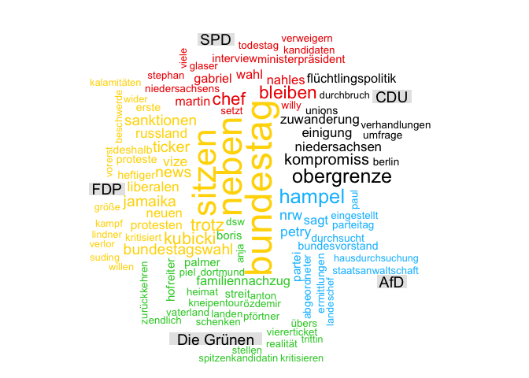

4.Wordclouds
------------

### Nachrichten-Dienste

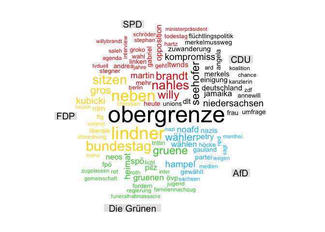

### Andere User-Accounts

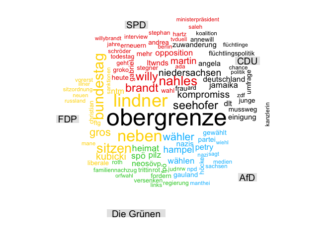

5. term frequency - inverse document frequency (tf-idf)
-------------------------------------------------------

### Nachrichtendienste

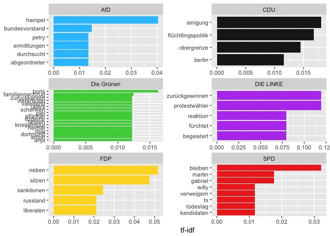

#### Andere User-Accounts

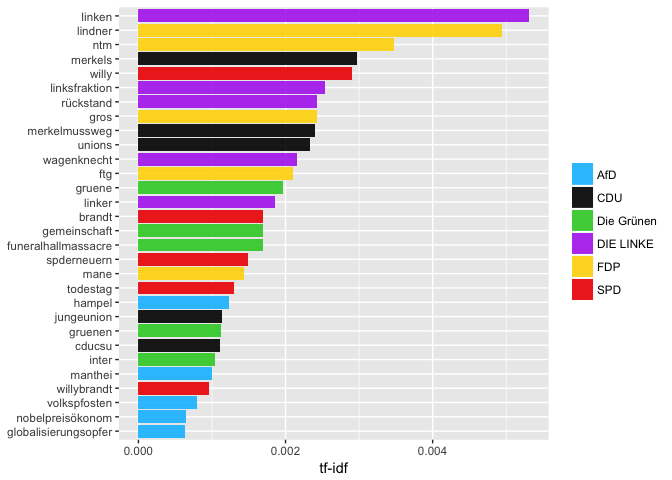

6. Sentiment Analyse
--------------------

#### Nachrichtenportale

##### Anzahl negativer Sentiment-Wörter

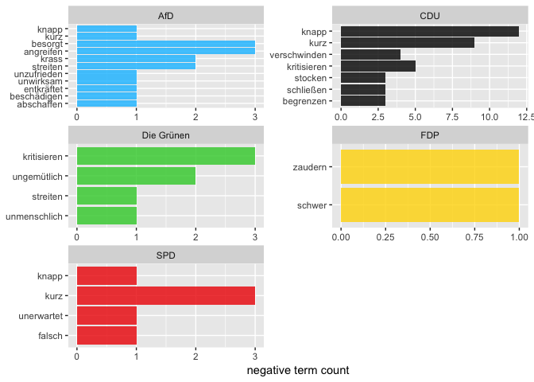

##### Anzahl positiver Sentiment-Wörter

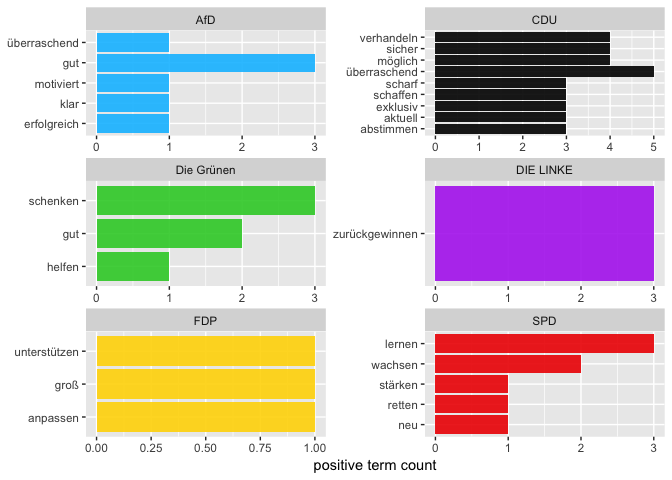

#### Gewichtete Analyse

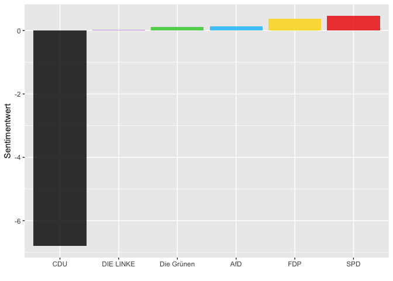

#### Was sind die Tweets mit den negativsten/positivsten Werten?

##### CDU

<!--html_preserve-->
<table class="gmisc_table" style="border-collapse: collapse; margin-top: 1em; margin-bottom: 1em;">
<thead>
<tr>
<th style="border-bottom: 1px solid grey; border-top: 2px solid grey;">
</th>
<th style="border-bottom: 1px solid grey; border-top: 2px solid grey; text-align: center;">
partei
</th>
<th style="border-bottom: 1px solid grey; border-top: 2px solid grey; text-align: center;">
word
</th>
<th style="border-bottom: 1px solid grey; border-top: 2px solid grey; text-align: center;">
text
</th>
<th style="border-bottom: 1px solid grey; border-top: 2px solid grey; text-align: center;">
Wert
</th>
</tr>
</thead>
<tbody>
<tr>
<td style="text-align: left;">
1
</td>
<td style="text-align: left;">
CDU
</td>
<td style="text-align: left;">
falsch
</td>
<td style="text-align: left;">
Richtungsstreit in der Union: "Die These, wir müssten nach rechts rücken, ist völlig falsch"... <https://t.co/A6medTYrMh>
</td>
<td style="text-align: left;">
-0.7618
</td>
</tr>
<tr>
<td style="text-align: left;">
2
</td>
<td style="text-align: left;">
CDU
</td>
<td style="text-align: left;">
bedeutungslos
</td>
<td style="text-align: left;">
"Bedeutungslos": CDU-Politiker Brok verrät, wie wenig die Obergrenze mit der Realität zu tun hat <https://t.co/7RGrnVomXe>
</td>
<td style="text-align: left;">
-0.6046
</td>
</tr>
<tr>
<td style="text-align: left;">
3
</td>
<td style="text-align: left;">
CDU
</td>
<td style="text-align: left;">
trennen
</td>
<td style="text-align: left;">
CDU/CSU sind gegen Familiennachzug. Aber der Staat darf eine Familie nicht willkürlich und nicht absichtlich trennen <https://t.co/RRXMUwWvd4>
</td>
<td style="text-align: left;">
-0.5033
</td>
</tr>
<tr>
<td style="text-align: left;">
4
</td>
<td style="text-align: left;">
CDU
</td>
<td style="text-align: left;">
unklar
</td>
<td style="text-align: left;">
Auftraggeber unklar - Anti-Merkel-Umfrage: Ohne Merkel hätten CDU und CSU mehr Stimmen bekommen <https://t.co/FVgsz5HaE7>
</td>
<td style="text-align: left;">
-0.5023
</td>
</tr>
<tr>
<td style="text-align: left;">
5
</td>
<td style="text-align: left;">
CDU
</td>
<td style="text-align: left;">
unklar
</td>
<td style="text-align: left;">
Auftraggeber unklar - Anti-Merkel-Umfrage: Ohne Merkel hätten CDU und CSU mehr Stimmen bekommen <https://t.co/fcW0FBfBJE>
</td>
<td style="text-align: left;">
-0.5023
</td>
</tr>
<tr>
<td style="border-bottom: 2px solid grey; text-align: left;">
6
</td>
<td style="border-bottom: 2px solid grey; text-align: left;">
CDU
</td>
<td style="border-bottom: 2px solid grey; text-align: left;">
beklagen
</td>
<td style="border-bottom: 2px solid grey; text-align: left;">
Union und Flüchtlingspolitik: Grüne beklagen „Punktsieg für die \#CSU“. \#btw17 <https://t.co/gow6zU29T5> <https://t.co/awrEXFmqmL>
</td>
<td style="border-bottom: 2px solid grey; text-align: left;">
-0.4967
</td>
</tr>
</tbody>
</table>
<!--/html_preserve-->
<!--html_preserve-->
<table class="gmisc_table" style="border-collapse: collapse; margin-top: 1em; margin-bottom: 1em;">
<thead>
<tr>
<th style="border-bottom: 1px solid grey; border-top: 2px solid grey;">
</th>
<th style="border-bottom: 1px solid grey; border-top: 2px solid grey; text-align: center;">
partei
</th>
<th style="border-bottom: 1px solid grey; border-top: 2px solid grey; text-align: center;">
word
</th>
<th style="border-bottom: 1px solid grey; border-top: 2px solid grey; text-align: center;">
text
</th>
<th style="border-bottom: 1px solid grey; border-top: 2px solid grey; text-align: center;">
Wert
</th>
</tr>
</thead>
<tbody>
<tr>
<td style="text-align: left;">
1
</td>
<td style="text-align: left;">
CDU
</td>
<td style="text-align: left;">
gelungen
</td>
<td style="text-align: left;">
FDP-Vize \#Kubicki im Dlf: "Der CDU ist es gelungen, die CSU endlich in Richtung \#Einwanderungsgesetz zu bewegen"… <https://t.co/2OGhqP82J4>
</td>
<td style="text-align: left;">
1
</td>
</tr>
<tr>
<td style="text-align: left;">
2
</td>
<td style="text-align: left;">
CDU
</td>
<td style="text-align: left;">
feiern
</td>
<td style="text-align: left;">
Flüchtlingsstreit: Während CDU und CSU ihren frisch geschlossenen Kompromiss feiern, melden sich Die Grünen zu Wort. <https://t.co/zPGa5G4G5m>
</td>
<td style="text-align: left;">
0.494
</td>
</tr>
<tr>
<td style="text-align: left;">
3
</td>
<td style="text-align: left;">
CDU
</td>
<td style="text-align: left;">
wichtig
</td>
<td style="text-align: left;">
Guten Morgen! \#CSU und \#CDU haben einen Kompromiss in der Flüchtlingsfrage erzielt. Das wird heute noch wichtig: <https://t.co/bKftDxX4fA>
</td>
<td style="text-align: left;">
0.3822
</td>
</tr>
<tr>
<td style="text-align: left;">
4
</td>
<td style="text-align: left;">
CDU
</td>
<td style="text-align: left;">
sicher
</td>
<td style="text-align: left;">
Nach Siegeszug der Rechtspopulisten - Merkel-Intimus Kauder sicher: Die AfD wird wieder verschwinden, wenn... <https://t.co/KZkXwQ4GmI>
</td>
<td style="text-align: left;">
0.3733
</td>
</tr>
<tr>
<td style="text-align: left;">
5
</td>
<td style="text-align: left;">
CDU
</td>
<td style="text-align: left;">
sicher
</td>
<td style="text-align: left;">
Nach Siegeszug der Rechtspopulisten - Merkel-Intimus Kauder sicher: Die AfD wird wieder verschwinden, wenn... <https://t.co/DLrtnIMzGU>
</td>
<td style="text-align: left;">
0.3733
</td>
</tr>
<tr>
<td style="border-bottom: 2px solid grey; text-align: left;">
6
</td>
<td style="border-bottom: 2px solid grey; text-align: left;">
CDU
</td>
<td style="border-bottom: 2px solid grey; text-align: left;">
sicher
</td>
<td style="border-bottom: 2px solid grey; text-align: left;">
Nach Siegeszug der Rechtspopulisten - Merkel-Intimus Kauder sicher: Die AfD wird wieder verschwinden, wenn... <https://t.co/eIui7eM8QZ>
</td>
<td style="border-bottom: 2px solid grey; text-align: left;">
0.3733
</td>
</tr>
</tbody>
</table>
<!--/html_preserve-->
##### SPD

<!--html_preserve-->
<table class="gmisc_table" style="border-collapse: collapse; margin-top: 1em; margin-bottom: 1em;">
<thead>
<tr>
<th style="border-bottom: 1px solid grey; border-top: 2px solid grey;">
</th>
<th style="border-bottom: 1px solid grey; border-top: 2px solid grey; text-align: center;">
partei
</th>
<th style="border-bottom: 1px solid grey; border-top: 2px solid grey; text-align: center;">
word
</th>
<th style="border-bottom: 1px solid grey; border-top: 2px solid grey; text-align: center;">
text
</th>
<th style="border-bottom: 1px solid grey; border-top: 2px solid grey; text-align: center;">
Wert
</th>
</tr>
</thead>
<tbody>
<tr>
<td style="text-align: left;">
1
</td>
<td style="text-align: left;">
SPD
</td>
<td style="text-align: left;">
falsch
</td>
<td style="text-align: left;">
\#Woidke kontert \#SPD-Schelte von Parteigenosse \#Saleh: "Völlig falsch, jetzt Öl ins Feuer zu gießen" <https://t.co/KoFu89L1TZ> \#btw17
</td>
<td style="text-align: left;">
-0.7618
</td>
</tr>
<tr>
<td style="text-align: left;">
2
</td>
<td style="text-align: left;">
SPD
</td>
<td style="text-align: left;">
knapp
</td>
<td style="text-align: left;">
Zweifaches Kopf-an-Kopf-Rennen: SPD liegt vor Niedersachen-Wahl knapp vorn <https://t.co/kmtKdWDNMx>
</td>
<td style="text-align: left;">
-0.2036
</td>
</tr>
<tr>
<td style="text-align: left;">
3
</td>
<td style="text-align: left;">
SPD
</td>
<td style="text-align: left;">
unerwartet
</td>
<td style="text-align: left;">
SPD-Ministerpräsident Stephan Weil: Ein Funke Hoffnung - Unerwartet hat Niedersachsens Ministerpräsident Stepha... <https://t.co/ow8xmR4whP>
</td>
<td style="text-align: left;">
-0.0349
</td>
</tr>
<tr>
<td style="text-align: left;">
4
</td>
<td style="text-align: left;">
SPD
</td>
<td style="text-align: left;">
kurz
</td>
<td style="text-align: left;">
Der positive Umfrage-Trend für Niedersachsens \#SPD setzt sich kurz vor der \#Landtagswahl fort. <https://t.co/8WA6WUaJyf>
</td>
<td style="text-align: left;">
-0.0048
</td>
</tr>
<tr>
<td style="text-align: left;">
5
</td>
<td style="text-align: left;">
SPD
</td>
<td style="text-align: left;">
kurz
</td>
<td style="text-align: left;">
Der positive Umfrage-Trend für Niedersachsens \#SPD setzt sich kurz vor der \#Landtagswahl fort. <https://t.co/FJ09GiqBkC>
</td>
<td style="text-align: left;">
-0.0048
</td>
</tr>
<tr>
<td style="border-bottom: 2px solid grey; text-align: left;">
6
</td>
<td style="border-bottom: 2px solid grey; text-align: left;">
SPD
</td>
<td style="border-bottom: 2px solid grey; text-align: left;">
kurz
</td>
<td style="border-bottom: 2px solid grey; text-align: left;">
Der positive Umfrage-Trend für Niedersachsens \#SPD setzt sich kurz vor der \#Landtagswahl fort. <https://t.co/MyZYNLO0qJ>
</td>
<td style="border-bottom: 2px solid grey; text-align: left;">
-0.0048
</td>
</tr>
</tbody>
</table>
<!--/html_preserve-->
<!--html_preserve-->
<table class='gmisc_table' style='border-collapse: collapse; margin-top: 1em; margin-bottom: 1em;' >
<thead>
<tr>
<th style="border-bottom: 1px solid grey; border-top: 2px solid grey;">
</th>
<th style="border-bottom: 1px solid grey; border-top: 2px solid grey; text-align: center;">
partei
</th>
<th style="border-bottom: 1px solid grey; border-top: 2px solid grey; text-align: center;">
word
</th>
<th style="border-bottom: 1px solid grey; border-top: 2px solid grey; text-align: center;">
text
</th>
<th style="border-bottom: 1px solid grey; border-top: 2px solid grey; text-align: center;">
Wert
</th>
</tr>
</thead>
<tbody>
<tr>
<td style="text-align: left;">
1
</td>
<td style="text-align: left;">
SPD
</td>
<td style="text-align: left;">
wachsen
</td>
<td style="text-align: left;">
Stadtentwicklung: So wollen Grüne und SPD Hamburg wachsen lassen <https://t.co/0ZwcYwXWO7> <https://t.co/ydaaLAQsCD>
</td>
<td style="text-align: left;">
0.3607
</td>
</tr>
<tr>
<td style="text-align: left;">
2
</td>
<td style="text-align: left;">
SPD
</td>
<td style="text-align: left;">
wachsen
</td>
<td style="text-align: left;">
So wollen Grüne und SPD Hamburg wachsen lassen <https://t.co/EbVdsXnvO7> <https://t.co/a5Y41xePAD>
</td>
<td style="text-align: left;">
0.3607
</td>
</tr>
<tr>
<td style="text-align: left;">
3
</td>
<td style="text-align: left;">
SPD
</td>
<td style="text-align: left;">
lernen
</td>
<td style="text-align: left;">
Die britische \#Labour-Partei hat einen Lauf. Davon kann die SPD lernen – nur nicht zu viel. <https://t.co/sOmxNlhtIl>
</td>
<td style="text-align: left;">
0.2492
</td>
</tr>
<tr>
<td style="text-align: left;">
4
</td>
<td style="text-align: left;">
SPD
</td>
<td style="text-align: left;">
lernen
</td>
<td style="text-align: left;">
Die britische Labour-Partei hat einen Lauf. Davon kann die SPD lernen – nur nicht zu viel. <https://t.co/eEzjZxkr0N>
</td>
<td style="text-align: left;">
0.2492
</td>
</tr>
<tr>
<td style="text-align: left;">
5
</td>
<td style="text-align: left;">
SPD
</td>
<td style="text-align: left;">
lernen
</td>
<td style='text-align: left;'>
1.  Todestag von Willy Brandt: Was die SPD von ihrem großen Vorsitzenden lernen kann - gerade jetzt <https://t.co/qTorgcV6jh>
    </td>
    <td style="text-align: left;">
    0.2492
    </td>
    </tr>
    <tr>
    <td style="border-bottom: 2px solid grey; text-align: left;">
    6
    </td>
    <td style="border-bottom: 2px solid grey; text-align: left;">
    SPD
    </td>
    <td style="border-bottom: 2px solid grey; text-align: left;">
    stärken
    </td>
    <td style="border-bottom: 2px solid grey; text-align: left;">
    Ein Wahlsieg in \#Niedersachsen würde Stephan Weils Einfluss in der \#SPD stärken - bundesweit. <https://t.co/gq3eaJNc7P>
    </td>
    <td style="border-bottom: 2px solid grey; text-align: left;">
    0.004
    </td>
    </tr>
    </tbody>
    </table>
    <!--/html_preserve-->

##### FDP

<!--html_preserve-->
<table class="gmisc_table" style="border-collapse: collapse; margin-top: 1em; margin-bottom: 1em;">
<thead>
<tr>
<th style="border-bottom: 1px solid grey; border-top: 2px solid grey;">
</th>
<th style="border-bottom: 1px solid grey; border-top: 2px solid grey; text-align: center;">
partei
</th>
<th style="border-bottom: 1px solid grey; border-top: 2px solid grey; text-align: center;">
word
</th>
<th style="border-bottom: 1px solid grey; border-top: 2px solid grey; text-align: center;">
text
</th>
<th style="border-bottom: 1px solid grey; border-top: 2px solid grey; text-align: center;">
Wert
</th>
</tr>
</thead>
<tbody>
<tr>
<td style="text-align: left;">
1
</td>
<td style="text-align: left;">
FDP
</td>
<td style="text-align: left;">
zaudern
</td>
<td style="text-align: left;">
Die FDP darf nicht zaudern, wenn es ums Regieren geht: Kommentar von @Herr\_Szymanski <https://t.co/e2EA8ovYyl>
</td>
<td style="text-align: left;">
-0.0048
</td>
</tr>
<tr>
<td style="text-align: left;">
2
</td>
<td style="text-align: left;">
FDP
</td>
<td style="text-align: left;">
schwer
</td>
<td style="text-align: left;">
"Wir wollen es wissen!" \#Grüne in Niedersachsen wollen regieren, Koalition mit FDP aber nur schwer vorstellbar: <https://t.co/WSrrjKzpnm>
</td>
<td style="text-align: left;">
-0.0048
</td>
</tr>
<tr>
<td style="text-align: left;">
3
</td>
<td style="text-align: left;">
FDP
</td>
<td style="text-align: left;">
unterstützen
</td>
<td style="text-align: left;">
Frankreich pro Jamaika-Koalition: Macron: FDP und Grüne unterstützen Europa <https://t.co/ihDBL20IkM>
</td>
<td style="text-align: left;">
0.004
</td>
</tr>
<tr>
<td style="border-bottom: 2px solid grey; text-align: left;">
4
</td>
<td style="border-bottom: 2px solid grey; text-align: left;">
FDP
</td>
<td style="border-bottom: 2px solid grey; text-align: left;">
groß
</td>
<td style="border-bottom: 2px solid grey; text-align: left;">
FDP: Liberale müssen im Bundestag neben AfD sitzen - Mit sechs Fraktionen ist der neue Bundestag groß wie nie. ... <https://t.co/dTZBke4iPG>
</td>
<td style="border-bottom: 2px solid grey; text-align: left;">
0.3694
</td>
</tr>
</tbody>
</table>
<!--/html_preserve-->
<!--html_preserve-->
<table class="gmisc_table" style="border-collapse: collapse; margin-top: 1em; margin-bottom: 1em;">
<thead>
<tr>
<th style="border-bottom: 1px solid grey; border-top: 2px solid grey;">
</th>
<th style="border-bottom: 1px solid grey; border-top: 2px solid grey; text-align: center;">
partei
</th>
<th style="border-bottom: 1px solid grey; border-top: 2px solid grey; text-align: center;">
word
</th>
<th style="border-bottom: 1px solid grey; border-top: 2px solid grey; text-align: center;">
text
</th>
<th style="border-bottom: 1px solid grey; border-top: 2px solid grey; text-align: center;">
Wert
</th>
</tr>
</thead>
<tbody>
<tr>
<td style="text-align: left;">
1
</td>
<td style="text-align: left;">
FDP
</td>
<td style="text-align: left;">
groß
</td>
<td style="text-align: left;">
FDP: Liberale müssen im Bundestag neben AfD sitzen - Mit sechs Fraktionen ist der neue Bundestag groß wie nie. ... <https://t.co/dTZBke4iPG>
</td>
<td style="text-align: left;">
0.3694
</td>
</tr>
<tr>
<td style="text-align: left;">
2
</td>
<td style="text-align: left;">
FDP
</td>
<td style="text-align: left;">
unterstützen
</td>
<td style="text-align: left;">
Frankreich pro Jamaika-Koalition: Macron: FDP und Grüne unterstützen Europa <https://t.co/ihDBL20IkM>
</td>
<td style="text-align: left;">
0.004
</td>
</tr>
<tr>
<td style="text-align: left;">
3
</td>
<td style="text-align: left;">
FDP
</td>
<td style="text-align: left;">
zaudern
</td>
<td style="text-align: left;">
Die FDP darf nicht zaudern, wenn es ums Regieren geht: Kommentar von @Herr\_Szymanski <https://t.co/e2EA8ovYyl>
</td>
<td style="text-align: left;">
-0.0048
</td>
</tr>
<tr>
<td style="border-bottom: 2px solid grey; text-align: left;">
4
</td>
<td style="border-bottom: 2px solid grey; text-align: left;">
FDP
</td>
<td style="border-bottom: 2px solid grey; text-align: left;">
schwer
</td>
<td style="border-bottom: 2px solid grey; text-align: left;">
"Wir wollen es wissen!" \#Grüne in Niedersachsen wollen regieren, Koalition mit FDP aber nur schwer vorstellbar: <https://t.co/WSrrjKzpnm>
</td>
<td style="border-bottom: 2px solid grey; text-align: left;">
-0.0048
</td>
</tr>
</tbody>
</table>
<!--/html_preserve-->
##### AfD

<!--html_preserve-->
<table class="gmisc_table" style="border-collapse: collapse; margin-top: 1em; margin-bottom: 1em;">
<thead>
<tr>
<th style="border-bottom: 1px solid grey; border-top: 2px solid grey;">
</th>
<th style="border-bottom: 1px solid grey; border-top: 2px solid grey; text-align: center;">
partei
</th>
<th style="border-bottom: 1px solid grey; border-top: 2px solid grey; text-align: center;">
word
</th>
<th style="border-bottom: 1px solid grey; border-top: 2px solid grey; text-align: center;">
text
</th>
<th style="border-bottom: 1px solid grey; border-top: 2px solid grey; text-align: center;">
Wert
</th>
</tr>
</thead>
<tbody>
<tr>
<td style="text-align: left;">
1
</td>
<td style="text-align: left;">
AfD
</td>
<td style="text-align: left;">
unzufrieden
</td>
<td style="text-align: left;">
Die \#AfD verliert immer mehr Mandatsträger, die mit dem Kurs der Parteiführung unzufrieden sind. <https://t.co/qSOPDQpPPq>
</td>
<td style="text-align: left;">
-0.3363
</td>
</tr>
<tr>
<td style="text-align: left;">
2
</td>
<td style="text-align: left;">
AfD
</td>
<td style="text-align: left;">
beschädigen
</td>
<td style="text-align: left;">
Es hätte nicht der \#AfD bedurft, um den sozialen und mentalen Zusammenhalt unserer Gesellschaft zu beschädigen. <https://t.co/BWGuiKJxnW>
</td>
<td style="text-align: left;">
-0.335
</td>
</tr>
<tr>
<td style="text-align: left;">
3
</td>
<td style="text-align: left;">
AfD
</td>
<td style="text-align: left;">
knapp
</td>
<td style="text-align: left;">
Knapp doppelt so viele Männer wie Frauen gaben am 24. September ihre Stimme der AfD. Was ist da los? <https://t.co/Cin0ZhHaFI>
</td>
<td style="text-align: left;">
-0.2036
</td>
</tr>
<tr>
<td style="text-align: left;">
4
</td>
<td style="text-align: left;">
AfD
</td>
<td style="text-align: left;">
krass
</td>
<td style="text-align: left;">
"Diese Frage ist krass" - Wolfsburg-Profi Arnold erschrocken von Fragen aus AfD-Umfeld \#fußball <https://t.co/AYWnmdKYtO>
</td>
<td style="text-align: left;">
-0.1603
</td>
</tr>
<tr>
<td style="text-align: left;">
5
</td>
<td style="text-align: left;">
AfD
</td>
<td style="text-align: left;">
krass
</td>
<td style="text-align: left;">
"Diese Frage ist krass" - Wolfsburg-Profi Arnold erschrocken von Fragen aus AfD-Umfeld \#fußball <https://t.co/fSsM80iRYR>
</td>
<td style="text-align: left;">
-0.1603
</td>
</tr>
<tr>
<td style="border-bottom: 2px solid grey; text-align: left;">
6
</td>
<td style="border-bottom: 2px solid grey; text-align: left;">
AfD
</td>
<td style="border-bottom: 2px solid grey; text-align: left;">
besorgt
</td>
<td style="border-bottom: 2px solid grey; text-align: left;">
Joseph Stiglitz: Nobelpreisökonom besorgt über AfD-Erfolg. <https://t.co/JYW2sbMTgg> \#Handelsblatt \#Politik
</td>
<td style="border-bottom: 2px solid grey; text-align: left;">
-0.0482
</td>
</tr>
</tbody>
</table>
<!--/html_preserve-->
<!--html_preserve-->
<table class="gmisc_table" style="border-collapse: collapse; margin-top: 1em; margin-bottom: 1em;">
<thead>
<tr>
<th style="border-bottom: 1px solid grey; border-top: 2px solid grey;">
</th>
<th style="border-bottom: 1px solid grey; border-top: 2px solid grey; text-align: center;">
partei
</th>
<th style="border-bottom: 1px solid grey; border-top: 2px solid grey; text-align: center;">
word
</th>
<th style="border-bottom: 1px solid grey; border-top: 2px solid grey; text-align: center;">
text
</th>
<th style="border-bottom: 1px solid grey; border-top: 2px solid grey; text-align: center;">
Wert
</th>
</tr>
</thead>
<tbody>
<tr>
<td style="text-align: left;">
1
</td>
<td style="text-align: left;">
AfD
</td>
<td style="text-align: left;">
gut
</td>
<td style="text-align: left;">
Gerade gut gelesen: Wegen Sicherheitsbedenken: AfD sagt Landesparteitag ab <https://t.co/xZ9HApLsY5> <https://t.co/qmOh6Ojhsn>
</td>
<td style="text-align: left;">
0.3716
</td>
</tr>
<tr>
<td style="text-align: left;">
2
</td>
<td style="text-align: left;">
AfD
</td>
<td style="text-align: left;">
gut
</td>
<td style="text-align: left;">
Gast-Kommentar: Die Frage, warum die AfD in Medien „immer so gut wegkommt“, verbietet sich für Redaktionen <https://t.co/YRFCE4sgXN>
</td>
<td style="text-align: left;">
0.3716
</td>
</tr>
<tr>
<td style="text-align: left;">
3
</td>
<td style="text-align: left;">
AfD
</td>
<td style="text-align: left;">
gut
</td>
<td style="text-align: left;">
Gerade gut gelesen: Austrittswelle bei AfD-Mandatsträgern <https://t.co/Nh4gr8WN1m> <https://t.co/Lmcrle5csY>
</td>
<td style="text-align: left;">
0.3716
</td>
</tr>
<tr>
<td style="text-align: left;">
4
</td>
<td style="text-align: left;">
AfD
</td>
<td style="text-align: left;">
motiviert
</td>
<td style="text-align: left;">
AfD-Landeschef Hampel: Durchsuchungen politisch motiviert <https://t.co/k59Wv3kMCN> <https://t.co/9pzi14OOIS>
</td>
<td style="text-align: left;">
0.3541
</td>
</tr>
<tr>
<td style="text-align: left;">
5
</td>
<td style="text-align: left;">
AfD
</td>
<td style="text-align: left;">
erfolgreich
</td>
<td style="text-align: left;">
AfD in Niedersachsen: Erfolgreich trotz Dauerzoff - Die AfD in Niedersachsen ist tief zerstritten – und ihre Sp... <https://t.co/egKOeM1ITG>
</td>
<td style="text-align: left;">
0.2193
</td>
</tr>
<tr>
<td style="border-bottom: 2px solid grey; text-align: left;">
6
</td>
<td style="border-bottom: 2px solid grey; text-align: left;">
AfD
</td>
<td style="border-bottom: 2px solid grey; text-align: left;">
klar
</td>
<td style="border-bottom: 2px solid grey; text-align: left;">
AfD Niedersachsen kämpft vorKTW mit Ermittlungen und Intrigen. Die Schuldigen sind für die Partei klar. <https://t.co/pcxmu3kgSt>
</td>
<td style="border-bottom: 2px solid grey; text-align: left;">
0.004
</td>
</tr>
</tbody>
</table>
<!--/html_preserve-->
### Andere Nutzer

#### Ungewichtete Analyse

##### Anzahl negativer Sentiment-Wörter

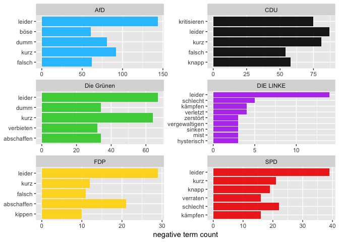

##### Anzahl positiver Sentiment-Wörter

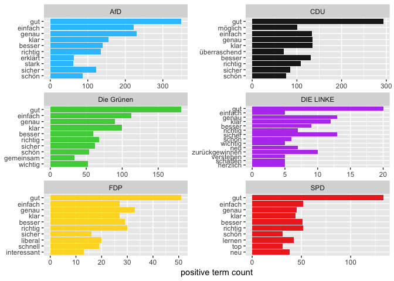

#### Gewichtete Analyse

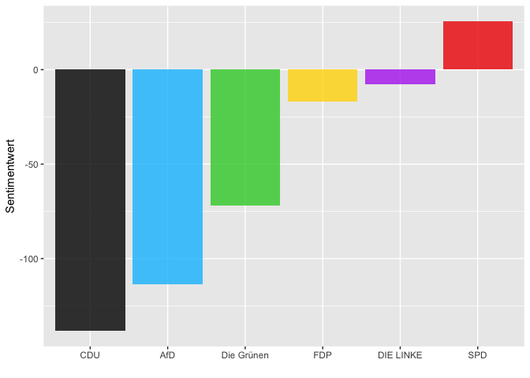

#### Was sind die Tweets mit den negativsten Werten?

##### CDU

<!--html_preserve-->
<table class="gmisc_table" style="border-collapse: collapse; margin-top: 1em; margin-bottom: 1em;">
<thead>
<tr>
<th style="border-bottom: 1px solid grey; border-top: 2px solid grey;">
</th>
<th style="border-bottom: 1px solid grey; border-top: 2px solid grey; text-align: center;">
partei
</th>
<th style="border-bottom: 1px solid grey; border-top: 2px solid grey; text-align: center;">
word
</th>
<th style="border-bottom: 1px solid grey; border-top: 2px solid grey; text-align: center;">
text
</th>
<th style="border-bottom: 1px solid grey; border-top: 2px solid grey; text-align: center;">
Wert
</th>
</tr>
</thead>
<tbody>
<tr>
<td style="text-align: left;">
1
</td>
<td style="text-align: left;">
CDU
</td>
<td style="text-align: left;">
unnötig
</td>
<td style="text-align: left;">
\#ltwnds2017 Je mehr \#AfD wählen umso eher wird R2G Katastrophe verhindert \#CDU wählen unnötig, die wollen jetzt islam. Feiertage einführen
</td>
<td style="text-align: left;">
-0.9463
</td>
</tr>
<tr>
<td style="text-align: left;">
2
</td>
<td style="text-align: left;">
CDU
</td>
<td style="text-align: left;">
unnötig
</td>
<td style="text-align: left;">
CDU/CSU führt sich mit \#Obergrenze mal wieder selber vor. Über wichtige Themen wie Altersarmut o.ä. zu diskutieren scheint ihnen unnötig.
</td>
<td style="text-align: left;">
-0.9463
</td>
</tr>
<tr>
<td style="text-align: left;">
3
</td>
<td style="text-align: left;">
CDU
</td>
<td style="text-align: left;">
schädlich
</td>
<td style="text-align: left;">
RT @KlausDFrank: @CDU @jensspahn @Junge\_Union Die politische Führung in der CDU ist schädlich für das Land. Die Marionetten setzen immer no…
</td>
<td style="text-align: left;">
-0.9269
</td>
</tr>
<tr>
<td style="text-align: left;">
4
</td>
<td style="text-align: left;">
CDU
</td>
<td style="text-align: left;">
schädlich
</td>
<td style="text-align: left;">
Merkels Beliebigkeit um Machterhalt zu sichern ist schädlich für unsere Demokratie und verachtend gegenüber der Wahlbevölkerung. \#Obergrenze
</td>
<td style="text-align: left;">
-0.9269
</td>
</tr>
<tr>
<td style="text-align: left;">
5
</td>
<td style="text-align: left;">
CDU
</td>
<td style="text-align: left;">
schwach
</td>
<td style="text-align: left;">
RT @hhoeppe: @althusmann hat schon als \#Kultusminister versagt. 2017 wird er die \#CDU unter 30 % drücken. Schwach. \#TVDuell
</td>
<td style="text-align: left;">
-0.9206
</td>
</tr>
<tr>
<td style="border-bottom: 2px solid grey; text-align: left;">
6
</td>
<td style="border-bottom: 2px solid grey; text-align: left;">
CDU
</td>
<td style="border-bottom: 2px solid grey; text-align: left;">
schwach
</td>
<td style="border-bottom: 2px solid grey; text-align: left;">
@althusmann hat schon als \#Kultusminister versagt. 2017 wird er die \#CDU unter 30 % drücken. Schwach. \#TVDuell
</td>
<td style="border-bottom: 2px solid grey; text-align: left;">
-0.9206
</td>
</tr>
</tbody>
</table>
<!--/html_preserve-->
<!--html_preserve-->
<table class="gmisc_table" style="border-collapse: collapse; margin-top: 1em; margin-bottom: 1em;">
<thead>
<tr>
<th style="border-bottom: 1px solid grey; border-top: 2px solid grey;">
</th>
<th style="border-bottom: 1px solid grey; border-top: 2px solid grey; text-align: center;">
partei
</th>
<th style="border-bottom: 1px solid grey; border-top: 2px solid grey; text-align: center;">
word
</th>
<th style="border-bottom: 1px solid grey; border-top: 2px solid grey; text-align: center;">
text
</th>
<th style="border-bottom: 1px solid grey; border-top: 2px solid grey; text-align: center;">
Wert
</th>
</tr>
</thead>
<tbody>
<tr>
<td style="text-align: left;">
1
</td>
<td style="text-align: left;">
CDU
</td>
<td style="text-align: left;">
gelungen
</td>
<td style="text-align: left;">
RT @DLFNachrichten: FDP-Vize \#Kubicki im Dlf: "Der CDU ist es gelungen, die CSU endlich in Richtung \#Einwanderungsgesetz zu bewegen" https:…
</td>
<td style="text-align: left;">
1
</td>
</tr>
<tr>
<td style="text-align: left;">
2
</td>
<td style="text-align: left;">
CDU
</td>
<td style="text-align: left;">
gelungen
</td>
<td style="text-align: left;">
@Kalleskoppel @ksta\_news Der CDU ist es bis zur Kanzlerschaft Merkels gelungen,zu verhindern,dass es rechts von ihr ne demokrat.Partei gibt
</td>
<td style="text-align: left;">
1
</td>
</tr>
<tr>
<td style="text-align: left;">
3
</td>
<td style="text-align: left;">
CDU
</td>
<td style="text-align: left;">
gelungen
</td>
<td style="text-align: left;">
PS. Ich finde es toll, dass der CDU und CSU endlich die Quadratur des Kreises gelungen ist: Weiterhin gilt das im... <https://t.co/COVpJdJPbl>
</td>
<td style="text-align: left;">
1
</td>
</tr>
<tr>
<td style="text-align: left;">
4
</td>
<td style="text-align: left;">
CDU
</td>
<td style="text-align: left;">
perfekt
</td>
<td style="text-align: left;">
@zeitonline Wenn es um linke Spinnereien geht, passen \#Grüne doch perfekt zur \#CDU. \#Energiewende, \#Flüchtlingspolitik, etc.
</td>
<td style="text-align: left;">
0.7299
</td>
</tr>
<tr>
<td style="text-align: left;">
5
</td>
<td style="text-align: left;">
CDU
</td>
<td style="text-align: left;">
perfekt
</td>
<td style="text-align: left;">
NunwirdinunseremLand der Linksruck perfekt gemacht. Hoffentlich kapieren diesjetzt die bürgerlichen Wähler, die CDU/CSU gewählt haben
</td>
<td style="text-align: left;">
0.7299
</td>
</tr>
<tr>
<td style="border-bottom: 2px solid grey; text-align: left;">
6
</td>
<td style="border-bottom: 2px solid grey; text-align: left;">
CDU
</td>
<td style="border-bottom: 2px solid grey; text-align: left;">
perfekt
</td>
<td style="border-bottom: 2px solid grey; text-align: left;">
\#annewill - Die CDU/CSU hat sich heute von Jamaika verabschiedet. Neuwahlen zum Bundestag am Tag der bayerischen Landtagswahl wäre perfekt.
</td>
<td style="border-bottom: 2px solid grey; text-align: left;">
0.7299
</td>
</tr>
</tbody>
</table>
<!--/html_preserve-->
##### SPD

<!--html_preserve-->
<table class="gmisc_table" style="border-collapse: collapse; margin-top: 1em; margin-bottom: 1em;">
<thead>
<tr>
<th style="border-bottom: 1px solid grey; border-top: 2px solid grey;">
</th>
<th style="border-bottom: 1px solid grey; border-top: 2px solid grey; text-align: center;">
partei
</th>
<th style="border-bottom: 1px solid grey; border-top: 2px solid grey; text-align: center;">
word
</th>
<th style="border-bottom: 1px solid grey; border-top: 2px solid grey; text-align: center;">
text
</th>
<th style="border-bottom: 1px solid grey; border-top: 2px solid grey; text-align: center;">
Wert
</th>
</tr>
</thead>
<tbody>
<tr>
<td style="text-align: left;">
1
</td>
<td style="text-align: left;">
SPD
</td>
<td style="text-align: left;">
schwach
</td>
<td style="text-align: left;">
@Bus\_Fauli @LeslieAlanMusic @LeonHirte Nur wenn die Linke schwach ist kann Die SPD stark sein
</td>
<td style="text-align: left;">
-0.9206
</td>
</tr>
<tr>
<td style="text-align: left;">
2
</td>
<td style="text-align: left;">
SPD
</td>
<td style="text-align: left;">
schwach
</td>
<td style="text-align: left;">
@spdbt @RNDnewsroom Dieses "Groß denken" klingt wie "Stark gegen den Schrank gelaufen und schwach wieder abgeprallt" \#Nahles \#SPD
</td>
<td style="text-align: left;">
-0.9206
</td>
</tr>
<tr>
<td style="text-align: left;">
3
</td>
<td style="text-align: left;">
SPD
</td>
<td style="text-align: left;">
schämen
</td>
<td style="text-align: left;">
@RichardLorisch @welt Die SPD sollte sich schämen! Über sowas profiliert man sich nicht! Herten hat große Probleme… <https://t.co/WXbU62mUdf>
</td>
<td style="text-align: left;">
-0.893
</td>
</tr>
<tr>
<td style="text-align: left;">
4
</td>
<td style="text-align: left;">
SPD
</td>
<td style="text-align: left;">
schämen
</td>
<td style="text-align: left;">
@Ralf\_Stegner Schämen sie sich Herr Stegner! So was ist SPD Vize, unglaublich. In einer Firma wären sie mit ihren A… <https://t.co/ckkbjAZbkW>
</td>
<td style="text-align: left;">
-0.893
</td>
</tr>
<tr>
<td style="text-align: left;">
5
</td>
<td style="text-align: left;">
SPD
</td>
<td style="text-align: left;">
schämen
</td>
<td style="text-align: left;">
@Ralf\_Stegner Jeden einzelnen Rechtsbruch, jede kriminelle Handlung, wurde von der SPD mitgetragen. Also, Klappe zu und leise schämen.
</td>
<td style="text-align: left;">
-0.893
</td>
</tr>
<tr>
<td style="border-bottom: 2px solid grey; text-align: left;">
6
</td>
<td style="border-bottom: 2px solid grey; text-align: left;">
SPD
</td>
<td style="border-bottom: 2px solid grey; text-align: left;">
schämen
</td>
<td style="border-bottom: 2px solid grey; text-align: left;">
RT @BertiHeinrich: @HeikoMaas Wie kann man sich als Verräter nur so mit Sprüchen v echten Politikern schmücken.Schämen sie sich.Die SPD d l…
</td>
<td style="border-bottom: 2px solid grey; text-align: left;">
-0.893
</td>
</tr>
</tbody>
</table>
<!--/html_preserve-->
<!--html_preserve-->
<table class="gmisc_table" style="border-collapse: collapse; margin-top: 1em; margin-bottom: 1em;">
<thead>
<tr>
<th style="border-bottom: 1px solid grey; border-top: 2px solid grey;">
</th>
<th style="border-bottom: 1px solid grey; border-top: 2px solid grey; text-align: center;">
partei
</th>
<th style="border-bottom: 1px solid grey; border-top: 2px solid grey; text-align: center;">
word
</th>
<th style="border-bottom: 1px solid grey; border-top: 2px solid grey; text-align: center;">
text
</th>
<th style="border-bottom: 1px solid grey; border-top: 2px solid grey; text-align: center;">
Wert
</th>
</tr>
</thead>
<tbody>
<tr>
<td style="text-align: left;">
1
</td>
<td style="text-align: left;">
SPD
</td>
<td style="text-align: left;">
gelungen
</td>
<td style="text-align: left;">
@CDU @Junge\_Union Es ist uns in einem Jahr noch nie gelungen, die SPD aus 2 Landesregierungen und der Bundesregierung zu werfen.:)
</td>
<td style="text-align: left;">
1
</td>
</tr>
<tr>
<td style="text-align: left;">
2
</td>
<td style="text-align: left;">
SPD
</td>
<td style="text-align: left;">
gelungen
</td>
<td style="text-align: left;">
Dass es \#SPD in \#BaWü in nur fünf Jahren (!) gelungen ist, das \#Bildungsniveau in Grundschulen an die Wand zu fahre… <https://t.co/WZvGcl1GC4>
</td>
<td style="text-align: left;">
1
</td>
</tr>
<tr>
<td style="text-align: left;">
3
</td>
<td style="text-align: left;">
SPD
</td>
<td style="text-align: left;">
perfekt
</td>
<td style="text-align: left;">
@alexanderebhart Beschreibt den Zustand der SPD einfach perfekt. So wirds eben nichts mit einer zukunftsgerichteten Politik.
</td>
<td style="text-align: left;">
0.7299
</td>
</tr>
<tr>
<td style="text-align: left;">
4
</td>
<td style="text-align: left;">
SPD
</td>
<td style="text-align: left;">
wunderbar
</td>
<td style="text-align: left;">
SPD gleich neben der Linken - das passt, und die neue Koalition in der Mitte: wunderbar! <https://t.co/7tms1pzDe2> via @welt
</td>
<td style="text-align: left;">
0.7234
</td>
</tr>
<tr>
<td style="text-align: left;">
5
</td>
<td style="text-align: left;">
SPD
</td>
<td style="text-align: left;">
wunderbar
</td>
<td style="text-align: left;">
Die Linke in \#NDS ist wunderbar aufgestellt, wenn man K-Gruppen Opas und GAZA-Demo-Wichtel mag. Da hat die \#SPD sowas von Bock drauf, nicht.
</td>
<td style="text-align: left;">
0.7234
</td>
</tr>
<tr>
<td style="border-bottom: 2px solid grey; text-align: left;">
6
</td>
<td style="border-bottom: 2px solid grey; text-align: left;">
SPD
</td>
<td style="border-bottom: 2px solid grey; text-align: left;">
wunderbar
</td>
<td style="border-bottom: 2px solid grey; text-align: left;">
@ManuelaSchwesig Wunderbar, wenn das Kompetenzteam Schulz/Stegner/Schwesig im Vorstand bleibt, bekommt die SPD &lt;10% bei der BTW2021.
</td>
<td style="border-bottom: 2px solid grey; text-align: left;">
0.7234
</td>
</tr>
</tbody>
</table>
<!--/html_preserve-->
##### FDP

<!--html_preserve-->
<table class="gmisc_table" style="border-collapse: collapse; margin-top: 1em; margin-bottom: 1em;">
<thead>
<tr>
<th style="border-bottom: 1px solid grey; border-top: 2px solid grey;">
</th>
<th style="border-bottom: 1px solid grey; border-top: 2px solid grey; text-align: center;">
partei
</th>
<th style="border-bottom: 1px solid grey; border-top: 2px solid grey; text-align: center;">
word
</th>
<th style="border-bottom: 1px solid grey; border-top: 2px solid grey; text-align: center;">
text
</th>
<th style="border-bottom: 1px solid grey; border-top: 2px solid grey; text-align: center;">
Wert
</th>
</tr>
</thead>
<tbody>
<tr>
<td style="text-align: left;">
1
</td>
<td style="text-align: left;">
FDP
</td>
<td style="text-align: left;">
zaudern
</td>
<td style="text-align: left;">
Die FDP darf nicht zaudern, wenn es ums Regieren geht: Kommentar von @Herr\_Szymanski <https://t.co/e2EA8ovYyl>
</td>
<td style="text-align: left;">
-0.0048
</td>
</tr>
<tr>
<td style="text-align: left;">
2
</td>
<td style="text-align: left;">
FDP
</td>
<td style="text-align: left;">
schwer
</td>
<td style="text-align: left;">
"Wir wollen es wissen!" \#Grüne in Niedersachsen wollen regieren, Koalition mit FDP aber nur schwer vorstellbar: <https://t.co/WSrrjKzpnm>
</td>
<td style="text-align: left;">
-0.0048
</td>
</tr>
<tr>
<td style="text-align: left;">
3
</td>
<td style="text-align: left;">
FDP
</td>
<td style="text-align: left;">
unterstützen
</td>
<td style="text-align: left;">
Frankreich pro Jamaika-Koalition: Macron: FDP und Grüne unterstützen Europa <https://t.co/ihDBL20IkM>
</td>
<td style="text-align: left;">
0.004
</td>
</tr>
<tr>
<td style="border-bottom: 2px solid grey; text-align: left;">
4
</td>
<td style="border-bottom: 2px solid grey; text-align: left;">
FDP
</td>
<td style="border-bottom: 2px solid grey; text-align: left;">
groß
</td>
<td style="border-bottom: 2px solid grey; text-align: left;">
FDP: Liberale müssen im Bundestag neben AfD sitzen - Mit sechs Fraktionen ist der neue Bundestag groß wie nie. ... <https://t.co/dTZBke4iPG>
</td>
<td style="border-bottom: 2px solid grey; text-align: left;">
0.3694
</td>
</tr>
</tbody>
</table>
<!--/html_preserve-->
<!--html_preserve-->
<table class="gmisc_table" style="border-collapse: collapse; margin-top: 1em; margin-bottom: 1em;">
<thead>
<tr>
<th style="border-bottom: 1px solid grey; border-top: 2px solid grey;">
</th>
<th style="border-bottom: 1px solid grey; border-top: 2px solid grey; text-align: center;">
partei
</th>
<th style="border-bottom: 1px solid grey; border-top: 2px solid grey; text-align: center;">
word
</th>
<th style="border-bottom: 1px solid grey; border-top: 2px solid grey; text-align: center;">
text
</th>
<th style="border-bottom: 1px solid grey; border-top: 2px solid grey; text-align: center;">
Wert
</th>
</tr>
</thead>
<tbody>
<tr>
<td style="text-align: left;">
1
</td>
<td style="text-align: left;">
FDP
</td>
<td style="text-align: left;">
groß
</td>
<td style="text-align: left;">
FDP: Liberale müssen im Bundestag neben AfD sitzen - Mit sechs Fraktionen ist der neue Bundestag groß wie nie. ... <https://t.co/dTZBke4iPG>
</td>
<td style="text-align: left;">
0.3694
</td>
</tr>
<tr>
<td style="text-align: left;">
2
</td>
<td style="text-align: left;">
FDP
</td>
<td style="text-align: left;">
unterstützen
</td>
<td style="text-align: left;">
Frankreich pro Jamaika-Koalition: Macron: FDP und Grüne unterstützen Europa <https://t.co/ihDBL20IkM>
</td>
<td style="text-align: left;">
0.004
</td>
</tr>
<tr>
<td style="text-align: left;">
3
</td>
<td style="text-align: left;">
FDP
</td>
<td style="text-align: left;">
zaudern
</td>
<td style="text-align: left;">
Die FDP darf nicht zaudern, wenn es ums Regieren geht: Kommentar von @Herr\_Szymanski <https://t.co/e2EA8ovYyl>
</td>
<td style="text-align: left;">
-0.0048
</td>
</tr>
<tr>
<td style="border-bottom: 2px solid grey; text-align: left;">
4
</td>
<td style="border-bottom: 2px solid grey; text-align: left;">
FDP
</td>
<td style="border-bottom: 2px solid grey; text-align: left;">
schwer
</td>
<td style="border-bottom: 2px solid grey; text-align: left;">
"Wir wollen es wissen!" \#Grüne in Niedersachsen wollen regieren, Koalition mit FDP aber nur schwer vorstellbar: <https://t.co/WSrrjKzpnm>
</td>
<td style="border-bottom: 2px solid grey; text-align: left;">
-0.0048
</td>
</tr>
</tbody>
</table>
<!--/html_preserve-->
##### AfD

<!--html_preserve-->
<table class="gmisc_table" style="border-collapse: collapse; margin-top: 1em; margin-bottom: 1em;">
<thead>
<tr>
<th style="border-bottom: 1px solid grey; border-top: 2px solid grey;">
</th>
<th style="border-bottom: 1px solid grey; border-top: 2px solid grey; text-align: center;">
partei
</th>
<th style="border-bottom: 1px solid grey; border-top: 2px solid grey; text-align: center;">
word
</th>
<th style="border-bottom: 1px solid grey; border-top: 2px solid grey; text-align: center;">
text
</th>
<th style="border-bottom: 1px solid grey; border-top: 2px solid grey; text-align: center;">
Wert
</th>
</tr>
</thead>
<tbody>
<tr>
<td style="text-align: left;">
1
</td>
<td style="text-align: left;">
AfD
</td>
<td style="text-align: left;">
unzufrieden
</td>
<td style="text-align: left;">
Die \#AfD verliert immer mehr Mandatsträger, die mit dem Kurs der Parteiführung unzufrieden sind. <https://t.co/qSOPDQpPPq>
</td>
<td style="text-align: left;">
-0.3363
</td>
</tr>
<tr>
<td style="text-align: left;">
2
</td>
<td style="text-align: left;">
AfD
</td>
<td style="text-align: left;">
beschädigen
</td>
<td style="text-align: left;">
Es hätte nicht der \#AfD bedurft, um den sozialen und mentalen Zusammenhalt unserer Gesellschaft zu beschädigen. <https://t.co/BWGuiKJxnW>
</td>
<td style="text-align: left;">
-0.335
</td>
</tr>
<tr>
<td style="text-align: left;">
3
</td>
<td style="text-align: left;">
AfD
</td>
<td style="text-align: left;">
knapp
</td>
<td style="text-align: left;">
Knapp doppelt so viele Männer wie Frauen gaben am 24. September ihre Stimme der AfD. Was ist da los? <https://t.co/Cin0ZhHaFI>
</td>
<td style="text-align: left;">
-0.2036
</td>
</tr>
<tr>
<td style="text-align: left;">
4
</td>
<td style="text-align: left;">
AfD
</td>
<td style="text-align: left;">
krass
</td>
<td style="text-align: left;">
"Diese Frage ist krass" - Wolfsburg-Profi Arnold erschrocken von Fragen aus AfD-Umfeld \#fußball <https://t.co/AYWnmdKYtO>
</td>
<td style="text-align: left;">
-0.1603
</td>
</tr>
<tr>
<td style="text-align: left;">
5
</td>
<td style="text-align: left;">
AfD
</td>
<td style="text-align: left;">
krass
</td>
<td style="text-align: left;">
"Diese Frage ist krass" - Wolfsburg-Profi Arnold erschrocken von Fragen aus AfD-Umfeld \#fußball <https://t.co/fSsM80iRYR>
</td>
<td style="text-align: left;">
-0.1603
</td>
</tr>
<tr>
<td style="border-bottom: 2px solid grey; text-align: left;">
6
</td>
<td style="border-bottom: 2px solid grey; text-align: left;">
AfD
</td>
<td style="border-bottom: 2px solid grey; text-align: left;">
besorgt
</td>
<td style="border-bottom: 2px solid grey; text-align: left;">
Joseph Stiglitz: Nobelpreisökonom besorgt über AfD-Erfolg. <https://t.co/JYW2sbMTgg> \#Handelsblatt \#Politik
</td>
<td style="border-bottom: 2px solid grey; text-align: left;">
-0.0482
</td>
</tr>
</tbody>
</table>
<!--/html_preserve-->
<!--html_preserve-->
<table class="gmisc_table" style="border-collapse: collapse; margin-top: 1em; margin-bottom: 1em;">
<thead>
<tr>
<th style="border-bottom: 1px solid grey; border-top: 2px solid grey;">
</th>
<th style="border-bottom: 1px solid grey; border-top: 2px solid grey; text-align: center;">
partei
</th>
<th style="border-bottom: 1px solid grey; border-top: 2px solid grey; text-align: center;">
word
</th>
<th style="border-bottom: 1px solid grey; border-top: 2px solid grey; text-align: center;">
text
</th>
<th style="border-bottom: 1px solid grey; border-top: 2px solid grey; text-align: center;">
Wert
</th>
</tr>
</thead>
<tbody>
<tr>
<td style="text-align: left;">
1
</td>
<td style="text-align: left;">
AfD
</td>
<td style="text-align: left;">
gut
</td>
<td style="text-align: left;">
Gerade gut gelesen: Wegen Sicherheitsbedenken: AfD sagt Landesparteitag ab <https://t.co/xZ9HApLsY5> <https://t.co/qmOh6Ojhsn>
</td>
<td style="text-align: left;">
0.3716
</td>
</tr>
<tr>
<td style="text-align: left;">
2
</td>
<td style="text-align: left;">
AfD
</td>
<td style="text-align: left;">
gut
</td>
<td style="text-align: left;">
Gast-Kommentar: Die Frage, warum die AfD in Medien „immer so gut wegkommt“, verbietet sich für Redaktionen <https://t.co/YRFCE4sgXN>
</td>
<td style="text-align: left;">
0.3716
</td>
</tr>
<tr>
<td style="text-align: left;">
3
</td>
<td style="text-align: left;">
AfD
</td>
<td style="text-align: left;">
gut
</td>
<td style="text-align: left;">
Gerade gut gelesen: Austrittswelle bei AfD-Mandatsträgern <https://t.co/Nh4gr8WN1m> <https://t.co/Lmcrle5csY>
</td>
<td style="text-align: left;">
0.3716
</td>
</tr>
<tr>
<td style="text-align: left;">
4
</td>
<td style="text-align: left;">
AfD
</td>
<td style="text-align: left;">
motiviert
</td>
<td style="text-align: left;">
AfD-Landeschef Hampel: Durchsuchungen politisch motiviert <https://t.co/k59Wv3kMCN> <https://t.co/9pzi14OOIS>
</td>
<td style="text-align: left;">
0.3541
</td>
</tr>
<tr>
<td style="text-align: left;">
5
</td>
<td style="text-align: left;">
AfD
</td>
<td style="text-align: left;">
erfolgreich
</td>
<td style="text-align: left;">
AfD in Niedersachsen: Erfolgreich trotz Dauerzoff - Die AfD in Niedersachsen ist tief zerstritten – und ihre Sp... <https://t.co/egKOeM1ITG>
</td>
<td style="text-align: left;">
0.2193
</td>
</tr>
<tr>
<td style="border-bottom: 2px solid grey; text-align: left;">
6
</td>
<td style="border-bottom: 2px solid grey; text-align: left;">
AfD
</td>
<td style="border-bottom: 2px solid grey; text-align: left;">
klar
</td>
<td style="border-bottom: 2px solid grey; text-align: left;">
AfD Niedersachsen kämpft vorKTW mit Ermittlungen und Intrigen. Die Schuldigen sind für die Partei klar. <https://t.co/pcxmu3kgSt>
</td>
<td style="border-bottom: 2px solid grey; text-align: left;">
0.004
</td>
</tr>
</tbody>
</table>
<!--/html_preserve-->
