Politische Stimmung bei Twitter
================
08.September - 15.September 2017

#### Anzahl der gesamten Tweets nach Datum

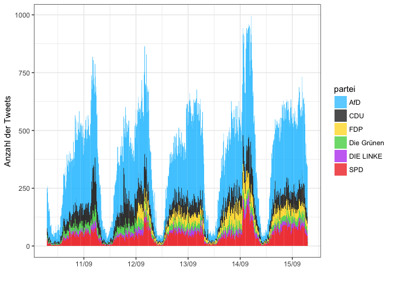

#### Private Nachrichtendienste

671 Tweets wurden in dem Zeitraum von den entsprechenden News-Portalen getweeted. Hier findet sich der Term "AfD" in knapp unter 50% der gesamten Tweets.

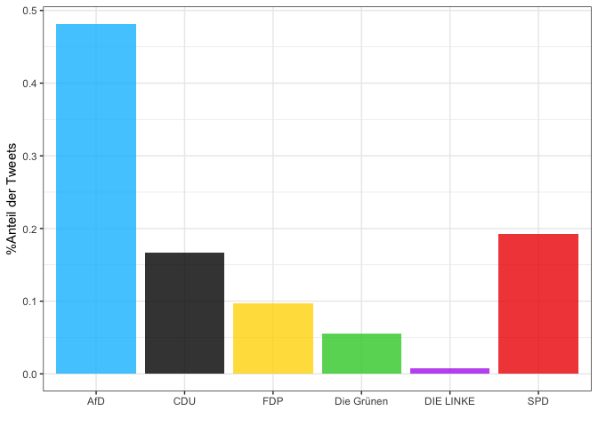

#### Öffentlich-Rechtliche Nachrichtendienste

Bei den öffentlich-rechtlichen Nachrichten enthält keiner der 129 Tweets im betrachteten Zeitraum den Term "Grüne". Außerdem ist auffällig, dass hier der Term "CDU" weitaus häufiger verwendet wird als in den obigen beiden Fällen.

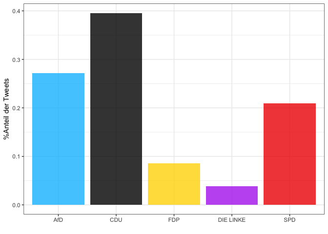

### Andere User-Accounts

Die Anzahl der übrigen User-Accounts ist mit Abstand am größten. Insgesamt 140.193 Tweets wurden in dem betrachteten Zeitraum getweeted (inklusive Retweets). Mehr als die Hälfte davon beinhaltete "AfD".

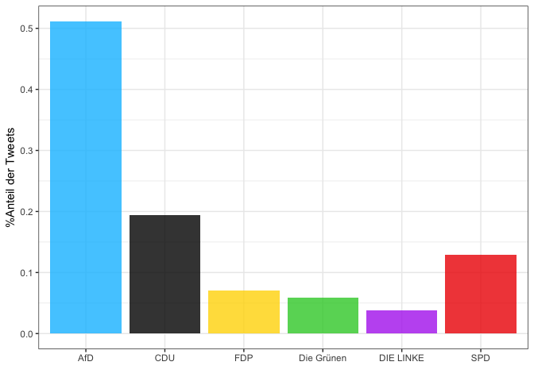

Wordclouds
----------

Welche Wörter werden am häufigsten in Verbindung mit den Parteien getweetet? Zur Visualisierung der am häufigsten verwendeten Wörter in Bezug auf eine Partei, erstellen wir eine Wordcloud.

#### Private Nachrichten

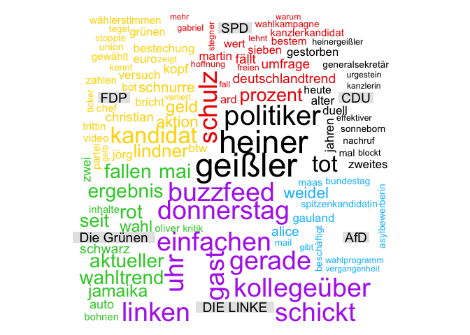

#### Öffentlich-Rechtliche Nachrichten

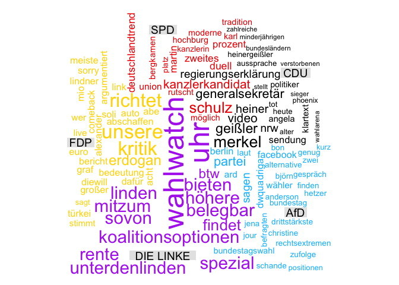

#### Andere User-Accounts

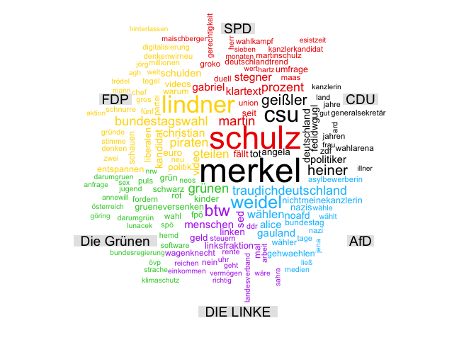

term frequency - inverse document frequency (tf-idf)
----------------------------------------------------

Die Idee des tf-idf Wertes (aus dem englischen "term frequency - inverse document frequency") ist es, die Relevanz eines Wortes für den Inhalt eines Dokumentes (in diesem Fall einer Partei) zu finden - und zwar im Vergleich zu allen im Korpus enthaltenen Dokumente (bzw. Parteien).

TF(t) = (Anzahl von Term t pro Patei) / (Anzahl aller Terme pro Partei)

IDF(t) = log\_e(Anzahl aller Parteien / Anzahl von Parteien, die den Term t enthalten)

In den folgenden Abbildungen, sind die Wörter (sog. unique terms) mit den höchsten tf-idf Werten pro Partei aufgelistet. Diese Wörter werden sind also im Zusammenhang einer Partei am "relevantesten".

#### Private Nachrichtendienste

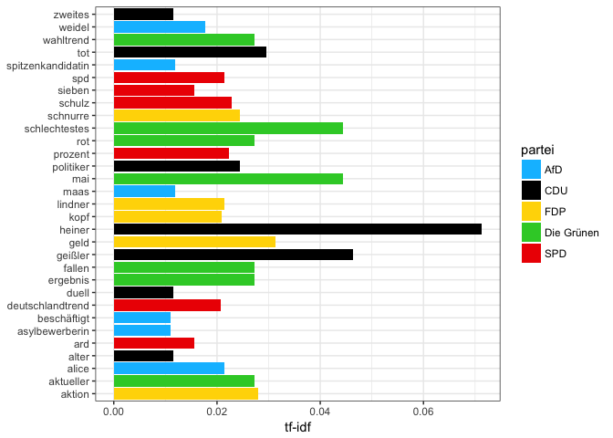

#### Öffentlich-Rechtliche Nachrichtendienste

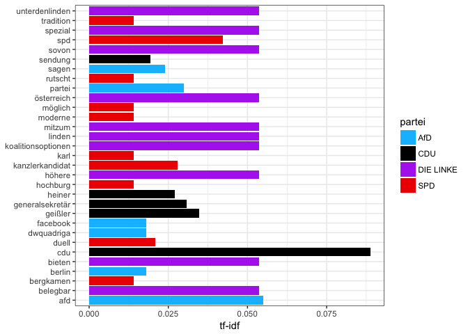

#### Andere User-Accounts

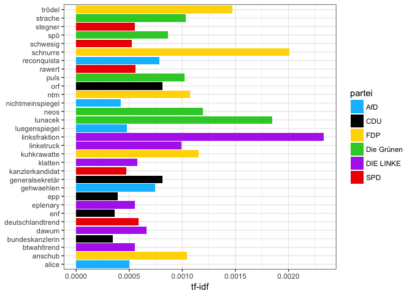

Man erkennt, dass vor allem mit Bezug auf die FDP anscheinend recht "einseitig" getwittert wurde. Hinter dem Term "Trödel" versteckt sich beispielsweise der Artikel vom Stern "Trödel neu denken oder: Fünf Gründe, warum man die FDP nicht wählen kann". Unter "Schnurre" findet man hauptsächlich Tweets zu dem Vorfall, bei dem FDP Kandidat Jörg Schnurre 2EUR für eine Stimme bot.

AfD-Wähler haben sich anscheinend mit dem Spiegel erzürnt. Der Term "Lügenspiegel" und "NichtmeinSpiegel" scheint beliebt zu sein. Außerdem scheint das spanische Wort reconquista (Rückeroberung) beliebt zu sein in Zusammenhang mit der AfD. Unter dem Begriff versteht man allgemein das Entstehen und die Ausdehnung des Herrschaftsbereichs der christlichen Reiche der Iberischen Halbinsel unter Zurückdrängung des muslimischen Machtbereichs (al-Andalus) im Mittelalter.

In Zusammenhang mit den Grünen wurde der Lifestream mit Ulrike Lunacek über Twitter diskutiert und Die Linke hat mit ihren verbesserten Umfragewerten die Hoffnung auf eine "Linksfraktion" neu erweckt. Bei der CDU hat der Tod des ehemaligen CDU-Generalsekretär Heiner Geißler Eindruck hinterlassen und bei der SPD ging es diese Woche um die SPD-Kandidaten Mechtild Rawert, Ralf Stegner und Manuela Schwesig.

Sentiment Analyse
-----------------

Interessant ist zunächst der Blick auf die am meisten verwendeten positiven und negativen Wörter um die Stimmung oder Emotionen (Sentiment) im Zusammenhang mit den Parteien auszulesen.

Ungewichtete Sentiment-Analyse: Zunächst betrachten wir, ob und welche Sentiment-Wörter auftauchen ohne diesen Wörtern den Sentiment-Wert zuzuweisen.

Gewichtete Sentiment-Analyse: Bei der gewichten Analyse wird den einzelnen "Sentiment" Worten ein Wert zugewiesen. Der Score gibt den Wert an, der sich aus der Summe der zugewiesenen Werte der positiven und negativen Wörter ergibt.

Das Prinzip dieser Analyse im einfachsten Fall so:

Für jedes Wort im Text: Überprüfe, ob das Wort im Lexikon existiert. Wenn JA, dann: Weise dem Wort den Sentiment-Wert aus dem Lexikon zu UND Addiere diesen Wert zu dem Sentimentwert des Dokuments. Wenn NEIN, dann: Gehe weiter zum nächsten Wort.

Gebe die Summenwerte pro Sentiment (z.b. negativ, positiv)

Wir verwenden das Lexikon der Leipzig Corpora Collection (<http://wortschatz.uni-leipzig.de/de/download>).

#### Private Nachrichtenportale

##### Anzahl negativer Sentiment-Wörter

Bei der CDU überwiegt das Wort "tot" auf Grund des bereits angesprochnen Todes von Heiner Geißler. Das Wort "leider" ist bei allen Parteien wiederzufinden. Auffällig ist noch, dass in Zusammenhang mit der AFD häufig das Wort "verfassungswidrig" verwendet wird.

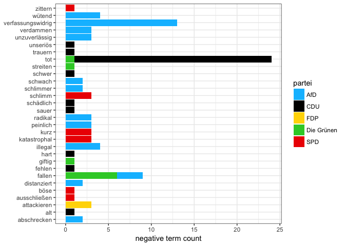

##### Anzahl positiver Sentiment-Wörter

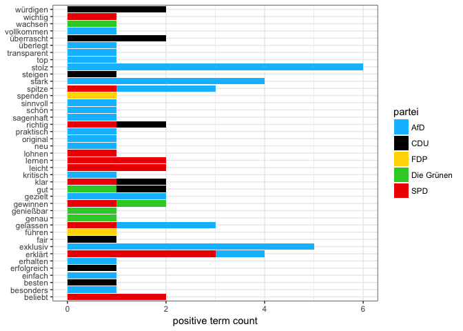

#### Gewichtete Analyse

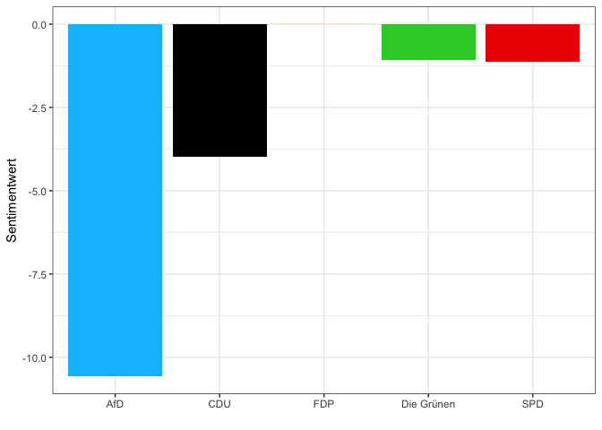

#### Öffentlich-Rechtliche Nachrichten

##### Anzahl negativer Sentiment-Wörter

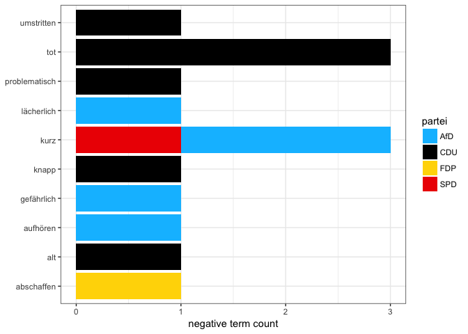

##### Anzahl positiver Sentiment-Wörter

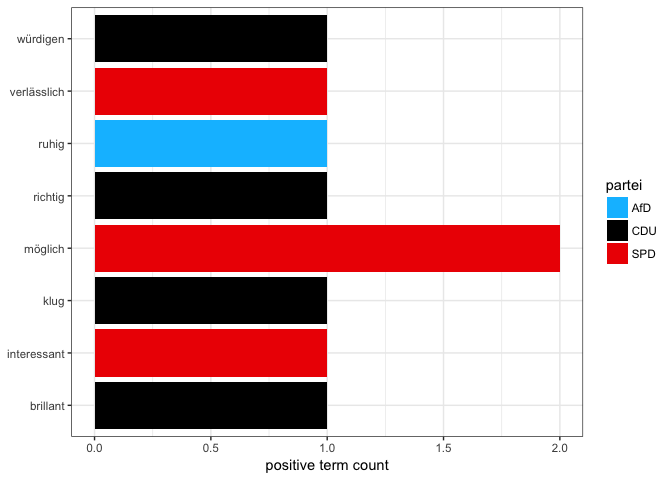

#### Gewichtete Analyse

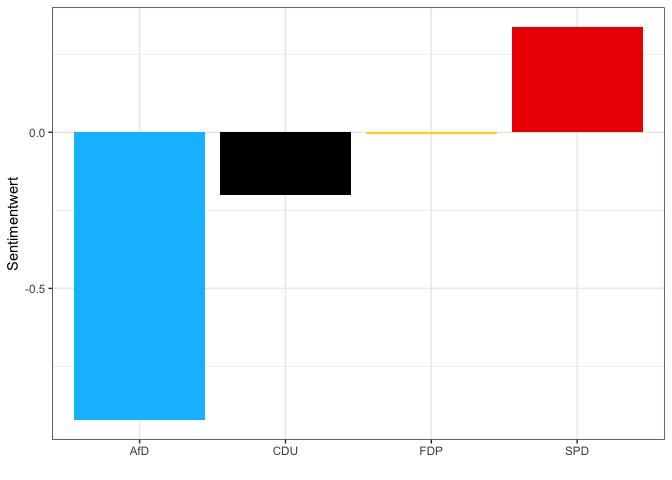

### Andere User-Accounts

#### Ungewichtete Analyse

##### Anzahl negativer Sentiment-Wörter

Bei der CDU überwiegt das Wort "tot" auf Grund des bereits angesprochnen Todes von Heiner Geißler. Das Wort "leider" ist bei allen Parteien wiederzufinden. Auffällig ist noch, dass in Zusammenhang mit der AFD häufig das Wort "verfassungswidrig" verwendet wird.

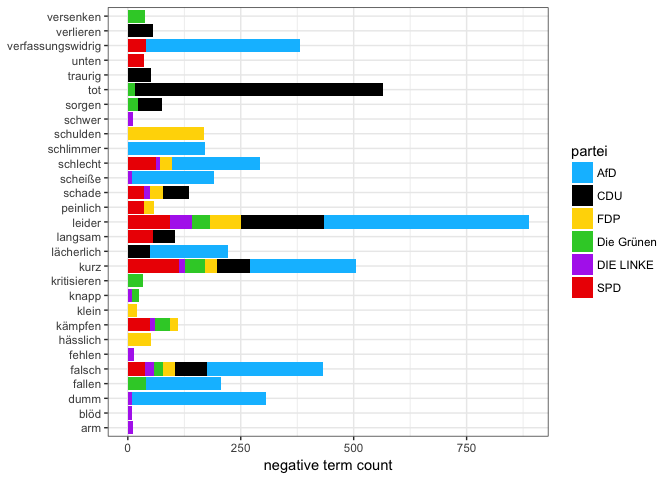

##### Anzahl positiver Sentiment-Wörter

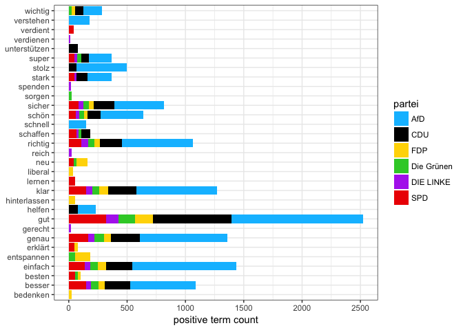

#### Gewichtete Analyse

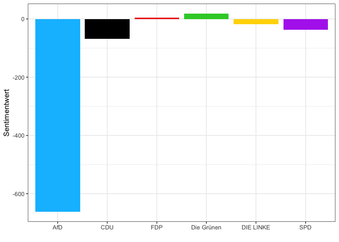
