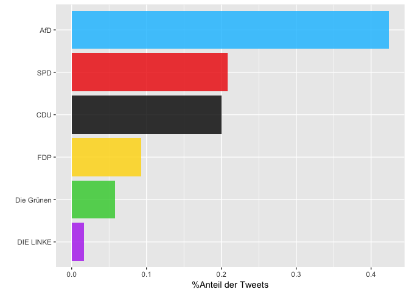
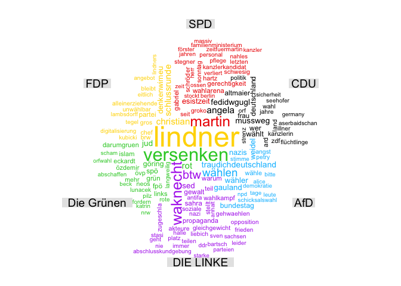
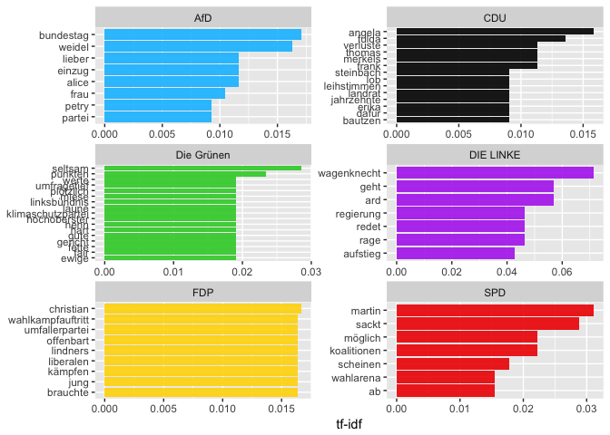
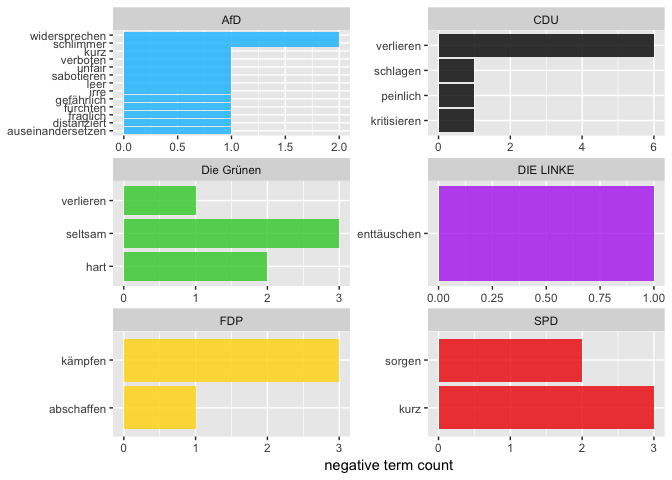

Politische Stimmung im Social Web vor der Bundestagswahl 2017
================
2017-10-09

Auch wenn man durchaus den Eindruck gewinnen kann, dass der Wahlkampf bisher eher mit angezogener Handbremse geführt wurde, nimmt er zumindest in den Medien, nun ca. anderthalb Wochen vor der Bundestagswahl, an Intensität zu. Höchste Zeit also, um ein Stimmungsbild in den sozialen Medien zu den zur Wahl stehenden Parteien einzufangen.

Erläuterungen zu den einzelnen Analyseschritten finden Sie [hier](https://franziloew.github.io/politsentiment/)

Zeitraum:

<!--html_preserve-->
<table class="gmisc_table" style="border-collapse: collapse; margin-top: 1em; margin-bottom: 1em;">
<thead>
<tr>
<td colspan="2" style="text-align: left;">
Zeitraum
</td>
</tr>
<tr>
<th style="font-weight: 900; border-bottom: 1px solid grey; border-top: 2px solid grey; text-align: center;">
von
</th>
<th style="border-bottom: 1px solid grey; border-top: 2px solid grey; text-align: center;">
2017-09-19 02:00:00
</th>
</tr>
</thead>
<tbody>
<tr>
<td style="border-bottom: 2px solid grey; text-align: left;">
bis
</td>
<td style="border-bottom: 2px solid grey; text-align: center;">
2017-09-23 01:59:53
</td>
</tr>
</tbody>
</table>
<!--/html_preserve-->
Anzahl gesamter Tweets:

<!--html_preserve-->
<table class="gmisc_table" style="border-collapse: collapse; margin-top: 1em; margin-bottom: 1em;">
<tbody>
<tr style="border-top: 2px solid grey;">
<td style="border-top: 2px solid grey; border-bottom: 2px solid grey; text-align: center;">
359917
</td>
</tr>
</tbody>
</table>
<!--/html_preserve-->
#### Anzahl der gesamten Tweets nach Datum


#### Von welchen Plattformen werden die meisten Tweets gesendet?

``` r
tweets %>%
  group_by(platform_reduced) %>%
  tally() %>%
  ggplot(aes(reorder(platform_reduced,n), (n/1000))) +
  geom_col(fill = "blue", alpha = .7) +
  xlab("") +
  ylab("in tsd.") +
  coord_flip() 
```



2. Wer retweeted wen?
---------------------


### Welche der Tweets wurden am häufigsten Retweeted?

<!--html_preserve-->
<table class="gmisc_table" style="border-collapse: collapse; margin-top: 1em; margin-bottom: 1em;">
<thead>
<tr>
<th style="border-bottom: 1px solid grey; border-top: 2px solid grey;">
</th>
<th style="border-bottom: 1px solid grey; border-top: 2px solid grey; text-align: center;">
name
</th>
<th style="border-bottom: 1px solid grey; border-top: 2px solid grey; text-align: center;">
text
</th>
<th style="border-bottom: 1px solid grey; border-top: 2px solid grey; text-align: center;">
retweet\_count
</th>
</tr>
</thead>
<tbody>
<tr>
<td style="text-align: left;">
1
</td>
<td style="text-align: left;">
Shahak Shapira
</td>
<td style="text-align: left;">
Gerade das hier von der netten AfD bekommen, inkl. Adressen & Telefonnummern - zum Glück alle nicht mehr aktuell. B… <https://t.co/iciSHZtdSg>
</td>
<td style="text-align: left;">
4227
</td>
</tr>
<tr>
<td style="text-align: left;">
2
</td>
<td style="text-align: left;">
ZDF heute journal
</td>
<td style="text-align: left;">
"Das Land, Herr Gauland, gehört weder Ihnen noch der AfD. Und das Volk erst recht nicht", kommentiert der stellv.… <https://t.co/Y3rZ7QYZK3>
</td>
<td style="text-align: left;">
3902
</td>
</tr>
<tr>
<td style="text-align: left;">
3
</td>
<td style="text-align: left;">
ZDF heute
</td>
<td style="text-align: left;">
"Das Land, Herr Gauland, gehört weder Ihnen noch der AfD. Und das Volk erst recht nicht." Kommentar des stv. ZDF-Ch… <https://t.co/1ZvLZRP1rP>
</td>
<td style="text-align: left;">
3396
</td>
</tr>
<tr>
<td style="text-align: left;">
4
</td>
<td style="text-align: left;">
Ralph Ruthe
</td>
<td style="text-align: left;">
Zu viel Text für Twitter, daher als Screenshot.

\#bundestagswahl2017 \#AfD <https://t.co/04xn1nIEhC>
</td>
<td style="text-align: left;">
3032
</td>
</tr>
<tr>
<td style="text-align: left;">
5
</td>
<td style="text-align: left;">
Kaffeecup
</td>
<td style="text-align: left;">
AfD: Ich bin kein Nazi.

Trump: Ich bin kein Idiot.

Erdogan: Ich bin kein Despot.

BER: Ich bin ein fertiger Flughafen.
</td>
<td style="text-align: left;">
2870
</td>
</tr>
<tr>
<td style="border-bottom: 2px solid grey; text-align: left;">
6
</td>
<td style="border-bottom: 2px solid grey; text-align: left;">
Ali Utlu
</td>
<td style="border-bottom: 2px solid grey; text-align: left;">
Links: Wo die meisten Ausländer leben.

Rechts: Wo die AfD die meisten Stimmen bekam. <https://t.co/0qfVEnNLN6>
</td>
<td style="border-bottom: 2px solid grey; text-align: left;">
2266
</td>
</tr>
</tbody>
</table>
<!--/html_preserve-->
3. Über welche Partei wird am meisten getweeted?
------------------------------------------------

Anzahlt gesamte Tweets: <!--html_preserve-->
<table class="gmisc_table" style="border-collapse: collapse; margin-top: 1em; margin-bottom: 1em;">
<tbody>
<tr style="border-top: 2px solid grey;">
<td style="border-top: 2px solid grey; border-bottom: 2px solid grey; text-align: center;">
368352
</td>
</tr>
</tbody>
</table>
<!--/html_preserve-->


#### Anzahl der Tweets großer Nachrichtendienste

Tweets insgesamt:

``` r
htmlTable(nrow(news))
```

<!--html_preserve-->
<table class="gmisc_table" style="border-collapse: collapse; margin-top: 1em; margin-bottom: 1em;">
<tbody>
<tr style="border-top: 2px solid grey;">
<td style="border-top: 2px solid grey; border-bottom: 2px solid grey; text-align: center;">
1782
</td>
</tr>
</tbody>
</table>
<!--/html_preserve-->


### Anzahl der Tweets anderer User-Accounts

Tweets insgesamt:

``` r
htmlTable(nrow(user))
```

<!--html_preserve-->
<table class="gmisc_table" style="border-collapse: collapse; margin-top: 1em; margin-bottom: 1em;">
<tbody>
<tr style="border-top: 2px solid grey;">
<td style="border-top: 2px solid grey; border-bottom: 2px solid grey; text-align: center;">
80761
</td>
</tr>
</tbody>
</table>
<!--/html_preserve-->


4.Wordclouds
------------

### Nachrichten-Dienste


### Andere User-Accounts



5. term frequency - inverse document frequency (tf-idf)
-------------------------------------------------------

### Nachrichtendienste


#### Andere User-Accounts


6. Sentiment Analyse
--------------------

#### Nachrichtenportale

##### Anzahl negativer Sentiment-Wörter


##### Anzahl positiver Sentiment-Wörter


#### Gewichtete Analyse


#### Was sind die Tweets mit den negativsten Werten?

##### CDU

<!--html_preserve-->
<table class="gmisc_table" style="border-collapse: collapse; margin-top: 1em; margin-bottom: 1em;">
<thead>
<tr>
<th style="border-bottom: 1px solid grey; border-top: 2px solid grey;">
</th>
<th style="border-bottom: 1px solid grey; border-top: 2px solid grey; text-align: center;">
partei
</th>
<th style="border-bottom: 1px solid grey; border-top: 2px solid grey; text-align: center;">
word
</th>
<th style="border-bottom: 1px solid grey; border-top: 2px solid grey; text-align: center;">
text
</th>
<th style="border-bottom: 1px solid grey; border-top: 2px solid grey; text-align: center;">
Wert
</th>
</tr>
</thead>
<tbody>
<tr>
<td style="text-align: left;">
1
</td>
<td style="text-align: left;">
CDU
</td>
<td style="text-align: left;">
schwach
</td>
<td style="text-align: left;">
Vorläufiges Endergebnis: Union verliert deutlich, SPD schwach wie nie, AfD auf Platz drei... <https://t.co/oOFDtttx0V>
</td>
<td style="text-align: left;">
-0.9206
</td>
</tr>
<tr>
<td style="text-align: left;">
2
</td>
<td style="text-align: left;">
CDU
</td>
<td style="text-align: left;">
schwach
</td>
<td style="text-align: left;">
Wahlergebnisse, erste Hochrechnung: CDU am stärksten, SPD schwach auf Platz 2, AfD drittstärkste Kraft: <https://t.co/0KDqKUN1nd>
</td>
<td style="text-align: left;">
-0.9206
</td>
</tr>
<tr>
<td style="text-align: left;">
3
</td>
<td style="text-align: left;">
CDU
</td>
<td style="text-align: left;">
schwach
</td>
<td style="text-align: left;">
Erste Prognose zur \#BTW17: Union vorn, SPD schwach wie nie, AfD auf Platz drei <https://t.co/OmAEeQWTes> <https://t.co/3vEdS8NMHv>
</td>
<td style="text-align: left;">
-0.9206
</td>
</tr>
<tr>
<td style="text-align: left;">
4
</td>
<td style="text-align: left;">
CDU
</td>
<td style="text-align: left;">
schwach
</td>
<td style="text-align: left;">
Erste Prognose: Union vorn, SPD schwach wie nie, AfD auf Platz drei <https://t.co/UqIvJ73NZj> <https://t.co/0f2Vhiqd6v>
</td>
<td style="text-align: left;">
-0.9206
</td>
</tr>
<tr>
<td style="text-align: left;">
5
</td>
<td style="text-align: left;">
CDU
</td>
<td style="text-align: left;">
schwach
</td>
<td style="text-align: left;">
Erste Prognose: CDU vorn, SPD schwach wie nie, AfD auf Platz drei... <https://t.co/oOFDtttx0V>
</td>
<td style="text-align: left;">
-0.9206
</td>
</tr>
<tr>
<td style="border-bottom: 2px solid grey; text-align: left;">
6
</td>
<td style="border-bottom: 2px solid grey; text-align: left;">
CDU
</td>
<td style="border-bottom: 2px solid grey; text-align: left;">
schwach
</td>
<td style="border-bottom: 2px solid grey; text-align: left;">
Bundestagswahl: Rekordverlust für Union, SPD schwach, AfD stark <https://t.co/g6sY59rT2N> \#btw17
</td>
<td style="border-bottom: 2px solid grey; text-align: left;">
-0.9206
</td>
</tr>
</tbody>
</table>
<!--/html_preserve-->
##### SPD

<!--html_preserve-->
<table class="gmisc_table" style="border-collapse: collapse; margin-top: 1em; margin-bottom: 1em;">
<thead>
<tr>
<th style="border-bottom: 1px solid grey; border-top: 2px solid grey;">
</th>
<th style="border-bottom: 1px solid grey; border-top: 2px solid grey; text-align: center;">
partei
</th>
<th style="border-bottom: 1px solid grey; border-top: 2px solid grey; text-align: center;">
word
</th>
<th style="border-bottom: 1px solid grey; border-top: 2px solid grey; text-align: center;">
text
</th>
<th style="border-bottom: 1px solid grey; border-top: 2px solid grey; text-align: center;">
Wert
</th>
</tr>
</thead>
<tbody>
<tr>
<td style="text-align: left;">
1
</td>
<td style="text-align: left;">
SPD
</td>
<td style="text-align: left;">
schlecht
</td>
<td style="text-align: left;">
Grafiken: Warum schnitt die SPD schlecht ab? <https://t.co/6OlwxLIl9N> \#btw17 \#Umfragen \#Grafiken
</td>
<td style="text-align: left;">
-0.7706
</td>
</tr>
<tr>
<td style="text-align: left;">
2
</td>
<td style="text-align: left;">
SPD
</td>
<td style="text-align: left;">
kämpfen
</td>
<td style="text-align: left;">
"Wo ist die stolze SPD?": Grüne kämpfen in alle Richtungen <https://t.co/Lwebu3t0Al> <https://t.co/0JKKO8Y2n1>
</td>
<td style="text-align: left;">
-0.3467
</td>
</tr>
<tr>
<td style="text-align: left;">
3
</td>
<td style="text-align: left;">
SPD
</td>
<td style="text-align: left;">
knapp
</td>
<td style="text-align: left;">
Knapp über 20 Prozent: Stunde Null für die SPD <https://t.co/OoIdVcfkuX> <https://t.co/DruZNZ9AsA>
</td>
<td style="text-align: left;">
-0.2036
</td>
</tr>
<tr>
<td style="text-align: left;">
4
</td>
<td style="text-align: left;">
SPD
</td>
<td style="text-align: left;">
knapp
</td>
<td style="text-align: left;">
Knapp über 20 Prozent: Stunde Null für die SPD <https://t.co/RiJy2ZmKl6> <https://t.co/FyjggUqlvf>
</td>
<td style="text-align: left;">
-0.2036
</td>
</tr>
<tr>
<td style="text-align: left;">
5
</td>
<td style="text-align: left;">
SPD
</td>
<td style="text-align: left;">
hart
</td>
<td style="text-align: left;">
Sozialdemokraten in der Krise - „Verlieren Charakter einer Volkspartei“: SPD-Mann geht hart mit Partei ins Gericht <https://t.co/eroHmldL2k>
</td>
<td style="text-align: left;">
-0.1483
</td>
</tr>
<tr>
<td style="border-bottom: 2px solid grey; text-align: left;">
6
</td>
<td style="border-bottom: 2px solid grey; text-align: left;">
SPD
</td>
<td style="border-bottom: 2px solid grey; text-align: left;">
hart
</td>
<td style="border-bottom: 2px solid grey; text-align: left;">
SPD in der Krise - „Verlieren Charakter einer Volkspartei“: SPD-Mann geht hart mit Partei ins Gericht <https://t.co/3kLDH5ct02>
</td>
<td style="border-bottom: 2px solid grey; text-align: left;">
-0.1483
</td>
</tr>
</tbody>
</table>
<!--/html_preserve-->
##### FDP

<!--html_preserve-->
<table class="gmisc_table" style="border-collapse: collapse; margin-top: 1em; margin-bottom: 1em;">
<thead>
<tr>
<th style="border-bottom: 1px solid grey; border-top: 2px solid grey;">
</th>
<th style="border-bottom: 1px solid grey; border-top: 2px solid grey; text-align: center;">
partei
</th>
<th style="border-bottom: 1px solid grey; border-top: 2px solid grey; text-align: center;">
word
</th>
<th style="border-bottom: 1px solid grey; border-top: 2px solid grey; text-align: center;">
text
</th>
<th style="border-bottom: 1px solid grey; border-top: 2px solid grey; text-align: center;">
Wert
</th>
</tr>
</thead>
<tbody>
<tr>
<td style="text-align: left;">
1
</td>
<td style="text-align: left;">
FDP
</td>
<td style="text-align: left;">
verdammt
</td>
<td style="text-align: left;">
"Wir sind nicht zum Regieren verdammt, aber wir sind bereit, Verantwortung zu übernehmen"- \#FDP Spitzenkandidat… <https://t.co/eXE7UIjdeZ>
</td>
<td style="text-align: left;">
-0.2925
</td>
</tr>
<tr>
<td style="text-align: left;">
2
</td>
<td style="text-align: left;">
FDP
</td>
<td style="text-align: left;">
tot
</td>
<td style="text-align: left;">
Auferstehung der FDP - Viele hatten sie für tot erklärt. Parteichef Lindner der FDP wieder Leben eingehaucht <https://t.co/pEVEgeQCp7>
</td>
<td style="text-align: left;">
-0.1683
</td>
</tr>
<tr>
<td style="text-align: left;">
3
</td>
<td style="text-align: left;">
FDP
</td>
<td style="text-align: left;">
kurz
</td>
<td style="text-align: left;">
2013 am Ende, jetzt kurz vor dem Comeback: Wie konnte die \#FDP das schaffen? \#btw17 \#bundestagswahl… <https://t.co/e0CAY3GnOF>
</td>
<td style="text-align: left;">
-0.0048
</td>
</tr>
<tr>
<td style="text-align: left;">
4
</td>
<td style="text-align: left;">
FDP
</td>
<td style="text-align: left;">
attackieren
</td>
<td style="text-align: left;">
Bundestagswahl - Grüne kämpfen um Platz drei – und attackieren AfD und FDP <https://t.co/de85Z3xX0T>
</td>
<td style="text-align: left;">
-0.0048
</td>
</tr>
<tr>
<td style="text-align: left;">
5
</td>
<td style="text-align: left;">
FDP
</td>
<td style="text-align: left;">
attackieren
</td>
<td style="text-align: left;">
Bundestagswahl - Grüne kämpfen um Platz drei – und attackieren AfD und FDP <https://t.co/IRxpYUEV6p>
</td>
<td style="text-align: left;">
-0.0048
</td>
</tr>
<tr>
<td style="border-bottom: 2px solid grey; text-align: left;">
6
</td>
<td style="border-bottom: 2px solid grey; text-align: left;">
FDP
</td>
<td style="border-bottom: 2px solid grey; text-align: left;">
attackieren
</td>
<td style="border-bottom: 2px solid grey; text-align: left;">
Bundestagswahl - Grüne kämpfen um Platz drei – und attackieren AfD und FDP <https://t.co/AcW74CxLwA>
</td>
<td style="border-bottom: 2px solid grey; text-align: left;">
-0.0048
</td>
</tr>
</tbody>
</table>
<!--/html_preserve-->
##### DIE LINKE

<!--html_preserve-->
<table class="gmisc_table" style="border-collapse: collapse; margin-top: 1em; margin-bottom: 1em;">
<thead>
<tr>
<th style="border-bottom: 1px solid grey; border-top: 2px solid grey;">
</th>
<th style="border-bottom: 1px solid grey; border-top: 2px solid grey; text-align: center;">
partei
</th>
<th style="border-bottom: 1px solid grey; border-top: 2px solid grey; text-align: center;">
word
</th>
<th style="border-bottom: 1px solid grey; border-top: 2px solid grey; text-align: center;">
text
</th>
<th style="border-bottom: 1px solid grey; border-top: 2px solid grey; text-align: center;">
Wert
</th>
</tr>
</thead>
<tbody>
<tr>
<td style="text-align: left;">
1
</td>
<td style="text-align: left;">
DIE LINKE
</td>
<td style="text-align: left;">
enttäuschen
</td>
<td style="text-align: left;">
Debat-O-Meter: Wagenknecht überzeugt sogar AfD-Fans, Gauland und von der Leyen enttäuschen <https://t.co/Z7puwpKQO7> <https://t.co/tU4L6tomk3>
</td>
<td style="text-align: left;">
-0.0586
</td>
</tr>
<tr>
<td style="text-align: left;">
2
</td>
<td style="text-align: left;">
DIE LINKE
</td>
<td style="text-align: left;">
überzeugt
</td>
<td style="text-align: left;">
Debat-O-Meter: Wagenknecht überzeugt sogar AfD-Fans, Gauland und von der Leyen enttäuschen <https://t.co/Z7puwpKQO7> <https://t.co/tU4L6tomk3>
</td>
<td style="text-align: left;">
0.2381
</td>
</tr>
<tr>
<td style="border-bottom: 2px solid grey; text-align: left;">
3
</td>
<td style="border-bottom: 2px solid grey; text-align: left;">
DIE LINKE
</td>
<td style="border-bottom: 2px solid grey; text-align: left;">
zufrieden
</td>
<td style="border-bottom: 2px solid grey; text-align: left;">
Laut Hochrechnung (18:13 Uhr) liegt @dieLinke bei 8,9 Prozent. Wagenknecht: „Sind mit unserem Ergebnis zufrieden.“… <https://t.co/jLsKRjiIJu>
</td>
<td style="border-bottom: 2px solid grey; text-align: left;">
0.393
</td>
</tr>
</tbody>
</table>
<!--/html_preserve-->
##### AfD

<!--html_preserve-->
<table class="gmisc_table" style="border-collapse: collapse; margin-top: 1em; margin-bottom: 1em;">
<thead>
<tr>
<th style="border-bottom: 1px solid grey; border-top: 2px solid grey;">
</th>
<th style="border-bottom: 1px solid grey; border-top: 2px solid grey; text-align: center;">
partei
</th>
<th style="border-bottom: 1px solid grey; border-top: 2px solid grey; text-align: center;">
word
</th>
<th style="border-bottom: 1px solid grey; border-top: 2px solid grey; text-align: center;">
text
</th>
<th style="border-bottom: 1px solid grey; border-top: 2px solid grey; text-align: center;">
Wert
</th>
</tr>
</thead>
<tbody>
<tr>
<td style="text-align: left;">
1
</td>
<td style="text-align: left;">
AfD
</td>
<td style="text-align: left;">
unfair
</td>
<td style="text-align: left;">
@civey\_de-Umfrage für @tagesspiegel: Zwei Drittel werten \#AfD-Wahlkampf als unfair <https://t.co/Vp6Tpeksbg> \#btw17
</td>
<td style="text-align: left;">
-0.8827
</td>
</tr>
<tr>
<td style="text-align: left;">
2
</td>
<td style="text-align: left;">
AfD
</td>
<td style="text-align: left;">
schlecht
</td>
<td style="text-align: left;">
Nobis (AfD): Jamaika-Koalition wäre für uns nicht schlecht <https://t.co/KkDruNUBzQ> <https://t.co/S7QQ3819wN>
</td>
<td style="text-align: left;">
-0.7706
</td>
</tr>
<tr>
<td style="text-align: left;">
3
</td>
<td style="text-align: left;">
AfD
</td>
<td style="text-align: left;">
gering
</td>
<td style="text-align: left;">
Einfluss des AfD wohl gering: Deutsche Wahl bedingt EU-Entscheidungen <https://t.co/5NGWFOLHnZ>
</td>
<td style="text-align: left;">
-0.6621
</td>
</tr>
<tr>
<td style="text-align: left;">
4
</td>
<td style="text-align: left;">
AfD
</td>
<td style="text-align: left;">
gefährlich
</td>
<td style="text-align: left;">
Gefährlich: \#Altmaiers Appell lieber nicht, als \#AfD zu wählen!Lebendige Demokratie heißt nicht nur genehme Parteien zu wählen \#Wahl2017
</td>
<td style="text-align: left;">
-0.6366
</td>
</tr>
<tr>
<td style="text-align: left;">
5
</td>
<td style="text-align: left;">
AfD
</td>
<td style="text-align: left;">
verboten
</td>
<td style="text-align: left;">
Gerichtlich verboten: AfD Bielefeld darf angebliches Zitat von @GoeringEckardt zu sexuellen Übergriffen von Flüchtlingen nicht verwenden.
</td>
<td style="text-align: left;">
-0.3657
</td>
</tr>
<tr>
<td style="border-bottom: 2px solid grey; text-align: left;">
6
</td>
<td style="border-bottom: 2px solid grey; text-align: left;">
AfD
</td>
<td style="border-bottom: 2px solid grey; text-align: left;">
fürchten
</td>
<td style="border-bottom: 2px solid grey; text-align: left;">
Migrationspolitik: AfD will Deutschland kurz vor der Wahl das Fürchten lehren <https://t.co/k1ojycg83A> <https://t.co/DSpVJbQC0R>
</td>
<td style="border-bottom: 2px solid grey; text-align: left;">
-0.3545
</td>
</tr>
</tbody>
</table>
<!--/html_preserve-->
### Andere Nutzer

#### Ungewichtete Analyse

##### Anzahl negativer Sentiment-Wörter

Bei der CDU überwiegt das Wort "tot" auf Grund des bereits angesprochnen Todes von Heiner Geißler. Das Wort "leider" ist bei allen Parteien wiederzufinden. Auffällig ist noch, dass in Zusammenhang mit der AFD häufig das Wort "verfassungswidrig" verwendet wird.


##### Anzahl positiver Sentiment-Wörter


#### Gewichtete Analyse


#### Was sind die Tweets mit den negativsten Werten?

##### CDU

<!--html_preserve-->
<table class="gmisc_table" style="border-collapse: collapse; margin-top: 1em; margin-bottom: 1em;">
<thead>
<tr>
<th style="border-bottom: 1px solid grey; border-top: 2px solid grey;">
</th>
<th style="border-bottom: 1px solid grey; border-top: 2px solid grey; text-align: center;">
partei
</th>
<th style="border-bottom: 1px solid grey; border-top: 2px solid grey; text-align: center;">
word
</th>
<th style="border-bottom: 1px solid grey; border-top: 2px solid grey; text-align: center;">
text
</th>
<th style="border-bottom: 1px solid grey; border-top: 2px solid grey; text-align: center;">
Wert
</th>
</tr>
</thead>
<tbody>
<tr>
<td style="text-align: left;">
1
</td>
<td style="text-align: left;">
CDU
</td>
<td style="text-align: left;">
unnötig
</td>
<td style="text-align: left;">
CDU und FDP wollen Bildung unnötig teuer machen. \#gerechtist wenn Bildung kostenfrei ist! \#SPD <https://t.co/3VmtOALy16>
</td>
<td style="text-align: left;">
-0.9463
</td>
</tr>
<tr>
<td style="text-align: left;">
2
</td>
<td style="text-align: left;">
CDU
</td>
<td style="text-align: left;">
unnötig
</td>
<td style="text-align: left;">
Ich gebe \#Altmeier nur halb recht. Die \#AFD wählen ist so unnötig wie ein Kropf ! Aber die Linke ist nicht wählbar, ist Falsch. \#CDU \#SPD
</td>
<td style="text-align: left;">
-0.9463
</td>
</tr>
<tr>
<td style="text-align: left;">
3
</td>
<td style="text-align: left;">
CDU
</td>
<td style="text-align: left;">
unnötig
</td>
<td style="text-align: left;">
@N24 Gebe ich die Stimme für Piraten ,Grünen oder FDP ab ist die Wahl sowieso unnötig Merkel gewinnt wieder da die… <https://t.co/cROVrjk9xn>
</td>
<td style="text-align: left;">
-0.9463
</td>
</tr>
<tr>
<td style="text-align: left;">
4
</td>
<td style="text-align: left;">
CDU
</td>
<td style="text-align: left;">
schädlich
</td>
<td style="text-align: left;">
@hajoschumacher Die Kohl spendenaffäre war für die CDU weitaus weniger schädlich als ich das gedacht hätte. Reicht das als Gegenbeweis?
</td>
<td style="text-align: left;">
-0.9269
</td>
</tr>
<tr>
<td style="text-align: left;">
5
</td>
<td style="text-align: left;">
CDU
</td>
<td style="text-align: left;">
schädlich
</td>
<td style="text-align: left;">
"Die Alleingänge einer Frau Merkel sind kontraproduktiv, schädlich und alles andere als für das Wohl des Volkes... <https://t.co/P3oiaiJYTC>
</td>
<td style="text-align: left;">
-0.9269
</td>
</tr>
<tr>
<td style="border-bottom: 2px solid grey; text-align: left;">
6
</td>
<td style="border-bottom: 2px solid grey; text-align: left;">
CDU
</td>
<td style="border-bottom: 2px solid grey; text-align: left;">
schwach
</td>
<td style="border-bottom: 2px solid grey; text-align: left;">
@Strack\_C Aber überall ist die CDU schwach wie 2005
</td>
<td style="border-bottom: 2px solid grey; text-align: left;">
-0.9206
</td>
</tr>
</tbody>
</table>
<!--/html_preserve-->
##### SPD

<!--html_preserve-->
<table class="gmisc_table" style="border-collapse: collapse; margin-top: 1em; margin-bottom: 1em;">
<thead>
<tr>
<th style="border-bottom: 1px solid grey; border-top: 2px solid grey;">
</th>
<th style="border-bottom: 1px solid grey; border-top: 2px solid grey; text-align: center;">
partei
</th>
<th style="border-bottom: 1px solid grey; border-top: 2px solid grey; text-align: center;">
word
</th>
<th style="border-bottom: 1px solid grey; border-top: 2px solid grey; text-align: center;">
text
</th>
<th style="border-bottom: 1px solid grey; border-top: 2px solid grey; text-align: center;">
Wert
</th>
</tr>
</thead>
<tbody>
<tr>
<td style="text-align: left;">
1
</td>
<td style="text-align: left;">
SPD
</td>
<td style="text-align: left;">
unnötig
</td>
<td style="text-align: left;">
Das Programm der \#Linken habe ich mir genau angesehen. Deren Forderungen wären allesamt unnötig, wäre die \#SPD noch eine Arbeiterpartei.
</td>
<td style="text-align: left;">
-0.9463
</td>
</tr>
<tr>
<td style="text-align: left;">
2
</td>
<td style="text-align: left;">
SPD
</td>
<td style="text-align: left;">
schädlich
</td>
<td style="text-align: left;">
@wathzmann @LischkaB @SPD\_LSA \#Schädlich hat einen Auftrag bekommen und der \#SPD 13k € gespendet. Selbst ein Kleink… <https://t.co/PSGRfT3RGE>
</td>
<td style="text-align: left;">
-0.9269
</td>
</tr>
<tr>
<td style="text-align: left;">
3
</td>
<td style="text-align: left;">
SPD
</td>
<td style="text-align: left;">
schwach
</td>
<td style="text-align: left;">
Was mich an der \#btw17 am meisten interessiert? -Wie schwach wird die spd?, und -schaffen die Grünen endlich den Parlamentsauszug?
</td>
<td style="text-align: left;">
-0.9206
</td>
</tr>
<tr>
<td style="text-align: left;">
4
</td>
<td style="text-align: left;">
SPD
</td>
<td style="text-align: left;">
schwach
</td>
<td style="text-align: left;">
@Zora\_211212 @EmiliaC32 @ShakRiet Gut, whatabout4yearsago? Da war eine Mehrheit für RRG wollte die SPD nicht. Und FDP war unfassbar schwach.
</td>
<td style="text-align: left;">
-0.9206
</td>
</tr>
<tr>
<td style="text-align: left;">
5
</td>
<td style="text-align: left;">
SPD
</td>
<td style="text-align: left;">
schwach
</td>
<td style="text-align: left;">
@christiansoeder Wie stark wird die FDP? Wie schwach die SPD? Auch spannende Balken, die man im Blick behalten sollte.
</td>
<td style="text-align: left;">
-0.9206
</td>
</tr>
<tr>
<td style="border-bottom: 2px solid grey; text-align: left;">
6
</td>
<td style="border-bottom: 2px solid grey; text-align: left;">
SPD
</td>
<td style="border-bottom: 2px solid grey; text-align: left;">
schämen
</td>
<td style="border-bottom: 2px solid grey; text-align: left;">
@Zukunftskinder Hör auf 😘 79% der SPD MITGLIEDER Schämen sich noch heute und genießen die Rutschbahn von den Grokoj… <https://t.co/bTISZTvC3o>
</td>
<td style="border-bottom: 2px solid grey; text-align: left;">
-0.893
</td>
</tr>
</tbody>
</table>
<!--/html_preserve-->
##### FDP

<!--html_preserve-->
<table class="gmisc_table" style="border-collapse: collapse; margin-top: 1em; margin-bottom: 1em;">
<thead>
<tr>
<th style="border-bottom: 1px solid grey; border-top: 2px solid grey;">
</th>
<th style="border-bottom: 1px solid grey; border-top: 2px solid grey; text-align: center;">
partei
</th>
<th style="border-bottom: 1px solid grey; border-top: 2px solid grey; text-align: center;">
word
</th>
<th style="border-bottom: 1px solid grey; border-top: 2px solid grey; text-align: center;">
text
</th>
<th style="border-bottom: 1px solid grey; border-top: 2px solid grey; text-align: center;">
Wert
</th>
</tr>
</thead>
<tbody>
<tr>
<td style="text-align: left;">
1
</td>
<td style="text-align: left;">
FDP
</td>
<td style="text-align: left;">
verdammt
</td>
<td style="text-align: left;">
"Wir sind nicht zum Regieren verdammt, aber wir sind bereit, Verantwortung zu übernehmen"- \#FDP Spitzenkandidat… <https://t.co/eXE7UIjdeZ>
</td>
<td style="text-align: left;">
-0.2925
</td>
</tr>
<tr>
<td style="text-align: left;">
2
</td>
<td style="text-align: left;">
FDP
</td>
<td style="text-align: left;">
tot
</td>
<td style="text-align: left;">
Auferstehung der FDP - Viele hatten sie für tot erklärt. Parteichef Lindner der FDP wieder Leben eingehaucht <https://t.co/pEVEgeQCp7>
</td>
<td style="text-align: left;">
-0.1683
</td>
</tr>
<tr>
<td style="text-align: left;">
3
</td>
<td style="text-align: left;">
FDP
</td>
<td style="text-align: left;">
kurz
</td>
<td style="text-align: left;">
2013 am Ende, jetzt kurz vor dem Comeback: Wie konnte die \#FDP das schaffen? \#btw17 \#bundestagswahl… <https://t.co/e0CAY3GnOF>
</td>
<td style="text-align: left;">
-0.0048
</td>
</tr>
<tr>
<td style="text-align: left;">
4
</td>
<td style="text-align: left;">
FDP
</td>
<td style="text-align: left;">
attackieren
</td>
<td style="text-align: left;">
Bundestagswahl - Grüne kämpfen um Platz drei – und attackieren AfD und FDP <https://t.co/de85Z3xX0T>
</td>
<td style="text-align: left;">
-0.0048
</td>
</tr>
<tr>
<td style="text-align: left;">
5
</td>
<td style="text-align: left;">
FDP
</td>
<td style="text-align: left;">
attackieren
</td>
<td style="text-align: left;">
Bundestagswahl - Grüne kämpfen um Platz drei – und attackieren AfD und FDP <https://t.co/IRxpYUEV6p>
</td>
<td style="text-align: left;">
-0.0048
</td>
</tr>
<tr>
<td style="border-bottom: 2px solid grey; text-align: left;">
6
</td>
<td style="border-bottom: 2px solid grey; text-align: left;">
FDP
</td>
<td style="border-bottom: 2px solid grey; text-align: left;">
attackieren
</td>
<td style="border-bottom: 2px solid grey; text-align: left;">
Bundestagswahl - Grüne kämpfen um Platz drei – und attackieren AfD und FDP <https://t.co/AcW74CxLwA>
</td>
<td style="border-bottom: 2px solid grey; text-align: left;">
-0.0048
</td>
</tr>
</tbody>
</table>
<!--/html_preserve-->
##### DIE LINKE

<!--html_preserve-->
<table class="gmisc_table" style="border-collapse: collapse; margin-top: 1em; margin-bottom: 1em;">
<thead>
<tr>
<th style="border-bottom: 1px solid grey; border-top: 2px solid grey;">
</th>
<th style="border-bottom: 1px solid grey; border-top: 2px solid grey; text-align: center;">
partei
</th>
<th style="border-bottom: 1px solid grey; border-top: 2px solid grey; text-align: center;">
word
</th>
<th style="border-bottom: 1px solid grey; border-top: 2px solid grey; text-align: center;">
text
</th>
<th style="border-bottom: 1px solid grey; border-top: 2px solid grey; text-align: center;">
Wert
</th>
</tr>
</thead>
<tbody>
<tr>
<td style="text-align: left;">
1
</td>
<td style="text-align: left;">
DIE LINKE
</td>
<td style="text-align: left;">
enttäuschen
</td>
<td style="text-align: left;">
Debat-O-Meter: Wagenknecht überzeugt sogar AfD-Fans, Gauland und von der Leyen enttäuschen <https://t.co/Z7puwpKQO7> <https://t.co/tU4L6tomk3>
</td>
<td style="text-align: left;">
-0.0586
</td>
</tr>
<tr>
<td style="text-align: left;">
2
</td>
<td style="text-align: left;">
DIE LINKE
</td>
<td style="text-align: left;">
überzeugt
</td>
<td style="text-align: left;">
Debat-O-Meter: Wagenknecht überzeugt sogar AfD-Fans, Gauland und von der Leyen enttäuschen <https://t.co/Z7puwpKQO7> <https://t.co/tU4L6tomk3>
</td>
<td style="text-align: left;">
0.2381
</td>
</tr>
<tr>
<td style="border-bottom: 2px solid grey; text-align: left;">
3
</td>
<td style="border-bottom: 2px solid grey; text-align: left;">
DIE LINKE
</td>
<td style="border-bottom: 2px solid grey; text-align: left;">
zufrieden
</td>
<td style="border-bottom: 2px solid grey; text-align: left;">
Laut Hochrechnung (18:13 Uhr) liegt @dieLinke bei 8,9 Prozent. Wagenknecht: „Sind mit unserem Ergebnis zufrieden.“… <https://t.co/jLsKRjiIJu>
</td>
<td style="border-bottom: 2px solid grey; text-align: left;">
0.393
</td>
</tr>
</tbody>
</table>
<!--/html_preserve-->
##### AfD

<!--html_preserve-->
<table class="gmisc_table" style="border-collapse: collapse; margin-top: 1em; margin-bottom: 1em;">
<thead>
<tr>
<th style="border-bottom: 1px solid grey; border-top: 2px solid grey;">
</th>
<th style="border-bottom: 1px solid grey; border-top: 2px solid grey; text-align: center;">
partei
</th>
<th style="border-bottom: 1px solid grey; border-top: 2px solid grey; text-align: center;">
word
</th>
<th style="border-bottom: 1px solid grey; border-top: 2px solid grey; text-align: center;">
text
</th>
<th style="border-bottom: 1px solid grey; border-top: 2px solid grey; text-align: center;">
Wert
</th>
</tr>
</thead>
<tbody>
<tr>
<td style="text-align: left;">
1
</td>
<td style="text-align: left;">
AfD
</td>
<td style="text-align: left;">
unfair
</td>
<td style="text-align: left;">
@civey\_de-Umfrage für @tagesspiegel: Zwei Drittel werten \#AfD-Wahlkampf als unfair <https://t.co/Vp6Tpeksbg> \#btw17
</td>
<td style="text-align: left;">
-0.8827
</td>
</tr>
<tr>
<td style="text-align: left;">
2
</td>
<td style="text-align: left;">
AfD
</td>
<td style="text-align: left;">
schlecht
</td>
<td style="text-align: left;">
Nobis (AfD): Jamaika-Koalition wäre für uns nicht schlecht <https://t.co/KkDruNUBzQ> <https://t.co/S7QQ3819wN>
</td>
<td style="text-align: left;">
-0.7706
</td>
</tr>
<tr>
<td style="text-align: left;">
3
</td>
<td style="text-align: left;">
AfD
</td>
<td style="text-align: left;">
gering
</td>
<td style="text-align: left;">
Einfluss des AfD wohl gering: Deutsche Wahl bedingt EU-Entscheidungen <https://t.co/5NGWFOLHnZ>
</td>
<td style="text-align: left;">
-0.6621
</td>
</tr>
<tr>
<td style="text-align: left;">
4
</td>
<td style="text-align: left;">
AfD
</td>
<td style="text-align: left;">
gefährlich
</td>
<td style="text-align: left;">
Gefährlich: \#Altmaiers Appell lieber nicht, als \#AfD zu wählen!Lebendige Demokratie heißt nicht nur genehme Parteien zu wählen \#Wahl2017
</td>
<td style="text-align: left;">
-0.6366
</td>
</tr>
<tr>
<td style="text-align: left;">
5
</td>
<td style="text-align: left;">
AfD
</td>
<td style="text-align: left;">
verboten
</td>
<td style="text-align: left;">
Gerichtlich verboten: AfD Bielefeld darf angebliches Zitat von @GoeringEckardt zu sexuellen Übergriffen von Flüchtlingen nicht verwenden.
</td>
<td style="text-align: left;">
-0.3657
</td>
</tr>
<tr>
<td style="border-bottom: 2px solid grey; text-align: left;">
6
</td>
<td style="border-bottom: 2px solid grey; text-align: left;">
AfD
</td>
<td style="border-bottom: 2px solid grey; text-align: left;">
fürchten
</td>
<td style="border-bottom: 2px solid grey; text-align: left;">
Migrationspolitik: AfD will Deutschland kurz vor der Wahl das Fürchten lehren <https://t.co/k1ojycg83A> <https://t.co/DSpVJbQC0R>
</td>
<td style="border-bottom: 2px solid grey; text-align: left;">
-0.3545
</td>
</tr>
</tbody>
</table>
<!--/html_preserve-->
