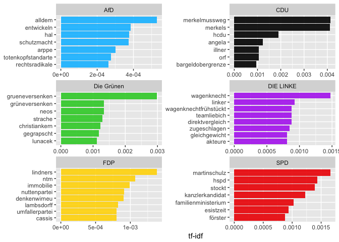
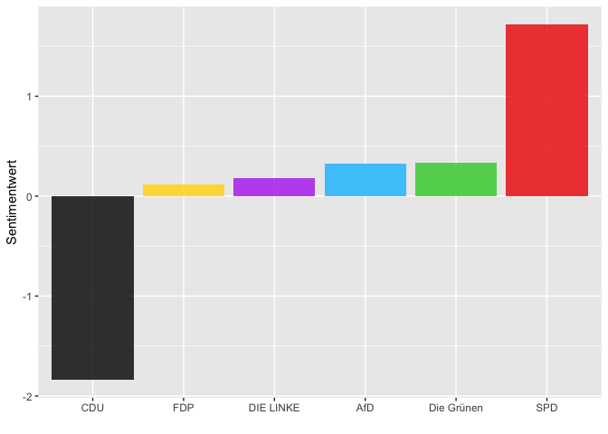
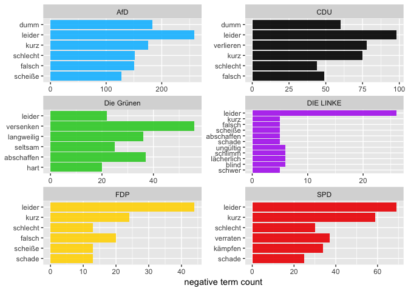

Politische Stimmung im Social Web vor der Bundestagswahl 2017
================

Auch wenn man durchaus den Eindruck gewinnen kann, dass der Wahlkampf bisher eher mit angezogener Handbremse geführt wurde, nimmt er zumindest in den Medien, nun ca. anderthalb Wochen vor der Bundestagswahl, an Intensität zu. Höchste Zeit also, um ein Stimmungsbild in den sozialen Medien zu den zur Wahl stehenden Parteien einzufangen.

Erläuterungen zu den einzelnen Analyseschritten finden Sie [hier](https://franziloew.github.io/politsentiment/)

Zeitraum:

<!--html_preserve-->
<table class="gmisc_table" style="border-collapse: collapse; margin-top: 1em; margin-bottom: 1em;">
<thead>
<tr>
<td colspan="2" style="text-align: left;">
Zeitraum
</td>
</tr>
<tr>
<th style="font-weight: 900; border-bottom: 1px solid grey; border-top: 2px solid grey; text-align: center;">
von
</th>
<th style="border-bottom: 1px solid grey; border-top: 2px solid grey; text-align: center;">
2017-09-19 02:00:42
</th>
</tr>
</thead>
<tbody>
<tr>
<td style="border-bottom: 2px solid grey; text-align: left;">
bis
</td>
<td style="border-bottom: 2px solid grey; text-align: center;">
2017-09-23 01:59:53
</td>
</tr>
</tbody>
</table>
<!--/html_preserve-->
Anzahl gesamter Tweets:

<!--html_preserve-->
<table class="gmisc_table" style="border-collapse: collapse; margin-top: 1em; margin-bottom: 1em;">
<tbody>
<tr style="border-top: 2px solid grey;">
<td style="border-top: 2px solid grey; border-bottom: 2px solid grey; text-align: center;">
355181
</td>
</tr>
</tbody>
</table>
<!--/html_preserve-->
#### Anzahl der gesamten Tweets nach Datum

## 1. Von welchen Plattformen werden die meisten Tweets gesendet?

## 2. Wer retweeted wen?

### Welche der Tweets wurden am häufigsten Retweeted?

<!--html_preserve-->
<table class="gmisc_table" style="border-collapse: collapse; margin-top: 1em; margin-bottom: 1em;">
<thead>
<tr>
<th style="border-bottom: 1px solid grey; border-top: 2px solid grey;">
</th>
<th style="border-bottom: 1px solid grey; border-top: 2px solid grey; text-align: center;">
name
</th>
<th style="border-bottom: 1px solid grey; border-top: 2px solid grey; text-align: center;">
text
</th>
<th style="border-bottom: 1px solid grey; border-top: 2px solid grey; text-align: center;">
retweet\_count
</th>
</tr>
</thead>
<tbody>
<tr>
<td style="text-align: left;">
1
</td>
<td style="text-align: left;">
Shahak Shapira
</td>
<td style="text-align: left;">
Gerade das hier von der netten AfD bekommen, inkl. Adressen & Telefonnummern - zum Glück alle nicht mehr aktuell. B… <https://t.co/iciSHZtdSg>
</td>
<td style="text-align: left;">
4227
</td>
</tr>
<tr>
<td style="text-align: left;">
2
</td>
<td style="text-align: left;">
Ralph Ruthe
</td>
<td style="text-align: left;">
Zu viel Text für Twitter, daher als Screenshot.

\#bundestagswahl2017 \#AfD <https://t.co/04xn1nIEhC>
</td>
<td style="text-align: left;">
3032
</td>
</tr>
<tr>
<td style="text-align: left;">
3
</td>
<td style="text-align: left;">
RA'in Nina Diercks
</td>
<td style="text-align: left;">
1.  Werte \#AfD-Anhänger, habe mir Euer schönes Wahlprogramm für Euch mal angesehen. Hier die Kurzzusammenfassung \#btw17 \#btw2017 (Thread).
    </td>
    <td style="text-align: left;">
    2086
    </td>
    </tr>
    <tr>
    <td style="text-align: left;">
    4
    </td>
    <td style="text-align: left;">
    Mrs. Sprachlos™
    </td>
    <td style='text-align: left;'>
    "Aber wenn doch alle Menschen wissen, wie schlimm es mit Hitler war, warum wählen die Leute dann die AfD? Das ist doch dumm."

Anja, 9 Jahre
</td>
<td style="text-align: left;">
1232
</td>
</tr>
<tr>
<td style="text-align: left;">
5
</td>
<td style="text-align: left;">
Alternative für 🇩🇪
</td>
<td style="text-align: left;">
TrauDichDeutschland:
====================

RETWEETE, um Deine Unterstützung für die \#AfD zu zeigen! \#Btw17 <https://t.co/0NQghAEJW1>
</td>
<td style="text-align: left;">
1218
</td>
</tr>
<tr>
<td style="border-bottom: 2px solid grey; text-align: left;">
6
</td>
<td style="border-bottom: 2px solid grey; text-align: left;">
AfD Bund
</td>
<td style="border-bottom: 2px solid grey; text-align: left;">
GEWINNEN MIT DER \#AfD: Schicken Sie uns ein Foto ihres unterschriebenen Wahlzettels und gewinnen Sie 1000x100 EUR \#BTW17 \#TrauDichDeutschand
</td>
<td style="border-bottom: 2px solid grey; text-align: left;">
1095
</td>
</tr>
</tbody>
</table>
<!--/html_preserve-->

## 3. Über welche Partei wird am meisten getweeted?

Anzahlt gesamte Tweets: <!--html_preserve-->
<table class="gmisc_table" style="border-collapse: collapse; margin-top: 1em; margin-bottom: 1em;">
<tbody>
<tr style="border-top: 2px solid grey;">
<td style="border-top: 2px solid grey; border-bottom: 2px solid grey; text-align: center;">
355181
</td>
</tr>
</tbody>
</table>
<!--/html_preserve-->

#### Anzahl der Tweets großer Nachrichtendienste

### Anzahl der Tweets anderer User-Accounts

## 4. Wordclouds

### Nachrichten-Dienste

### Andere User-Accounts

## 5. term frequency - inverse document frequency (tf-idf)

### Nachrichtendienste

#### Andere User-Accounts

## 6. Sentiment Analyse

#### Nachrichtenportale

##### Anzahl negativer Sentiment-Wörter

##### Anzahl positiver Sentiment-Wörter

#### Gewichtete Analyse

#### Was sind die Tweets mit den negativsten Werten?

##### CDU

<!--html_preserve-->
<table class="gmisc_table" style="border-collapse: collapse; margin-top: 1em; margin-bottom: 1em;">
<thead>
<tr>
<th style="border-bottom: 1px solid grey; border-top: 2px solid grey;">
</th>
<th style="border-bottom: 1px solid grey; border-top: 2px solid grey; text-align: center;">
partei
</th>
<th style="border-bottom: 1px solid grey; border-top: 2px solid grey; text-align: center;">
word
</th>
<th style="border-bottom: 1px solid grey; border-top: 2px solid grey; text-align: center;">
text
</th>
<th style="border-bottom: 1px solid grey; border-top: 2px solid grey; text-align: center;">
Wert
</th>
</tr>
</thead>
<tbody>
<tr>
<td style="text-align: left;">
1
</td>
<td style="text-align: left;">
CDU
</td>
<td style="text-align: left;">
kritisieren
</td>
<td style="text-align: left;">
Kameraeinsatz an Sachsen-Anhalts \#Schulen: Grüne kritisieren "Wildwuchs", CDU findet ihn nützlich: <https://t.co/rMVfds4JuF> \#videoüberwachung
</td>
<td style="text-align: left;">
-0.3466
</td>
</tr>
<tr>
<td style="text-align: left;">
2
</td>
<td style="text-align: left;">
CDU
</td>
<td style="text-align: left;">
peinlich
</td>
<td style="text-align: left;">
Peinlich: \#CDU Abgeordnete \#Strenz will erst gewählt werden bevor sie kritische Fragen zu Finanzierung aus Aserbaidschan beantwortet
</td>
<td style="text-align: left;">
-0.0048
</td>
</tr>
<tr>
<td style="text-align: left;">
3
</td>
<td style="text-align: left;">
CDU
</td>
<td style="text-align: left;">
entlasten
</td>
<td style="text-align: left;">
Steuerpolitik der Parteien analysiert: „Die CDU will auch Spitzenverdiener entlasten“ <https://t.co/OiqX7DfSJq>
</td>
<td style="text-align: left;">
0.004
</td>
</tr>
<tr>
<td style="text-align: left;">
4
</td>
<td style="text-align: left;">
CDU
</td>
<td style="text-align: left;">
rechtfertigen
</td>
<td style="text-align: left;">
CDU-Wahlkampfmanager Altmaier: "Eine Stimme für die AfD ist für mich nicht zu rechtfertigen" <https://t.co/RbkA9QN5Nt> <https://t.co/okrpciEsX6>
</td>
<td style="text-align: left;">
0.004
</td>
</tr>
<tr>
<td style="text-align: left;">
5
</td>
<td style="text-align: left;">
CDU
</td>
<td style="text-align: left;">
stabil
</td>
<td style="text-align: left;">
\#CDU stabil, \#SPD verliert, \#AfD gewinnt - das letzte \#Politbarometer vor der \#BTW17: <https://t.co/TKKBaj4kPp>
</td>
<td style="text-align: left;">
0.1016
</td>
</tr>
<tr>
<td style="border-bottom: 2px solid grey; text-align: left;">
6
</td>
<td style="border-bottom: 2px solid grey; text-align: left;">
CDU
</td>
<td style="border-bottom: 2px solid grey; text-align: left;">
erfolgreich
</td>
<td style="border-bottom: 2px solid grey; text-align: left;">
Jepp, Angela Merkel und @CDU sind tatsächlich sehr erfolgreich bei jungen Wählern. Warum? Ein paar Antworten.… <https://t.co/5Usd2yJ4xu>
</td>
<td style="border-bottom: 2px solid grey; text-align: left;">
0.2193
</td>
</tr>
</tbody>
</table>
<!--/html_preserve-->
##### SPD

<!--html_preserve-->
<table class='gmisc_table' style='border-collapse: collapse; margin-top: 1em; margin-bottom: 1em;' >
<thead>
<tr>
<th style="border-bottom: 1px solid grey; border-top: 2px solid grey;">
</th>
<th style="border-bottom: 1px solid grey; border-top: 2px solid grey; text-align: center;">
partei
</th>
<th style="border-bottom: 1px solid grey; border-top: 2px solid grey; text-align: center;">
word
</th>
<th style="border-bottom: 1px solid grey; border-top: 2px solid grey; text-align: center;">
text
</th>
<th style="border-bottom: 1px solid grey; border-top: 2px solid grey; text-align: center;">
Wert
</th>
</tr>
</thead>
<tbody>
<tr>
<td style="text-align: left;">
1
</td>
<td style="text-align: left;">
SPD
</td>
<td style="text-align: left;">
kurz
</td>
<td style="text-align: left;">
Bundestagswahl 2017 - Kurz vor der Wahl: SPD verliert - AfD legt im ZDF-"Politbarometer" erneut zu <https://t.co/4PfZKmx48R>
</td>
<td style="text-align: left;">
-0.0048
</td>
</tr>
<tr>
<td style="text-align: left;">
2
</td>
<td style="text-align: left;">
SPD
</td>
<td style="text-align: left;">
kurz
</td>
<td style="text-align: left;">
Bundestagswahl 2017 - Kurz vor der Wahl: SPD verliert - AfD legt im ZDF-"Politbarometer" erneut zu <https://t.co/kMTRO7qvS5>
</td>
<td style="text-align: left;">
-0.0048
</td>
</tr>
<tr>
<td style="text-align: left;">
3
</td>
<td style="text-align: left;">
SPD
</td>
<td style="text-align: left;">
kurz
</td>
<td style='text-align: left;'>
-   SPD sackt in Umfrage kurz vor der Wahl deutlich ab <https://t.co/uutj1wmh8H> \#DerTag
    </td>
    <td style="text-align: left;">
    -0.0048
    </td>
    </tr>
    <tr>
    <td style="text-align: left;">
    4
    </td>
    <td style="text-align: left;">
    SPD
    </td>
    <td style="text-align: left;">
    sorgen
    </td>
    <td style="text-align: left;">
    Promis lesen Wahlprogramme - Walter Sittler erklärt, wie die SPD für mehr Gerechtigkeit sorgen will <https://t.co/0i74v86r6O>
    </td>
    <td style="text-align: left;">
    -0.0048
    </td>
    </tr>
    <tr>
    <td style="text-align: left;">
    5
    </td>
    <td style="text-align: left;">
    SPD
    </td>
    <td style="text-align: left;">
    sorgen
    </td>
    <td style="text-align: left;">
    Promis lesen Wahlprogramme - Walter Sittler liest vor, wie die SPD für mehr Gerechtigkeit sorgen will <https://t.co/Y14xb1qKhm>
    </td>
    <td style="text-align: left;">
    -0.0048
    </td>
    </tr>
    <tr>
    <td style="border-bottom: 2px solid grey; text-align: left;">
    6
    </td>
    <td style="border-bottom: 2px solid grey; text-align: left;">
    SPD
    </td>
    <td style="border-bottom: 2px solid grey; text-align: left;">
    spürbar
    </td>
    <td style="border-bottom: 2px solid grey; text-align: left;">
    Verluste für Union und SPD, AfD legt spürbar zu - <https://t.co/lqHsdKfxbf>
    </td>
    <td style="border-bottom: 2px solid grey; text-align: left;">
    0.004
    </td>
    </tr>
    </tbody>
    </table>
    <!--/html_preserve-->

##### FDP

<!--html_preserve-->
<table class="gmisc_table" style="border-collapse: collapse; margin-top: 1em; margin-bottom: 1em;">
<thead>
<tr>
<th style="border-bottom: 1px solid grey; border-top: 2px solid grey;">
</th>
<th style="border-bottom: 1px solid grey; border-top: 2px solid grey; text-align: center;">
partei
</th>
<th style="border-bottom: 1px solid grey; border-top: 2px solid grey; text-align: center;">
word
</th>
<th style="border-bottom: 1px solid grey; border-top: 2px solid grey; text-align: center;">
text
</th>
<th style="border-bottom: 1px solid grey; border-top: 2px solid grey; text-align: center;">
Wert
</th>
</tr>
</thead>
<tbody>
<tr>
<td style="text-align: left;">
1
</td>
<td style="text-align: left;">
FDP
</td>
<td style="text-align: left;">
fördern
</td>
<td style="text-align: left;">
Die meisten Parteien wollen das \#Fahrrad fördern – nicht so \#AfD und \#FDP <https://t.co/WIDfJ9AM5w>
</td>
<td style="text-align: left;">
0.004
</td>
</tr>
<tr>
<td style="text-align: left;">
2
</td>
<td style="text-align: left;">
FDP
</td>
<td style="text-align: left;">
genau
</td>
<td style="text-align: left;">
FDP-Vize Suding: Ein-Mann-Strategie "genau richtig" <https://t.co/TnBObbMkNX> <https://t.co/0zCQyPkc2R>
</td>
<td style="text-align: left;">
0.004
</td>
</tr>
<tr>
<td style="text-align: left;">
3
</td>
<td style="text-align: left;">
FDP
</td>
<td style="text-align: left;">
richtig
</td>
<td style="text-align: left;">
FDP-Vize Suding: Ein-Mann-Strategie "genau richtig" <https://t.co/TnBObbMkNX> <https://t.co/0zCQyPkc2R>
</td>
<td style="text-align: left;">
0.004
</td>
</tr>
<tr>
<td style="text-align: left;">
4
</td>
<td style="text-align: left;">
FDP
</td>
<td style="text-align: left;">
bedeuten
</td>
<td style="text-align: left;">
Bundestagswahl 2017 - Was würde Jamaika bedeuten? Bei welchen Punkten sich FDP und Grüne einig sind <https://t.co/ViQsOwDJkd>
</td>
<td style="text-align: left;">
0.004
</td>
</tr>
<tr>
<td style="text-align: left;">
5
</td>
<td style="text-align: left;">
FDP
</td>
<td style="text-align: left;">
bedeuten
</td>
<td style="text-align: left;">
Was würde Jamaika bedeuten? Bei welchen Punkten sich FDP und Grüne einig sind - <https://t.co/RjcMWIsZJy>
</td>
<td style="text-align: left;">
0.004
</td>
</tr>
<tr>
<td style="border-bottom: 2px solid grey; text-align: left;">
6
</td>
<td style="border-bottom: 2px solid grey; text-align: left;">
FDP
</td>
<td style="border-bottom: 2px solid grey; text-align: left;">
verdienen
</td>
<td style="border-bottom: 2px solid grey; text-align: left;">
FDP wählen und 2 Euro verdienen? Ist das etwa \#Wählerbestechung? <https://t.co/Ozs9bUlfcY>
</td>
<td style="border-bottom: 2px solid grey; text-align: left;">
0.0989
</td>
</tr>
</tbody>
</table>
<!--/html_preserve-->
##### DIE LINKE

<!--html_preserve-->
<table class="gmisc_table" style="border-collapse: collapse; margin-top: 1em; margin-bottom: 1em;">
<thead>
<tr>
<th style="border-bottom: 1px solid grey; border-top: 2px solid grey;">
</th>
<th style="border-bottom: 1px solid grey; border-top: 2px solid grey; text-align: center;">
partei
</th>
<th style="border-bottom: 1px solid grey; border-top: 2px solid grey; text-align: center;">
word
</th>
<th style="border-bottom: 1px solid grey; border-top: 2px solid grey; text-align: center;">
text
</th>
<th style="border-bottom: 1px solid grey; border-top: 2px solid grey; text-align: center;">
Wert
</th>
</tr>
</thead>
<tbody>
<tr>
<td style="text-align: left;">
1
</td>
<td style="text-align: left;">
DIE LINKE
</td>
<td style="text-align: left;">
enttäuschen
</td>
<td style="text-align: left;">
Debat-O-Meter: Wagenknecht überzeugt sogar AfD-Fans, Gauland und von der Leyen enttäuschen <https://t.co/Z7puwpKQO7> <https://t.co/tU4L6tomk3>
</td>
<td style="text-align: left;">
-0.0586
</td>
</tr>
<tr>
<td style="border-bottom: 2px solid grey; text-align: left;">
2
</td>
<td style="border-bottom: 2px solid grey; text-align: left;">
DIE LINKE
</td>
<td style="border-bottom: 2px solid grey; text-align: left;">
überzeugt
</td>
<td style="border-bottom: 2px solid grey; text-align: left;">
Debat-O-Meter: Wagenknecht überzeugt sogar AfD-Fans, Gauland und von der Leyen enttäuschen <https://t.co/Z7puwpKQO7> <https://t.co/tU4L6tomk3>
</td>
<td style="border-bottom: 2px solid grey; text-align: left;">
0.2381
</td>
</tr>
</tbody>
</table>
<!--/html_preserve-->
##### AfD

<!--html_preserve-->
<table class="gmisc_table" style="border-collapse: collapse; margin-top: 1em; margin-bottom: 1em;">
<thead>
<tr>
<th style="border-bottom: 1px solid grey; border-top: 2px solid grey;">
</th>
<th style="border-bottom: 1px solid grey; border-top: 2px solid grey; text-align: center;">
partei
</th>
<th style="border-bottom: 1px solid grey; border-top: 2px solid grey; text-align: center;">
word
</th>
<th style="border-bottom: 1px solid grey; border-top: 2px solid grey; text-align: center;">
text
</th>
<th style="border-bottom: 1px solid grey; border-top: 2px solid grey; text-align: center;">
Wert
</th>
</tr>
</thead>
<tbody>
<tr>
<td style="text-align: left;">
1
</td>
<td style="text-align: left;">
AfD
</td>
<td style="text-align: left;">
unfair
</td>
<td style="text-align: left;">
@civey\_de-Umfrage für @tagesspiegel: Zwei Drittel werten \#AfD-Wahlkampf als unfair <https://t.co/Vp6Tpeksbg> \#btw17
</td>
<td style="text-align: left;">
-0.8827
</td>
</tr>
<tr>
<td style="text-align: left;">
2
</td>
<td style="text-align: left;">
AfD
</td>
<td style="text-align: left;">
gefährlich
</td>
<td style="text-align: left;">
Gefährlich: \#Altmaiers Appell lieber nicht, als \#AfD zu wählen!Lebendige Demokratie heißt nicht nur genehme Parteien zu wählen \#Wahl2017
</td>
<td style="text-align: left;">
-0.6366
</td>
</tr>
<tr>
<td style="text-align: left;">
3
</td>
<td style="text-align: left;">
AfD
</td>
<td style="text-align: left;">
verboten
</td>
<td style="text-align: left;">
Gerichtlich verboten: AfD Bielefeld darf angebliches Zitat von @GoeringEckardt zu sexuellen Übergriffen von Flüchtlingen nicht verwenden.
</td>
<td style="text-align: left;">
-0.3657
</td>
</tr>
<tr>
<td style="text-align: left;">
4
</td>
<td style="text-align: left;">
AfD
</td>
<td style="text-align: left;">
fürchten
</td>
<td style="text-align: left;">
Migrationspolitik: AfD will Deutschland kurz vor der Wahl das Fürchten lehren <https://t.co/k1ojycg83A> <https://t.co/DSpVJbQC0R>
</td>
<td style="text-align: left;">
-0.3545
</td>
</tr>
<tr>
<td style="text-align: left;">
5
</td>
<td style="text-align: left;">
AfD
</td>
<td style="text-align: left;">
hart
</td>
<td style="text-align: left;">
"hart aber fair": Wenn Grüne und CSU sich seltsam einig mit der AfD sind <https://t.co/JOvujRUsW1> <https://t.co/GdJPgMMVXl>
</td>
<td style="text-align: left;">
-0.1483
</td>
</tr>
<tr>
<td style="border-bottom: 2px solid grey; text-align: left;">
6
</td>
<td style="border-bottom: 2px solid grey; text-align: left;">
AfD
</td>
<td style="border-bottom: 2px solid grey; text-align: left;">
hart
</td>
<td style="border-bottom: 2px solid grey; text-align: left;">
"hart aber fair": Wenn Grüne und CSU sich seltsam einig mit der AfD sind <https://t.co/yulG9RpafS> <https://t.co/onxrTfeVaE>
</td>
<td style="border-bottom: 2px solid grey; text-align: left;">
-0.1483
</td>
</tr>
</tbody>
</table>
<!--/html_preserve-->
### Andere Nutzer

#### Ungewichtete Analyse

##### Anzahl negativer Sentiment-Wörter

Bei der CDU überwiegt das Wort "tot" auf Grund des bereits angesprochnen Todes von Heiner Geißler. Das Wort "leider" ist bei allen Parteien wiederzufinden. Auffällig ist noch, dass in Zusammenhang mit der AFD häufig das Wort "verfassungswidrig" verwendet wird.

##### Anzahl positiver Sentiment-Wörter

#### Gewichtete Analyse

#### Was sind die Tweets mit den negativsten Werten?

##### CDU

<!--html_preserve-->
<table class="gmisc_table" style="border-collapse: collapse; margin-top: 1em; margin-bottom: 1em;">
<thead>
<tr>
<th style="border-bottom: 1px solid grey; border-top: 2px solid grey;">
</th>
<th style="border-bottom: 1px solid grey; border-top: 2px solid grey; text-align: center;">
partei
</th>
<th style="border-bottom: 1px solid grey; border-top: 2px solid grey; text-align: center;">
word
</th>
<th style="border-bottom: 1px solid grey; border-top: 2px solid grey; text-align: center;">
text
</th>
<th style="border-bottom: 1px solid grey; border-top: 2px solid grey; text-align: center;">
Wert
</th>
</tr>
</thead>
<tbody>
<tr>
<td style="text-align: left;">
1
</td>
<td style="text-align: left;">
CDU
</td>
<td style="text-align: left;">
unnötig
</td>
<td style="text-align: left;">
CDU und FDP wollen Bildung unnötig teuer machen. \#gerechtist wenn Bildung kostenfrei ist! \#SPD <https://t.co/3VmtOALy16>
</td>
<td style="text-align: left;">
-0.9463
</td>
</tr>
<tr>
<td style="text-align: left;">
2
</td>
<td style="text-align: left;">
CDU
</td>
<td style="text-align: left;">
unnötig
</td>
<td style="text-align: left;">
Lieber @MartinSchulz, bitte reden Sie mit Frau Wagenknecht und Herrn Özdemir, öffentlich. Das wäre der Weg. Ein 2. Duell mit CDU ist unnötig
</td>
<td style="text-align: left;">
-0.9463
</td>
</tr>
<tr>
<td style="text-align: left;">
3
</td>
<td style="text-align: left;">
CDU
</td>
<td style="text-align: left;">
unnötig
</td>
<td style="text-align: left;">
Ich gebe \#Altmeier nur halb recht. Die \#AFD wählen ist so unnötig wie ein Kropf ! Aber die Linke ist nicht wählbar, ist Falsch. \#CDU \#SPD
</td>
<td style="text-align: left;">
-0.9463
</td>
</tr>
<tr>
<td style="text-align: left;">
4
</td>
<td style="text-align: left;">
CDU
</td>
<td style="text-align: left;">
unnötig
</td>
<td style="text-align: left;">
@N24 Gebe ich die Stimme für Piraten ,Grünen oder FDP ab ist die Wahl sowieso unnötig Merkel gewinnt wieder da die… <https://t.co/cROVrjk9xn>
</td>
<td style="text-align: left;">
-0.9463
</td>
</tr>
<tr>
<td style="text-align: left;">
5
</td>
<td style="text-align: left;">
CDU
</td>
<td style="text-align: left;">
schädlich
</td>
<td style="text-align: left;">
@hajoschumacher Die Kohl spendenaffäre war für die CDU weitaus weniger schädlich als ich das gedacht hätte. Reicht das als Gegenbeweis?
</td>
<td style="text-align: left;">
-0.9269
</td>
</tr>
<tr>
<td style="border-bottom: 2px solid grey; text-align: left;">
6
</td>
<td style="border-bottom: 2px solid grey; text-align: left;">
CDU
</td>
<td style="border-bottom: 2px solid grey; text-align: left;">
schädlich
</td>
<td style="border-bottom: 2px solid grey; text-align: left;">
"Die Alleingänge einer Frau Merkel sind kontraproduktiv, schädlich und alles andere als für das Wohl des Volkes... <https://t.co/P3oiaiJYTC>
</td>
<td style="border-bottom: 2px solid grey; text-align: left;">
-0.9269
</td>
</tr>
</tbody>
</table>
<!--/html_preserve-->
##### SPD

<!--html_preserve-->
<table class="gmisc_table" style="border-collapse: collapse; margin-top: 1em; margin-bottom: 1em;">
<thead>
<tr>
<th style="border-bottom: 1px solid grey; border-top: 2px solid grey;">
</th>
<th style="border-bottom: 1px solid grey; border-top: 2px solid grey; text-align: center;">
partei
</th>
<th style="border-bottom: 1px solid grey; border-top: 2px solid grey; text-align: center;">
word
</th>
<th style="border-bottom: 1px solid grey; border-top: 2px solid grey; text-align: center;">
text
</th>
<th style="border-bottom: 1px solid grey; border-top: 2px solid grey; text-align: center;">
Wert
</th>
</tr>
</thead>
<tbody>
<tr>
<td style="text-align: left;">
1
</td>
<td style="text-align: left;">
SPD
</td>
<td style="text-align: left;">
unnötig
</td>
<td style="text-align: left;">
Das Programm der \#Linken habe ich mir genau angesehen. Deren Forderungen wären allesamt unnötig, wäre die \#SPD noch eine Arbeiterpartei.
</td>
<td style="text-align: left;">
-0.9463
</td>
</tr>
<tr>
<td style="text-align: left;">
2
</td>
<td style="text-align: left;">
SPD
</td>
<td style="text-align: left;">
schädlich
</td>
<td style="text-align: left;">
@wathzmann @LischkaB @SPD\_LSA \#Schädlich hat einen Auftrag bekommen und der \#SPD 13k € gespendet. Selbst ein Kleink… <https://t.co/PSGRfT3RGE>
</td>
<td style="text-align: left;">
-0.9269
</td>
</tr>
<tr>
<td style="text-align: left;">
3
</td>
<td style="text-align: left;">
SPD
</td>
<td style="text-align: left;">
schwach
</td>
<td style="text-align: left;">
Was mich an der \#btw17 am meisten interessiert? -Wie schwach wird die spd?, und -schaffen die Grünen endlich den Parlamentsauszug?
</td>
<td style="text-align: left;">
-0.9206
</td>
</tr>
<tr>
<td style="text-align: left;">
4
</td>
<td style="text-align: left;">
SPD
</td>
<td style="text-align: left;">
schwach
</td>
<td style="text-align: left;">
@Wahlrecht\_de Union verliert weiter, SPD bleibt schwach, Kleine halten starke Werte der Vorwoche. War wohl die letzte Umfrage vor der Wahl.
</td>
<td style="text-align: left;">
-0.9206
</td>
</tr>
<tr>
<td style="text-align: left;">
5
</td>
<td style="text-align: left;">
SPD
</td>
<td style="text-align: left;">
schwach
</td>
<td style="text-align: left;">
@Zora\_211212 @EmiliaC32 @ShakRiet Gut, whatabout4yearsago? Da war eine Mehrheit für RRG wollte die SPD nicht. Und FDP war unfassbar schwach.
</td>
<td style="text-align: left;">
-0.9206
</td>
</tr>
<tr>
<td style="border-bottom: 2px solid grey; text-align: left;">
6
</td>
<td style="border-bottom: 2px solid grey; text-align: left;">
SPD
</td>
<td style="border-bottom: 2px solid grey; text-align: left;">
schwach
</td>
<td style="border-bottom: 2px solid grey; text-align: left;">
@christiansoeder Wie stark wird die FDP? Wie schwach die SPD? Auch spannende Balken, die man im Blick behalten sollte.
</td>
<td style="border-bottom: 2px solid grey; text-align: left;">
-0.9206
</td>
</tr>
</tbody>
</table>
<!--/html_preserve-->
##### FDP

<!--html_preserve-->
<table class="gmisc_table" style="border-collapse: collapse; margin-top: 1em; margin-bottom: 1em;">
<thead>
<tr>
<th style="border-bottom: 1px solid grey; border-top: 2px solid grey;">
</th>
<th style="border-bottom: 1px solid grey; border-top: 2px solid grey; text-align: center;">
partei
</th>
<th style="border-bottom: 1px solid grey; border-top: 2px solid grey; text-align: center;">
word
</th>
<th style="border-bottom: 1px solid grey; border-top: 2px solid grey; text-align: center;">
text
</th>
<th style="border-bottom: 1px solid grey; border-top: 2px solid grey; text-align: center;">
Wert
</th>
</tr>
</thead>
<tbody>
<tr>
<td style="text-align: left;">
1
</td>
<td style="text-align: left;">
FDP
</td>
<td style="text-align: left;">
fördern
</td>
<td style="text-align: left;">
Die meisten Parteien wollen das \#Fahrrad fördern – nicht so \#AfD und \#FDP <https://t.co/WIDfJ9AM5w>
</td>
<td style="text-align: left;">
0.004
</td>
</tr>
<tr>
<td style="text-align: left;">
2
</td>
<td style="text-align: left;">
FDP
</td>
<td style="text-align: left;">
genau
</td>
<td style="text-align: left;">
FDP-Vize Suding: Ein-Mann-Strategie "genau richtig" <https://t.co/TnBObbMkNX> <https://t.co/0zCQyPkc2R>
</td>
<td style="text-align: left;">
0.004
</td>
</tr>
<tr>
<td style="text-align: left;">
3
</td>
<td style="text-align: left;">
FDP
</td>
<td style="text-align: left;">
richtig
</td>
<td style="text-align: left;">
FDP-Vize Suding: Ein-Mann-Strategie "genau richtig" <https://t.co/TnBObbMkNX> <https://t.co/0zCQyPkc2R>
</td>
<td style="text-align: left;">
0.004
</td>
</tr>
<tr>
<td style="text-align: left;">
4
</td>
<td style="text-align: left;">
FDP
</td>
<td style="text-align: left;">
bedeuten
</td>
<td style="text-align: left;">
Bundestagswahl 2017 - Was würde Jamaika bedeuten? Bei welchen Punkten sich FDP und Grüne einig sind <https://t.co/ViQsOwDJkd>
</td>
<td style="text-align: left;">
0.004
</td>
</tr>
<tr>
<td style="text-align: left;">
5
</td>
<td style="text-align: left;">
FDP
</td>
<td style="text-align: left;">
bedeuten
</td>
<td style="text-align: left;">
Was würde Jamaika bedeuten? Bei welchen Punkten sich FDP und Grüne einig sind - <https://t.co/RjcMWIsZJy>
</td>
<td style="text-align: left;">
0.004
</td>
</tr>
<tr>
<td style="border-bottom: 2px solid grey; text-align: left;">
6
</td>
<td style="border-bottom: 2px solid grey; text-align: left;">
FDP
</td>
<td style="border-bottom: 2px solid grey; text-align: left;">
verdienen
</td>
<td style="border-bottom: 2px solid grey; text-align: left;">
FDP wählen und 2 Euro verdienen? Ist das etwa \#Wählerbestechung? <https://t.co/Ozs9bUlfcY>
</td>
<td style="border-bottom: 2px solid grey; text-align: left;">
0.0989
</td>
</tr>
</tbody>
</table>
<!--/html_preserve-->
##### DIE LINKE

<!--html_preserve-->
<table class="gmisc_table" style="border-collapse: collapse; margin-top: 1em; margin-bottom: 1em;">
<thead>
<tr>
<th style="border-bottom: 1px solid grey; border-top: 2px solid grey;">
</th>
<th style="border-bottom: 1px solid grey; border-top: 2px solid grey; text-align: center;">
partei
</th>
<th style="border-bottom: 1px solid grey; border-top: 2px solid grey; text-align: center;">
word
</th>
<th style="border-bottom: 1px solid grey; border-top: 2px solid grey; text-align: center;">
text
</th>
<th style="border-bottom: 1px solid grey; border-top: 2px solid grey; text-align: center;">
Wert
</th>
</tr>
</thead>
<tbody>
<tr>
<td style="text-align: left;">
1
</td>
<td style="text-align: left;">
DIE LINKE
</td>
<td style="text-align: left;">
enttäuschen
</td>
<td style="text-align: left;">
Debat-O-Meter: Wagenknecht überzeugt sogar AfD-Fans, Gauland und von der Leyen enttäuschen <https://t.co/Z7puwpKQO7> <https://t.co/tU4L6tomk3>
</td>
<td style="text-align: left;">
-0.0586
</td>
</tr>
<tr>
<td style="border-bottom: 2px solid grey; text-align: left;">
2
</td>
<td style="border-bottom: 2px solid grey; text-align: left;">
DIE LINKE
</td>
<td style="border-bottom: 2px solid grey; text-align: left;">
überzeugt
</td>
<td style="border-bottom: 2px solid grey; text-align: left;">
Debat-O-Meter: Wagenknecht überzeugt sogar AfD-Fans, Gauland und von der Leyen enttäuschen <https://t.co/Z7puwpKQO7> <https://t.co/tU4L6tomk3>
</td>
<td style="border-bottom: 2px solid grey; text-align: left;">
0.2381
</td>
</tr>
</tbody>
</table>
<!--/html_preserve-->
##### AfD

<!--html_preserve-->
<table class="gmisc_table" style="border-collapse: collapse; margin-top: 1em; margin-bottom: 1em;">
<thead>
<tr>
<th style="border-bottom: 1px solid grey; border-top: 2px solid grey;">
</th>
<th style="border-bottom: 1px solid grey; border-top: 2px solid grey; text-align: center;">
partei
</th>
<th style="border-bottom: 1px solid grey; border-top: 2px solid grey; text-align: center;">
word
</th>
<th style="border-bottom: 1px solid grey; border-top: 2px solid grey; text-align: center;">
text
</th>
<th style="border-bottom: 1px solid grey; border-top: 2px solid grey; text-align: center;">
Wert
</th>
</tr>
</thead>
<tbody>
<tr>
<td style="text-align: left;">
1
</td>
<td style="text-align: left;">
AfD
</td>
<td style="text-align: left;">
unfair
</td>
<td style="text-align: left;">
@civey\_de-Umfrage für @tagesspiegel: Zwei Drittel werten \#AfD-Wahlkampf als unfair <https://t.co/Vp6Tpeksbg> \#btw17
</td>
<td style="text-align: left;">
-0.8827
</td>
</tr>
<tr>
<td style="text-align: left;">
2
</td>
<td style="text-align: left;">
AfD
</td>
<td style="text-align: left;">
gefährlich
</td>
<td style="text-align: left;">
Gefährlich: \#Altmaiers Appell lieber nicht, als \#AfD zu wählen!Lebendige Demokratie heißt nicht nur genehme Parteien zu wählen \#Wahl2017
</td>
<td style="text-align: left;">
-0.6366
</td>
</tr>
<tr>
<td style="text-align: left;">
3
</td>
<td style="text-align: left;">
AfD
</td>
<td style="text-align: left;">
verboten
</td>
<td style="text-align: left;">
Gerichtlich verboten: AfD Bielefeld darf angebliches Zitat von @GoeringEckardt zu sexuellen Übergriffen von Flüchtlingen nicht verwenden.
</td>
<td style="text-align: left;">
-0.3657
</td>
</tr>
<tr>
<td style="text-align: left;">
4
</td>
<td style="text-align: left;">
AfD
</td>
<td style="text-align: left;">
fürchten
</td>
<td style="text-align: left;">
Migrationspolitik: AfD will Deutschland kurz vor der Wahl das Fürchten lehren <https://t.co/k1ojycg83A> <https://t.co/DSpVJbQC0R>
</td>
<td style="text-align: left;">
-0.3545
</td>
</tr>
<tr>
<td style="text-align: left;">
5
</td>
<td style="text-align: left;">
AfD
</td>
<td style="text-align: left;">
hart
</td>
<td style="text-align: left;">
"hart aber fair": Wenn Grüne und CSU sich seltsam einig mit der AfD sind <https://t.co/JOvujRUsW1> <https://t.co/GdJPgMMVXl>
</td>
<td style="text-align: left;">
-0.1483
</td>
</tr>
<tr>
<td style="border-bottom: 2px solid grey; text-align: left;">
6
</td>
<td style="border-bottom: 2px solid grey; text-align: left;">
AfD
</td>
<td style="border-bottom: 2px solid grey; text-align: left;">
hart
</td>
<td style="border-bottom: 2px solid grey; text-align: left;">
"hart aber fair": Wenn Grüne und CSU sich seltsam einig mit der AfD sind <https://t.co/yulG9RpafS> <https://t.co/onxrTfeVaE>
</td>
<td style="border-bottom: 2px solid grey; text-align: left;">
-0.1483
</td>
</tr>
</tbody>
</table>
<!--/html_preserve-->
