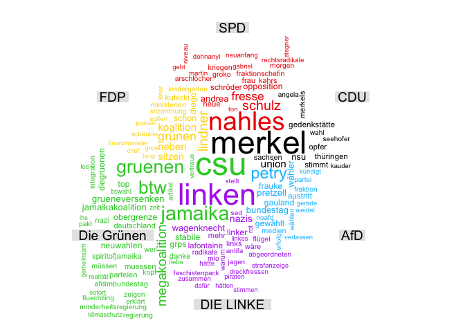
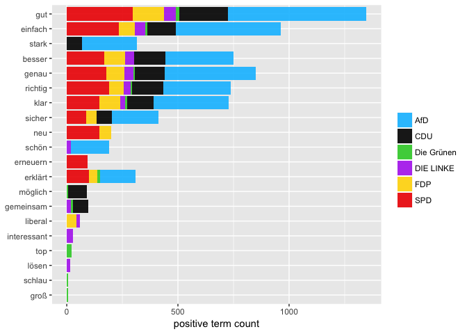

Politische Stimmung bei Twitter nach der Bundestagswahl 2017
================
2017-10-09

Wie sieht die politische Stimmung bei Twitter in den Tagen nach der Bundestagswahl aus?

Erläuterungen zu den einzelnen Analyseschritten finden Sie [hier](https://franziloew.github.io/politsentiment/)

Zeitraum:

<!--html_preserve-->
<table class="gmisc_table" style="border-collapse: collapse; margin-top: 1em; margin-bottom: 1em;">
<thead>
<tr>
<td colspan="2" style="text-align: left;">
Zeitraum
</td>
</tr>
<tr>
<th style="font-weight: 900; border-bottom: 1px solid grey; border-top: 2px solid grey; text-align: center;">
von
</th>
<th style="border-bottom: 1px solid grey; border-top: 2px solid grey; text-align: center;">
2017-09-26 02:00:02
</th>
</tr>
</thead>
<tbody>
<tr>
<td style="border-bottom: 2px solid grey; text-align: left;">
bis
</td>
<td style="border-bottom: 2px solid grey; text-align: center;">
2017-09-30 01:59:45
</td>
</tr>
</tbody>
</table>
<!--/html_preserve-->
Anzahl der Tweets (ohne Retweets):

<!--html_preserve-->
<table class="gmisc_table" style="border-collapse: collapse; margin-top: 1em; margin-bottom: 1em;">
<tbody>
<tr style="border-top: 2px solid grey;">
<td style="border-top: 2px solid grey; border-bottom: 2px solid grey; text-align: center;">
101980
</td>
</tr>
</tbody>
</table>
<!--/html_preserve-->
### Anzahl der gesamten Tweets nach Datum

### Von welchen Plattformen werden die meisten Tweets gesendet?

1. Wer retweeted wen?
---------------------

### Welche Tweets wurden am häufigsten Retweeted?

<!--html_preserve-->
<table class="gmisc_table" style="border-collapse: collapse; margin-top: 1em; margin-bottom: 1em;">
<thead>
<tr>
<th style="border-bottom: 1px solid grey; border-top: 2px solid grey;">
</th>
<th style="border-bottom: 1px solid grey; border-top: 2px solid grey; text-align: center;">
name
</th>
<th style="border-bottom: 1px solid grey; border-top: 2px solid grey; text-align: center;">
text
</th>
<th style="border-bottom: 1px solid grey; border-top: 2px solid grey; text-align: center;">
retweet\_count
</th>
</tr>
</thead>
<tbody>
<tr>
<td style="text-align: left;">
1
</td>
<td style="text-align: left;">
Nicht Chevy Chase
</td>
<td style="text-align: left;">
Weidel verlässt ZDF Sendung ✔ Petry verlässt AfD-Fraktion ✔ AfD verlässt den Bundestag Höcke verlässt das Land Nazis verlassen den Planeten
</td>
<td style="text-align: left;">
2063
</td>
</tr>
<tr>
<td style="text-align: left;">
2
</td>
<td style="text-align: left;">
Rebel
</td>
<td style="text-align: left;">
"Andrea Nahles steht für eine radikale 360-Grad Wende bei der SPD."

“Du meinst eine 180-Grad Wende.”

“Nein.”
</td>
<td style="text-align: left;">
829
</td>
</tr>
<tr>
<td style="text-align: left;">
3
</td>
<td style="text-align: left;">
ZDF heute-show
</td>
<td style="text-align: left;">
In einem Wahlkreis liegt die AfD unter fünf Prozent: Münster. Der Grund: Der zuständige russische Hacker hatte kein Ü auf der Tastatur.
</td>
<td style="text-align: left;">
778
</td>
</tr>
<tr>
<td style="text-align: left;">
4
</td>
<td style="text-align: left;">
Dieter Stein
</td>
<td style="text-align: left;">
Wenn Gauland gesagt hätte, "ab morgen kriegen CDU/CSU in die Fresse", gäbe es übermorgen wahrscheinlich Lichterkett… <https://t.co/tJp5dteVFB>
</td>
<td style="text-align: left;">
648
</td>
</tr>
<tr>
<td style="text-align: left;">
5
</td>
<td style="text-align: left;">
Meiko Haas
</td>
<td style="text-align: left;">
Wenn eine Frau,mit abgebrochenen Studium,ohne Ausbildung &noch nie gearbeitet hat.Vorsitzende einer Arbeiterpartei wird,sind sie in der \#SPD
</td>
<td style="text-align: left;">
559
</td>
</tr>
<tr>
<td style="border-bottom: 2px solid grey; text-align: left;">
6
</td>
<td style="border-bottom: 2px solid grey; text-align: left;">
extra3
</td>
<td style="border-bottom: 2px solid grey; text-align: left;">
\#Pretzell folgt \#Petry. Die \#AfD hat also doch nichts gegen Familiennachzug.
</td>
<td style="border-bottom: 2px solid grey; text-align: left;">
529
</td>
</tr>
</tbody>
</table>
<!--/html_preserve-->
2. Über welche Partei wird am meisten getweeted?
------------------------------------------------

#### Nachrichtendienste (privat und öffentlich-rechtlich)

Anzahl gesamter Tweets:

<!--html_preserve-->
<table class="gmisc_table" style="border-collapse: collapse; margin-top: 1em; margin-bottom: 1em;">
<tbody>
<tr style="border-top: 2px solid grey;">
<td style="border-top: 2px solid grey; border-bottom: 2px solid grey; text-align: center;">
1353
</td>
</tr>
</tbody>
</table>
<!--/html_preserve-->

#### Andere User-Accounts

Anzahl gesamter Tweets:

<!--html_preserve-->
<table class="gmisc_table" style="border-collapse: collapse; margin-top: 1em; margin-bottom: 1em;">
<tbody>
<tr style="border-top: 2px solid grey;">
<td style="border-top: 2px solid grey; border-bottom: 2px solid grey; text-align: center;">
90615
</td>
</tr>
</tbody>
</table>
<!--/html_preserve-->

4. Wordclouds
-------------

#### Private Nachrichten

#### Andere User-Accounts

5. term frequency - inverse document frequency (tf-idf)
-------------------------------------------------------

#### Nachrichtendienste

#### Andere User-Accounts

6. Sentiment Analyse
--------------------

#### Nachrichtenportale

##### Anzahl negativer Sentiment-Wörter

##### Anzahl positiver Sentiment-Wörter

#### Gewichtete Analyse

#### Was sind die Tweets mit den negativsten/positivsten Werten?

#### CDU

<!--html_preserve-->
<table class="gmisc_table" style="border-collapse: collapse; margin-top: 1em; margin-bottom: 1em;">
<thead>
<tr>
<th style="border-bottom: 1px solid grey; border-top: 2px solid grey;">
</th>
<th style="border-bottom: 1px solid grey; border-top: 2px solid grey; text-align: center;">
partei
</th>
<th style="border-bottom: 1px solid grey; border-top: 2px solid grey; text-align: center;">
word
</th>
<th style="border-bottom: 1px solid grey; border-top: 2px solid grey; text-align: center;">
text
</th>
<th style="border-bottom: 1px solid grey; border-top: 2px solid grey; text-align: center;">
Wert
</th>
</tr>
</thead>
<tbody>
<tr>
<td style="text-align: left;">
1
</td>
<td style="text-align: left;">
CDU
</td>
<td style="text-align: left;">
falsch
</td>
<td style="text-align: left;">
Video: \#phoenixrunde "Rekordverluste - Was machen \#Union und \#SPD falsch?" <https://t.co/YvIgBXEJct> @HannahBeitzer @SZ @walli5 \#BTW17
</td>
<td style="text-align: left;">
-0.7618
</td>
</tr>
<tr>
<td style="text-align: left;">
2
</td>
<td style="text-align: left;">
CDU
</td>
<td style="text-align: left;">
falsch
</td>
<td style="text-align: left;">
Wie groß sind die großen Parteien noch? Um 22:15 h diskutiert die \#phoenixrunde über "Rekordverluste - Was machen SPD und Union falsch?"
</td>
<td style="text-align: left;">
-0.7618
</td>
</tr>
<tr>
<td style="text-align: left;">
3
</td>
<td style="text-align: left;">
CDU
</td>
<td style="text-align: left;">
drängen
</td>
<td style="text-align: left;">
Bundestagswahl 2017 im News-Ticker - Grüne und FDP drängen Union zu gemeinsamer Linie <https://t.co/KnOapB59CU>
</td>
<td style="text-align: left;">
-0.3516
</td>
</tr>
<tr>
<td style="text-align: left;">
4
</td>
<td style="text-align: left;">
CDU
</td>
<td style="text-align: left;">
drängen
</td>
<td style="text-align: left;">
Bundestagswahl 2017 im News-Ticker - Grüne und FDP drängen Union zu Gemeinsamkeit <https://t.co/SNLf5JFhVz>
</td>
<td style="text-align: left;">
-0.3516
</td>
</tr>
<tr>
<td style="text-align: left;">
5
</td>
<td style="text-align: left;">
CDU
</td>
<td style="text-align: left;">
drängen
</td>
<td style="text-align: left;">
Bundestagswahl 2017 im News-Ticker - Grüne und FDP drängen Union zu Gemeinsamkeit <https://t.co/9TkTmAYfLZ>
</td>
<td style="text-align: left;">
-0.3516
</td>
</tr>
<tr>
<td style="border-bottom: 2px solid grey; text-align: left;">
6
</td>
<td style="border-bottom: 2px solid grey; text-align: left;">
CDU
</td>
<td style="border-bottom: 2px solid grey; text-align: left;">
drängen
</td>
<td style="border-bottom: 2px solid grey; text-align: left;">
Bundestagswahl 2017 im News-Ticker - Grüne und FDP drängen Union zu Gemeinsamkeit <https://t.co/t6hQqg0xYf>
</td>
<td style="border-bottom: 2px solid grey; text-align: left;">
-0.3516
</td>
</tr>
</tbody>
</table>
<!--/html_preserve-->
<!--html_preserve-->
<table class="gmisc_table" style="border-collapse: collapse; margin-top: 1em; margin-bottom: 1em;">
<thead>
<tr>
<th style="border-bottom: 1px solid grey; border-top: 2px solid grey;">
</th>
<th style="border-bottom: 1px solid grey; border-top: 2px solid grey; text-align: center;">
partei
</th>
<th style="border-bottom: 1px solid grey; border-top: 2px solid grey; text-align: center;">
word
</th>
<th style="border-bottom: 1px solid grey; border-top: 2px solid grey; text-align: center;">
text
</th>
<th style="border-bottom: 1px solid grey; border-top: 2px solid grey; text-align: center;">
Wert
</th>
</tr>
</thead>
<tbody>
<tr>
<td style="text-align: left;">
1
</td>
<td style="text-align: left;">
CDU
</td>
<td style="text-align: left;">
spannend
</td>
<td style="text-align: left;">
Fraktionssitzung \#Union wird spannend: Ratlosigkeit bei \#CDU u \#Wut bei \#CSU Und nicht wenige fragen ob \#Merkel verstanden hat \#BTW17
</td>
<td style="text-align: left;">
0.7165
</td>
</tr>
<tr>
<td style="text-align: left;">
2
</td>
<td style="text-align: left;">
CDU
</td>
<td style="text-align: left;">
zufrieden
</td>
<td style="text-align: left;">
Die Agentur "Jung von Matt" verhalf zwar der CDU zum Sieg bei der \#BTW17, zufrieden sind die Werber trotzdem nicht. <https://t.co/41luHcFAJp>
</td>
<td style="text-align: left;">
0.393
</td>
</tr>
<tr>
<td style="text-align: left;">
3
</td>
<td style="text-align: left;">
CDU
</td>
<td style="text-align: left;">
groß
</td>
<td style="text-align: left;">
Wie groß sind die großen Parteien noch? Um 22:15 h diskutiert die \#phoenixrunde über "Rekordverluste - Was machen SPD und Union falsch?"
</td>
<td style="text-align: left;">
0.3694
</td>
</tr>
<tr>
<td style="text-align: left;">
4
</td>
<td style="text-align: left;">
CDU
</td>
<td style="text-align: left;">
lernen
</td>
<td style="text-align: left;">
Wie ein 24-jähriger \#CDU-Politiker in Meck-Pomm die \#AfD besiegte - und was seine Partei von ihm lernen kann <https://t.co/Vy2mQgfoEc>
</td>
<td style="text-align: left;">
0.2492
</td>
</tr>
<tr>
<td style="text-align: left;">
5
</td>
<td style="text-align: left;">
CDU
</td>
<td style="text-align: left;">
lernen
</td>
<td style="text-align: left;">
Wie ein 24-jähriger \#CDU-Politiker in Meck-Pomm die \#AfD besiegte - und was seine Partei von ihm lernen kann <https://t.co/Vy2mQgfoEc>
</td>
<td style="text-align: left;">
0.2492
</td>
</tr>
<tr>
<td style="border-bottom: 2px solid grey; text-align: left;">
6
</td>
<td style="border-bottom: 2px solid grey; text-align: left;">
CDU
</td>
<td style="border-bottom: 2px solid grey; text-align: left;">
beliebt
</td>
<td style="border-bottom: 2px solid grey; text-align: left;">
Datenanalyse zur Wahl: Kaum Ausländer in AfD-Hochburgen - Union besonders auf dem Land beliebt... <https://t.co/a0hev11k2S>
</td>
<td style="border-bottom: 2px solid grey; text-align: left;">
0.2172
</td>
</tr>
</tbody>
</table>
<!--/html_preserve-->
#### SPD

<!--html_preserve-->
<table class="gmisc_table" style="border-collapse: collapse; margin-top: 1em; margin-bottom: 1em;">
<thead>
<tr>
<th style="border-bottom: 1px solid grey; border-top: 2px solid grey;">
</th>
<th style="border-bottom: 1px solid grey; border-top: 2px solid grey; text-align: center;">
partei
</th>
<th style="border-bottom: 1px solid grey; border-top: 2px solid grey; text-align: center;">
word
</th>
<th style="border-bottom: 1px solid grey; border-top: 2px solid grey; text-align: center;">
text
</th>
<th style="border-bottom: 1px solid grey; border-top: 2px solid grey; text-align: center;">
Wert
</th>
</tr>
</thead>
<tbody>
<tr>
<td style="text-align: left;">
1
</td>
<td style="text-align: left;">
SPD
</td>
<td style="text-align: left;">
schlecht
</td>
<td style="text-align: left;">
Der \#SPD geht es schlecht – doch anderen Sozialdemokraten geht es noch schlechter. Warum lesen Sie auf \#FAZplus <https://t.co/xDTQt0b45X>
</td>
<td style="text-align: left;">
-0.7706
</td>
</tr>
<tr>
<td style="text-align: left;">
2
</td>
<td style="text-align: left;">
SPD
</td>
<td style="text-align: left;">
schlecht
</td>
<td style="text-align: left;">
Der \#SPD geht es schlecht – doch anderen Sozialdemokraten geht es noch schlechter. Warum lesen Sie auf \#FAZplus <https://t.co/MPdw4AjXaU>
</td>
<td style="text-align: left;">
-0.7706
</td>
</tr>
<tr>
<td style="text-align: left;">
3
</td>
<td style="text-align: left;">
SPD
</td>
<td style="text-align: left;">
falsch
</td>
<td style="text-align: left;">
Video: \#phoenixrunde "Rekordverluste - Was machen \#Union und \#SPD falsch?" <https://t.co/YvIgBXEJct> @HannahBeitzer @SZ @walli5 \#BTW17
</td>
<td style="text-align: left;">
-0.7618
</td>
</tr>
<tr>
<td style="text-align: left;">
4
</td>
<td style="text-align: left;">
SPD
</td>
<td style="text-align: left;">
falsch
</td>
<td style="text-align: left;">
Wie groß sind die großen Parteien noch? Um 22:15 h diskutiert die \#phoenixrunde über "Rekordverluste - Was machen SPD und Union falsch?"
</td>
<td style="text-align: left;">
-0.7618
</td>
</tr>
<tr>
<td style="text-align: left;">
5
</td>
<td style="text-align: left;">
SPD
</td>
<td style="text-align: left;">
feige
</td>
<td style="text-align: left;">
Til Schweiger - "Das ist feige": Schauspieler greift SPD an - und erhält prompt die Quittung <https://t.co/HJr96lxb4U>
</td>
<td style="text-align: left;">
-0.4649
</td>
</tr>
<tr>
<td style="border-bottom: 2px solid grey; text-align: left;">
6
</td>
<td style="border-bottom: 2px solid grey; text-align: left;">
SPD
</td>
<td style="border-bottom: 2px solid grey; text-align: left;">
feige
</td>
<td style="border-bottom: 2px solid grey; text-align: left;">
Til Schweiger - "Das ist feige": Schauspieler erklärt AfD-Wahlerfolg - und greift dann die SPD an <https://t.co/mqK6rzbvyR>
</td>
<td style="border-bottom: 2px solid grey; text-align: left;">
-0.4649
</td>
</tr>
</tbody>
</table>
<!--/html_preserve-->
<!--html_preserve-->
<table class="gmisc_table" style="border-collapse: collapse; margin-top: 1em; margin-bottom: 1em;">
<thead>
<tr>
<th style="border-bottom: 1px solid grey; border-top: 2px solid grey;">
</th>
<th style="border-bottom: 1px solid grey; border-top: 2px solid grey; text-align: center;">
partei
</th>
<th style="border-bottom: 1px solid grey; border-top: 2px solid grey; text-align: center;">
word
</th>
<th style="border-bottom: 1px solid grey; border-top: 2px solid grey; text-align: center;">
text
</th>
<th style="border-bottom: 1px solid grey; border-top: 2px solid grey; text-align: center;">
Wert
</th>
</tr>
</thead>
<tbody>
<tr>
<td style="text-align: left;">
1
</td>
<td style="text-align: left;">
SPD
</td>
<td style="text-align: left;">
stolz
</td>
<td style="text-align: left;">
Die \#SPD ist stolz auf ihre 150-jährige Geschichte. Doch der Volkspartei fehlt eine Vision von sich selbst. Analyse. <https://t.co/pEdEWqNrJ2>
</td>
<td style="text-align: left;">
0.5161
</td>
</tr>
<tr>
<td style="text-align: left;">
2
</td>
<td style="text-align: left;">
SPD
</td>
<td style="text-align: left;">
groß
</td>
<td style="text-align: left;">
Wie groß sind die großen Parteien noch? Um 22:15 h diskutiert die \#phoenixrunde über "Rekordverluste - Was machen SPD und Union falsch?"
</td>
<td style="text-align: left;">
0.3694
</td>
</tr>
<tr>
<td style="text-align: left;">
3
</td>
<td style="text-align: left;">
SPD
</td>
<td style="text-align: left;">
heil
</td>
<td style="text-align: left;">
SPD-Generalsekretär Heil hört auf - NOZ - <https://t.co/i5O1Zn23nu>
</td>
<td style="text-align: left;">
0.3414
</td>
</tr>
<tr>
<td style="text-align: left;">
4
</td>
<td style="text-align: left;">
SPD
</td>
<td style="text-align: left;">
heil
</td>
<td style="text-align: left;">
SPD-Generalsekretär Heil macht nur bis Dezember weiter. <https://t.co/G2r20KJt4Y>
</td>
<td style="text-align: left;">
0.3414
</td>
</tr>
<tr>
<td style="text-align: left;">
5
</td>
<td style="text-align: left;">
SPD
</td>
<td style="text-align: left;">
heil
</td>
<td style="text-align: left;">
SPD-Neuanfang ohne Heil <https://t.co/LY9pknbOWf> \#SPD
</td>
<td style="text-align: left;">
0.3414
</td>
</tr>
<tr>
<td style="border-bottom: 2px solid grey; text-align: left;">
6
</td>
<td style="border-bottom: 2px solid grey; text-align: left;">
SPD
</td>
<td style="border-bottom: 2px solid grey; text-align: left;">
heil
</td>
<td style="border-bottom: 2px solid grey; text-align: left;">
Heil bleibt Generalsekretär der SPD - Schneider wird Parlamentarischer Geschäftsführer <https://t.co/8ucF8vlrt5>
</td>
<td style="border-bottom: 2px solid grey; text-align: left;">
0.3414
</td>
</tr>
</tbody>
</table>
<!--/html_preserve-->
#### FDP

<!--html_preserve-->
<table class="gmisc_table" style="border-collapse: collapse; margin-top: 1em; margin-bottom: 1em;">
<thead>
<tr>
<th style="border-bottom: 1px solid grey; border-top: 2px solid grey;">
</th>
<th style="border-bottom: 1px solid grey; border-top: 2px solid grey; text-align: center;">
partei
</th>
<th style="border-bottom: 1px solid grey; border-top: 2px solid grey; text-align: center;">
word
</th>
<th style="border-bottom: 1px solid grey; border-top: 2px solid grey; text-align: center;">
text
</th>
<th style="border-bottom: 1px solid grey; border-top: 2px solid grey; text-align: center;">
Wert
</th>
</tr>
</thead>
<tbody>
<tr>
<td style="text-align: left;">
1
</td>
<td style="text-align: left;">
FDP
</td>
<td style="text-align: left;">
drängen
</td>
<td style="text-align: left;">
Bundestagswahl 2017 im News-Ticker - Grüne und FDP drängen Union zu gemeinsamer Linie <https://t.co/KnOapB59CU>
</td>
<td style="text-align: left;">
-0.3516
</td>
</tr>
<tr>
<td style="text-align: left;">
2
</td>
<td style="text-align: left;">
FDP
</td>
<td style="text-align: left;">
drängen
</td>
<td style="text-align: left;">
Bundestagswahl 2017 im News-Ticker - Grüne und FDP drängen Union zu Gemeinsamkeit <https://t.co/SNLf5JFhVz>
</td>
<td style="text-align: left;">
-0.3516
</td>
</tr>
<tr>
<td style="text-align: left;">
3
</td>
<td style="text-align: left;">
FDP
</td>
<td style="text-align: left;">
drängen
</td>
<td style="text-align: left;">
Bundestagswahl 2017 im News-Ticker - Grüne und FDP drängen Union zu Gemeinsamkeit <https://t.co/9TkTmAYfLZ>
</td>
<td style="text-align: left;">
-0.3516
</td>
</tr>
<tr>
<td style="text-align: left;">
4
</td>
<td style="text-align: left;">
FDP
</td>
<td style="text-align: left;">
drängen
</td>
<td style="text-align: left;">
Bundestagswahl 2017 im News-Ticker - Grüne und FDP drängen Union zu Gemeinsamkeit <https://t.co/t6hQqg0xYf>
</td>
<td style="text-align: left;">
-0.3516
</td>
</tr>
<tr>
<td style="text-align: left;">
5
</td>
<td style="text-align: left;">
FDP
</td>
<td style="text-align: left;">
dämpfen
</td>
<td style="text-align: left;">
"Das steht in den Sternen": FDP und Grüne dämpfen Hoffnungen auf Jamaika-Koalition: <https://t.co/WboD89nY99>
</td>
<td style="text-align: left;">
-0.0411
</td>
</tr>
<tr>
<td style="border-bottom: 2px solid grey; text-align: left;">
6
</td>
<td style="border-bottom: 2px solid grey; text-align: left;">
FDP
</td>
<td style="border-bottom: 2px solid grey; text-align: left;">
klären
</td>
<td style="border-bottom: 2px solid grey; text-align: left;">
Vor Sondierungsgesprächen müssten CDU und CSU erst einmal klären, was sie wollen, fordern Grüne und FDP im ZDF. <https://t.co/JcyNEpCaS2>
</td>
<td style="border-bottom: 2px solid grey; text-align: left;">
0.004
</td>
</tr>
</tbody>
</table>
<!--/html_preserve-->
<!--html_preserve-->
<table class="gmisc_table" style="border-collapse: collapse; margin-top: 1em; margin-bottom: 1em;">
<thead>
<tr>
<th style="border-bottom: 1px solid grey; border-top: 2px solid grey;">
</th>
<th style="border-bottom: 1px solid grey; border-top: 2px solid grey; text-align: center;">
partei
</th>
<th style="border-bottom: 1px solid grey; border-top: 2px solid grey; text-align: center;">
word
</th>
<th style="border-bottom: 1px solid grey; border-top: 2px solid grey; text-align: center;">
text
</th>
<th style="border-bottom: 1px solid grey; border-top: 2px solid grey; text-align: center;">
Wert
</th>
</tr>
</thead>
<tbody>
<tr>
<td style="text-align: left;">
1
</td>
<td style="text-align: left;">
FDP
</td>
<td style="text-align: left;">
gut
</td>
<td style="text-align: left;">
Die \#FDP schneidet in \#Frankfurt-Westend besonders gut ab, im Riederwald gibt es wenig zu holen <https://t.co/E6mulSxEQb>
</td>
<td style="text-align: left;">
0.3716
</td>
</tr>
<tr>
<td style="text-align: left;">
2
</td>
<td style="text-align: left;">
FDP
</td>
<td style="text-align: left;">
klären
</td>
<td style="text-align: left;">
Vor Sondierungsgesprächen müssten CDU und CSU erst einmal klären, was sie wollen, fordern Grüne und FDP im ZDF. <https://t.co/JcyNEpCaS2>
</td>
<td style="text-align: left;">
0.004
</td>
</tr>
<tr>
<td style="text-align: left;">
3
</td>
<td style="text-align: left;">
FDP
</td>
<td style="text-align: left;">
erkennbar
</td>
<td style="text-align: left;">
Konflikte sind vor den möglichen Koalitionsverhandlungen von CDU/CSU, FDP und Grünen deutlich erkennbar. <https://t.co/W8z8eMIoNx>
</td>
<td style="text-align: left;">
0.004
</td>
</tr>
<tr>
<td style="text-align: left;">
4
</td>
<td style="text-align: left;">
FDP
</td>
<td style="text-align: left;">
führen
</td>
<td style="text-align: left;">
.@DGuenther\_CDUSH appelliert an Union, Koalitionsgespräche im Bund mit FDP und Grünen einmütig zu führen.… <https://t.co/M1Ss8NZe1C>
</td>
<td style="text-align: left;">
0.004
</td>
</tr>
<tr>
<td style="text-align: left;">
5
</td>
<td style="text-align: left;">
FDP
</td>
<td style="text-align: left;">
frei
</td>
<td style="text-align: left;">
Fake News in der Rheinischen Post? FDP-Chef Lindner bezeichnet Bericht über Jamaika-Treffen als „frei erfunden“ <https://t.co/8lxq4wAWoL>
</td>
<td style="text-align: left;">
0.004
</td>
</tr>
<tr>
<td style="border-bottom: 2px solid grey; text-align: left;">
6
</td>
<td style="border-bottom: 2px solid grey; text-align: left;">
FDP
</td>
<td style="border-bottom: 2px solid grey; text-align: left;">
klären
</td>
<td style="border-bottom: 2px solid grey; text-align: left;">
Vor Sondierungsgesprächen müssten CDU und CSU erst einmal klären, was sie wollen, fordern Grüne und FDP im ZDF. <https://t.co/JcyNEpCaS2>
</td>
<td style="border-bottom: 2px solid grey; text-align: left;">
0.004
</td>
</tr>
</tbody>
</table>
<!--/html_preserve-->
#### AfD

<!--html_preserve-->
<table class="gmisc_table" style="border-collapse: collapse; margin-top: 1em; margin-bottom: 1em;">
<thead>
<tr>
<th style="border-bottom: 1px solid grey; border-top: 2px solid grey;">
</th>
<th style="border-bottom: 1px solid grey; border-top: 2px solid grey; text-align: center;">
partei
</th>
<th style="border-bottom: 1px solid grey; border-top: 2px solid grey; text-align: center;">
word
</th>
<th style="border-bottom: 1px solid grey; border-top: 2px solid grey; text-align: center;">
text
</th>
<th style="border-bottom: 1px solid grey; border-top: 2px solid grey; text-align: center;">
Wert
</th>
</tr>
</thead>
<tbody>
<tr>
<td style="text-align: left;">
1
</td>
<td style="text-align: left;">
AfD
</td>
<td style="text-align: left;">
falsch
</td>
<td style="text-align: left;">
Laut \#AfD sind die Medien dafür verantwortlich, dass die Partei bei der Wahl so gut abschnitt. Was daran falsch ist: <https://t.co/XXOTBssle2>
</td>
<td style="text-align: left;">
-0.7618
</td>
</tr>
<tr>
<td style="text-align: left;">
2
</td>
<td style="text-align: left;">
AfD
</td>
<td style="text-align: left;">
falsch
</td>
<td style="text-align: left;">
Schluss mit dem Kindergarten! - Kaum ist die AfD im Bundestag, machen die anderen Parteien alles falsch <https://t.co/1JOAQpNh2b>
</td>
<td style="text-align: left;">
-0.7618
</td>
</tr>
<tr>
<td style="text-align: left;">
3
</td>
<td style="text-align: left;">
AfD
</td>
<td style="text-align: left;">
falsch
</td>
<td style="text-align: left;">
Schluss mit dem Kindergarten! - Kaum ist die AfD im Bundestag, machen die anderen Parteien alles falsch <https://t.co/OkEsM95frL>
</td>
<td style="text-align: left;">
-0.7618
</td>
</tr>
<tr>
<td style="text-align: left;">
4
</td>
<td style="text-align: left;">
AfD
</td>
<td style="text-align: left;">
falsch
</td>
<td style="text-align: left;">
Schluss mit dem Kindergarten! - Kaum ist die AfD im Bundestag, machen die anderen Parteien alles falsch <https://t.co/F85Sav4kLv>
</td>
<td style="text-align: left;">
-0.7618
</td>
</tr>
<tr>
<td style="text-align: left;">
5
</td>
<td style="text-align: left;">
AfD
</td>
<td style="text-align: left;">
kündigen
</td>
<td style="text-align: left;">
Bundestagswahl 2017 im News-Ticker - AfD-Chefin Petry und Ehemann Pretzell kündigen Parteiaustritt an <https://t.co/aOgMvOLEXG>
</td>
<td style="text-align: left;">
-0.4947
</td>
</tr>
<tr>
<td style="border-bottom: 2px solid grey; text-align: left;">
6
</td>
<td style="border-bottom: 2px solid grey; text-align: left;">
AfD
</td>
<td style="border-bottom: 2px solid grey; text-align: left;">
kündigen
</td>
<td style="border-bottom: 2px solid grey; text-align: left;">
Bundestagswahl 2017 im News-Ticker - AfD-Chefin Petry und Ehemann Pretzell kündigen Parteiaustritt an <https://t.co/vDFXhDcJXw>
</td>
<td style="border-bottom: 2px solid grey; text-align: left;">
-0.4947
</td>
</tr>
</tbody>
</table>
<!--/html_preserve-->
<!--html_preserve-->
<table class="gmisc_table" style="border-collapse: collapse; margin-top: 1em; margin-bottom: 1em;">
<thead>
<tr>
<th style="border-bottom: 1px solid grey; border-top: 2px solid grey;">
</th>
<th style="border-bottom: 1px solid grey; border-top: 2px solid grey; text-align: center;">
partei
</th>
<th style="border-bottom: 1px solid grey; border-top: 2px solid grey; text-align: center;">
word
</th>
<th style="border-bottom: 1px solid grey; border-top: 2px solid grey; text-align: center;">
text
</th>
<th style="border-bottom: 1px solid grey; border-top: 2px solid grey; text-align: center;">
Wert
</th>
</tr>
</thead>
<tbody>
<tr>
<td style="text-align: left;">
1
</td>
<td style="text-align: left;">
AfD
</td>
<td style="text-align: left;">
gut
</td>
<td style="text-align: left;">
Laut \#AfD sind die Medien dafür verantwortlich, dass die Partei bei der Wahl so gut abschnitt. Was daran falsch ist: <https://t.co/XXOTBssle2>
</td>
<td style="text-align: left;">
0.3716
</td>
</tr>
<tr>
<td style="text-align: left;">
2
</td>
<td style="text-align: left;">
AfD
</td>
<td style="text-align: left;">
gut
</td>
<td style="text-align: left;">
\#AfD-Hochburgen in \#Frankfurt - vor allem im Westen schneidet die Partei gut ab <https://t.co/TqZA72hNDQ>
</td>
<td style="text-align: left;">
0.3716
</td>
</tr>
<tr>
<td style="text-align: left;">
3
</td>
<td style="text-align: left;">
AfD
</td>
<td style="text-align: left;">
groß
</td>
<td style="text-align: left;">
Haben die Medien die \#AfD groß gemacht? Das sagen Politikwissenschaftler: <https://t.co/O0TmkmPhPi> \#BTW17
</td>
<td style="text-align: left;">
0.3694
</td>
</tr>
<tr>
<td style="text-align: left;">
4
</td>
<td style="text-align: left;">
AfD
</td>
<td style="text-align: left;">
groß
</td>
<td style="text-align: left;">
Ist die AfD wirklich wegen der Medien groß? <https://t.co/ZJtSUoC2Gt>
</td>
<td style="text-align: left;">
0.3694
</td>
</tr>
<tr>
<td style="text-align: left;">
5
</td>
<td style="text-align: left;">
AfD
</td>
<td style="text-align: left;">
groß
</td>
<td style="text-align: left;">
Stellungnahme: Haben die beiden öffentlich-rechtlichen Sender \#ARD und \#ZDF die \#AfD groß gemacht? <https://t.co/fnVgc1o1aW>
</td>
<td style="text-align: left;">
0.3694
</td>
</tr>
<tr>
<td style="border-bottom: 2px solid grey; text-align: left;">
6
</td>
<td style="border-bottom: 2px solid grey; text-align: left;">
AfD
</td>
<td style="border-bottom: 2px solid grey; text-align: left;">
fair
</td>
<td style="border-bottom: 2px solid grey; text-align: left;">
Medien-Bashing bei „Hart aber fair“: Sind Journalisten schuld am Aufstieg der AfD? <https://t.co/Ds66jRKByK>
</td>
<td style="border-bottom: 2px solid grey; text-align: left;">
0.3281
</td>
</tr>
</tbody>
</table>
<!--/html_preserve-->
### Andere User-Accounts

#### Ungewichtete Analyse

##### Anzahl negativer Sentiment-Wörter

##### Anzahl positiver Sentiment-Wörter

#### Gewichtete Analyse

#### Was sind die Tweets mit den negativsten/positivsten Werten?

#### CDU

<!--html_preserve-->
<table class="gmisc_table" style="border-collapse: collapse; margin-top: 1em; margin-bottom: 1em;">
<thead>
<tr>
<th style="border-bottom: 1px solid grey; border-top: 2px solid grey;">
</th>
<th style="border-bottom: 1px solid grey; border-top: 2px solid grey; text-align: center;">
partei
</th>
<th style="border-bottom: 1px solid grey; border-top: 2px solid grey; text-align: center;">
word
</th>
<th style="border-bottom: 1px solid grey; border-top: 2px solid grey; text-align: center;">
text
</th>
<th style="border-bottom: 1px solid grey; border-top: 2px solid grey; text-align: center;">
Wert
</th>
</tr>
</thead>
<tbody>
<tr>
<td style="text-align: left;">
1
</td>
<td style="text-align: left;">
CDU
</td>
<td style="text-align: left;">
unnötig
</td>
<td style="text-align: left;">
@jonas\_hartig @DeinBeichtstuhl Jo. Grüne wäre aber unnötig gewesen. Wurde CDU
</td>
<td style="text-align: left;">
-0.9463
</td>
</tr>
<tr>
<td style="text-align: left;">
2
</td>
<td style="text-align: left;">
CDU
</td>
<td style="text-align: left;">
schädlich
</td>
<td style="text-align: left;">
@hotmifi @NorgePrivacy Nächste Stufen der Epikrise, schädlich, katastrophal, suizidal CDU, CSU und SPD ringen um di… <https://t.co/AniQCpPkAg>
</td>
<td style="text-align: left;">
-0.9269
</td>
</tr>
<tr>
<td style="text-align: left;">
3
</td>
<td style="text-align: left;">
CDU
</td>
<td style="text-align: left;">
schwach
</td>
<td style="text-align: left;">
@justgroovy20th Die Politik der sächs. CDU war in den letzten Jahren schwach, traurig aber, dass andere Parteien au… <https://t.co/gDK4Tdped5>
</td>
<td style="text-align: left;">
-0.9206
</td>
</tr>
<tr>
<td style="text-align: left;">
4
</td>
<td style="text-align: left;">
CDU
</td>
<td style="text-align: left;">
schwach
</td>
<td style="text-align: left;">
Gibt es eine Alternative CDU oder SPD bleiben andere "Alternativen" schwach. \#Saarland-Wahl \#NRW-Wahl \#SH-Wahl vers… <https://t.co/ujjJroCGK6>
</td>
<td style="text-align: left;">
-0.9206
</td>
</tr>
<tr>
<td style="text-align: left;">
5
</td>
<td style="text-align: left;">
CDU
</td>
<td style="text-align: left;">
schwach
</td>
<td style="text-align: left;">
\#Baaske-Rücktritt: Brandenburger \#CDU denkt offenbar schon an \#Neuwahlen. Grund nach @BILD-Informationen: \#SPD zu schwach zum Regieren.
</td>
<td style="text-align: left;">
-0.9206
</td>
</tr>
<tr>
<td style="border-bottom: 2px solid grey; text-align: left;">
6
</td>
<td style="border-bottom: 2px solid grey; text-align: left;">
CDU
</td>
<td style="border-bottom: 2px solid grey; text-align: left;">
schwach
</td>
<td style="border-bottom: 2px solid grey; text-align: left;">
@new\_reads @Thomas\_Gehring\_ oder anders: da wo die cdu nicht einen auf hardliner macht wie in SH, ist die afd auch relativ schwach.
</td>
<td style="border-bottom: 2px solid grey; text-align: left;">
-0.9206
</td>
</tr>
</tbody>
</table>
<!--/html_preserve-->
<!--html_preserve-->
<table class='gmisc_table' style='border-collapse: collapse; margin-top: 1em; margin-bottom: 1em;' >
<thead>
<tr>
<th style="border-bottom: 1px solid grey; border-top: 2px solid grey;">
</th>
<th style="border-bottom: 1px solid grey; border-top: 2px solid grey; text-align: center;">
partei
</th>
<th style="border-bottom: 1px solid grey; border-top: 2px solid grey; text-align: center;">
word
</th>
<th style="border-bottom: 1px solid grey; border-top: 2px solid grey; text-align: center;">
text
</th>
<th style="border-bottom: 1px solid grey; border-top: 2px solid grey; text-align: center;">
Wert
</th>
</tr>
</thead>
<tbody>
<tr>
<td style="text-align: left;">
1
</td>
<td style="text-align: left;">
CDU
</td>
<td style="text-align: left;">
gelungen
</td>
<td style='text-align: left;'>
1.  Der \#AfD ist nix gelungen. 2. Das waren Ex-Wähler der \#CDU und \#SPD 3. Strategisch Wählen funktioniert doch. 4. Hermann ist raus. \#illner
    </td>
    <td style="text-align: left;">
    1
    </td>
    </tr>
    <tr>
    <td style="text-align: left;">
    2
    </td>
    <td style="text-align: left;">
    CDU
    </td>
    <td style="text-align: left;">
    gelungen
    </td>
    <td style="text-align: left;">
    @Surfin\_Bird @Tobias\_B CDU/CSU werden irgendwann wieder die Lücke Rechts schließen.Wie das in NRW bereits gelungen… <https://t.co/w8WcIPnYxw>
    </td>
    <td style="text-align: left;">
    1
    </td>
    </tr>
    <tr>
    <td style="text-align: left;">
    3
    </td>
    <td style="text-align: left;">
    CDU
    </td>
    <td style="text-align: left;">
    gelungen
    </td>
    <td style="text-align: left;">
    \#CDU -Fraktionsvize: „Es sei nicht gelungen, den Ostdeutschen die Geschichte ihres Erfolgs zu erzählen." <https://t.co/0n5kZsFiql> via @welt
    </td>
    <td style="text-align: left;">
    1
    </td>
    </tr>
    <tr>
    <td style="text-align: left;">
    4
    </td>
    <td style="text-align: left;">
    CDU
    </td>
    <td style="text-align: left;">
    gelungen
    </td>
    <td style='text-align: left;'>
    1.  Der \#AfD ist nix gelungen. 2. Das waren Ex-Wähler der \#CDU und \#SPD 3. Strategisch Wählen funktioniert doch. 4. Hermann ist raus. \#illner
        </td>
        <td style="text-align: left;">
        1
        </td>
        </tr>
        <tr>
        <td style="text-align: left;">
        5
        </td>
        <td style="text-align: left;">
        CDU
        </td>
        <td style="text-align: left;">
        gelungen
        </td>
        <td style="text-align: left;">
        Merkel😁hat verloren u zum 3 Mal versagt aber Ihre Arroganz bleibt trotz Macht Verlust nichts ist Ihr gelungen doch… <https://t.co/kVKCnDt5lz>
        </td>
        <td style="text-align: left;">
        1
        </td>
        </tr>
        <tr>
        <td style="border-bottom: 2px solid grey; text-align: left;">
        6
        </td>
        <td style="border-bottom: 2px solid grey; text-align: left;">
        CDU
        </td>
        <td style="border-bottom: 2px solid grey; text-align: left;">
        gelungen
        </td>
        <td style='border-bottom: 2px solid grey; text-align: left;'>
        1.  Der \#AfD ist nix gelungen. 2. Das waren Ex-Wähler der \#CDU und \#SPD 3. Strategisch Wählen funktioniert doch. 4. Hermann ist raus. \#illner
            </td>
            <td style="border-bottom: 2px solid grey; text-align: left;">
            1
            </td>
            </tr>
            </tbody>
            </table>
            <!--/html_preserve-->

#### SPD

<!--html_preserve-->
<table class="gmisc_table" style="border-collapse: collapse; margin-top: 1em; margin-bottom: 1em;">
<thead>
<tr>
<th style="border-bottom: 1px solid grey; border-top: 2px solid grey;">
</th>
<th style="border-bottom: 1px solid grey; border-top: 2px solid grey; text-align: center;">
partei
</th>
<th style="border-bottom: 1px solid grey; border-top: 2px solid grey; text-align: center;">
word
</th>
<th style="border-bottom: 1px solid grey; border-top: 2px solid grey; text-align: center;">
text
</th>
<th style="border-bottom: 1px solid grey; border-top: 2px solid grey; text-align: center;">
Wert
</th>
</tr>
</thead>
<tbody>
<tr>
<td style="text-align: left;">
1
</td>
<td style="text-align: left;">
SPD
</td>
<td style="text-align: left;">
unnötig
</td>
<td style="text-align: left;">
Der türkische Konsularunterricht ist aus der Zeit gefallen & unnötig doktrinär. Gut, dass die SPD Alternativen will <https://t.co/yFS9kTZZA2>
</td>
<td style="text-align: left;">
-0.9463
</td>
</tr>
<tr>
<td style="text-align: left;">
2
</td>
<td style="text-align: left;">
SPD
</td>
<td style="text-align: left;">
unnötig
</td>
<td style="text-align: left;">
@Nero5732 @spdde Wäre total ungewohnt... Spd und Profil. Würde nur unnötig Verwirrung in der Politik stiften.
</td>
<td style="text-align: left;">
-0.9463
</td>
</tr>
<tr>
<td style="text-align: left;">
3
</td>
<td style="text-align: left;">
SPD
</td>
<td style="text-align: left;">
schädlich
</td>
<td style="text-align: left;">
@hotmifi @NorgePrivacy Nächste Stufen der Epikrise, schädlich, katastrophal, suizidal CDU, CSU und SPD ringen um di… <https://t.co/AniQCpPkAg>
</td>
<td style="text-align: left;">
-0.9269
</td>
</tr>
<tr>
<td style="text-align: left;">
4
</td>
<td style="text-align: left;">
SPD
</td>
<td style="text-align: left;">
schädlich
</td>
<td style="text-align: left;">
@hotmifi @NorgePrivacy Nächste Stufen der Epikrise, schädlich, katastrophal, suizidal CDU, CSU und SPD ringen um di… <https://t.co/AniQCpPkAg>
</td>
<td style="text-align: left;">
-0.9269
</td>
</tr>
<tr>
<td style="text-align: left;">
5
</td>
<td style="text-align: left;">
SPD
</td>
<td style="text-align: left;">
schwach
</td>
<td style="text-align: left;">
Gibt es eine Alternative CDU oder SPD bleiben andere "Alternativen" schwach. \#Saarland-Wahl \#NRW-Wahl \#SH-Wahl vers… <https://t.co/ujjJroCGK6>
</td>
<td style="text-align: left;">
-0.9206
</td>
</tr>
<tr>
<td style="border-bottom: 2px solid grey; text-align: left;">
6
</td>
<td style="border-bottom: 2px solid grey; text-align: left;">
SPD
</td>
<td style="border-bottom: 2px solid grey; text-align: left;">
schwach
</td>
<td style="border-bottom: 2px solid grey; text-align: left;">
\#Baaske-Rücktritt: Brandenburger \#CDU denkt offenbar schon an \#Neuwahlen. Grund nach @BILD-Informationen: \#SPD zu schwach zum Regieren.
</td>
<td style="border-bottom: 2px solid grey; text-align: left;">
-0.9206
</td>
</tr>
</tbody>
</table>
<!--/html_preserve-->
<!--html_preserve-->
<table class='gmisc_table' style='border-collapse: collapse; margin-top: 1em; margin-bottom: 1em;' >
<thead>
<tr>
<th style="border-bottom: 1px solid grey; border-top: 2px solid grey;">
</th>
<th style="border-bottom: 1px solid grey; border-top: 2px solid grey; text-align: center;">
partei
</th>
<th style="border-bottom: 1px solid grey; border-top: 2px solid grey; text-align: center;">
word
</th>
<th style="border-bottom: 1px solid grey; border-top: 2px solid grey; text-align: center;">
text
</th>
<th style="border-bottom: 1px solid grey; border-top: 2px solid grey; text-align: center;">
Wert
</th>
</tr>
</thead>
<tbody>
<tr>
<td style="text-align: left;">
1
</td>
<td style="text-align: left;">
SPD
</td>
<td style="text-align: left;">
gelungen
</td>
<td style='text-align: left;'>
1.  Der \#AfD ist nix gelungen. 2. Das waren Ex-Wähler der \#CDU und \#SPD 3. Strategisch Wählen funktioniert doch. 4. Hermann ist raus. \#illner
    </td>
    <td style="text-align: left;">
    1
    </td>
    </tr>
    <tr>
    <td style="text-align: left;">
    2
    </td>
    <td style="text-align: left;">
    SPD
    </td>
    <td style="text-align: left;">
    gelungen
    </td>
    <td style="text-align: left;">
    Im Falle einer Hintertür GroKo & Nahles an an der Spitze vom SPD - Soufflé wäre es gelungen, alle Wähler/innen zu verschaukeln.Großartig!🤣😂🤣
    </td>
    <td style="text-align: left;">
    1
    </td>
    </tr>
    <tr>
    <td style="text-align: left;">
    3
    </td>
    <td style="text-align: left;">
    SPD
    </td>
    <td style="text-align: left;">
    gelungen
    </td>
    <td style="text-align: left;">
    Mit Andrea Nahles ist der SPD im Wettrennen mit der FDP zur 18%-Marke ein genialer Schachzug gelungen.
    </td>
    <td style="text-align: left;">
    1
    </td>
    </tr>
    <tr>
    <td style="text-align: left;">
    4
    </td>
    <td style="text-align: left;">
    SPD
    </td>
    <td style="text-align: left;">
    gelungen
    </td>
    <td style='text-align: left;'>
    1.  Der \#AfD ist nix gelungen. 2. Das waren Ex-Wähler der \#CDU und \#SPD 3. Strategisch Wählen funktioniert doch. 4. Hermann ist raus. \#illner
        </td>
        <td style="text-align: left;">
        1
        </td>
        </tr>
        <tr>
        <td style="text-align: left;">
        5
        </td>
        <td style="text-align: left;">
        SPD
        </td>
        <td style="text-align: left;">
        gelungen
        </td>
        <td style="text-align: left;">
        Mit Andrea Nahles ist der SPD im Wettrennen mit der FDP zur 18%-Marke ein genialer Schachzug gelungen.
        </td>
        <td style="text-align: left;">
        1
        </td>
        </tr>
        <tr>
        <td style="border-bottom: 2px solid grey; text-align: left;">
        6
        </td>
        <td style="border-bottom: 2px solid grey; text-align: left;">
        SPD
        </td>
        <td style="border-bottom: 2px solid grey; text-align: left;">
        gelungen
        </td>
        <td style='border-bottom: 2px solid grey; text-align: left;'>
        1.  Der \#AfD ist nix gelungen. 2. Das waren Ex-Wähler der \#CDU und \#SPD 3. Strategisch Wählen funktioniert doch. 4. Hermann ist raus. \#illner
            </td>
            <td style="border-bottom: 2px solid grey; text-align: left;">
            1
            </td>
            </tr>
            </tbody>
            </table>
            <!--/html_preserve-->

#### FDP

<!--html_preserve-->
<table class="gmisc_table" style="border-collapse: collapse; margin-top: 1em; margin-bottom: 1em;">
<thead>
<tr>
<th style="border-bottom: 1px solid grey; border-top: 2px solid grey;">
</th>
<th style="border-bottom: 1px solid grey; border-top: 2px solid grey; text-align: center;">
partei
</th>
<th style="border-bottom: 1px solid grey; border-top: 2px solid grey; text-align: center;">
word
</th>
<th style="border-bottom: 1px solid grey; border-top: 2px solid grey; text-align: center;">
text
</th>
<th style="border-bottom: 1px solid grey; border-top: 2px solid grey; text-align: center;">
Wert
</th>
</tr>
</thead>
<tbody>
<tr>
<td style="text-align: left;">
1
</td>
<td style="text-align: left;">
FDP
</td>
<td style="text-align: left;">
schwach
</td>
<td style="text-align: left;">
Wolfgang \#Kubicki sagt die SPD Minister\*innen wären schwach gewesen?! Bin gespannt auf 4 Jahre vers. Bundesministerien \#FDP
</td>
<td style="text-align: left;">
-0.9206
</td>
</tr>
<tr>
<td style="text-align: left;">
2
</td>
<td style="text-align: left;">
FDP
</td>
<td style="text-align: left;">
schwach
</td>
<td style="text-align: left;">
@juliustroeger FDP und Grüne sind im Osten schwach. Sind die Grünen doch eine Partei der Besserverdienenden - genau wie die FDP? 🤔
</td>
<td style="text-align: left;">
-0.9206
</td>
</tr>
<tr>
<td style="text-align: left;">
3
</td>
<td style="text-align: left;">
FDP
</td>
<td style="text-align: left;">
schämen
</td>
<td style="text-align: left;">
Super,bisher hieß es die AFD Wähler sollen sich schämen.Ab heute schämen sich einige FDP Wähler.Die @fdp ist nun im Größenwahnsinn \#BTW17
</td>
<td style="text-align: left;">
-0.893
</td>
</tr>
<tr>
<td style="text-align: left;">
4
</td>
<td style="text-align: left;">
FDP
</td>
<td style="text-align: left;">
unfair
</td>
<td style="text-align: left;">
@by\_my\_bac FDP so: Es darf keine Mietpreisbremse geben, dass ist nähmlich supi unfair gegenüber Vermietern!!!1!!!1!
</td>
<td style="text-align: left;">
-0.8827
</td>
</tr>
<tr>
<td style="text-align: left;">
5
</td>
<td style="text-align: left;">
FDP
</td>
<td style="text-align: left;">
schuldig
</td>
<td style="text-align: left;">
@c\_lindner Will die FDP auch paar Schulden abbauen? Das ist man der nächsten Generation schuldig
</td>
<td style="text-align: left;">
-0.7968
</td>
</tr>
<tr>
<td style="border-bottom: 2px solid grey; text-align: left;">
6
</td>
<td style="border-bottom: 2px solid grey; text-align: left;">
FDP
</td>
<td style="border-bottom: 2px solid grey; text-align: left;">
ungerecht
</td>
<td style="border-bottom: 2px solid grey; text-align: left;">
Herr Kubiciki wie lange hat die FDP mitregiert...wie ungerecht war es denn früher?? \#illner
</td>
<td style="border-bottom: 2px solid grey; text-align: left;">
-0.7844
</td>
</tr>
</tbody>
</table>
<!--/html_preserve-->
<!--html_preserve-->
<table class="gmisc_table" style="border-collapse: collapse; margin-top: 1em; margin-bottom: 1em;">
<thead>
<tr>
<th style="border-bottom: 1px solid grey; border-top: 2px solid grey;">
</th>
<th style="border-bottom: 1px solid grey; border-top: 2px solid grey; text-align: center;">
partei
</th>
<th style="border-bottom: 1px solid grey; border-top: 2px solid grey; text-align: center;">
word
</th>
<th style="border-bottom: 1px solid grey; border-top: 2px solid grey; text-align: center;">
text
</th>
<th style="border-bottom: 1px solid grey; border-top: 2px solid grey; text-align: center;">
Wert
</th>
</tr>
</thead>
<tbody>
<tr>
<td style="text-align: left;">
1
</td>
<td style="text-align: left;">
FDP
</td>
<td style="text-align: left;">
gelungen
</td>
<td style="text-align: left;">
Mit Andrea Nahles ist der SPD im Wettrennen mit der FDP zur 18%-Marke ein genialer Schachzug gelungen.
</td>
<td style="text-align: left;">
1
</td>
</tr>
<tr>
<td style="text-align: left;">
2
</td>
<td style="text-align: left;">
FDP
</td>
<td style="text-align: left;">
gelungen
</td>
<td style="text-align: left;">
Mit Andrea Nahles ist der SPD im Wettrennen mit der FDP zur 18%-Marke ein genialer Schachzug gelungen.
</td>
<td style="text-align: left;">
1
</td>
</tr>
<tr>
<td style="text-align: left;">
3
</td>
<td style="text-align: left;">
FDP
</td>
<td style="text-align: left;">
gelungen
</td>
<td style="text-align: left;">
Das Comeback ist gelungen: FDP zieht wieder in den Bundestag ein <https://t.co/5RebNhXDBP>
</td>
<td style="text-align: left;">
1
</td>
</tr>
<tr>
<td style="text-align: left;">
4
</td>
<td style="text-align: left;">
FDP
</td>
<td style="text-align: left;">
wunderbar
</td>
<td style="text-align: left;">
@NiemaMovassat Na wunderbar. Jetzt Koalition m. AfD u. FDP und der Wählerwille wird erfüllt.
</td>
<td style="text-align: left;">
0.7234
</td>
</tr>
<tr>
<td style="text-align: left;">
5
</td>
<td style="text-align: left;">
FDP
</td>
<td style="text-align: left;">
wunderbar
</td>
<td style="text-align: left;">
@Metaliberal @MartinSonneborn Bravo! Ein tweet, der die FDP wunderbar zusammenfasst. <https://t.co/3LmXJF9ypM>
</td>
<td style="text-align: left;">
0.7234
</td>
</tr>
<tr>
<td style="border-bottom: 2px solid grey; text-align: left;">
6
</td>
<td style="border-bottom: 2px solid grey; text-align: left;">
FDP
</td>
<td style="border-bottom: 2px solid grey; text-align: left;">
wunderbar
</td>
<td style="border-bottom: 2px solid grey; text-align: left;">
@NiemaMovassat Na wunderbar. Jetzt Koalition m. AfD u. FDP und der Wählerwille wird erfüllt.
</td>
<td style="border-bottom: 2px solid grey; text-align: left;">
0.7234
</td>
</tr>
</tbody>
</table>
<!--/html_preserve-->
#### AfD

<!--html_preserve-->
<table class="gmisc_table" style="border-collapse: collapse; margin-top: 1em; margin-bottom: 1em;">
<thead>
<tr>
<th style="border-bottom: 1px solid grey; border-top: 2px solid grey;">
</th>
<th style="border-bottom: 1px solid grey; border-top: 2px solid grey; text-align: center;">
partei
</th>
<th style="border-bottom: 1px solid grey; border-top: 2px solid grey; text-align: center;">
word
</th>
<th style="border-bottom: 1px solid grey; border-top: 2px solid grey; text-align: center;">
text
</th>
<th style="border-bottom: 1px solid grey; border-top: 2px solid grey; text-align: center;">
Wert
</th>
</tr>
</thead>
<tbody>
<tr>
<td style="text-align: left;">
1
</td>
<td style="text-align: left;">
AfD
</td>
<td style="text-align: left;">
unnötig
</td>
<td style="text-align: left;">
Und wieso nähert sich Frau \#Nahles jetzt verbal an die AfD an? Unnötig! Das kann man doch auch anders ausdrücken.… <https://t.co/1TGCkQCT5f>
</td>
<td style="text-align: left;">
-0.9463
</td>
</tr>
<tr>
<td style="text-align: left;">
2
</td>
<td style="text-align: left;">
AfD
</td>
<td style="text-align: left;">
unnötig
</td>
<td style="text-align: left;">
@maybritillner @cem\_oezdemir Die AFD sollte nicht durch Omnipräsenz in den Medienzitaten noch weiter unnötig aufgew… <https://t.co/sccna6baEI>
</td>
<td style="text-align: left;">
-0.9463
</td>
</tr>
<tr>
<td style="text-align: left;">
3
</td>
<td style="text-align: left;">
AfD
</td>
<td style="text-align: left;">
unnötig
</td>
<td style="text-align: left;">
Menschen: "hört auf euch über die afd zu beschweren bringt ja nix" die gleichen Menschen: "280 Zeichen tweets sind so unnötig *mecker*" 🙄
</td>
<td style="text-align: left;">
-0.9463
</td>
</tr>
<tr>
<td style="text-align: left;">
4
</td>
<td style="text-align: left;">
AfD
</td>
<td style="text-align: left;">
unnötig
</td>
<td style="text-align: left;">
@mopo Auch wenn ich kein Fan von \#AfD bin. So etwas ist absolut unnötig.
</td>
<td style="text-align: left;">
-0.9463
</td>
</tr>
<tr>
<td style="text-align: left;">
5
</td>
<td style="text-align: left;">
AfD
</td>
<td style="text-align: left;">
unnötig
</td>
<td style="text-align: left;">
Und wieso nähert sich Frau \#Nahles jetzt verbal an die AfD an? Unnötig! Das kann man doch auch anders ausdrücken.… <https://t.co/1TGCkQCT5f>
</td>
<td style="text-align: left;">
-0.9463
</td>
</tr>
<tr>
<td style="border-bottom: 2px solid grey; text-align: left;">
6
</td>
<td style="border-bottom: 2px solid grey; text-align: left;">
AfD
</td>
<td style="border-bottom: 2px solid grey; text-align: left;">
unnötig
</td>
<td style="border-bottom: 2px solid grey; text-align: left;">
@jutta\_ditfurth Ist aber eine sachlich korrekte Einschätzung. Aus der Opferrolle profitiert die AfD unnötig. Wir mü… <https://t.co/ZtqtzlQ49C>
</td>
<td style="border-bottom: 2px solid grey; text-align: left;">
-0.9463
</td>
</tr>
</tbody>
</table>
<!--/html_preserve-->
<!--html_preserve-->
<table class='gmisc_table' style='border-collapse: collapse; margin-top: 1em; margin-bottom: 1em;' >
<thead>
<tr>
<th style="border-bottom: 1px solid grey; border-top: 2px solid grey;">
</th>
<th style="border-bottom: 1px solid grey; border-top: 2px solid grey; text-align: center;">
partei
</th>
<th style="border-bottom: 1px solid grey; border-top: 2px solid grey; text-align: center;">
word
</th>
<th style="border-bottom: 1px solid grey; border-top: 2px solid grey; text-align: center;">
text
</th>
<th style="border-bottom: 1px solid grey; border-top: 2px solid grey; text-align: center;">
Wert
</th>
</tr>
</thead>
<tbody>
<tr>
<td style="text-align: left;">
1
</td>
<td style="text-align: left;">
AfD
</td>
<td style="text-align: left;">
gelungen
</td>
<td style='text-align: left;'>
1.  Der \#AfD ist nix gelungen. 2. Das waren Ex-Wähler der \#CDU und \#SPD 3. Strategisch Wählen funktioniert doch. 4. Hermann ist raus. \#illner
    </td>
    <td style="text-align: left;">
    1
    </td>
    </tr>
    <tr>
    <td style="text-align: left;">
    2
    </td>
    <td style="text-align: left;">
    AfD
    </td>
    <td style="text-align: left;">
    gelungen
    </td>
    <td style="text-align: left;">
    @CDU Vollkommen richtig. Eines steht jetzt schon fest. Den demokratischen Parteien ist es nicht gelungen, die AfD s… <https://t.co/onzRPoYagd>
    </td>
    <td style="text-align: left;">
    1
    </td>
    </tr>
    <tr>
    <td style="text-align: left;">
    3
    </td>
    <td style="text-align: left;">
    AfD
    </td>
    <td style="text-align: left;">
    gelungen
    </td>
    <td style='text-align: left;'>
    1.  Der \#AfD ist nix gelungen. 2. Das waren Ex-Wähler der \#CDU und \#SPD 3. Strategisch Wählen funktioniert doch. 4. Hermann ist raus. \#illner
        </td>
        <td style="text-align: left;">
        1
        </td>
        </tr>
        <tr>
        <td style="text-align: left;">
        4
        </td>
        <td style="text-align: left;">
        AfD
        </td>
        <td style="text-align: left;">
        gelungen
        </td>
        <td style='text-align: left;'>
        1.  Der \#AfD ist nix gelungen. 2. Das waren Ex-Wähler der \#CDU und \#SPD 3. Strategisch Wählen funktioniert doch. 4. Hermann ist raus. \#illner
            </td>
            <td style="text-align: left;">
            1
            </td>
            </tr>
            <tr>
            <td style="text-align: left;">
            5
            </td>
            <td style="text-align: left;">
            AfD
            </td>
            <td style="text-align: left;">
            gelungen
            </td>
            <td style="text-align: left;">
            @CDU Vollkommen richtig. Eines steht jetzt schon fest. Den demokratischen Parteien ist es nicht gelungen, die AfD s… <https://t.co/onzRPoYagd>
            </td>
            <td style="text-align: left;">
            1
            </td>
            </tr>
            <tr>
            <td style="border-bottom: 2px solid grey; text-align: left;">
            6
            </td>
            <td style="border-bottom: 2px solid grey; text-align: left;">
            AfD
            </td>
            <td style="border-bottom: 2px solid grey; text-align: left;">
            gelungen
            </td>
            <td style="border-bottom: 2px solid grey; text-align: left;">
            @neomagazin \#dasurteil zu \#dasurteil: eher unlustig, AfD und cfp gelungen😘. 4/10. Fähigkeit zur Selbstkritik kaum v… <https://t.co/uetbSNRF0u>
            </td>
            <td style="border-bottom: 2px solid grey; text-align: left;">
            1
            </td>
            </tr>
            </tbody>
            </table>
            <!--/html_preserve-->
