Tweets während der Konstituierung des 19.Bundestages
================
2017-10-25

Die Sitzung zur Konstituierung des 19.Bundestages fand am 24.10.2017 statt und konnte auf Phoenix live verfolgt werden. Twitter-User kommentierten die Sitzung unter dem Hashtag \#Bundestag. Wir haben alle Tweets des Tages gesammelt die dieses Wort beinhalteten.

Um einen Eindruck zu gewinnen, über welche Parteien was und wieviel getwittert wurde, generieren wir die Variable "Partei", die die jeweilige Nennung einer Partei im Tweet wiedergibt. Jeder Tweet wird also dahingehend bewertet, ob er eine Partei nennt. Es kann also vorkommen, dass Tweets mehrfach im Korpus auftauchen (Wenn mehr als eine Partei genannt wird.) Wenn keine Partei explizit genannt wird, dann bekommt der Tweet die Bezeichnung "None".

Weitere Erläuterungen zu den einzelnen Analyseschritten finden Sie [hier](https://franziloew.github.io/politsentiment/)

### Zeitraum

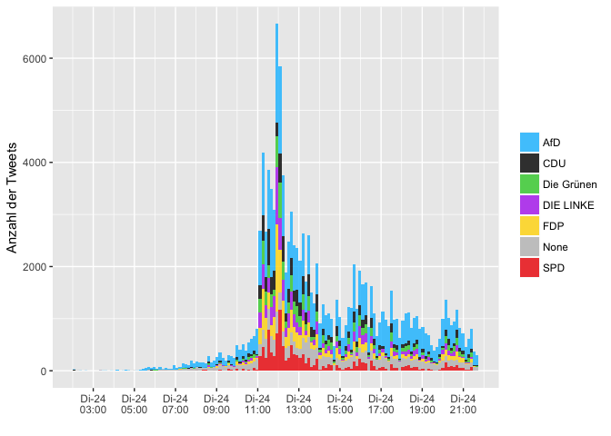

Von welchen Plattformen werden die meisten Tweets gesendet?
-----------------------------------------------------------

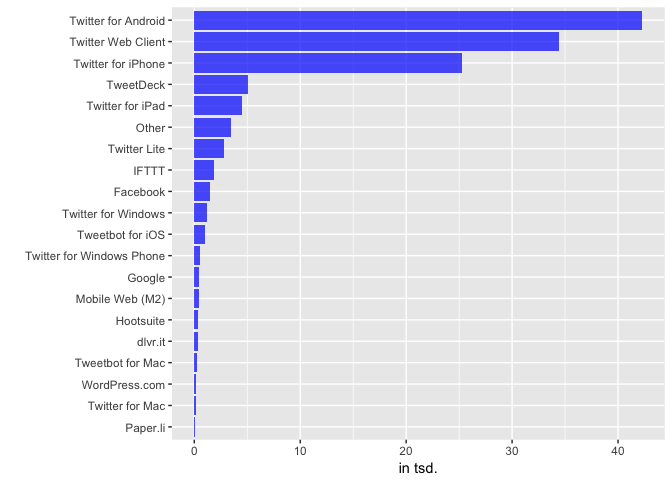

Wer retweeted wen?
------------------

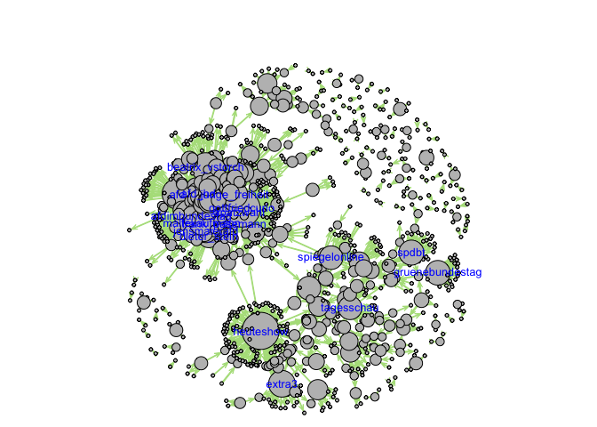

### Welche Tweets wurden am häufigsten Retweeted?

<!--html_preserve-->
<table class="gmisc_table" style="border-collapse: collapse; margin-top: 1em; margin-bottom: 1em;">
<thead>
<tr>
<th style="border-bottom: 1px solid grey; border-top: 2px solid grey;">
</th>
<th style="border-bottom: 1px solid grey; border-top: 2px solid grey; text-align: center;">
name
</th>
<th style="border-bottom: 1px solid grey; border-top: 2px solid grey; text-align: center;">
text
</th>
<th style="border-bottom: 1px solid grey; border-top: 2px solid grey; text-align: center;">
retweet\_count
</th>
</tr>
</thead>
<tbody>
<tr>
<td style="text-align: left;">
1
</td>
<td style="text-align: left;">
Götz Frömming
</td>
<td style="text-align: left;">
Mit der \#AfD-Fraktion zieht keine Truppe „Nazis“ in den Bundestag ein, und sie besteht auch nicht aus Dumpfbacken <https://t.co/NcuFZihEtO>
</td>
<td style="text-align: left;">
160
</td>
</tr>
<tr>
<td style="text-align: left;">
2
</td>
<td style="text-align: left;">
Wiebke Muhsal
</td>
<td style="text-align: left;">
Tja, was wäre ein Bundestag ohne KGE o Claudia Roth?😂Bei \#AfD werden die Leute übrigens demokratisch nach Leistung… <https://t.co/0aLr4EOMXY>
</td>
<td style="text-align: left;">
160
</td>
</tr>
<tr>
<td style="text-align: left;">
3
</td>
<td style="text-align: left;">
Jakob Augstein
</td>
<td style="text-align: left;">
Es geht los. Die Grünen wollen Merkel vor 4xBefragung im Jahr schützen. Wäre wohl zu anstrengend für die Kanzlerin. <https://t.co/XcjMHWWDQn>
</td>
<td style="text-align: left;">
157
</td>
</tr>
<tr>
<td style="text-align: left;">
4
</td>
<td style="text-align: left;">
Dr. Gottfried Curio
</td>
<td style="text-align: left;">
Bernd Baumann (\#AfD): 1933 und 2017 wurden die Geschäftsordnungen geändert, damit keine politischen Gegner Sitzunge… <https://t.co/bg5fvWIkpc>
</td>
<td style="text-align: left;">
156
</td>
</tr>
<tr>
<td style="text-align: left;">
5
</td>
<td style="text-align: left;">
Methone
</td>
<td style="text-align: left;">
SPD-Antrag abgelehnt: Jamaika-Fraktionen stimmen schon gemeinsam ab <https://t.co/2eAXhY6ujH> \#DieNachrichten
</td>
<td style="text-align: left;">
155
</td>
</tr>
<tr>
<td style="text-align: left;">
6
</td>
<td style="text-align: left;">
marvin
</td>
<td style="text-align: left;">
FDP ist eine Stunde wieder da und knallt mit der alten, geliebten Arroganz durch das Parlament, Herzlich Willkommen zurück!

\#bundestag
</td>
<td style="text-align: left;">
155
</td>
</tr>
<tr>
<td style="text-align: left;">
7
</td>
<td style="text-align: left;">
Hannes Kling
</td>
<td style="text-align: left;">
Die Rede des Alterspräsidenten beginnt mit einer Wahlwerbung der \#FDP. Respekt vor dem Amt haben die Liberalen wohl auch nicht. \#Bundestag
</td>
<td style="text-align: left;">
155
</td>
</tr>
<tr>
<td style="text-align: left;">
8
</td>
<td style="text-align: left;">
ZEIT ONLINE
</td>
<td style="text-align: left;">
Wolfgang Schäuble macht als neuer Bundestagspräsident vor, wie man mit der AfD umgehen sollte. <https://t.co/BSMny6caS9>
</td>
<td style="text-align: left;">
155
</td>
</tr>
<tr>
<td style="text-align: left;">
9
</td>
<td style="text-align: left;">
Junge Freiheit
</td>
<td style="text-align: left;">
Auch im dritten Wahlgang hat der \#AfD-Kandidat Glaser keine Mehrheit erhalten. \#bundestag &gt; <https://t.co/MUMWdHdEIv> <https://t.co/QCQQYQ7JGz>
</td>
<td style="text-align: left;">
155
</td>
</tr>
<tr>
<td style="border-bottom: 2px solid grey; text-align: left;">
10
</td>
<td style="border-bottom: 2px solid grey; text-align: left;">
SPIEGEL ONLINE
</td>
<td style="border-bottom: 2px solid grey; text-align: left;">
Wahl der Bundestags-Vizepräsidenten: \#AfD-Kandidat \#Glaser fällt durch. \#Bundestag <https://t.co/o1M87MI5xV>
</td>
<td style="border-bottom: 2px solid grey; text-align: left;">
155
</td>
</tr>
</tbody>
</table>
<!--/html_preserve-->
Über welche Partei wird am meisten getweeted?
---------------------------------------------

Anzahlt gesamte Tweets (ohne Retweets): <!--html_preserve-->
<table class="gmisc_table" style="border-collapse: collapse; margin-top: 1em; margin-bottom: 1em;">
<tbody>
<tr style="border-top: 2px solid grey;">
<td style="border-top: 2px solid grey; border-bottom: 2px solid grey; text-align: center;">
36052
</td>
</tr>
</tbody>
</table>
<!--/html_preserve-->
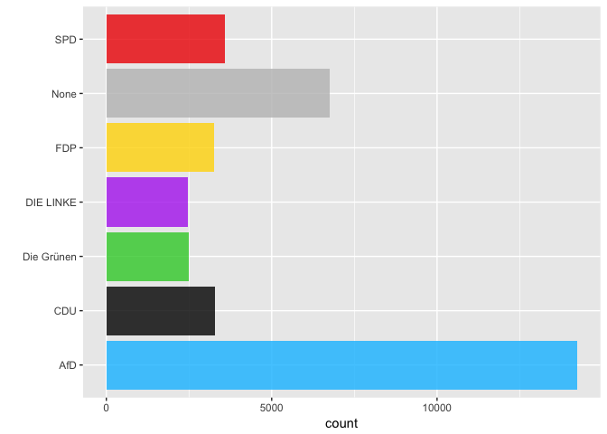

### Nur Nachrichten-Accounts

Anzahlt gesamte Tweets (ohne Retweets): <!--html_preserve-->
<table class="gmisc_table" style="border-collapse: collapse; margin-top: 1em; margin-bottom: 1em;">
<tbody>
<tr style="border-top: 2px solid grey;">
<td style="border-top: 2px solid grey; border-bottom: 2px solid grey; text-align: center;">
631
</td>
</tr>
</tbody>
</table>
<!--/html_preserve-->
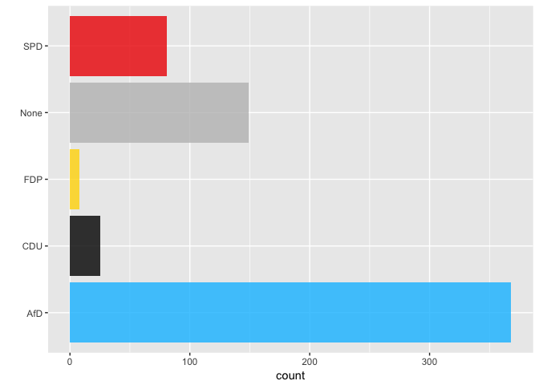

Term frequency
--------------

### Wordclouds

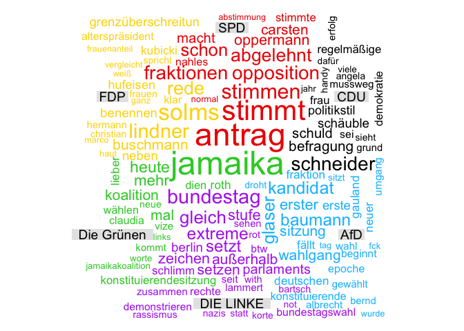

### Wordcloud (Tweets ohne Partei-Nennung)

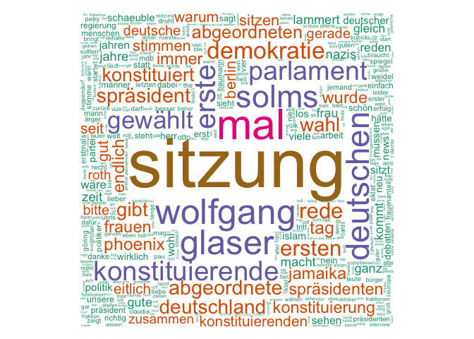

### inverse document frequency (tf-idf)

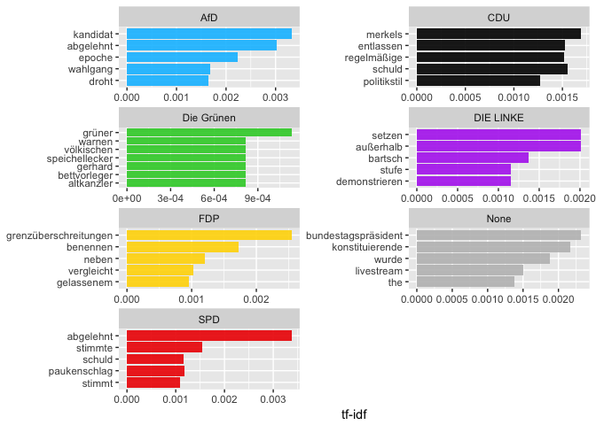

### Bigrams

Welche zwei Wörter tauchen am häufigsten gemeinsam auf?

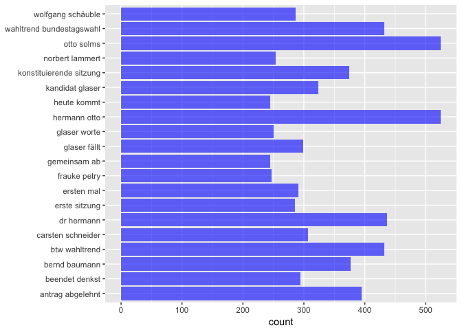

Sentiment Analyse
-----------------

#### Anzahl negativer Sentiment-Wörter

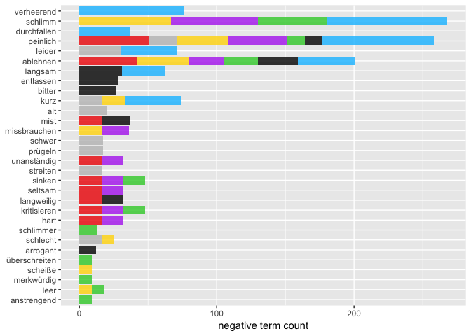

#### Anzahl positiver Sentiment-Wörter

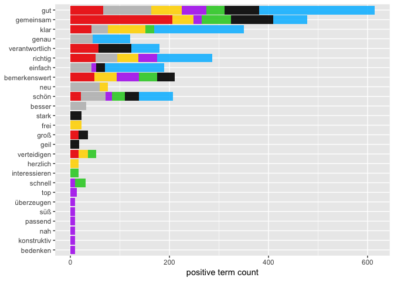

### Gewichtete Analyse

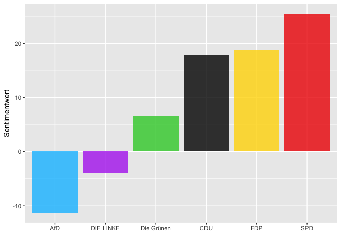

Was sind die Tweets mit den negativsten/positivsten Werten?
-----------------------------------------------------------

### CDU

<!--html_preserve-->
<table class="gmisc_table" style="border-collapse: collapse; margin-top: 1em; margin-bottom: 1em;">
<thead>
<tr>
<th style="border-bottom: 1px solid grey; border-top: 2px solid grey;">
</th>
<th style="border-bottom: 1px solid grey; border-top: 2px solid grey; text-align: center;">
partei
</th>
<th style="border-bottom: 1px solid grey; border-top: 2px solid grey; text-align: center;">
word
</th>
<th style="border-bottom: 1px solid grey; border-top: 2px solid grey; text-align: center;">
text
</th>
<th style="border-bottom: 1px solid grey; border-top: 2px solid grey; text-align: center;">
Wert
</th>
</tr>
</thead>
<tbody>
<tr>
<td style="text-align: left;">
1
</td>
<td style="text-align: left;">
CDU
</td>
<td style="text-align: left;">
schwach
</td>
<td style="text-align: left;">
Ach die CDU-Rede is doch schwach... So ein Mist. \#Bundestag
</td>
<td style="text-align: left;">
-0.9206
</td>
</tr>
<tr>
<td style="text-align: left;">
2
</td>
<td style="text-align: left;">
CDU
</td>
<td style="text-align: left;">
schämen
</td>
<td style="text-align: left;">
Die CDU sollte sich ob ihrer Rede in Grund und Boden schämen. Das zeigt, dass sie das Wahlergebnis nicht verstanden haben \#Bundestag
</td>
<td style="text-align: left;">
-0.893
</td>
</tr>
<tr>
<td style="text-align: left;">
3
</td>
<td style="text-align: left;">
CDU
</td>
<td style="text-align: left;">
schlecht
</td>
<td style="text-align: left;">
Der CDU-Mensch lobt das britische Modell mit der PM Befragung und will es dann nicht. Weil seine Chefin da schlecht aussieht... \#Bundestag
</td>
<td style="text-align: left;">
-0.7706
</td>
</tr>
<tr>
<td style="text-align: left;">
4
</td>
<td style="text-align: left;">
CDU
</td>
<td style="text-align: left;">
ablehnen
</td>
<td style="text-align: left;">
CDU und \#FDP jeweils nur mit Angriffen in der Rede, von Beiden kein Vorschlag, nur Ablehnen von Anträgen
=========================================================================================================

Fortschritt? Vergiss es \#bundestag
</td>
<td style="text-align: left;">
-0.6458
</td>
</tr>
<tr>
<td style="border-bottom: 2px solid grey; text-align: left;">
5
</td>
<td style="border-bottom: 2px solid grey; text-align: left;">
CDU
</td>
<td style="border-bottom: 2px solid grey; text-align: left;">
ablehnen
</td>
<td style="border-bottom: 2px solid grey; text-align: left;">
Linke will \#Glaser geschlossen ablehnen, CDU/CSU, SPD, FDP & Grüne überlassen Wahl den Abgeordneten. Dürfte spannen… <https://t.co/KG9RynMZC5>
</td>
<td style="border-bottom: 2px solid grey; text-align: left;">
-0.6458
</td>
</tr>
</tbody>
</table>
<!--/html_preserve-->
<!--html_preserve-->
<table class="gmisc_table" style="border-collapse: collapse; margin-top: 1em; margin-bottom: 1em;">
<thead>
<tr>
<th style="border-bottom: 1px solid grey; border-top: 2px solid grey;">
</th>
<th style="border-bottom: 1px solid grey; border-top: 2px solid grey; text-align: center;">
partei
</th>
<th style="border-bottom: 1px solid grey; border-top: 2px solid grey; text-align: center;">
word
</th>
<th style="border-bottom: 1px solid grey; border-top: 2px solid grey; text-align: center;">
text
</th>
<th style="border-bottom: 1px solid grey; border-top: 2px solid grey; text-align: center;">
Wert
</th>
</tr>
</thead>
<tbody>
<tr>
<td style="text-align: left;">
1
</td>
<td style="text-align: left;">
CDU
</td>
<td style="text-align: left;">
bewährt
</td>
<td style="text-align: left;">
Union: "Wir machen es so, wie es sich bewährt hat". Ja. Und dann fahren wir mit unseren Kutschen heim zu Frau & Kind. \#Bundestag
</td>
<td style="text-align: left;">
0.465
</td>
</tr>
<tr>
<td style="text-align: left;">
2
</td>
<td style="text-align: left;">
CDU
</td>
<td style="text-align: left;">
sympathisch
</td>
<td style="text-align: left;">
Schade, die einzige Abgeordnete von CDU/CSU im Bundestag, die ich sympathisch fand, ist jetzt weg ... <https://t.co/q3GSVbREaH>
</td>
<td style="text-align: left;">
0.4529
</td>
</tr>
<tr>
<td style="text-align: left;">
3
</td>
<td style="text-align: left;">
CDU
</td>
<td style="text-align: left;">
bemerkenswert
</td>
<td style="text-align: left;">
CDU, FDP, GRÜNE und Linke stimmen gegen AfD-Antrag. AfD und SPD stimmen dafür. Mehr als bemerkenswert. 😳 \#Bundestag <https://t.co/9IhFvwxbDR>
</td>
<td style="text-align: left;">
0.4515
</td>
</tr>
<tr>
<td style="text-align: left;">
4
</td>
<td style="text-align: left;">
CDU
</td>
<td style="text-align: left;">
sicher
</td>
<td style="text-align: left;">
Neuer Bundestag: CDU-Politiker Goering-Eckardts-fehlenden-Berufsabschluss. Ich bin mir sicher dass es mindestens 80% oder mehr daran fehlt
</td>
<td style="text-align: left;">
0.3733
</td>
</tr>
<tr>
<td style="border-bottom: 2px solid grey; text-align: left;">
5
</td>
<td style="border-bottom: 2px solid grey; text-align: left;">
CDU
</td>
<td style="border-bottom: 2px solid grey; text-align: left;">
helfen
</td>
<td style="border-bottom: 2px solid grey; text-align: left;">
Die \#Grünen helfen der Union jetzt schon beim Merkel Schutz vor der Opposition. Wie schnell die da umgeschaltet haben... \#bundestag
</td>
<td style="border-bottom: 2px solid grey; text-align: left;">
0.373
</td>
</tr>
</tbody>
</table>
<!--/html_preserve-->
### SPD

<!--html_preserve-->
<table class="gmisc_table" style="border-collapse: collapse; margin-top: 1em; margin-bottom: 1em;">
<thead>
<tr>
<th style="border-bottom: 1px solid grey; border-top: 2px solid grey;">
</th>
<th style="border-bottom: 1px solid grey; border-top: 2px solid grey; text-align: center;">
partei
</th>
<th style="border-bottom: 1px solid grey; border-top: 2px solid grey; text-align: center;">
word
</th>
<th style="border-bottom: 1px solid grey; border-top: 2px solid grey; text-align: center;">
text
</th>
<th style="border-bottom: 1px solid grey; border-top: 2px solid grey; text-align: center;">
Wert
</th>
</tr>
</thead>
<tbody>
<tr>
<td style="text-align: left;">
1
</td>
<td style="text-align: left;">
SPD
</td>
<td style="text-align: left;">
schlecht
</td>
<td style="text-align: left;">
\#KonstituierendeSitzung \#Bundestag Nicht schlecht, wie \#Jamaika hier schon funktioniert. Dass \#SPD und \#AfD zusammenstimmen? Autsch!!
</td>
<td style="text-align: left;">
-0.7706
</td>
</tr>
<tr>
<td style="text-align: left;">
2
</td>
<td style="text-align: left;">
SPD
</td>
<td style="text-align: left;">
ablehnen
</td>
<td style="text-align: left;">
Linke will \#Glaser geschlossen ablehnen, CDU/CSU, SPD, FDP & Grüne überlassen Wahl den Abgeordneten. Dürfte spannen… <https://t.co/KG9RynMZC5>
</td>
<td style="text-align: left;">
-0.6458
</td>
</tr>
<tr>
<td style="text-align: left;">
3
</td>
<td style="text-align: left;">
SPD
</td>
<td style="text-align: left;">
ablehnen
</td>
<td style="text-align: left;">
@spdbt Die SPD kann auch gar nicht die Vizepräsidentschaft irgendeiner Partei im Bundestag ablehnen.
</td>
<td style="text-align: left;">
-0.6458
</td>
</tr>
<tr>
<td style="text-align: left;">
4
</td>
<td style="text-align: left;">
SPD
</td>
<td style="text-align: left;">
ablehnen
</td>
<td style="text-align: left;">
396 Stimmen \#Oppermann hätte konsequent seine Wahl ablehnen müssen. So hätte \#SPD Ulla Schmidt für 2. Wahlgang nominieren können. \#Bundestag
</td>
<td style="text-align: left;">
-0.6458
</td>
</tr>
<tr>
<td style="border-bottom: 2px solid grey; text-align: left;">
5
</td>
<td style="border-bottom: 2px solid grey; text-align: left;">
SPD
</td>
<td style="border-bottom: 2px solid grey; text-align: left;">
ablehnen
</td>
<td style="border-bottom: 2px solid grey; text-align: left;">
Das Problem ist, wenn die \#AfD vorab ausspionierte \#SPD-Anträge stellt, die \#SPD \#ausnahmslos ablehnen will...sie merken schon \#Bundestag
</td>
<td style="border-bottom: 2px solid grey; text-align: left;">
-0.6458
</td>
</tr>
</tbody>
</table>
<!--/html_preserve-->
<!--html_preserve-->
<table class="gmisc_table" style="border-collapse: collapse; margin-top: 1em; margin-bottom: 1em;">
<thead>
<tr>
<th style="border-bottom: 1px solid grey; border-top: 2px solid grey;">
</th>
<th style="border-bottom: 1px solid grey; border-top: 2px solid grey; text-align: center;">
partei
</th>
<th style="border-bottom: 1px solid grey; border-top: 2px solid grey; text-align: center;">
word
</th>
<th style="border-bottom: 1px solid grey; border-top: 2px solid grey; text-align: center;">
text
</th>
<th style="border-bottom: 1px solid grey; border-top: 2px solid grey; text-align: center;">
Wert
</th>
</tr>
</thead>
<tbody>
<tr>
<td style="text-align: left;">
1
</td>
<td style="text-align: left;">
SPD
</td>
<td style="text-align: left;">
wunderbar
</td>
<td style="text-align: left;">
Mensch, die Grünen sind schon nahe der Koalitionsdisziplin. SPD-Bashing klappt bereits wunderbar. \#bundestag <https://t.co/EetukEwloV>
</td>
<td style="text-align: left;">
0.7234
</td>
</tr>
<tr>
<td style="text-align: left;">
2
</td>
<td style="text-align: left;">
SPD
</td>
<td style="text-align: left;">
spannend
</td>
<td style="text-align: left;">
Hört hört SPD ist Opposition und AfD legt auch los....ab sofort wird der \#Bundestag wieder spannend und „unterhaltsam“ 😜
</td>
<td style="text-align: left;">
0.7165
</td>
</tr>
<tr>
<td style="text-align: left;">
3
</td>
<td style="text-align: left;">
SPD
</td>
<td style="text-align: left;">
stolz
</td>
<td style="text-align: left;">
Die SPD hat über 40/% Frauen im Bundestag. Weit über Durchschnitt. Darauf sollten wir stolz sein. <https://t.co/qEWKOvwYgI>
</td>
<td style="text-align: left;">
0.5161
</td>
</tr>
<tr>
<td style="text-align: left;">
4
</td>
<td style="text-align: left;">
SPD
</td>
<td style="text-align: left;">
super
</td>
<td style="text-align: left;">
Die SPD stimmt einem Antrag der AfD im Bundestag zu. Das fängt ja super an.🙈
</td>
<td style="text-align: left;">
0.5012
</td>
</tr>
<tr>
<td style="border-bottom: 2px solid grey; text-align: left;">
5
</td>
<td style="border-bottom: 2px solid grey; text-align: left;">
SPD
</td>
<td style="border-bottom: 2px solid grey; text-align: left;">
super
</td>
<td style="border-bottom: 2px solid grey; text-align: left;">
SPD-Forderung nach Fragestunde mit Bundeskanzlerin ist super. Der \#Bundestag muss Ort der Debatte MIT der Regierung sein, nicht über sie.
</td>
<td style="border-bottom: 2px solid grey; text-align: left;">
0.5012
</td>
</tr>
</tbody>
</table>
<!--/html_preserve-->
### FDP

<!--html_preserve-->
<table class="gmisc_table" style="border-collapse: collapse; margin-top: 1em; margin-bottom: 1em;">
<thead>
<tr>
<th style="border-bottom: 1px solid grey; border-top: 2px solid grey;">
</th>
<th style="border-bottom: 1px solid grey; border-top: 2px solid grey; text-align: center;">
partei
</th>
<th style="border-bottom: 1px solid grey; border-top: 2px solid grey; text-align: center;">
word
</th>
<th style="border-bottom: 1px solid grey; border-top: 2px solid grey; text-align: center;">
text
</th>
<th style="border-bottom: 1px solid grey; border-top: 2px solid grey; text-align: center;">
Wert
</th>
</tr>
</thead>
<tbody>
<tr>
<td style="text-align: left;">
1
</td>
<td style="text-align: left;">
FDP
</td>
<td style="text-align: left;">
unnötig
</td>
<td style="text-align: left;">
Die Erwähnung der FDP in der „persönlichen Anmerkung“ von Solms war unnötig. Als ob die FDP ein RECHT auf Mitgliedschaft im Bundestag hätte…
</td>
<td style="text-align: left;">
-0.9463
</td>
</tr>
<tr>
<td style="text-align: left;">
2
</td>
<td style="text-align: left;">
FDP
</td>
<td style="text-align: left;">
schwach
</td>
<td style="text-align: left;">
Konstituierung \#Bundestag.Eröffnungsrede Inhaltlich schwach u.Politisch von FDP gefärbt.Chance eins historischen Mo… <https://t.co/sATzyjON7K>
</td>
<td style="text-align: left;">
-0.9206
</td>
</tr>
<tr>
<td style="text-align: left;">
3
</td>
<td style="text-align: left;">
FDP
</td>
<td style="text-align: left;">
schwach
</td>
<td style="text-align: left;">
Kommentar: Diese Rede von Solms war schwach. Zu viel FDP, zu wenig rhetorische Stärke \#Bundestag
</td>
<td style="text-align: left;">
-0.9206
</td>
</tr>
<tr>
<td style="text-align: left;">
4
</td>
<td style="text-align: left;">
FDP
</td>
<td style="text-align: left;">
schämen
</td>
<td style="text-align: left;">
Der zweite FDP-Redner. Das zweite mal muss man sich schämen. Was haben die in den letzten 4 Jahren gemacht? \#Bundestag
</td>
<td style="text-align: left;">
-0.893
</td>
</tr>
<tr>
<td style="border-bottom: 2px solid grey; text-align: left;">
5
</td>
<td style="border-bottom: 2px solid grey; text-align: left;">
FDP
</td>
<td style="border-bottom: 2px solid grey; text-align: left;">
schlecht
</td>
<td style="border-bottom: 2px solid grey; text-align: left;">
Oh, der FDPler spricht frei. Nicht schlecht. Macht die AfD zwar größer als sie ist, aber immerhin. Braucht Eier, im Bundestag frei zu reden.
</td>
<td style="border-bottom: 2px solid grey; text-align: left;">
-0.7706
</td>
</tr>
</tbody>
</table>
<!--/html_preserve-->
<!--html_preserve-->
<table class="gmisc_table" style="border-collapse: collapse; margin-top: 1em; margin-bottom: 1em;">
<thead>
<tr>
<th style="border-bottom: 1px solid grey; border-top: 2px solid grey;">
</th>
<th style="border-bottom: 1px solid grey; border-top: 2px solid grey; text-align: center;">
partei
</th>
<th style="border-bottom: 1px solid grey; border-top: 2px solid grey; text-align: center;">
word
</th>
<th style="border-bottom: 1px solid grey; border-top: 2px solid grey; text-align: center;">
text
</th>
<th style="border-bottom: 1px solid grey; border-top: 2px solid grey; text-align: center;">
Wert
</th>
</tr>
</thead>
<tbody>
<tr>
<td style="text-align: left;">
1
</td>
<td style="text-align: left;">
FDP
</td>
<td style="text-align: left;">
besonders
</td>
<td style="text-align: left;">
So ist es! RT @Mareicares: Irgendwie auch nochmal besonders schlimm, diese vielen Menschen rechts von der FDP sitzen zu sehen. \#Bundestag
</td>
<td style="text-align: left;">
0.5391
</td>
</tr>
<tr>
<td style="text-align: left;">
2
</td>
<td style="text-align: left;">
FDP
</td>
<td style="text-align: left;">
besonders
</td>
<td style="text-align: left;">
Irgendwie auch nochmal besonders schlimm, diese vielen Menschen rechts von der FDP sitzen zu sehen. \#Bundestag
</td>
<td style="text-align: left;">
0.5391
</td>
</tr>
<tr>
<td style="text-align: left;">
3
</td>
<td style="text-align: left;">
FDP
</td>
<td style="text-align: left;">
toll
</td>
<td style="text-align: left;">
Ahja jetzt wird die @spdde auch noch mit der \#AfD gleichgesetzt. Na wie „toll“, dass wir die \#FDP wieder im \#Bundestag sitzen haben. 🤦‍♂️
</td>
<td style="text-align: left;">
0.5066
</td>
</tr>
<tr>
<td style="text-align: left;">
4
</td>
<td style="text-align: left;">
FDP
</td>
<td style="text-align: left;">
super
</td>
<td style="text-align: left;">
Super Rede ohne Skript durch die \#fdp \#Bundestag - und gleich mal die \#grünen hinterher 😆
</td>
<td style="text-align: left;">
0.5012
</td>
</tr>
<tr>
<td style="border-bottom: 2px solid grey; text-align: left;">
5
</td>
<td style="border-bottom: 2px solid grey; text-align: left;">
FDP
</td>
<td style="border-bottom: 2px solid grey; text-align: left;">
bemerkenswert
</td>
<td style="border-bottom: 2px solid grey; text-align: left;">
CDU, FDP, GRÜNE und Linke stimmen gegen AfD-Antrag. AfD und SPD stimmen dafür. Mehr als bemerkenswert. 😳 \#Bundestag <https://t.co/9IhFvwxbDR>
</td>
<td style="border-bottom: 2px solid grey; text-align: left;">
0.4515
</td>
</tr>
</tbody>
</table>
<!--/html_preserve-->
### AfD

<!--html_preserve-->
<table class="gmisc_table" style="border-collapse: collapse; margin-top: 1em; margin-bottom: 1em;">
<thead>
<tr>
<th style="border-bottom: 1px solid grey; border-top: 2px solid grey;">
</th>
<th style="border-bottom: 1px solid grey; border-top: 2px solid grey; text-align: center;">
partei
</th>
<th style="border-bottom: 1px solid grey; border-top: 2px solid grey; text-align: center;">
word
</th>
<th style="border-bottom: 1px solid grey; border-top: 2px solid grey; text-align: center;">
text
</th>
<th style="border-bottom: 1px solid grey; border-top: 2px solid grey; text-align: center;">
Wert
</th>
</tr>
</thead>
<tbody>
<tr>
<td style="text-align: left;">
1
</td>
<td style="text-align: left;">
AfD
</td>
<td style="text-align: left;">
schwach
</td>
<td style="text-align: left;">
\#Bundestag AfD ist wahrscheinlich relativ schwach in den Ausschüssen... Das ist mal ein Satz der mir heute ein wenig gefällt 😌
</td>
<td style="text-align: left;">
-0.9206
</td>
</tr>
<tr>
<td style="text-align: left;">
2
</td>
<td style="text-align: left;">
AfD
</td>
<td style="text-align: left;">
unfair
</td>
<td style="text-align: left;">
Neulich bei der AfD im Bundestag:

Es ist unfair, wenn ein Kandidat, der sich zu einer Wahl stellt, nicht gewählt… <https://t.co/TeexmNKiWL>
</td>
<td style="text-align: left;">
-0.8827
</td>
</tr>
<tr>
<td style="text-align: left;">
3
</td>
<td style="text-align: left;">
AfD
</td>
<td style="text-align: left;">
brechen
</td>
<td style="text-align: left;">
Frauke \#Petry und Mario \#Mieruch brechen mit der \#AfD. Wie sollen die anderen im \#Bundestag jetzt mit ihnen umgehen? <https://t.co/IwbWGblvcq>
</td>
<td style="text-align: left;">
-0.7991
</td>
</tr>
<tr>
<td style="text-align: left;">
4
</td>
<td style="text-align: left;">
AfD
</td>
<td style="text-align: left;">
brechen
</td>
<td style="text-align: left;">
Widerlicher, antideutscher Umgang im \#Bundestag gg \#AFD. Sowas wird dann „Demokratie“ genannt. Man möchte brechen. <https://t.co/5V8T5DyUdY>
</td>
<td style="text-align: left;">
-0.7991
</td>
</tr>
<tr>
<td style="border-bottom: 2px solid grey; text-align: left;">
5
</td>
<td style="border-bottom: 2px solid grey; text-align: left;">
AfD
</td>
<td style="border-bottom: 2px solid grey; text-align: left;">
brechen
</td>
<td style="border-bottom: 2px solid grey; text-align: left;">
Ich könnte brechen, wenn ich Weidel und Gauland im Bundestag!!!!!!!!!! sitzen sehe 😭😭😭😭\#Bundestag
</td>
<td style="border-bottom: 2px solid grey; text-align: left;">
-0.7991
</td>
</tr>
</tbody>
</table>
<!--/html_preserve-->
<!--html_preserve-->
<table class="gmisc_table" style="border-collapse: collapse; margin-top: 1em; margin-bottom: 1em;">
<thead>
<tr>
<th style="border-bottom: 1px solid grey; border-top: 2px solid grey;">
</th>
<th style="border-bottom: 1px solid grey; border-top: 2px solid grey; text-align: center;">
partei
</th>
<th style="border-bottom: 1px solid grey; border-top: 2px solid grey; text-align: center;">
word
</th>
<th style="border-bottom: 1px solid grey; border-top: 2px solid grey; text-align: center;">
text
</th>
<th style="border-bottom: 1px solid grey; border-top: 2px solid grey; text-align: center;">
Wert
</th>
</tr>
</thead>
<tbody>
<tr>
<td style="text-align: left;">
1
</td>
<td style="text-align: left;">
AfD
</td>
<td style="text-align: left;">
perfekt
</td>
<td style="text-align: left;">
Der Eklat ist perfekt: AfD Abgeordneter wird nicht gewählt, aus Prinzip, nicht aus Wissen! \#Bundestag
</td>
<td style="text-align: left;">
0.7299
</td>
</tr>
<tr>
<td style="text-align: left;">
2
</td>
<td style="text-align: left;">
AfD
</td>
<td style="text-align: left;">
wunderbar
</td>
<td style="text-align: left;">
Bundestag
=========

Die \#AfD wurde von den Systemsklaven wunderbar in den Mittelpunkt gerückt Die Angst geht um bei den Durchschnittspolitikern
</td>
<td style="text-align: left;">
0.7234
</td>
</tr>
<tr>
<td style="text-align: left;">
3
</td>
<td style="text-align: left;">
AfD
</td>
<td style="text-align: left;">
spannend
</td>
<td style="text-align: left;">
Hört hört SPD ist Opposition und AfD legt auch los....ab sofort wird der \#Bundestag wieder spannend und „unterhaltsam“ 😜
</td>
<td style="text-align: left;">
0.7165
</td>
</tr>
<tr>
<td style="text-align: left;">
4
</td>
<td style="text-align: left;">
AfD
</td>
<td style="text-align: left;">
spannend
</td>
<td style="text-align: left;">
Jetzt schon spannend zu sehen, an welchen Stellen die \#AfD klatscht...oder eben auch nicht. \#Bundestag \#btw17 \#noafd
</td>
<td style="text-align: left;">
0.7165
</td>
</tr>
<tr>
<td style="border-bottom: 2px solid grey; text-align: left;">
5
</td>
<td style="border-bottom: 2px solid grey; text-align: left;">
AfD
</td>
<td style="border-bottom: 2px solid grey; text-align: left;">
hervorragend
</td>
<td style="border-bottom: 2px solid grey; text-align: left;">
Ich finde es fantastisch, dass die \#AfD sich in ihrer Opferrolle einfindet. Hervorragend. \#Bundestag
</td>
<td style="border-bottom: 2px solid grey; text-align: left;">
0.5891
</td>
</tr>
</tbody>
</table>
<!--/html_preserve-->
### Die Grünen

<!--html_preserve-->
<table class="gmisc_table" style="border-collapse: collapse; margin-top: 1em; margin-bottom: 1em;">
<thead>
<tr>
<th style="border-bottom: 1px solid grey; border-top: 2px solid grey;">
</th>
<th style="border-bottom: 1px solid grey; border-top: 2px solid grey; text-align: center;">
partei
</th>
<th style="border-bottom: 1px solid grey; border-top: 2px solid grey; text-align: center;">
word
</th>
<th style="border-bottom: 1px solid grey; border-top: 2px solid grey; text-align: center;">
text
</th>
<th style="border-bottom: 1px solid grey; border-top: 2px solid grey; text-align: center;">
Wert
</th>
</tr>
</thead>
<tbody>
<tr>
<td style="text-align: left;">
1
</td>
<td style="text-align: left;">
Die Grünen
</td>
<td style="text-align: left;">
schlecht
</td>
<td style="text-align: left;">
Die \#Grünen sagen Sie finden die Idee des Antrages nicht schlecht, stimmen aber dagegen Schon wie eine richtige Regierungspartei \#Bundestag
</td>
<td style="text-align: left;">
-0.7706
</td>
</tr>
<tr>
<td style="text-align: left;">
2
</td>
<td style="text-align: left;">
Die Grünen
</td>
<td style="text-align: left;">
schlimmer
</td>
<td style="text-align: left;">
@darfmanfragen \#Bundestag Schlimmer noch, die \#grüne Pfeife (\#Deutschland verrecke) schafft es auch im 1. Durchgang… <https://t.co/KRoRSzciwR>
</td>
<td style="text-align: left;">
-0.6494
</td>
</tr>
<tr>
<td style="text-align: left;">
3
</td>
<td style="text-align: left;">
Die Grünen
</td>
<td style="text-align: left;">
schlimmer
</td>
<td style="text-align: left;">
\#AfD \#Bundestag schlimmer und respektloser vor dem Hohen Haus als beim Einzug der ökopopulistischen \#Grünen 1983 ge… <https://t.co/qDm8sCz2t2>
</td>
<td style="text-align: left;">
-0.6494
</td>
</tr>
<tr>
<td style="text-align: left;">
4
</td>
<td style="text-align: left;">
Die Grünen
</td>
<td style="text-align: left;">
ablehnen
</td>
<td style="text-align: left;">
Linke will \#Glaser geschlossen ablehnen, CDU/CSU, SPD, FDP & Grüne überlassen Wahl den Abgeordneten. Dürfte spannen… <https://t.co/KG9RynMZC5>
</td>
<td style="text-align: left;">
-0.6458
</td>
</tr>
<tr>
<td style="border-bottom: 2px solid grey; text-align: left;">
5
</td>
<td style="border-bottom: 2px solid grey; text-align: left;">
Die Grünen
</td>
<td style="border-bottom: 2px solid grey; text-align: left;">
erbärmlich
</td>
<td style="border-bottom: 2px solid grey; text-align: left;">
Da finden sich die Jamaikaner schon zusammen. Peinlich wie die \#Grünen sich jetzt schon verkaufen. Ganz erbärmlich! \#bundestag \#bt
</td>
<td style="border-bottom: 2px solid grey; text-align: left;">
-0.4796
</td>
</tr>
</tbody>
</table>
<!--/html_preserve-->
<!--html_preserve-->
<table class="gmisc_table" style="border-collapse: collapse; margin-top: 1em; margin-bottom: 1em;">
<thead>
<tr>
<th style="border-bottom: 1px solid grey; border-top: 2px solid grey;">
</th>
<th style="border-bottom: 1px solid grey; border-top: 2px solid grey; text-align: center;">
partei
</th>
<th style="border-bottom: 1px solid grey; border-top: 2px solid grey; text-align: center;">
word
</th>
<th style="border-bottom: 1px solid grey; border-top: 2px solid grey; text-align: center;">
text
</th>
<th style="border-bottom: 1px solid grey; border-top: 2px solid grey; text-align: center;">
Wert
</th>
</tr>
</thead>
<tbody>
<tr>
<td style="text-align: left;">
1
</td>
<td style="text-align: left;">
Die Grünen
</td>
<td style="text-align: left;">
wunderbar
</td>
<td style="text-align: left;">
Mensch, die Grünen sind schon nahe der Koalitionsdisziplin. SPD-Bashing klappt bereits wunderbar. \#bundestag <https://t.co/EetukEwloV>
</td>
<td style="text-align: left;">
0.7234
</td>
</tr>
<tr>
<td style="text-align: left;">
2
</td>
<td style="text-align: left;">
Die Grünen
</td>
<td style="text-align: left;">
super
</td>
<td style="text-align: left;">
Super Rede ohne Skript durch die \#fdp \#Bundestag - und gleich mal die \#grünen hinterher 😆
</td>
<td style="text-align: left;">
0.5012
</td>
</tr>
<tr>
<td style="text-align: left;">
3
</td>
<td style="text-align: left;">
Die Grünen
</td>
<td style="text-align: left;">
bemerkenswert
</td>
<td style="text-align: left;">
CDU, FDP, GRÜNE und Linke stimmen gegen AfD-Antrag. AfD und SPD stimmen dafür. Mehr als bemerkenswert. 😳 \#Bundestag <https://t.co/9IhFvwxbDR>
</td>
<td style="text-align: left;">
0.4515
</td>
</tr>
<tr>
<td style="text-align: left;">
4
</td>
<td style="text-align: left;">
Die Grünen
</td>
<td style="text-align: left;">
helfen
</td>
<td style="text-align: left;">
Die \#Grünen helfen der Union jetzt schon beim Merkel Schutz vor der Opposition. Wie schnell die da umgeschaltet haben... \#bundestag
</td>
<td style="text-align: left;">
0.373
</td>
</tr>
<tr>
<td style="border-bottom: 2px solid grey; text-align: left;">
5
</td>
<td style="border-bottom: 2px solid grey; text-align: left;">
Die Grünen
</td>
<td style="border-bottom: 2px solid grey; text-align: left;">
gut
</td>
<td style="border-bottom: 2px solid grey; text-align: left;">
\#Bundestag \#Jamaika Die \#Merkel Steigbügelhalter und 10% Parteien \#FDP & \#Grüne interessieren sich nur noch die gut… <https://t.co/6send9SHsh>
</td>
<td style="border-bottom: 2px solid grey; text-align: left;">
0.3716
</td>
</tr>
</tbody>
</table>
<!--/html_preserve-->
### DIE LINKE

<!--html_preserve-->
<table class="gmisc_table" style="border-collapse: collapse; margin-top: 1em; margin-bottom: 1em;">
<thead>
<tr>
<th style="border-bottom: 1px solid grey; border-top: 2px solid grey;">
</th>
<th style="border-bottom: 1px solid grey; border-top: 2px solid grey; text-align: center;">
partei
</th>
<th style="border-bottom: 1px solid grey; border-top: 2px solid grey; text-align: center;">
word
</th>
<th style="border-bottom: 1px solid grey; border-top: 2px solid grey; text-align: center;">
text
</th>
<th style="border-bottom: 1px solid grey; border-top: 2px solid grey; text-align: center;">
Wert
</th>
</tr>
</thead>
<tbody>
<tr>
<td style="text-align: left;">
1
</td>
<td style="text-align: left;">
DIE LINKE
</td>
<td style="text-align: left;">
bedenklich
</td>
<td style="text-align: left;">
Die \#Linke findet es bedenklich, daß in den Pausen im \#bundestag alle Frauentoiletten unbesetzt sind. 😂😂😂🤡🤡🤡 <https://t.co/Eqd51YEyTP>
</td>
<td style="text-align: left;">
-0.7701
</td>
</tr>
<tr>
<td style="text-align: left;">
2
</td>
<td style="text-align: left;">
DIE LINKE
</td>
<td style="text-align: left;">
falsch
</td>
<td style="text-align: left;">
@MiriamOzen Die Aussage des Herrn Postel ist grundsätzlich falsch. Nazis sind Linke und die sitzen schon länger im Bundestag.
</td>
<td style="text-align: left;">
-0.7618
</td>
</tr>
<tr>
<td style="text-align: left;">
3
</td>
<td style="text-align: left;">
DIE LINKE
</td>
<td style="text-align: left;">
ablehnen
</td>
<td style="text-align: left;">
Linke will \#Glaser geschlossen ablehnen, CDU/CSU, SPD, FDP & Grüne überlassen Wahl den Abgeordneten. Dürfte spannen… <https://t.co/KG9RynMZC5>
</td>
<td style="text-align: left;">
-0.6458
</td>
</tr>
<tr>
<td style="text-align: left;">
4
</td>
<td style="text-align: left;">
DIE LINKE
</td>
<td style="text-align: left;">
zerstört
</td>
<td style="text-align: left;">
AfD klatscht bei jemanden von den Linken. Mein Weltbild ist zerstört. \#Bundestag
</td>
<td style="text-align: left;">
-0.503
</td>
</tr>
<tr>
<td style="border-bottom: 2px solid grey; text-align: left;">
5
</td>
<td style="border-bottom: 2px solid grey; text-align: left;">
DIE LINKE
</td>
<td style="border-bottom: 2px solid grey; text-align: left;">
leider
</td>
<td style="border-bottom: 2px solid grey; text-align: left;">
Als Demokrat muss ich, selbst als Linker, der \#AfD leider recht geben: Alterspräsident des \#Bundestag sollte der Älteste sein.
</td>
<td style="border-bottom: 2px solid grey; text-align: left;">
-0.4787
</td>
</tr>
</tbody>
</table>
<!--/html_preserve-->
<!--html_preserve-->
<table class="gmisc_table" style="border-collapse: collapse; margin-top: 1em; margin-bottom: 1em;">
<thead>
<tr>
<th style="border-bottom: 1px solid grey; border-top: 2px solid grey;">
</th>
<th style="border-bottom: 1px solid grey; border-top: 2px solid grey; text-align: center;">
partei
</th>
<th style="border-bottom: 1px solid grey; border-top: 2px solid grey; text-align: center;">
word
</th>
<th style="border-bottom: 1px solid grey; border-top: 2px solid grey; text-align: center;">
text
</th>
<th style="border-bottom: 1px solid grey; border-top: 2px solid grey; text-align: center;">
Wert
</th>
</tr>
</thead>
<tbody>
<tr>
<td style="text-align: left;">
1
</td>
<td style="text-align: left;">
DIE LINKE
</td>
<td style="text-align: left;">
freundlich
</td>
<td style="text-align: left;">
@Korallenherz sehr freundlich wie du mit mir umgehst ... einige von den Linken haben auch zugestimmt… <https://t.co/mI8s1tiufl>
</td>
<td style="text-align: left;">
0.6022
</td>
</tr>
<tr>
<td style="text-align: left;">
2
</td>
<td style="text-align: left;">
DIE LINKE
</td>
<td style="text-align: left;">
stolz
</td>
<td style="text-align: left;">
Wir sind alle wahnsinnig stolz auf Dich, liebe @PetraPauMaHe! 😊 👏👏👏🥇🥇🥇 \#Linksfraktion \#dieLinke \#Bundestag <https://t.co/I04zH7wKTv>
</td>
<td style="text-align: left;">
0.5161
</td>
</tr>
<tr>
<td style="text-align: left;">
3
</td>
<td style="text-align: left;">
DIE LINKE
</td>
<td style="text-align: left;">
herrlich
</td>
<td style="text-align: left;">
@APatzwahl @AfD Herrlich, dann haben die linken INAZIs mal wieder von ihren Verwandte​n, den NAZIs kopiert, wie öft… <https://t.co/Y2efAcnVZ8>
</td>
<td style="text-align: left;">
0.4821
</td>
</tr>
<tr>
<td style="text-align: left;">
4
</td>
<td style="text-align: left;">
DIE LINKE
</td>
<td style="text-align: left;">
bemerkenswert
</td>
<td style="text-align: left;">
CDU, FDP, GRÜNE und Linke stimmen gegen AfD-Antrag. AfD und SPD stimmen dafür. Mehr als bemerkenswert. 😳 \#Bundestag <https://t.co/9IhFvwxbDR>
</td>
<td style="text-align: left;">
0.4515
</td>
</tr>
<tr>
<td style="border-bottom: 2px solid grey; text-align: left;">
5
</td>
<td style="border-bottom: 2px solid grey; text-align: left;">
DIE LINKE
</td>
<td style="border-bottom: 2px solid grey; text-align: left;">
bemerkenswert
</td>
<td style="border-bottom: 2px solid grey; text-align: left;">
Es redet,ja wer redet den da von der FDP eigentlich?Naja egal,jedenfalls bekommt er Applaus von den Linken.Das ist bemerkenswert. \#BUNDESTAG
</td>
<td style="border-bottom: 2px solid grey; text-align: left;">
0.4515
</td>
</tr>
</tbody>
</table>
<!--/html_preserve-->
### Tweets ohne explizite Partei-Nennung

<!--html_preserve-->
<table class="gmisc_table" style="border-collapse: collapse; margin-top: 1em; margin-bottom: 1em;">
<thead>
<tr>
<th style="border-bottom: 1px solid grey; border-top: 2px solid grey;">
</th>
<th style="border-bottom: 1px solid grey; border-top: 2px solid grey; text-align: center;">
partei
</th>
<th style="border-bottom: 1px solid grey; border-top: 2px solid grey; text-align: center;">
word
</th>
<th style="border-bottom: 1px solid grey; border-top: 2px solid grey; text-align: center;">
text
</th>
<th style="border-bottom: 1px solid grey; border-top: 2px solid grey; text-align: center;">
Wert
</th>
</tr>
</thead>
<tbody>
<tr>
<td style="text-align: left;">
1
</td>
<td style="text-align: left;">
None
</td>
<td style="text-align: left;">
unnötig
</td>
<td style="text-align: left;">
Richtig unnötig so giganorm viele Abgeordnete. Die Hälfte würde auch reichen. \#Bundestag
</td>
<td style="text-align: left;">
-0.9463
</td>
</tr>
<tr>
<td style="text-align: left;">
2
</td>
<td style="text-align: left;">
None
</td>
<td style="text-align: left;">
unnötig
</td>
<td style="text-align: left;">
Völlig korrekt, jemanden, der Islam die Religionsfreiheit abspricht,nicht zum \#bundestag Vizepräsidenten zu wählen.Aber zieml. unnötig (1/2)
</td>
<td style="text-align: left;">
-0.9463
</td>
</tr>
<tr>
<td style="text-align: left;">
3
</td>
<td style="text-align: left;">
None
</td>
<td style="text-align: left;">
schwach
</td>
<td style="text-align: left;">
@DerLenzMdB die Verpflegung im Bundestag heute war echt schwach. Ein kleiner Stand für die Besucher 🙄 aber Käfer wird bestimmt profitieren 😂
</td>
<td style="text-align: left;">
-0.9206
</td>
</tr>
<tr>
<td style="text-align: left;">
4
</td>
<td style="text-align: left;">
None
</td>
<td style="text-align: left;">
schwach
</td>
<td style="text-align: left;">
Enttäuschende Konstituierung. Solms war schwach, taktische Anträge & Debatte zum Abschalten. Das muss besser werden. Von allen. \#Bundestag
</td>
<td style="text-align: left;">
-0.9206
</td>
</tr>
<tr>
<td style="border-bottom: 2px solid grey; text-align: left;">
5
</td>
<td style="border-bottom: 2px solid grey; text-align: left;">
None
</td>
<td style="border-bottom: 2px solid grey; text-align: left;">
schwach
</td>
<td style="border-bottom: 2px solid grey; text-align: left;">
Lammert vermisst man qualitativ bei den Reden jetzt schon. Solms schon wirklich schwach bisher. \#bundestag
</td>
<td style="border-bottom: 2px solid grey; text-align: left;">
-0.9206
</td>
</tr>
</tbody>
</table>
<!--/html_preserve-->
<!--html_preserve-->
<table class="gmisc_table" style="border-collapse: collapse; margin-top: 1em; margin-bottom: 1em;">
<thead>
<tr>
<th style="border-bottom: 1px solid grey; border-top: 2px solid grey;">
</th>
<th style="border-bottom: 1px solid grey; border-top: 2px solid grey; text-align: center;">
partei
</th>
<th style="border-bottom: 1px solid grey; border-top: 2px solid grey; text-align: center;">
word
</th>
<th style="border-bottom: 1px solid grey; border-top: 2px solid grey; text-align: center;">
text
</th>
<th style="border-bottom: 1px solid grey; border-top: 2px solid grey; text-align: center;">
Wert
</th>
</tr>
</thead>
<tbody>
<tr>
<td style="text-align: left;">
1
</td>
<td style="text-align: left;">
None
</td>
<td style="text-align: left;">
gelungen
</td>
<td style="text-align: left;">
\#Bundestag Endlich mal etwas Abwechslung. Baumanns Auftritt war sehr gelungen!
</td>
<td style="text-align: left;">
1
</td>
</tr>
<tr>
<td style="text-align: left;">
2
</td>
<td style="text-align: left;">
None
</td>
<td style="text-align: left;">
perfekt
</td>
<td style="text-align: left;">
TagderBibliotheken passt übrigens perfekt zu \#Bundestag:
=========================================================

Jede Menge Wissen, aber alles muss man selbst rausfinden.
</td>
<td style="text-align: left;">
0.7299
</td>
</tr>
<tr>
<td style="text-align: left;">
3
</td>
<td style="text-align: left;">
None
</td>
<td style="text-align: left;">
perfekt
</td>
<td style="text-align: left;">
13 witzige Tweets, die die erste Sitzung des neuen Bundestages perfekt zusammenfassen <https://t.co/K9gINsy76I> \#bundestag
</td>
<td style="text-align: left;">
0.7299
</td>
</tr>
<tr>
<td style="text-align: left;">
4
</td>
<td style="text-align: left;">
None
</td>
<td style="text-align: left;">
perfekt
</td>
<td style="text-align: left;">
Neues Jobangebot für \#Solms. Die Rolle als "Professor Hastig" in der \#Sesamstraße. Passt perfekt \#Bundestag
</td>
<td style="text-align: left;">
0.7299
</td>
</tr>
<tr>
<td style="border-bottom: 2px solid grey; text-align: left;">
5
</td>
<td style="border-bottom: 2px solid grey; text-align: left;">
None
</td>
<td style="border-bottom: 2px solid grey; text-align: left;">
perfekt
</td>
<td style="border-bottom: 2px solid grey; text-align: left;">
@CWRoehl Perfekt ist halt nicht so einfach 😁 Ich denke, dass das ein wesentlich lebhafterer \#Bundestag wird. Ich bin gespannt!😊
</td>
<td style="border-bottom: 2px solid grey; text-align: left;">
0.7299
</td>
</tr>
</tbody>
</table>
<!--/html_preserve-->
