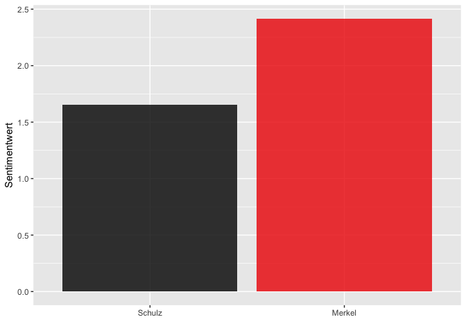
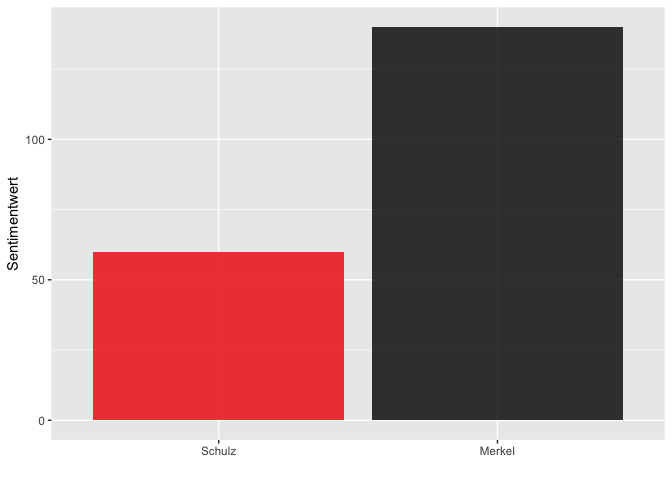

TV Duell
================
Franzi Löw
2017-10-06

Was wurde am 03.September 2017 im Verlauf des TV Duells zwischen Angela Merkel und Martin Schulz getwittert?

Erläuterungen zu den einzelnen Analyseschritten finden Sie [hier](https://franziloew.github.io/politsentiment/)

Anzahl gesamter Tweets:

<!--html_preserve-->
<table class="gmisc_table" style="border-collapse: collapse; margin-top: 1em; margin-bottom: 1em;">
<tbody>
<tr style="border-top: 2px solid grey;">
<td style="border-top: 2px solid grey; border-bottom: 2px solid grey; text-align: center;">
50039
</td>
</tr>
</tbody>
</table>
<!--/html_preserve-->
### Anzahl der gesamten Tweets nach Datum

### Von welchen Plattformen werden die meisten Tweets gesendet?

## 1. Wer retweeted wen?

### Welche Tweets wurden am häufigsten Retweeted?

<!--html_preserve-->
<table class="gmisc_table" style="border-collapse: collapse; margin-top: 1em; margin-bottom: 1em;">
<thead>
<tr>
<th style="border-bottom: 1px solid grey; border-top: 2px solid grey;">
</th>
<th style="border-bottom: 1px solid grey; border-top: 2px solid grey; text-align: center;">
name
</th>
<th style="border-bottom: 1px solid grey; border-top: 2px solid grey; text-align: center;">
text
</th>
<th style="border-bottom: 1px solid grey; border-top: 2px solid grey; text-align: center;">
retweet\_count
</th>
</tr>
</thead>
<tbody>
<tr>
<td style="text-align: left;">
1
</td>
<td style="text-align: left;">
Heiko Maas
</td>
<td style="text-align: left;">
Frau Merkel hätte mich jederzeit anrufen können. Meine Nummer hat sie. Stattdessen hat sie die MFK ohne Gegenargument blockiert. \#tvduell
</td>
<td style="text-align: left;">
551
</td>
</tr>
<tr>
<td style="text-align: left;">
2
</td>
<td style="text-align: left;">
WELT
</td>
<td style="text-align: left;">
Merkel über Zitat zur Pkw-Maut – \#Faktencheck zum TV-Duell <https://t.co/VPJLMFPauR> \#tvduell \#btw17 <https://t.co/XmDFmprllW>
</td>
<td style="text-align: left;">
501
</td>
</tr>
<tr>
<td style="text-align: left;">
3
</td>
<td style="text-align: left;">
Jan Böhmermann
</td>
<td style="text-align: left;">
Merkel leitet die Runde super. Schulz scheint auch zufrieden. \#tvduell
</td>
<td style="text-align: left;">
494
</td>
</tr>
<tr>
<td style="text-align: left;">
4
</td>
<td style="text-align: left;">
extra3
</td>
<td style="text-align: left;">
Moderatoren: "Jetzt kommen Ja/Nein-Fragen". Merkel: "Vielleicht." \#TVDuell
</td>
<td style="text-align: left;">
450
</td>
</tr>
<tr>
<td style="text-align: left;">
5
</td>
<td style="text-align: left;">
Nico Semsrott
</td>
<td style="text-align: left;">
Worüber reden die seit 70 Minuten? Hat denn keiner in der SPD oder CDU Kontakt zu einem Menschen, der in Deutschland lebt? \#tvduell
</td>
<td style="text-align: left;">
371
</td>
</tr>
<tr>
<td style="border-bottom: 2px solid grey; text-align: left;">
6
</td>
<td style="border-bottom: 2px solid grey; text-align: left;">
BÜNDNIS90/DIE GRÜNEN
</td>
<td style="border-bottom: 2px solid grey; text-align: left;">
Übrigens: Wer Merkel wählt, wählt \#Dobrindt. \#tvduell <https://t.co/mQlh2U3f0u>
</td>
<td style="border-bottom: 2px solid grey; text-align: left;">
371
</td>
</tr>
</tbody>
</table>
<!--/html_preserve-->
## 2. Über wen wird am meisten getweeted?

#### Nachrichtendienste (privat und öffentlich-rechtlich)

Anzahl gesamter Tweets:

<!--html_preserve-->
<table class="gmisc_table" style="border-collapse: collapse; margin-top: 1em; margin-bottom: 1em;">
<tbody>
<tr style="border-top: 2px solid grey;">
<td style="border-top: 2px solid grey; border-bottom: 2px solid grey; text-align: center;">
146
</td>
</tr>
</tbody>
</table>
<!--/html_preserve-->

#### Andere User-Accounts

Anzahl gesamter Tweets:

<!--html_preserve-->
<table class="gmisc_table" style="border-collapse: collapse; margin-top: 1em; margin-bottom: 1em;">
<tbody>
<tr style="border-top: 2px solid grey;">
<td style="border-top: 2px solid grey; border-bottom: 2px solid grey; text-align: center;">
19615
</td>
</tr>
</tbody>
</table>
<!--/html_preserve-->

## 4. Wordclouds

#### Nachrichtendienste

#### Andere User-Accounts

## 5. term frequency - inverse document frequency (tf-idf)

#### Nachrichtendienste

#### Andere User-Accounts

## 6. Sentiment Analyse

#### Nachrichtenportale

##### Anzahl negativer Sentiment-Wörter

##### Anzahl positiver Sentiment-Wörter

#### Gewichtete Analyse

#### Was sind die Tweets mit den negativsten/positivsten Werten?

#### Merkel

<!--html_preserve-->
<table class="gmisc_table" style="border-collapse: collapse; margin-top: 1em; margin-bottom: 1em;">
<thead>
<tr>
<th style="border-bottom: 1px solid grey; border-top: 2px solid grey;">
</th>
<th style="border-bottom: 1px solid grey; border-top: 2px solid grey; text-align: center;">
candidate
</th>
<th style="border-bottom: 1px solid grey; border-top: 2px solid grey; text-align: center;">
word
</th>
<th style="border-bottom: 1px solid grey; border-top: 2px solid grey; text-align: center;">
text
</th>
<th style="border-bottom: 1px solid grey; border-top: 2px solid grey; text-align: center;">
Wert
</th>
</tr>
</thead>
<tbody>
<tr>
<td style="text-align: left;">
1
</td>
<td style="text-align: left;">
Merkel
</td>
<td style="text-align: left;">
schlecht
</td>
<td style="text-align: left;">
Ex-Kanzler Schröder geht zum russischen Ölkonzern Rosneft. Wie finden das Merkel und Schulz? "Schlecht." \#TVDuell… <https://t.co/PjbrQntNrE>
</td>
<td style="text-align: left;">
-0.7706
</td>
</tr>
<tr>
<td style="text-align: left;">
2
</td>
<td style="text-align: left;">
Merkel
</td>
<td style="text-align: left;">
klein
</td>
<td style="text-align: left;">
Manchmal gelingt es Schulz, Merkel aus der Reserve zu locken. Sonst viel Klein-Klein. @MariamLau1 über das \#tvduell: <https://t.co/NNccYejAjI>
</td>
<td style="text-align: left;">
-0.2715
</td>
</tr>
<tr>
<td style="text-align: left;">
3
</td>
<td style="text-align: left;">
Merkel
</td>
<td style="text-align: left;">
klein
</td>
<td style="text-align: left;">
Manchmal gelingt es Schulz, Merkel aus der Reserve zu locken. Sonst viel Klein-Klein. @MariamLau1 über das \#tvduell: <https://t.co/NNccYejAjI>
</td>
<td style="text-align: left;">
-0.2715
</td>
</tr>
<tr>
<td style="text-align: left;">
4
</td>
<td style="text-align: left;">
Merkel
</td>
<td style="text-align: left;">
skeptisch
</td>
<td style="text-align: left;">
Merkel im \#TVDuell: "Klares Nein zu Rente mit 70" - Schulz reagiert skeptisch und erinnert an Kehrtwende der Kanzlerin bei der Maut
</td>
<td style="text-align: left;">
-0.1985
</td>
</tr>
<tr>
<td style="text-align: left;">
5
</td>
<td style="text-align: left;">
Merkel
</td>
<td style="text-align: left;">
hart
</td>
<td style="text-align: left;">
Wer hart das \#tvduell gewonnen? Die Meinungsforscher sagen: Merkel. Warum wir damit trotzdem vorsichtig sein müssen: <https://t.co/1zO1y3W5A4>
</td>
<td style="text-align: left;">
-0.1483
</td>
</tr>
<tr>
<td style="border-bottom: 2px solid grey; text-align: left;">
6
</td>
<td style="border-bottom: 2px solid grey; text-align: left;">
Merkel
</td>
<td style="border-bottom: 2px solid grey; text-align: left;">
vergeblich
</td>
<td style="border-bottom: 2px solid grey; text-align: left;">
\#TVDuell: @MartinSchulz müht sich vergeblich gegen Merkel \#btw17 <https://t.co/Gn02E148kv>
</td>
<td style="border-bottom: 2px solid grey; text-align: left;">
-0.0048
</td>
</tr>
</tbody>
</table>
<!--/html_preserve-->
<!--html_preserve-->
<table class="gmisc_table" style="border-collapse: collapse; margin-top: 1em; margin-bottom: 1em;">
<thead>
<tr>
<th style="border-bottom: 1px solid grey; border-top: 2px solid grey;">
</th>
<th style="border-bottom: 1px solid grey; border-top: 2px solid grey; text-align: center;">
candidate
</th>
<th style="border-bottom: 1px solid grey; border-top: 2px solid grey; text-align: center;">
word
</th>
<th style="border-bottom: 1px solid grey; border-top: 2px solid grey; text-align: center;">
text
</th>
<th style="border-bottom: 1px solid grey; border-top: 2px solid grey; text-align: center;">
Wert
</th>
</tr>
</thead>
<tbody>
<tr>
<td style="text-align: left;">
1
</td>
<td style="text-align: left;">
Merkel
</td>
<td style="text-align: left;">
toll
</td>
<td style="text-align: left;">
"War super. War ganz toll!" Reaktionen auf das \#TVDuell zwischen Merkel und Schulz. <https://t.co/py3rkhNG4N>… <https://t.co/BFKsrB4RI8>
</td>
<td style="text-align: left;">
0.5066
</td>
</tr>
<tr>
<td style="text-align: left;">
2
</td>
<td style="text-align: left;">
Merkel
</td>
<td style="text-align: left;">
toll
</td>
<td style="text-align: left;">
"Finde ich ganz, ganz toll, Frau Merkel": Schulz verrät mit einem Satz, warum er das Duell verloren hat \#TVDuell <https://t.co/kTMovyymWk>
</td>
<td style="text-align: left;">
0.5066
</td>
</tr>
<tr>
<td style="text-align: left;">
3
</td>
<td style="text-align: left;">
Merkel
</td>
<td style="text-align: left;">
toll
</td>
<td style="text-align: left;">
Merkel: "Die Rente mit 70 kommt nicht" Schulz: "Toll, à la bonheur, Frau Merkel" \#TVDuell
</td>
<td style="text-align: left;">
0.5066
</td>
</tr>
<tr>
<td style="text-align: left;">
4
</td>
<td style="text-align: left;">
Merkel
</td>
<td style="text-align: left;">
toll
</td>
<td style="text-align: left;">
“Finde ich toll, Frau Merkel.” Hat Schulz vorher niemand verraten, dass er Unterschiede betonen sollte, nicht Gemeinsamkeiten? \#TVDuell
</td>
<td style="text-align: left;">
0.5066
</td>
</tr>
<tr>
<td style="text-align: left;">
5
</td>
<td style="text-align: left;">
Merkel
</td>
<td style="text-align: left;">
super
</td>
<td style="text-align: left;">
"War super. War ganz toll!" Reaktionen auf das \#TVDuell zwischen Merkel und Schulz. <https://t.co/py3rkhNG4N>… <https://t.co/BFKsrB4RI8>
</td>
<td style="text-align: left;">
0.5012
</td>
</tr>
<tr>
<td style="border-bottom: 2px solid grey; text-align: left;">
6
</td>
<td style="border-bottom: 2px solid grey; text-align: left;">
Merkel
</td>
<td style="border-bottom: 2px solid grey; text-align: left;">
sicher
</td>
<td style="border-bottom: 2px solid grey; text-align: left;">
Netzreaktionen zum \#TVDuell: „Bin mir sicher: \#Schulz wählt am Ende \#Merkel“ \#btw17 <https://t.co/TMoqcJeVHF> <https://t.co/t9daiqIOSu>
</td>
<td style="border-bottom: 2px solid grey; text-align: left;">
0.3733
</td>
</tr>
</tbody>
</table>
<!--/html_preserve-->
#### Schulz

<!--html_preserve-->
<table class="gmisc_table" style="border-collapse: collapse; margin-top: 1em; margin-bottom: 1em;">
<thead>
<tr>
<th style="border-bottom: 1px solid grey; border-top: 2px solid grey;">
</th>
<th style="border-bottom: 1px solid grey; border-top: 2px solid grey; text-align: center;">
candidate
</th>
<th style="border-bottom: 1px solid grey; border-top: 2px solid grey; text-align: center;">
word
</th>
<th style="border-bottom: 1px solid grey; border-top: 2px solid grey; text-align: center;">
text
</th>
<th style="border-bottom: 1px solid grey; border-top: 2px solid grey; text-align: center;">
Wert
</th>
</tr>
</thead>
<tbody>
<tr>
<td style="text-align: left;">
1
</td>
<td style="text-align: left;">
Schulz
</td>
<td style="text-align: left;">
schlecht
</td>
<td style="text-align: left;">
Ex-Kanzler Schröder geht zum russischen Ölkonzern Rosneft. Wie finden das Merkel und Schulz? "Schlecht." \#TVDuell… <https://t.co/PjbrQntNrE>
</td>
<td style="text-align: left;">
-0.7706
</td>
</tr>
<tr>
<td style="text-align: left;">
2
</td>
<td style="text-align: left;">
Schulz
</td>
<td style="text-align: left;">
klein
</td>
<td style="text-align: left;">
Manchmal gelingt es Schulz, Merkel aus der Reserve zu locken. Sonst viel Klein-Klein. @MariamLau1 über das \#tvduell: <https://t.co/NNccYejAjI>
</td>
<td style="text-align: left;">
-0.2715
</td>
</tr>
<tr>
<td style="text-align: left;">
3
</td>
<td style="text-align: left;">
Schulz
</td>
<td style="text-align: left;">
klein
</td>
<td style="text-align: left;">
Manchmal gelingt es Schulz, Merkel aus der Reserve zu locken. Sonst viel Klein-Klein. @MariamLau1 über das \#tvduell: <https://t.co/NNccYejAjI>
</td>
<td style="text-align: left;">
-0.2715
</td>
</tr>
<tr>
<td style="text-align: left;">
4
</td>
<td style="text-align: left;">
Schulz
</td>
<td style="text-align: left;">
skeptisch
</td>
<td style="text-align: left;">
Merkel im \#TVDuell: "Klares Nein zu Rente mit 70" - Schulz reagiert skeptisch und erinnert an Kehrtwende der Kanzlerin bei der Maut
</td>
<td style="text-align: left;">
-0.1985
</td>
</tr>
<tr>
<td style="text-align: left;">
5
</td>
<td style="text-align: left;">
Schulz
</td>
<td style="text-align: left;">
beenden
</td>
<td style="text-align: left;">
Schulz will EU-Beitrittsverhandlungen mit Türkei beenden <https://t.co/lXkgQmmyvW> \#tvduell \#Merkel \#Schulz \#BTW17
</td>
<td style="text-align: left;">
-0.0603
</td>
</tr>
<tr>
<td style="border-bottom: 2px solid grey; text-align: left;">
6
</td>
<td style="border-bottom: 2px solid grey; text-align: left;">
Schulz
</td>
<td style="border-bottom: 2px solid grey; text-align: left;">
besser
</td>
<td style="border-bottom: 2px solid grey; text-align: left;">
Flüchtlingspolitik, Türkei, Rente, diese Themen bestimmen das \#TVDuell. Viele sehen \#Schulz besser als erwartet. <https://t.co/tfr5OdUt5d>
</td>
<td style="border-bottom: 2px solid grey; text-align: left;">
0.004
</td>
</tr>
</tbody>
</table>
<!--/html_preserve-->
<!--html_preserve-->
<table class="gmisc_table" style="border-collapse: collapse; margin-top: 1em; margin-bottom: 1em;">
<thead>
<tr>
<th style="border-bottom: 1px solid grey; border-top: 2px solid grey;">
</th>
<th style="border-bottom: 1px solid grey; border-top: 2px solid grey; text-align: center;">
candidate
</th>
<th style="border-bottom: 1px solid grey; border-top: 2px solid grey; text-align: center;">
word
</th>
<th style="border-bottom: 1px solid grey; border-top: 2px solid grey; text-align: center;">
text
</th>
<th style="border-bottom: 1px solid grey; border-top: 2px solid grey; text-align: center;">
Wert
</th>
</tr>
</thead>
<tbody>
<tr>
<td style="text-align: left;">
1
</td>
<td style="text-align: left;">
Schulz
</td>
<td style="text-align: left;">
toll
</td>
<td style="text-align: left;">
"War super. War ganz toll!" Reaktionen auf das \#TVDuell zwischen Merkel und Schulz. <https://t.co/py3rkhNG4N>… <https://t.co/BFKsrB4RI8>
</td>
<td style="text-align: left;">
0.5066
</td>
</tr>
<tr>
<td style="text-align: left;">
2
</td>
<td style="text-align: left;">
Schulz
</td>
<td style="text-align: left;">
toll
</td>
<td style="text-align: left;">
"Finde ich ganz, ganz toll, Frau Merkel": Schulz verrät mit einem Satz, warum er das Duell verloren hat \#TVDuell <https://t.co/kTMovyymWk>
</td>
<td style="text-align: left;">
0.5066
</td>
</tr>
<tr>
<td style="text-align: left;">
3
</td>
<td style="text-align: left;">
Schulz
</td>
<td style="text-align: left;">
toll
</td>
<td style="text-align: left;">
Merkel: "Die Rente mit 70 kommt nicht" Schulz: "Toll, à la bonheur, Frau Merkel" \#TVDuell
</td>
<td style="text-align: left;">
0.5066
</td>
</tr>
<tr>
<td style="text-align: left;">
4
</td>
<td style="text-align: left;">
Schulz
</td>
<td style="text-align: left;">
toll
</td>
<td style="text-align: left;">
“Finde ich toll, Frau Merkel.” Hat Schulz vorher niemand verraten, dass er Unterschiede betonen sollte, nicht Gemeinsamkeiten? \#TVDuell
</td>
<td style="text-align: left;">
0.5066
</td>
</tr>
<tr>
<td style="text-align: left;">
5
</td>
<td style="text-align: left;">
Schulz
</td>
<td style="text-align: left;">
super
</td>
<td style="text-align: left;">
"War super. War ganz toll!" Reaktionen auf das \#TVDuell zwischen Merkel und Schulz. <https://t.co/py3rkhNG4N>… <https://t.co/BFKsrB4RI8>
</td>
<td style="text-align: left;">
0.5012
</td>
</tr>
<tr>
<td style="border-bottom: 2px solid grey; text-align: left;">
6
</td>
<td style="border-bottom: 2px solid grey; text-align: left;">
Schulz
</td>
<td style="border-bottom: 2px solid grey; text-align: left;">
sicher
</td>
<td style="border-bottom: 2px solid grey; text-align: left;">
Netzreaktionen zum \#TVDuell: „Bin mir sicher: \#Schulz wählt am Ende \#Merkel“ \#btw17 <https://t.co/TMoqcJeVHF> <https://t.co/t9daiqIOSu>
</td>
<td style="border-bottom: 2px solid grey; text-align: left;">
0.3733
</td>
</tr>
</tbody>
</table>
<!--/html_preserve-->
### Andere User-Accounts

#### Ungewichtete Analyse

##### Anzahl negativer Sentiment-Wörter

##### Anzahl positiver Sentiment-Wörter

#### Gewichtete Analyse

#### Was sind die Tweets mit den negativsten/positivsten Werten?

#### Merkel

<!--html_preserve-->
<table class="gmisc_table" style="border-collapse: collapse; margin-top: 1em; margin-bottom: 1em;">
<thead>
<tr>
<th style="border-bottom: 1px solid grey; border-top: 2px solid grey;">
</th>
<th style="border-bottom: 1px solid grey; border-top: 2px solid grey; text-align: center;">
candidate
</th>
<th style="border-bottom: 1px solid grey; border-top: 2px solid grey; text-align: center;">
word
</th>
<th style="border-bottom: 1px solid grey; border-top: 2px solid grey; text-align: center;">
text
</th>
<th style="border-bottom: 1px solid grey; border-top: 2px solid grey; text-align: center;">
Wert
</th>
</tr>
</thead>
<tbody>
<tr>
<td style="text-align: left;">
1
</td>
<td style="text-align: left;">
Merkel
</td>
<td style="text-align: left;">
unnötig
</td>
<td style="text-align: left;">
\#TVDuell "Wenn ich Kanzler werde" ist Futur, hätte gereicht. "Werden würde", Konjunktiv unnötig, wirkt unsicher. Merkel weiß es auch nicht
</td>
<td style="text-align: left;">
-0.9463
</td>
</tr>
<tr>
<td style="text-align: left;">
2
</td>
<td style="text-align: left;">
Merkel
</td>
<td style="text-align: left;">
unnötig
</td>
<td style="text-align: left;">
TVDuell
=======

Merkel war insgesamt auch etwas angriffslustiger, am Ende ist \#Schulz sogar ein bisschen sauer geworden.
=========================================================================================================

War aber auch unnötig.
</td>
<td style="text-align: left;">
-0.9463
</td>
</tr>
<tr>
<td style="text-align: left;">
3
</td>
<td style="text-align: left;">
Merkel
</td>
<td style="text-align: left;">
schwach
</td>
<td style="text-align: left;">
@ManuelaSchwesig @spdde @MartinSchulz Beide schwach. Für \#Merkel reicht das. \#TVDuell
</td>
<td style="text-align: left;">
-0.9206
</td>
</tr>
<tr>
<td style="text-align: left;">
4
</td>
<td style="text-align: left;">
Merkel
</td>
<td style="text-align: left;">
schwach
</td>
<td style="text-align: left;">
Merkel war schwach, aber \#Schulz war unter aller Sau, ein Plauderi. \#TVDuell geht 7:3 ans Merkel. Niemand mag Martin rufen.
=============================================================================================================================

@MartinSchulz
</td>
<td style="text-align: left;">
-0.9206
</td>
</tr>
<tr>
<td style="text-align: left;">
5
</td>
<td style="text-align: left;">
Merkel
</td>
<td style="text-align: left;">
schwach
</td>
<td style="text-align: left;">
unpopularopinion ich fand Schulz argumentativ tatsächlich besser als Merkel.
============================================================================

Trotzdem beide schwach. \#annewill \#TVDuell
</td>
<td style="text-align: left;">
-0.9206
</td>
</tr>
<tr>
<td style="border-bottom: 2px solid grey; text-align: left;">
6
</td>
<td style="border-bottom: 2px solid grey; text-align: left;">
Merkel
</td>
<td style="border-bottom: 2px solid grey; text-align: left;">
schwach
</td>
<td style="border-bottom: 2px solid grey; text-align: left;">
Fand ja beide Kandidaten schwach, jedoch hat Schulz meiner Meinung nach wenigstens klare Position bezogen im Gegensatz zu Merkel \#TVDuell
</td>
<td style="border-bottom: 2px solid grey; text-align: left;">
-0.9206
</td>
</tr>
</tbody>
</table>
<!--/html_preserve-->
<!--html_preserve-->
<table class="gmisc_table" style="border-collapse: collapse; margin-top: 1em; margin-bottom: 1em;">
<thead>
<tr>
<th style="border-bottom: 1px solid grey; border-top: 2px solid grey;">
</th>
<th style="border-bottom: 1px solid grey; border-top: 2px solid grey; text-align: center;">
candidate
</th>
<th style="border-bottom: 1px solid grey; border-top: 2px solid grey; text-align: center;">
word
</th>
<th style="border-bottom: 1px solid grey; border-top: 2px solid grey; text-align: center;">
text
</th>
<th style="border-bottom: 1px solid grey; border-top: 2px solid grey; text-align: center;">
Wert
</th>
</tr>
</thead>
<tbody>
<tr>
<td style="text-align: left;">
1
</td>
<td style="text-align: left;">
Merkel
</td>
<td style="text-align: left;">
gelungen
</td>
<td style="text-align: left;">
Rundes Schlußwort von Merkel. Das war gelungen. \#TVDuell
</td>
<td style="text-align: left;">
1
</td>
</tr>
<tr>
<td style="text-align: left;">
2
</td>
<td style="text-align: left;">
Merkel
</td>
<td style="text-align: left;">
perfekt
</td>
<td style="text-align: left;">
\#Schulz fasst das \#TVDuell perfekt zusammen. \#MerkelvsSchulz <https://t.co/PuNmiggAX3>
</td>
<td style="text-align: left;">
0.7299
</td>
</tr>
<tr>
<td style="text-align: left;">
3
</td>
<td style="text-align: left;">
Merkel
</td>
<td style="text-align: left;">
perfekt
</td>
<td style="text-align: left;">
\#Merkel perfekt. Souverän, kompetent, glaubwürdig \#tvduell
</td>
<td style="text-align: left;">
0.7299
</td>
</tr>
<tr>
<td style="text-align: left;">
4
</td>
<td style="text-align: left;">
Merkel
</td>
<td style="text-align: left;">
perfekt
</td>
<td style="text-align: left;">
Sie gleichen sich Perfekt aus! 💙\#GroKoRomance \#TvDuell \#SchMerkel
</td>
<td style="text-align: left;">
0.7299
</td>
</tr>
<tr>
<td style="text-align: left;">
5
</td>
<td style="text-align: left;">
Merkel
</td>
<td style="text-align: left;">
perfekt
</td>
<td style="text-align: left;">
Großer Trommelwirbel: \#Merkel und \#Schulz gleichen sich als Koalitionäre perfekt in der Redezeit aus! \#TVDuell Schlimm das Ganze!
</td>
<td style="text-align: left;">
0.7299
</td>
</tr>
<tr>
<td style="border-bottom: 2px solid grey; text-align: left;">
6
</td>
<td style="border-bottom: 2px solid grey; text-align: left;">
Merkel
</td>
<td style="border-bottom: 2px solid grey; text-align: left;">
perfekt
</td>
<td style="border-bottom: 2px solid grey; text-align: left;">
Merkels Augen passen perfekt zu ihrem Jackett. Punkt. Ende. Ausschlaggebend. \#tvduell
</td>
<td style="border-bottom: 2px solid grey; text-align: left;">
0.7299
</td>
</tr>
</tbody>
</table>
<!--/html_preserve-->
#### Schulz

<!--html_preserve-->
<table class="gmisc_table" style="border-collapse: collapse; margin-top: 1em; margin-bottom: 1em;">
<thead>
<tr>
<th style="border-bottom: 1px solid grey; border-top: 2px solid grey;">
</th>
<th style="border-bottom: 1px solid grey; border-top: 2px solid grey; text-align: center;">
candidate
</th>
<th style="border-bottom: 1px solid grey; border-top: 2px solid grey; text-align: center;">
word
</th>
<th style="border-bottom: 1px solid grey; border-top: 2px solid grey; text-align: center;">
text
</th>
<th style="border-bottom: 1px solid grey; border-top: 2px solid grey; text-align: center;">
Wert
</th>
</tr>
</thead>
<tbody>
<tr>
<td style="text-align: left;">
1
</td>
<td style="text-align: left;">
Schulz
</td>
<td style="text-align: left;">
unnötig
</td>
<td style="text-align: left;">
TVDuell
=======

Merkel war insgesamt auch etwas angriffslustiger, am Ende ist \#Schulz sogar ein bisschen sauer geworden.
=========================================================================================================

War aber auch unnötig.
</td>
<td style="text-align: left;">
-0.9463
</td>
</tr>
<tr>
<td style="text-align: left;">
2
</td>
<td style="text-align: left;">
Schulz
</td>
<td style="text-align: left;">
unnötig
</td>
<td style="text-align: left;">
Spätestens jetzt hab ich absolut keine Lust auf einen Bundeskanzler Schulz mehr. Peinlicher und unnötig pathetischer Auftritt beim \#TVDuell
</td>
<td style="text-align: left;">
-0.9463
</td>
</tr>
<tr>
<td style="text-align: left;">
3
</td>
<td style="text-align: left;">
Schulz
</td>
<td style="text-align: left;">
unnötig
</td>
<td style="text-align: left;">
Schulz ist peinlich...ganz ehrlich. Das mit Sachsen Anhalt war gerade super unnötig! \#tvduell
</td>
<td style="text-align: left;">
-0.9463
</td>
</tr>
<tr>
<td style="text-align: left;">
4
</td>
<td style="text-align: left;">
Schulz
</td>
<td style="text-align: left;">
schwach
</td>
<td style="text-align: left;">
Merkel war schwach, aber \#Schulz war unter aller Sau, ein Plauderi. \#TVDuell geht 7:3 ans Merkel. Niemand mag Martin rufen.
=============================================================================================================================

@MartinSchulz
</td>
<td style="text-align: left;">
-0.9206
</td>
</tr>
<tr>
<td style="text-align: left;">
5
</td>
<td style="text-align: left;">
Schulz
</td>
<td style="text-align: left;">
schwach
</td>
<td style="text-align: left;">
unpopularopinion ich fand Schulz argumentativ tatsächlich besser als Merkel.
============================================================================

Trotzdem beide schwach. \#annewill \#TVDuell
</td>
<td style="text-align: left;">
-0.9206
</td>
</tr>
<tr>
<td style="border-bottom: 2px solid grey; text-align: left;">
6
</td>
<td style="border-bottom: 2px solid grey; text-align: left;">
Schulz
</td>
<td style="border-bottom: 2px solid grey; text-align: left;">
schwach
</td>
<td style="border-bottom: 2px solid grey; text-align: left;">
Fand ja beide Kandidaten schwach, jedoch hat Schulz meiner Meinung nach wenigstens klare Position bezogen im Gegensatz zu Merkel \#TVDuell
</td>
<td style="border-bottom: 2px solid grey; text-align: left;">
-0.9206
</td>
</tr>
</tbody>
</table>
<!--/html_preserve-->
<!--html_preserve-->
<table class="gmisc_table" style="border-collapse: collapse; margin-top: 1em; margin-bottom: 1em;">
<thead>
<tr>
<th style="border-bottom: 1px solid grey; border-top: 2px solid grey;">
</th>
<th style="border-bottom: 1px solid grey; border-top: 2px solid grey; text-align: center;">
candidate
</th>
<th style="border-bottom: 1px solid grey; border-top: 2px solid grey; text-align: center;">
word
</th>
<th style="border-bottom: 1px solid grey; border-top: 2px solid grey; text-align: center;">
text
</th>
<th style="border-bottom: 1px solid grey; border-top: 2px solid grey; text-align: center;">
Wert
</th>
</tr>
</thead>
<tbody>
<tr>
<td style="text-align: left;">
1
</td>
<td style="text-align: left;">
Schulz
</td>
<td style="text-align: left;">
perfekt
</td>
<td style="text-align: left;">
\#Schulz fasst das \#TVDuell perfekt zusammen. \#MerkelvsSchulz <https://t.co/PuNmiggAX3>
</td>
<td style="text-align: left;">
0.7299
</td>
</tr>
<tr>
<td style="text-align: left;">
2
</td>
<td style="text-align: left;">
Schulz
</td>
<td style="text-align: left;">
perfekt
</td>
<td style="text-align: left;">
\#tvduell Martin Schulz hat gerockt. Schlusswort war perfekt und hat alles mögliche getroffen.
</td>
<td style="text-align: left;">
0.7299
</td>
</tr>
<tr>
<td style="text-align: left;">
3
</td>
<td style="text-align: left;">
Schulz
</td>
<td style="text-align: left;">
perfekt
</td>
<td style="text-align: left;">
Das Schlusswort von \#Schulz perfekt frei vorgetragen \#TVDuell
</td>
<td style="text-align: left;">
0.7299
</td>
</tr>
<tr>
<td style="text-align: left;">
4
</td>
<td style="text-align: left;">
Schulz
</td>
<td style="text-align: left;">
perfekt
</td>
<td style="text-align: left;">
Das letzte Wort von Herrn \#Schulz war einfach perfekt! 😊❤

\#tvduell
</td>
<td style="text-align: left;">
0.7299
</td>
</tr>
<tr>
<td style="text-align: left;">
5
</td>
<td style="text-align: left;">
Schulz
</td>
<td style="text-align: left;">
perfekt
</td>
<td style="text-align: left;">
Großer Trommelwirbel: \#Merkel und \#Schulz gleichen sich als Koalitionäre perfekt in der Redezeit aus! \#TVDuell Schlimm das Ganze!
</td>
<td style="text-align: left;">
0.7299
</td>
</tr>
<tr>
<td style="border-bottom: 2px solid grey; text-align: left;">
6
</td>
<td style="border-bottom: 2px solid grey; text-align: left;">
Schulz
</td>
<td style="border-bottom: 2px solid grey; text-align: left;">
perfekt
</td>
<td style="border-bottom: 2px solid grey; text-align: left;">
Zustimmendes Nicken von \#Schulz, jetzt ist die Lovestory perfekt! \#tvduell
</td>
<td style="border-bottom: 2px solid grey; text-align: left;">
0.7299
</td>
</tr>
</tbody>
</table>
<!--/html_preserve-->
