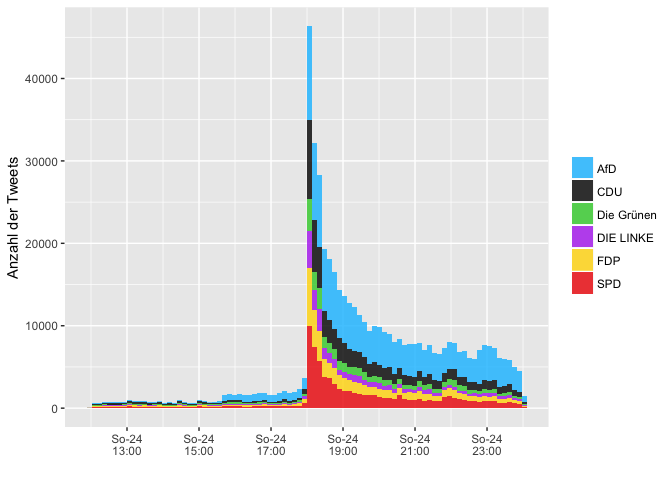
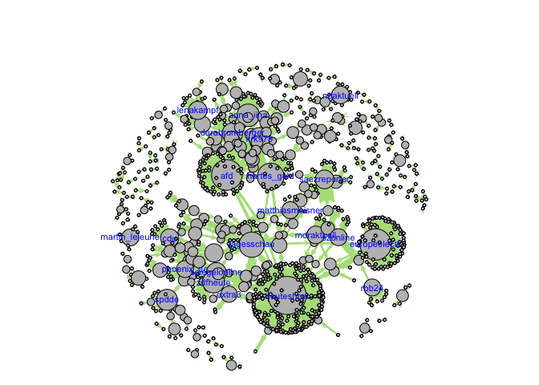
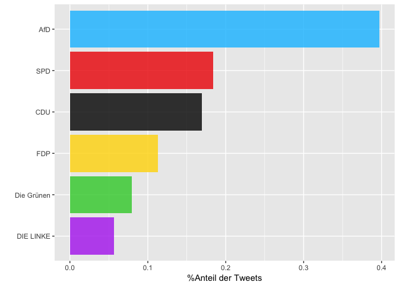
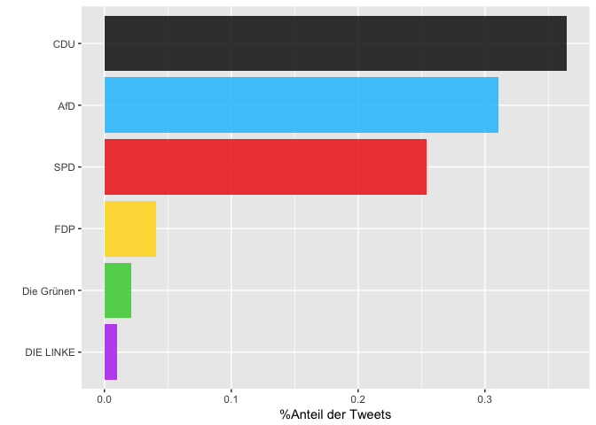
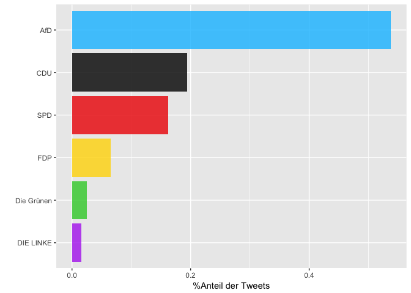
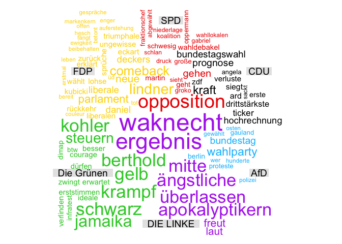
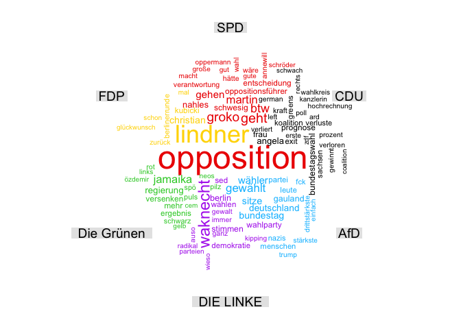
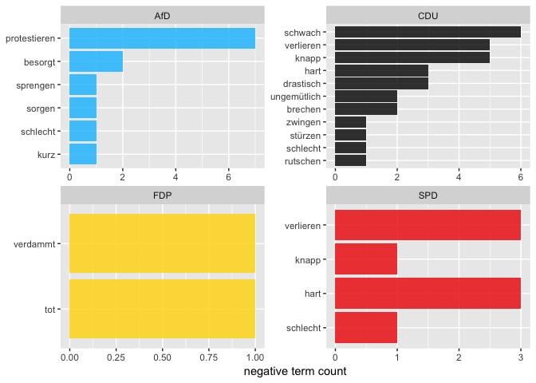
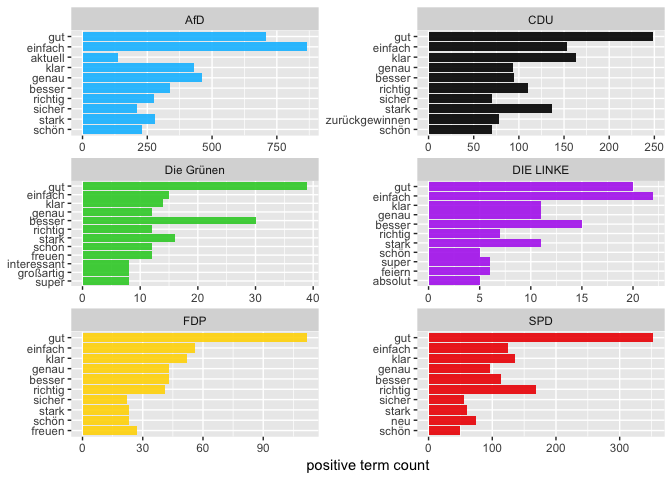

Was wurde am Wahltag getwittert?
================
2017-10-09

Erläuterungen zu den einzelnen Analyseschritten finden Sie [hier](https://franziloew.github.io/politsentiment/)

### Anzahl der gesamten Tweets nach Datum

Wir betrachten einen Zeitraum von 12h (Sonntag, 24.09.2017, 12Uhr - 24Uhr) Pünktlich um 18:00 Uhr zu den ersten Hochrechnungen steigt die Anzahl der Tweets rapide an.



1. Von welchen Plattformen werden die meisten Tweets gesendet?
--------------------------------------------------------------


2. Wer retweeted wen?
---------------------



### Welche Tweets wurden am häufigsten Retweeted?

<!--html_preserve-->
<table class="gmisc_table" style="border-collapse: collapse; margin-top: 1em; margin-bottom: 1em;">
<thead>
<tr>
<th style="border-bottom: 1px solid grey; border-top: 2px solid grey;">
</th>
<th style="border-bottom: 1px solid grey; border-top: 2px solid grey; text-align: center;">
name
</th>
<th style="border-bottom: 1px solid grey; border-top: 2px solid grey; text-align: center;">
text
</th>
<th style="border-bottom: 1px solid grey; border-top: 2px solid grey; text-align: center;">
retweet\_count
</th>
</tr>
</thead>
<tbody>
<tr>
<td style="text-align: left;">
1
</td>
<td style="text-align: left;">
ZDF heute journal
</td>
<td style="text-align: left;">
"Das Land, Herr Gauland, gehört weder Ihnen noch der AfD. Und das Volk erst recht nicht", kommentiert der stellv.… <https://t.co/Y3rZ7QYZK3>
</td>
<td style="text-align: left;">
3902
</td>
</tr>
<tr>
<td style="text-align: left;">
2
</td>
<td style="text-align: left;">
ZDF heute
</td>
<td style="text-align: left;">
"Das Land, Herr Gauland, gehört weder Ihnen noch der AfD. Und das Volk erst recht nicht." Kommentar des stv. ZDF-Ch… <https://t.co/1ZvLZRP1rP>
</td>
<td style="text-align: left;">
3396
</td>
</tr>
<tr>
<td style="text-align: left;">
3
</td>
<td style="text-align: left;">
Kaffeecup
</td>
<td style="text-align: left;">
AfD: Ich bin kein Nazi.

Trump: Ich bin kein Idiot.

Erdogan: Ich bin kein Despot.

BER: Ich bin ein fertiger Flughafen.
</td>
<td style="text-align: left;">
2870
</td>
</tr>
<tr>
<td style="text-align: left;">
4
</td>
<td style="text-align: left;">
Geert Wilders
</td>
<td style="text-align: left;">
PVV nr 2 in The Netherlands FN nr 2 in France FPÖ nr 2 in Austria AfD nr 3 in Germany

The message is clear.

We are no islamic nations.
</td>
<td style="text-align: left;">
2007
</td>
</tr>
<tr>
<td style="text-align: left;">
5
</td>
<td style="text-align: left;">
Frauke Petry
</td>
<td style="text-align: left;">
"Zuerst ignorieren sie dich, dann lachen sie über dich, dann bekämpfen sie dich und dann gewinnst du." - Gandhi. DANKE 🇩🇪🇩🇪🇩🇪🇩🇪 \#Btw17 \#AfD
</td>
<td style="text-align: left;">
1627
</td>
</tr>
<tr>
<td style="border-bottom: 2px solid grey; text-align: left;">
6
</td>
<td style="border-bottom: 2px solid grey; text-align: left;">
ZDF heute
</td>
<td style="border-bottom: 2px solid grey; text-align: left;">
Ströbele empfiehlt, nicht jeden "Furz der AfD" wochenlang zu kommentieren \#btw17 <https://t.co/6ul8l9MQZO>
</td>
<td style="border-bottom: 2px solid grey; text-align: left;">
1366
</td>
</tr>
</tbody>
</table>
<!--/html_preserve-->
3. Über welche Partei wird am meisten getweeted?
------------------------------------------------

Anzahlt gesamte Tweets: <!--html_preserve-->
<table class="gmisc_table" style="border-collapse: collapse; margin-top: 1em; margin-bottom: 1em;">
<tbody>
<tr style="border-top: 2px solid grey;">
<td style="border-top: 2px solid grey; border-bottom: 2px solid grey; text-align: center;">
150825
</td>
</tr>
</tbody>
</table>
<!--/html_preserve-->
``` r
orig %>%
  group_by(partei) %>%
  tally(sort = TRUE)%>%
  ggplot(aes(reorder(partei,n), (n/nrow(orig)))) +
  xlab("") +
  ylab("%Anteil der Tweets") +
  geom_col(fill = c("darkorchid2","gold","black","red2", "deepskyblue1"), alpha = .8) +
  coord_flip()
```



#### Nachrichtendienste

Anzahlt gesamte Tweets: <!--html_preserve-->
<table class="gmisc_table" style="border-collapse: collapse; margin-top: 1em; margin-bottom: 1em;">
<tbody>
<tr style="border-top: 2px solid grey;">
<td style="border-top: 2px solid grey; border-bottom: 2px solid grey; text-align: center;">
604
</td>
</tr>
</tbody>
</table>
<!--/html_preserve-->


#### Andere User-Accounts

Anzahlt gesamte Tweets: <!--html_preserve-->
<table class="gmisc_table" style="border-collapse: collapse; margin-top: 1em; margin-bottom: 1em;">
<tbody>
<tr style="border-top: 2px solid grey;">
<td style="border-top: 2px solid grey; border-bottom: 2px solid grey; text-align: center;">
68071
</td>
</tr>
</tbody>
</table>
<!--/html_preserve-->


4. Wordclouds
-------------

### Nachrichtendienste



### Andere User-Accounts



5. term frequency - inverse document frequency (tf-idf)
-------------------------------------------------------

### Nachrichtendienste


### Andere User-Accounts


6. Sentiment Analyse
--------------------

#### Nachrichtenportale

##### Anzahl negativer Sentiment-Wörter



##### Anzahl positiver Sentiment-Wörter


#### Gewichtete Analyse


#### Was sind die Tweets mit den negativsten/positivsten Werten?

#### CDU

<!--html_preserve-->
<table class="gmisc_table" style="border-collapse: collapse; margin-top: 1em; margin-bottom: 1em;">
<thead>
<tr>
<th style="border-bottom: 1px solid grey; border-top: 2px solid grey;">
</th>
<th style="border-bottom: 1px solid grey; border-top: 2px solid grey; text-align: center;">
partei
</th>
<th style="border-bottom: 1px solid grey; border-top: 2px solid grey; text-align: center;">
word
</th>
<th style="border-bottom: 1px solid grey; border-top: 2px solid grey; text-align: center;">
text
</th>
<th style="border-bottom: 1px solid grey; border-top: 2px solid grey; text-align: center;">
Wert
</th>
</tr>
</thead>
<tbody>
<tr>
<td style="text-align: left;">
1
</td>
<td style="text-align: left;">
CDU
</td>
<td style="text-align: left;">
schwach
</td>
<td style="text-align: left;">
Wahlergebnisse, erste Hochrechnung: CDU am stärksten, SPD schwach auf Platz 2, AfD drittstärkste Kraft: <https://t.co/0KDqKUN1nd>
</td>
<td style="text-align: left;">
-0.9206
</td>
</tr>
<tr>
<td style="text-align: left;">
2
</td>
<td style="text-align: left;">
CDU
</td>
<td style="text-align: left;">
schwach
</td>
<td style="text-align: left;">
Erste Prognose zur \#BTW17: Union vorn, SPD schwach wie nie, AfD auf Platz drei <https://t.co/OmAEeQWTes> <https://t.co/3vEdS8NMHv>
</td>
<td style="text-align: left;">
-0.9206
</td>
</tr>
<tr>
<td style="text-align: left;">
3
</td>
<td style="text-align: left;">
CDU
</td>
<td style="text-align: left;">
schwach
</td>
<td style="text-align: left;">
Erste Prognose: Union vorn, SPD schwach wie nie, AfD auf Platz drei <https://t.co/UqIvJ73NZj> <https://t.co/0f2Vhiqd6v>
</td>
<td style="text-align: left;">
-0.9206
</td>
</tr>
<tr>
<td style="text-align: left;">
4
</td>
<td style="text-align: left;">
CDU
</td>
<td style="text-align: left;">
schwach
</td>
<td style="text-align: left;">
Erste Prognose: CDU vorn, SPD schwach wie nie, AfD auf Platz drei... <https://t.co/oOFDtttx0V>
</td>
<td style="text-align: left;">
-0.9206
</td>
</tr>
<tr>
<td style="text-align: left;">
5
</td>
<td style="text-align: left;">
CDU
</td>
<td style="text-align: left;">
schwach
</td>
<td style="text-align: left;">
Bundestagswahl: Rekordverlust für Union, SPD schwach, AfD stark <https://t.co/g6sY59rT2N> \#btw17
</td>
<td style="text-align: left;">
-0.9206
</td>
</tr>
<tr>
<td style="border-bottom: 2px solid grey; text-align: left;">
6
</td>
<td style="border-bottom: 2px solid grey; text-align: left;">
CDU
</td>
<td style="border-bottom: 2px solid grey; text-align: left;">
schwach
</td>
<td style="border-bottom: 2px solid grey; text-align: left;">
Starke Verluste für die Union, die SPD weiter schwach, AfD dritte Kraft. \#btw17 <https://t.co/lkY9GU3U4m>
</td>
<td style="border-bottom: 2px solid grey; text-align: left;">
-0.9206
</td>
</tr>
</tbody>
</table>
<!--/html_preserve-->
<!--html_preserve-->
<table class="gmisc_table" style="border-collapse: collapse; margin-top: 1em; margin-bottom: 1em;">
<thead>
<tr>
<th style="border-bottom: 1px solid grey; border-top: 2px solid grey;">
</th>
<th style="border-bottom: 1px solid grey; border-top: 2px solid grey; text-align: center;">
partei
</th>
<th style="border-bottom: 1px solid grey; border-top: 2px solid grey; text-align: center;">
word
</th>
<th style="border-bottom: 1px solid grey; border-top: 2px solid grey; text-align: center;">
text
</th>
<th style="border-bottom: 1px solid grey; border-top: 2px solid grey; text-align: center;">
Wert
</th>
</tr>
</thead>
<tbody>
<tr>
<td style="text-align: left;">
1
</td>
<td style="text-align: left;">
CDU
</td>
<td style="text-align: left;">
feiern
</td>
<td style="text-align: left;">
\*\*\* BILDplus Inhalt \*\*\* BILD Analyse - Warum Merkel keinen Grund zum Feiern hat <https://t.co/NhW34DYr96>
</td>
<td style="text-align: left;">
0.494
</td>
</tr>
<tr>
<td style="text-align: left;">
2
</td>
<td style="text-align: left;">
CDU
</td>
<td style="text-align: left;">
feiern
</td>
<td style="text-align: left;">
\#CDU und \#CSU werden nach der \#BTW17 wieder stärkste Kraft. Trotzdem ist nicht allen nach Feiern zumute. <https://t.co/0IV1WWYljk>
</td>
<td style="text-align: left;">
0.494
</td>
</tr>
<tr>
<td style="text-align: left;">
3
</td>
<td style="text-align: left;">
CDU
</td>
<td style="text-align: left;">
fertig
</td>
<td style="text-align: left;">
Thüringen ist fertig mit auszählen \#BTW17: 74,3% Wahlbeteiligung. CDU vor AfD, Linke, SPD und FDP. <https://t.co/tMPO2rOIIC>
</td>
<td style="text-align: left;">
0.3757
</td>
</tr>
<tr>
<td style="text-align: left;">
4
</td>
<td style="text-align: left;">
CDU
</td>
<td style="text-align: left;">
gut
</td>
<td style="text-align: left;">
In Thüringen holt die CDU alle Wahlkreise bei \#BTW17 - Mit welchem Ergebnis ist hier gut zu sehen: <https://t.co/ylIbgkR2OE>
</td>
<td style="text-align: left;">
0.3716
</td>
</tr>
<tr>
<td style="text-align: left;">
5
</td>
<td style="text-align: left;">
CDU
</td>
<td style="text-align: left;">
kräftig
</td>
<td style="text-align: left;">
Große Parteien büßen bei \#btw17 kräftig Stimmen ein. So reagieren Union, SPD, AfD, Linke, FDP und Grüne: <https://t.co/1o2ZfMbam3>
</td>
<td style="text-align: left;">
0.2408
</td>
</tr>
<tr>
<td style="border-bottom: 2px solid grey; text-align: left;">
6
</td>
<td style="border-bottom: 2px solid grey; text-align: left;">
CDU
</td>
<td style="border-bottom: 2px solid grey; text-align: left;">
hoffen
</td>
<td style="border-bottom: 2px solid grey; text-align: left;">
Wen das Ausland wählen würde: Briten hoffen auf FDP, Macron will Merkel – und Putin? <https://t.co/kAM9E34Yet> <https://t.co/8VSwUTrGJ8>
</td>
<td style="border-bottom: 2px solid grey; text-align: left;">
0.2318
</td>
</tr>
</tbody>
</table>
<!--/html_preserve-->
#### SPD

<!--html_preserve-->
<table class="gmisc_table" style="border-collapse: collapse; margin-top: 1em; margin-bottom: 1em;">
<thead>
<tr>
<th style="border-bottom: 1px solid grey; border-top: 2px solid grey;">
</th>
<th style="border-bottom: 1px solid grey; border-top: 2px solid grey; text-align: center;">
partei
</th>
<th style="border-bottom: 1px solid grey; border-top: 2px solid grey; text-align: center;">
word
</th>
<th style="border-bottom: 1px solid grey; border-top: 2px solid grey; text-align: center;">
text
</th>
<th style="border-bottom: 1px solid grey; border-top: 2px solid grey; text-align: center;">
Wert
</th>
</tr>
</thead>
<tbody>
<tr>
<td style="text-align: left;">
1
</td>
<td style="text-align: left;">
SPD
</td>
<td style="text-align: left;">
schlecht
</td>
<td style="text-align: left;">
Grafiken: Warum schnitt die SPD schlecht ab? <https://t.co/6OlwxLIl9N> \#btw17 \#Umfragen \#Grafiken
</td>
<td style="text-align: left;">
-0.7706
</td>
</tr>
<tr>
<td style="text-align: left;">
2
</td>
<td style="text-align: left;">
SPD
</td>
<td style="text-align: left;">
knapp
</td>
<td style="text-align: left;">
Knapp über 20 Prozent: Stunde Null für die SPD <https://t.co/RiJy2ZmKl6> <https://t.co/FyjggUqlvf>
</td>
<td style="text-align: left;">
-0.2036
</td>
</tr>
<tr>
<td style="text-align: left;">
3
</td>
<td style="text-align: left;">
SPD
</td>
<td style="text-align: left;">
hart
</td>
<td style="text-align: left;">
Sozialdemokraten in der Krise - „Verlieren Charakter einer Volkspartei“: SPD-Mann geht hart mit Partei ins Gericht <https://t.co/eroHmldL2k>
</td>
<td style="text-align: left;">
-0.1483
</td>
</tr>
<tr>
<td style="text-align: left;">
4
</td>
<td style="text-align: left;">
SPD
</td>
<td style="text-align: left;">
hart
</td>
<td style="text-align: left;">
SPD in der Krise - „Verlieren Charakter einer Volkspartei“: SPD-Mann geht hart mit Partei ins Gericht <https://t.co/3kLDH5ct02>
</td>
<td style="text-align: left;">
-0.1483
</td>
</tr>
<tr>
<td style="text-align: left;">
5
</td>
<td style="text-align: left;">
SPD
</td>
<td style="text-align: left;">
hart
</td>
<td style="text-align: left;">
Sozialdemokraten in der Krise - „Verlieren Charakter einer Volkspartei“: SPD-Mann geht hart mit Partei ins Gericht <https://t.co/GqhKYFzgIA>
</td>
<td style="text-align: left;">
-0.1483
</td>
</tr>
<tr>
<td style="border-bottom: 2px solid grey; text-align: left;">
6
</td>
<td style="border-bottom: 2px solid grey; text-align: left;">
SPD
</td>
<td style="border-bottom: 2px solid grey; text-align: left;">
genau
</td>
<td style="border-bottom: 2px solid grey; text-align: left;">
Die SPD weiß plötzlich genau, was sie will \#btw17 <https://t.co/F46xGc67UB>
</td>
<td style="border-bottom: 2px solid grey; text-align: left;">
0.004
</td>
</tr>
</tbody>
</table>
<!--/html_preserve-->
<!--html_preserve-->
<table class="gmisc_table" style="border-collapse: collapse; margin-top: 1em; margin-bottom: 1em;">
<thead>
<tr>
<th style="border-bottom: 1px solid grey; border-top: 2px solid grey;">
</th>
<th style="border-bottom: 1px solid grey; border-top: 2px solid grey; text-align: center;">
partei
</th>
<th style="border-bottom: 1px solid grey; border-top: 2px solid grey; text-align: center;">
word
</th>
<th style="border-bottom: 1px solid grey; border-top: 2px solid grey; text-align: center;">
text
</th>
<th style="border-bottom: 1px solid grey; border-top: 2px solid grey; text-align: center;">
Wert
</th>
</tr>
</thead>
<tbody>
<tr>
<td style="text-align: left;">
1
</td>
<td style="text-align: left;">
SPD
</td>
<td style="text-align: left;">
freuen
</td>
<td style="text-align: left;">
Paradoxerweise freuen sich die \#SPD-Mitglieder über den Gang in die Opposition. \#BTW <https://t.co/d1jjMwywEf>
</td>
<td style="text-align: left;">
0.2198
</td>
</tr>
<tr>
<td style="text-align: left;">
2
</td>
<td style="text-align: left;">
SPD
</td>
<td style="text-align: left;">
jubeln
</td>
<td style="text-align: left;">
Wahl-Hammer in Deutschland - Der Moment der Wahrheit: Totenstille bei der SPD - Grüne und FDP jubeln am lautesten <https://t.co/nRfWgi2Pky>
</td>
<td style="text-align: left;">
0.0756
</td>
</tr>
<tr>
<td style="text-align: left;">
3
</td>
<td style="text-align: left;">
SPD
</td>
<td style="text-align: left;">
jubeln
</td>
<td style="text-align: left;">
Wahl-Hammer in Deutschland - Der Moment der Wahrheit: Totenstille bei der SPD - Grüne und FDP jubeln am lautesten <https://t.co/FbVFDismEv>
</td>
<td style="text-align: left;">
0.0756
</td>
</tr>
<tr>
<td style="text-align: left;">
4
</td>
<td style="text-align: left;">
SPD
</td>
<td style="text-align: left;">
genau
</td>
<td style="text-align: left;">
Die SPD weiß plötzlich genau, was sie will \#btw17 <https://t.co/F46xGc67UB>
</td>
<td style="text-align: left;">
0.004
</td>
</tr>
<tr>
<td style="text-align: left;">
5
</td>
<td style="text-align: left;">
SPD
</td>
<td style="text-align: left;">
überholen
</td>
<td style="text-align: left;">
\#Linke könnte \#SPD in \#Berlin überholen. Auch das \#Tegel-Votum lief für Müller nicht wie gewünscht \#BTW17… <https://t.co/MZ8n3kC75q>
</td>
<td style="text-align: left;">
0.004
</td>
</tr>
<tr>
<td style="border-bottom: 2px solid grey; text-align: left;">
6
</td>
<td style="border-bottom: 2px solid grey; text-align: left;">
SPD
</td>
<td style="border-bottom: 2px solid grey; text-align: left;">
gewünscht
</td>
<td style="border-bottom: 2px solid grey; text-align: left;">
\#Linke könnte \#SPD in \#Berlin überholen. Auch das \#Tegel-Votum lief für Müller nicht wie gewünscht \#BTW17… <https://t.co/MZ8n3kC75q>
</td>
<td style="border-bottom: 2px solid grey; text-align: left;">
0.004
</td>
</tr>
</tbody>
</table>
<!--/html_preserve-->
#### FDP

<!--html_preserve-->
<table class="gmisc_table" style="border-collapse: collapse; margin-top: 1em; margin-bottom: 1em;">
<thead>
<tr>
<th style="border-bottom: 1px solid grey; border-top: 2px solid grey;">
</th>
<th style="border-bottom: 1px solid grey; border-top: 2px solid grey; text-align: center;">
partei
</th>
<th style="border-bottom: 1px solid grey; border-top: 2px solid grey; text-align: center;">
word
</th>
<th style="border-bottom: 1px solid grey; border-top: 2px solid grey; text-align: center;">
text
</th>
<th style="border-bottom: 1px solid grey; border-top: 2px solid grey; text-align: center;">
Wert
</th>
</tr>
</thead>
<tbody>
<tr>
<td style="text-align: left;">
1
</td>
<td style="text-align: left;">
FDP
</td>
<td style="text-align: left;">
verdammt
</td>
<td style="text-align: left;">
"Wir sind nicht zum Regieren verdammt, aber wir sind bereit, Verantwortung zu übernehmen"- \#FDP Spitzenkandidat… <https://t.co/eXE7UIjdeZ>
</td>
<td style="text-align: left;">
-0.2925
</td>
</tr>
<tr>
<td style="text-align: left;">
2
</td>
<td style="text-align: left;">
FDP
</td>
<td style="text-align: left;">
tot
</td>
<td style="text-align: left;">
Auferstehung der FDP - Viele hatten sie für tot erklärt. Parteichef Lindner der FDP wieder Leben eingehaucht <https://t.co/pEVEgeQCp7>
</td>
<td style="text-align: left;">
-0.1683
</td>
</tr>
<tr>
<td style="text-align: left;">
3
</td>
<td style="text-align: left;">
FDP
</td>
<td style="text-align: left;">
erklärt
</td>
<td style="text-align: left;">
Auferstehung der FDP - Viele hatten sie für tot erklärt. Parteichef Lindner der FDP wieder Leben eingehaucht <https://t.co/pEVEgeQCp7>
</td>
<td style="text-align: left;">
0.004
</td>
</tr>
<tr>
<td style="text-align: left;">
4
</td>
<td style="text-align: left;">
FDP
</td>
<td style="text-align: left;">
bereit
</td>
<td style="text-align: left;">
"Wir sind nicht zum Regieren verdammt, aber wir sind bereit, Verantwortung zu übernehmen"- \#FDP Spitzenkandidat… <https://t.co/eXE7UIjdeZ>
</td>
<td style="text-align: left;">
0.004
</td>
</tr>
<tr>
<td style="text-align: left;">
5
</td>
<td style="text-align: left;">
FDP
</td>
<td style="text-align: left;">
erklärt
</td>
<td style="text-align: left;">
Bettina Hesch wählt die \#FDP. Was sie sich für Deutschland wünscht, erklärt sie im Video. \#btw17… <https://t.co/xPHOStIMY4>
</td>
<td style="text-align: left;">
0.004
</td>
</tr>
<tr>
<td style="border-bottom: 2px solid grey; text-align: left;">
6
</td>
<td style="border-bottom: 2px solid grey; text-align: left;">
FDP
</td>
<td style="border-bottom: 2px solid grey; text-align: left;">
stolz
</td>
<td style="border-bottom: 2px solid grey; text-align: left;">
FDP-Bundesvize Kubicki: Bin stolz auf meine Partei <https://t.co/TdxHiL6FKh> <https://t.co/VxQWfdmCKa>
</td>
<td style="border-bottom: 2px solid grey; text-align: left;">
0.5161
</td>
</tr>
</tbody>
</table>
<!--/html_preserve-->
<!--html_preserve-->
<table class="gmisc_table" style="border-collapse: collapse; margin-top: 1em; margin-bottom: 1em;">
<thead>
<tr>
<th style="border-bottom: 1px solid grey; border-top: 2px solid grey;">
</th>
<th style="border-bottom: 1px solid grey; border-top: 2px solid grey; text-align: center;">
partei
</th>
<th style="border-bottom: 1px solid grey; border-top: 2px solid grey; text-align: center;">
word
</th>
<th style="border-bottom: 1px solid grey; border-top: 2px solid grey; text-align: center;">
text
</th>
<th style="border-bottom: 1px solid grey; border-top: 2px solid grey; text-align: center;">
Wert
</th>
</tr>
</thead>
<tbody>
<tr>
<td style="text-align: left;">
1
</td>
<td style="text-align: left;">
FDP
</td>
<td style="text-align: left;">
stolz
</td>
<td style="text-align: left;">
FDP-Bundesvize Kubicki: Bin stolz auf meine Partei <https://t.co/TdxHiL6FKh> <https://t.co/VxQWfdmCKa>
</td>
<td style="text-align: left;">
0.5161
</td>
</tr>
<tr>
<td style="text-align: left;">
2
</td>
<td style="text-align: left;">
FDP
</td>
<td style="text-align: left;">
erklärt
</td>
<td style="text-align: left;">
Auferstehung der FDP - Viele hatten sie für tot erklärt. Parteichef Lindner der FDP wieder Leben eingehaucht <https://t.co/pEVEgeQCp7>
</td>
<td style="text-align: left;">
0.004
</td>
</tr>
<tr>
<td style="text-align: left;">
3
</td>
<td style="text-align: left;">
FDP
</td>
<td style="text-align: left;">
bereit
</td>
<td style="text-align: left;">
"Wir sind nicht zum Regieren verdammt, aber wir sind bereit, Verantwortung zu übernehmen"- \#FDP Spitzenkandidat… <https://t.co/eXE7UIjdeZ>
</td>
<td style="text-align: left;">
0.004
</td>
</tr>
<tr>
<td style="text-align: left;">
4
</td>
<td style="text-align: left;">
FDP
</td>
<td style="text-align: left;">
erklärt
</td>
<td style="text-align: left;">
Bettina Hesch wählt die \#FDP. Was sie sich für Deutschland wünscht, erklärt sie im Video. \#btw17… <https://t.co/xPHOStIMY4>
</td>
<td style="text-align: left;">
0.004
</td>
</tr>
<tr>
<td style="text-align: left;">
5
</td>
<td style="text-align: left;">
FDP
</td>
<td style="text-align: left;">
tot
</td>
<td style="text-align: left;">
Auferstehung der FDP - Viele hatten sie für tot erklärt. Parteichef Lindner der FDP wieder Leben eingehaucht <https://t.co/pEVEgeQCp7>
</td>
<td style="text-align: left;">
-0.1683
</td>
</tr>
<tr>
<td style="border-bottom: 2px solid grey; text-align: left;">
6
</td>
<td style="border-bottom: 2px solid grey; text-align: left;">
FDP
</td>
<td style="border-bottom: 2px solid grey; text-align: left;">
verdammt
</td>
<td style="border-bottom: 2px solid grey; text-align: left;">
"Wir sind nicht zum Regieren verdammt, aber wir sind bereit, Verantwortung zu übernehmen"- \#FDP Spitzenkandidat… <https://t.co/eXE7UIjdeZ>
</td>
<td style="border-bottom: 2px solid grey; text-align: left;">
-0.2925
</td>
</tr>
</tbody>
</table>
<!--/html_preserve-->
#### AfD

<!--html_preserve-->
<table class="gmisc_table" style="border-collapse: collapse; margin-top: 1em; margin-bottom: 1em;">
<thead>
<tr>
<th style="border-bottom: 1px solid grey; border-top: 2px solid grey;">
</th>
<th style="border-bottom: 1px solid grey; border-top: 2px solid grey; text-align: center;">
partei
</th>
<th style="border-bottom: 1px solid grey; border-top: 2px solid grey; text-align: center;">
word
</th>
<th style="border-bottom: 1px solid grey; border-top: 2px solid grey; text-align: center;">
text
</th>
<th style="border-bottom: 1px solid grey; border-top: 2px solid grey; text-align: center;">
Wert
</th>
</tr>
</thead>
<tbody>
<tr>
<td style="text-align: left;">
1
</td>
<td style="text-align: left;">
AfD
</td>
<td style="text-align: left;">
schlecht
</td>
<td style="text-align: left;">
Nobis (AfD): Jamaika-Koalition wäre für uns nicht schlecht <https://t.co/KkDruNUBzQ> <https://t.co/S7QQ3819wN>
</td>
<td style="text-align: left;">
-0.7706
</td>
</tr>
<tr>
<td style="text-align: left;">
2
</td>
<td style="text-align: left;">
AfD
</td>
<td style="text-align: left;">
besorgt
</td>
<td style="text-align: left;">
Türkische Gemeinde besorgt wegen AfD: "Nun darf wieder öffentlich darüber nachgedacht werden, Menschen zu entsorgen" <https://t.co/RdgGFXelEC>
</td>
<td style="text-align: left;">
-0.0482
</td>
</tr>
<tr>
<td style="text-align: left;">
3
</td>
<td style="text-align: left;">
AfD
</td>
<td style="text-align: left;">
besorgt
</td>
<td style="text-align: left;">
Juden in Europa besorgt über Wahlerfolg der AfD. Mehr im Dlf24-Liveblog: <https://t.co/pBRIyDpRXB> \#BTW17
</td>
<td style="text-align: left;">
-0.0482
</td>
</tr>
<tr>
<td style="text-align: left;">
4
</td>
<td style="text-align: left;">
AfD
</td>
<td style="text-align: left;">
protestieren
</td>
<td style="text-align: left;">
23:24. Noch immer Protestieren am Alexanderplatz hunderte Menschen gegen die AfD \#87Prozent \#btw17 <https://t.co/MfcpiqoYkm>
</td>
<td style="text-align: left;">
-0.0048
</td>
</tr>
<tr>
<td style="text-align: left;">
5
</td>
<td style="text-align: left;">
AfD
</td>
<td style="text-align: left;">
protestieren
</td>
<td style="text-align: left;">
FOCUS Online vor Ort - AfD feiert auf Wahlparty ihren Sieg - draußen protestieren Hunderte gegen die Partei <https://t.co/cIWY9SQN1A>
</td>
<td style="text-align: left;">
-0.0048
</td>
</tr>
<tr>
<td style="border-bottom: 2px solid grey; text-align: left;">
6
</td>
<td style="border-bottom: 2px solid grey; text-align: left;">
AfD
</td>
<td style="border-bottom: 2px solid grey; text-align: left;">
protestieren
</td>
<td style="border-bottom: 2px solid grey; text-align: left;">
Auch in Köln und Frankfurt am Main protestieren hunderte Menschen gegen die AfD. <https://t.co/XThQyPHYMX> \#btw17
</td>
<td style="border-bottom: 2px solid grey; text-align: left;">
-0.0048
</td>
</tr>
</tbody>
</table>
<!--/html_preserve-->
<!--html_preserve-->
<table class="gmisc_table" style="border-collapse: collapse; margin-top: 1em; margin-bottom: 1em;">
<thead>
<tr>
<th style="border-bottom: 1px solid grey; border-top: 2px solid grey;">
</th>
<th style="border-bottom: 1px solid grey; border-top: 2px solid grey; text-align: center;">
partei
</th>
<th style="border-bottom: 1px solid grey; border-top: 2px solid grey; text-align: center;">
word
</th>
<th style="border-bottom: 1px solid grey; border-top: 2px solid grey; text-align: center;">
text
</th>
<th style="border-bottom: 1px solid grey; border-top: 2px solid grey; text-align: center;">
Wert
</th>
</tr>
</thead>
<tbody>
<tr>
<td style="text-align: left;">
1
</td>
<td style="text-align: left;">
AfD
</td>
<td style="text-align: left;">
zufrieden
</td>
<td style="text-align: left;">
AfD-Landesvorsitzende: "Ich bin zufrieden" <https://t.co/FbmVXxBivn> <https://t.co/NMYXAZHifx>
</td>
<td style="text-align: left;">
0.393
</td>
</tr>
<tr>
<td style="text-align: left;">
2
</td>
<td style="text-align: left;">
AfD
</td>
<td style="text-align: left;">
warm
</td>
<td style="text-align: left;">
Die künftige Bundesregierung muss sich nach Ansicht von \#AfD- Spitzenkandidat Alexander \#Gauland "warm anziehen"… <https://t.co/MRgG4BdId5>
</td>
<td style="text-align: left;">
0.3796
</td>
</tr>
<tr>
<td style="text-align: left;">
3
</td>
<td style="text-align: left;">
AfD
</td>
<td style="text-align: left;">
gut
</td>
<td style="text-align: left;">
Zwischen Protest und purer Verzweiflung: Bei diesen Wählergruppen hat die AfD besonders gut abgeschnitten <https://t.co/NzZI9JqlCx>
</td>
<td style="text-align: left;">
0.3716
</td>
</tr>
<tr>
<td style="text-align: left;">
4
</td>
<td style="text-align: left;">
AfD
</td>
<td style="text-align: left;">
gut
</td>
<td style="text-align: left;">
Warum die AfD bei \#btw17 so gut abgeschnitten hat - Analyse von @BenePeters <https://t.co/H5DswLRIIz>
</td>
<td style="text-align: left;">
0.3716
</td>
</tr>
<tr>
<td style="text-align: left;">
5
</td>
<td style="text-align: left;">
AfD
</td>
<td style="text-align: left;">
reichlich
</td>
<td style="text-align: left;">
Überraschung in Bayern: Die CSU verliert mächtig, rechts von ihr ist reichlich Platz für die AfD. \#btw17 <https://t.co/qN3gfyr2UM>
</td>
<td style="text-align: left;">
0.3617
</td>
</tr>
<tr>
<td style="border-bottom: 2px solid grey; text-align: left;">
6
</td>
<td style="border-bottom: 2px solid grey; text-align: left;">
AfD
</td>
<td style="border-bottom: 2px solid grey; text-align: left;">
gefeiert
</td>
<td style="border-bottom: 2px solid grey; text-align: left;">
Wahlparty der AfD in Berlin - drinnen wird gefeiert, draußen demonstriert. Auch in Köln, Frankfurt und Hamburg komm… <https://t.co/3fwNTSbb7g>
</td>
<td style="border-bottom: 2px solid grey; text-align: left;">
0.3403
</td>
</tr>
</tbody>
</table>
<!--/html_preserve-->
### Andere User-Accounts

#### Ungewichtete Analyse

##### Anzahl negativer Sentiment-Wörter


##### Anzahl positiver Sentiment-Wörter


#### Gewichtete Analyse



#### Was sind die Tweets mit den negativsten/positivsten Werten?

##### CDU

<!--html_preserve-->
<table class="gmisc_table" style="border-collapse: collapse; margin-top: 1em; margin-bottom: 1em;">
<thead>
<tr>
<th style="border-bottom: 1px solid grey; border-top: 2px solid grey;">
</th>
<th style="border-bottom: 1px solid grey; border-top: 2px solid grey; text-align: center;">
partei
</th>
<th style="border-bottom: 1px solid grey; border-top: 2px solid grey; text-align: center;">
word
</th>
<th style="border-bottom: 1px solid grey; border-top: 2px solid grey; text-align: center;">
text
</th>
<th style="border-bottom: 1px solid grey; border-top: 2px solid grey; text-align: center;">
Wert
</th>
</tr>
</thead>
<tbody>
<tr>
<td style="text-align: left;">
1
</td>
<td style="text-align: left;">
CDU
</td>
<td style="text-align: left;">
unnötig
</td>
<td style="text-align: left;">
Wenns danach geht ist jede Form von solo widerstand unnötig und man kann ja eh cdu wählen weil pdl sowieso keine Mehrheit kriegt
</td>
<td style="text-align: left;">
-0.9463
</td>
</tr>
<tr>
<td style="text-align: left;">
2
</td>
<td style="text-align: left;">
CDU
</td>
<td style="text-align: left;">
schädlich
</td>
<td style="text-align: left;">
@45albannach Das meinte ich eigentlich auch mit neu Aufstellen. Die Regierungszeit mit der CDU war sehr schädlich für die Partei.
</td>
<td style="text-align: left;">
-0.9269
</td>
</tr>
<tr>
<td style="text-align: left;">
3
</td>
<td style="text-align: left;">
CDU
</td>
<td style="text-align: left;">
schwach
</td>
<td style="text-align: left;">
Hochrechnungen: Union verliert deutlich, SPD schwach wie nie, AfD auf Platz drei <https://t.co/mIsCVptyvd> via @SPIEGELONLINE
</td>
<td style="text-align: left;">
-0.9206
</td>
</tr>
<tr>
<td style="text-align: left;">
4
</td>
<td style="text-align: left;">
CDU
</td>
<td style="text-align: left;">
schwach
</td>
<td style="text-align: left;">
Erste Ergebnisse in \#Oberhausen: SPD mit historischem Tief, CDU schwach, Triumph für die AfD <https://t.co/dzeRRCfktx>
</td>
<td style="text-align: left;">
-0.9206
</td>
</tr>
<tr>
<td style="text-align: left;">
5
</td>
<td style="text-align: left;">
CDU
</td>
<td style="text-align: left;">
schwach
</td>
<td style="text-align: left;">
Hochrechnungen: Union verliert deutlich, SPD schwach wie nie, AfD auf Platz drei <https://t.co/RhscPQ21lL> via @SPIEGELONLINE
</td>
<td style="text-align: left;">
-0.9206
</td>
</tr>
<tr>
<td style="border-bottom: 2px solid grey; text-align: left;">
6
</td>
<td style="border-bottom: 2px solid grey; text-align: left;">
CDU
</td>
<td style="border-bottom: 2px solid grey; text-align: left;">
schwach
</td>
<td style="border-bottom: 2px solid grey; text-align: left;">
@MoritzvonUslar aber es ist schwach nach 4 jahren groko mit dem finger auf die cdu zu zeigen \#soreloser\#mschulz
</td>
<td style="border-bottom: 2px solid grey; text-align: left;">
-0.9206
</td>
</tr>
</tbody>
</table>
<!--/html_preserve-->
<!--html_preserve-->
<table class="gmisc_table" style="border-collapse: collapse; margin-top: 1em; margin-bottom: 1em;">
<thead>
<tr>
<th style="border-bottom: 1px solid grey; border-top: 2px solid grey;">
</th>
<th style="border-bottom: 1px solid grey; border-top: 2px solid grey; text-align: center;">
partei
</th>
<th style="border-bottom: 1px solid grey; border-top: 2px solid grey; text-align: center;">
word
</th>
<th style="border-bottom: 1px solid grey; border-top: 2px solid grey; text-align: center;">
text
</th>
<th style="border-bottom: 1px solid grey; border-top: 2px solid grey; text-align: center;">
Wert
</th>
</tr>
</thead>
<tbody>
<tr>
<td style="text-align: left;">
1
</td>
<td style="text-align: left;">
CDU
</td>
<td style="text-align: left;">
gelungen
</td>
<td style="text-align: left;">
Den Parteifreunden der CDU Lübeck ist ein Meisterstück gelungen! Prof. Dr. Claudia Schmidtke gewinnt die... <https://t.co/XCjEXcPARz>
</td>
<td style="text-align: left;">
1
</td>
</tr>
<tr>
<td style="text-align: left;">
2
</td>
<td style="text-align: left;">
CDU
</td>
<td style="text-align: left;">
gelungen
</td>
<td style="text-align: left;">
Die CDU hat so sehr keine Lust auf \#JamaikaKoalition...Zumindest der Schachzug ist der SPD gelungen! \#BTW17
</td>
<td style="text-align: left;">
1
</td>
</tr>
<tr>
<td style="text-align: left;">
3
</td>
<td style="text-align: left;">
CDU
</td>
<td style="text-align: left;">
gelungen
</td>
<td style="text-align: left;">
@hessenschauDE Das ist schon der CDU und SPD gelungen
</td>
<td style="text-align: left;">
1
</td>
</tr>
<tr>
<td style="text-align: left;">
4
</td>
<td style="text-align: left;">
CDU
</td>
<td style="text-align: left;">
perfekt
</td>
<td style="text-align: left;">
@gautwin wenn statt cdu es nur csu geben würde = perfekt
</td>
<td style="text-align: left;">
0.7299
</td>
</tr>
<tr>
<td style="text-align: left;">
5
</td>
<td style="text-align: left;">
CDU
</td>
<td style="text-align: left;">
perfekt
</td>
<td style="text-align: left;">
@Cologneandy @torchesinhands @AfD DAS IST NICHT MAL DER PUNKT! Merkel ist auch nicht perfekt, aber nichts ist so sc… <https://t.co/ynX6OkuCu7>
</td>
<td style="text-align: left;">
0.7299
</td>
</tr>
<tr>
<td style="border-bottom: 2px solid grey; text-align: left;">
6
</td>
<td style="border-bottom: 2px solid grey; text-align: left;">
CDU
</td>
<td style="border-bottom: 2px solid grey; text-align: left;">
spannend
</td>
<td style="border-bottom: 2px solid grey; text-align: left;">
@JanHendrik85 @TiloJung Es bleibt spannend. Wenn keiner mit CDU will, dann gibt's vielleicht eine Minderheitenregie… <https://t.co/rHfULAnTGV>
</td>
<td style="border-bottom: 2px solid grey; text-align: left;">
0.7165
</td>
</tr>
</tbody>
</table>
<!--/html_preserve-->
##### SPD

<!--html_preserve-->
<table class="gmisc_table" style="border-collapse: collapse; margin-top: 1em; margin-bottom: 1em;">
<thead>
<tr>
<th style="border-bottom: 1px solid grey; border-top: 2px solid grey;">
</th>
<th style="border-bottom: 1px solid grey; border-top: 2px solid grey; text-align: center;">
partei
</th>
<th style="border-bottom: 1px solid grey; border-top: 2px solid grey; text-align: center;">
word
</th>
<th style="border-bottom: 1px solid grey; border-top: 2px solid grey; text-align: center;">
text
</th>
<th style="border-bottom: 1px solid grey; border-top: 2px solid grey; text-align: center;">
Wert
</th>
</tr>
</thead>
<tbody>
<tr>
<td style="text-align: left;">
1
</td>
<td style="text-align: left;">
SPD
</td>
<td style="text-align: left;">
unnötig
</td>
<td style="text-align: left;">
@southwest\_fool @MartinSchulz Sehe ich beides genauso, SPD muss in die Opposition. Finde allerdings Ton und Wortwahl unnötig.
</td>
<td style="text-align: left;">
-0.9463
</td>
</tr>
<tr>
<td style="text-align: left;">
2
</td>
<td style="text-align: left;">
SPD
</td>
<td style="text-align: left;">
schädlich
</td>
<td style="text-align: left;">
\#BTW17 Der Gang in die \#Opposition ist aus Sicht der \#SPD richtig, für das Land ist dieser Egoismus aber schädlich.
</td>
<td style="text-align: left;">
-0.9269
</td>
</tr>
<tr>
<td style="text-align: left;">
3
</td>
<td style="text-align: left;">
SPD
</td>
<td style="text-align: left;">
schwach
</td>
<td style="text-align: left;">
@extra3 in Deutschland demonstrieren die Leute gegen afd und gehen auf die Straßen und ihr verhöhnt die spd... Schwach...
</td>
<td style="text-align: left;">
-0.9206
</td>
</tr>
<tr>
<td style="text-align: left;">
4
</td>
<td style="text-align: left;">
SPD
</td>
<td style="text-align: left;">
schwach
</td>
<td style="text-align: left;">
@Wintertanne Genau. Wer schwach ist, sollte nicht mitregieren. Dank Schulz ist die SPD nicht nur schwach, sondern vernichtend schwach.
</td>
<td style="text-align: left;">
-0.9206
</td>
</tr>
<tr>
<td style="text-align: left;">
5
</td>
<td style="text-align: left;">
SPD
</td>
<td style="text-align: left;">
schwach
</td>
<td style="text-align: left;">
@Wintertanne Genau. Wer schwach ist, sollte nicht mitregieren. Dank Schulz ist die SPD nicht nur schwach, sondern vernichtend schwach.
</td>
<td style="text-align: left;">
-0.9206
</td>
</tr>
<tr>
<td style="border-bottom: 2px solid grey; text-align: left;">
6
</td>
<td style="border-bottom: 2px solid grey; text-align: left;">
SPD
</td>
<td style="border-bottom: 2px solid grey; text-align: left;">
schwach
</td>
<td style="border-bottom: 2px solid grey; text-align: left;">
@Wintertanne Genau. Wer schwach ist, sollte nicht mitregieren. Dank Schulz ist die SPD nicht nur schwach, sondern vernichtend schwach.
</td>
<td style="border-bottom: 2px solid grey; text-align: left;">
-0.9206
</td>
</tr>
</tbody>
</table>
<!--/html_preserve-->
<!--html_preserve-->
<table class="gmisc_table" style="border-collapse: collapse; margin-top: 1em; margin-bottom: 1em;">
<thead>
<tr>
<th style="border-bottom: 1px solid grey; border-top: 2px solid grey;">
</th>
<th style="border-bottom: 1px solid grey; border-top: 2px solid grey; text-align: center;">
partei
</th>
<th style="border-bottom: 1px solid grey; border-top: 2px solid grey; text-align: center;">
word
</th>
<th style="border-bottom: 1px solid grey; border-top: 2px solid grey; text-align: center;">
text
</th>
<th style="border-bottom: 1px solid grey; border-top: 2px solid grey; text-align: center;">
Wert
</th>
</tr>
</thead>
<tbody>
<tr>
<td style="text-align: left;">
1
</td>
<td style="text-align: left;">
SPD
</td>
<td style="text-align: left;">
gelungen
</td>
<td style="text-align: left;">
Genial: SPD Kandidat in Gelsenkirchen will dass sich die 15% \#AfD der Landtagsw. nicht wiederholen. Gelungen. Es sind jetzt 17%.😂😂😂
</td>
<td style="text-align: left;">
1
</td>
</tr>
<tr>
<td style="text-align: left;">
2
</td>
<td style="text-align: left;">
SPD
</td>
<td style="text-align: left;">
gelungen
</td>
<td style="text-align: left;">
Glückwunsch @MartinSchulz die \#spd abwahl ist gelungen! Beschimpfe nicht Demokraten der \#afd als Nazis nur weil sie… <https://t.co/tkCsILXoMV>
</td>
<td style="text-align: left;">
1
</td>
</tr>
<tr>
<td style="text-align: left;">
3
</td>
<td style="text-align: left;">
SPD
</td>
<td style="text-align: left;">
gelungen
</td>
<td style="text-align: left;">
\#btw2017 \#SPD kann man nur zuraten, dass \#Schulz den Vorsitz abgibt. Kein Zukunftsimpuls gelungen.
</td>
<td style="text-align: left;">
1
</td>
</tr>
<tr>
<td style="text-align: left;">
4
</td>
<td style="text-align: left;">
SPD
</td>
<td style="text-align: left;">
gelungen
</td>
<td style="text-align: left;">
\#btw2017 SPD hat die 20% Hürde übersprungen, damit ist Gang in die Opposition gelungen.
</td>
<td style="text-align: left;">
1
</td>
</tr>
<tr>
<td style="text-align: left;">
5
</td>
<td style="text-align: left;">
SPD
</td>
<td style="text-align: left;">
perfekt
</td>
<td style="text-align: left;">
@SPIEGELONLINE @kuzy Die AfD ist im Bundestag. Die SPD muss Opposition sein. Perfekt. Genau das wollen wir ja. Dank… <https://t.co/lwT5GJVEJD>
</td>
<td style="text-align: left;">
0.7299
</td>
</tr>
<tr>
<td style="border-bottom: 2px solid grey; text-align: left;">
6
</td>
<td style="border-bottom: 2px solid grey; text-align: left;">
SPD
</td>
<td style="border-bottom: 2px solid grey; text-align: left;">
perfekt
</td>
<td style="border-bottom: 2px solid grey; text-align: left;">
@thisishight Ich müsste eigentlich in die spd eintreten, habe die auch gewählt und mein Name passt einfach perfekt hahaha
</td>
<td style="border-bottom: 2px solid grey; text-align: left;">
0.7299
</td>
</tr>
</tbody>
</table>
<!--/html_preserve-->
##### FDP

<!--html_preserve-->
<table class="gmisc_table" style="border-collapse: collapse; margin-top: 1em; margin-bottom: 1em;">
<thead>
<tr>
<th style="border-bottom: 1px solid grey; border-top: 2px solid grey;">
</th>
<th style="border-bottom: 1px solid grey; border-top: 2px solid grey; text-align: center;">
partei
</th>
<th style="border-bottom: 1px solid grey; border-top: 2px solid grey; text-align: center;">
word
</th>
<th style="border-bottom: 1px solid grey; border-top: 2px solid grey; text-align: center;">
text
</th>
<th style="border-bottom: 1px solid grey; border-top: 2px solid grey; text-align: center;">
Wert
</th>
</tr>
</thead>
<tbody>
<tr>
<td style="text-align: left;">
1
</td>
<td style="text-align: left;">
FDP
</td>
<td style="text-align: left;">
unnötig
</td>
<td style="text-align: left;">
@Wurfschuh @annicado Wie unnötig ist dieser Tweet?? Wenn es danach geht, dann haben 90% die FDP nicht gewählt omg
</td>
<td style="text-align: left;">
-0.9463
</td>
</tr>
<tr>
<td style="text-align: left;">
2
</td>
<td style="text-align: left;">
FDP
</td>
<td style="text-align: left;">
unnötig
</td>
<td style="text-align: left;">
fdp auch so unnötig, löscht euch gemeinsam mit afd euch braucht niemand
</td>
<td style="text-align: left;">
-0.9463
</td>
</tr>
<tr>
<td style="text-align: left;">
3
</td>
<td style="text-align: left;">
FDP
</td>
<td style="text-align: left;">
schwach
</td>
<td style="text-align: left;">
FDP ist zu schwach, um mit zu regieren und wieder alle Versprechen zu brechen. Das würde sie doch schnell den Kopf kosten! \#JamaikaKoalition
</td>
<td style="text-align: left;">
-0.9206
</td>
</tr>
<tr>
<td style="text-align: left;">
4
</td>
<td style="text-align: left;">
FDP
</td>
<td style="text-align: left;">
schwach
</td>
<td style="text-align: left;">
Herr Lindner möchte die AfD also 4 Jahre ignorieren? Schwach! \#Berlinerrunde
</td>
<td style="text-align: left;">
-0.9206
</td>
</tr>
<tr>
<td style="text-align: left;">
5
</td>
<td style="text-align: left;">
FDP
</td>
<td style="text-align: left;">
schämen
</td>
<td style="text-align: left;">
\#fdp \#BTW17 Glückwunsch. Verkackt es bitte nicht, ich möchte mich nicht wieder schämen müssen.
</td>
<td style="text-align: left;">
-0.893
</td>
</tr>
<tr>
<td style="border-bottom: 2px solid grey; text-align: left;">
6
</td>
<td style="border-bottom: 2px solid grey; text-align: left;">
FDP
</td>
<td style="border-bottom: 2px solid grey; text-align: left;">
schlecht
</td>
<td style="border-bottom: 2px solid grey; text-align: left;">
Haha, der Benni Strasser hat in seiner Heimatgde. Berg 25% 1. und 18% 2.stimmen für die FDP geholt. Nicht schlecht. <https://t.co/x54UQfRi61>
</td>
<td style="border-bottom: 2px solid grey; text-align: left;">
-0.7706
</td>
</tr>
</tbody>
</table>
<!--/html_preserve-->
<!--html_preserve-->
<table class="gmisc_table" style="border-collapse: collapse; margin-top: 1em; margin-bottom: 1em;">
<thead>
<tr>
<th style="border-bottom: 1px solid grey; border-top: 2px solid grey;">
</th>
<th style="border-bottom: 1px solid grey; border-top: 2px solid grey; text-align: center;">
partei
</th>
<th style="border-bottom: 1px solid grey; border-top: 2px solid grey; text-align: center;">
word
</th>
<th style="border-bottom: 1px solid grey; border-top: 2px solid grey; text-align: center;">
text
</th>
<th style="border-bottom: 1px solid grey; border-top: 2px solid grey; text-align: center;">
Wert
</th>
</tr>
</thead>
<tbody>
<tr>
<td style="text-align: left;">
1
</td>
<td style="text-align: left;">
FDP
</td>
<td style="text-align: left;">
gelungen
</td>
<td style="text-align: left;">
Ein "Turnaround" ist der FDP also gelungen? Sprache, bitte, schöne klare Sprache auch im @ZDF
</td>
<td style="text-align: left;">
1
</td>
</tr>
<tr>
<td style="text-align: left;">
2
</td>
<td style="text-align: left;">
FDP
</td>
<td style="text-align: left;">
gelungen
</td>
<td style="text-align: left;">
Das Comeback ist gelungen: FDP zieht wieder in den Bundestag \#FDP <https://t.co/2ablFjsawv>
</td>
<td style="text-align: left;">
1
</td>
</tr>
<tr>
<td style="text-align: left;">
3
</td>
<td style="text-align: left;">
FDP
</td>
<td style="text-align: left;">
perfekt
</td>
<td style="text-align: left;">
FDP hat 9,9% jetzt ist es perfekt
</td>
<td style="text-align: left;">
0.7299
</td>
</tr>
<tr>
<td style="text-align: left;">
4
</td>
<td style="text-align: left;">
FDP
</td>
<td style="text-align: left;">
wunderbar
</td>
<td style="text-align: left;">
@virindisertus Gleichwohl, ist es wunderbar, mehr Stimmen für die FDP zu sehen, selbst wenn sie ein bisschen zu euroskeptische sind
</td>
<td style="text-align: left;">
0.7234
</td>
</tr>
<tr>
<td style="text-align: left;">
5
</td>
<td style="text-align: left;">
FDP
</td>
<td style="text-align: left;">
wunderbar
</td>
<td style="text-align: left;">
@Dave\_Kay Laut wissenschaftlichen Untersuchungen funktioniert die Strategie der \#FDP ganz wunderbar. <https://t.co/Bjo8AEBPU7> \#btw17
</td>
<td style="text-align: left;">
0.7234
</td>
</tr>
<tr>
<td style="border-bottom: 2px solid grey; text-align: left;">
6
</td>
<td style="border-bottom: 2px solid grey; text-align: left;">
FDP
</td>
<td style="border-bottom: 2px solid grey; text-align: left;">
wunderbar
</td>
<td style="border-bottom: 2px solid grey; text-align: left;">
Wunderbar vorgeführt. DLF \#ChristophHeinemann interviewt \#Afd Pretzell. Heraus kommt: Nichts. Nur Wut und Unmöglichkeit bei Pretzell.
</td>
<td style="border-bottom: 2px solid grey; text-align: left;">
0.7234
</td>
</tr>
</tbody>
</table>
<!--/html_preserve-->
##### AfD

<!--html_preserve-->
<table class="gmisc_table" style="border-collapse: collapse; margin-top: 1em; margin-bottom: 1em;">
<thead>
<tr>
<th style="border-bottom: 1px solid grey; border-top: 2px solid grey;">
</th>
<th style="border-bottom: 1px solid grey; border-top: 2px solid grey; text-align: center;">
partei
</th>
<th style="border-bottom: 1px solid grey; border-top: 2px solid grey; text-align: center;">
word
</th>
<th style="border-bottom: 1px solid grey; border-top: 2px solid grey; text-align: center;">
text
</th>
<th style="border-bottom: 1px solid grey; border-top: 2px solid grey; text-align: center;">
Wert
</th>
</tr>
</thead>
<tbody>
<tr>
<td style="text-align: left;">
1
</td>
<td style="text-align: left;">
AfD
</td>
<td style="text-align: left;">
unnötig
</td>
<td style="text-align: left;">
Aber ganz ehrlich diese ganzen Hashtags gegen AFD sind schon krass unnötig.
</td>
<td style="text-align: left;">
-0.9463
</td>
</tr>
<tr>
<td style="text-align: left;">
2
</td>
<td style="text-align: left;">
AfD
</td>
<td style="text-align: left;">
unnötig
</td>
<td style="text-align: left;">
@AFD201 Stimmt, AfD ist echt unnötig :)
</td>
<td style="text-align: left;">
-0.9463
</td>
</tr>
<tr>
<td style="text-align: left;">
3
</td>
<td style="text-align: left;">
AfD
</td>
<td style="text-align: left;">
unnötig
</td>
<td style="text-align: left;">
Also das Ergebnis der \#AFD bei der \#BTW17 mit dem Jahr 1933 und den Beginn der NS Diktatur zu vergleichen, ist echt unnötig,kindisch & dumm!
</td>
<td style="text-align: left;">
-0.9463
</td>
</tr>
<tr>
<td style="text-align: left;">
4
</td>
<td style="text-align: left;">
AfD
</td>
<td style="text-align: left;">
unnötig
</td>
<td style="text-align: left;">
@Mike\_Stuerzekan @ZitronenChan Ja man, die Afd gefährdet auch unnötig mich und andere... Gibt trzdm gestörte die se wählen xD
</td>
<td style="text-align: left;">
-0.9463
</td>
</tr>
<tr>
<td style="text-align: left;">
5
</td>
<td style="text-align: left;">
AfD
</td>
<td style="text-align: left;">
unnötig
</td>
<td style="text-align: left;">
Wow, Trump wurde gewählt alle in Deutschland rasten unnötig aus. AFD sind 3. Hab bisher 2 gesehen, die es schlecht finden...
</td>
<td style="text-align: left;">
-0.9463
</td>
</tr>
<tr>
<td style="border-bottom: 2px solid grey; text-align: left;">
6
</td>
<td style="border-bottom: 2px solid grey; text-align: left;">
AfD
</td>
<td style="border-bottom: 2px solid grey; text-align: left;">
unnötig
</td>
<td style="border-bottom: 2px solid grey; text-align: left;">
Der Anteil der AfD Stimmen der Wahl kann leider nicht berücksichtigt werden, Teile dieser würden die Öffentlichkeit unnötig verunsichern.
</td>
<td style="border-bottom: 2px solid grey; text-align: left;">
-0.9463
</td>
</tr>
</tbody>
</table>
<!--/html_preserve-->
<!--html_preserve-->
<table class="gmisc_table" style="border-collapse: collapse; margin-top: 1em; margin-bottom: 1em;">
<thead>
<tr>
<th style="border-bottom: 1px solid grey; border-top: 2px solid grey;">
</th>
<th style="border-bottom: 1px solid grey; border-top: 2px solid grey; text-align: center;">
partei
</th>
<th style="border-bottom: 1px solid grey; border-top: 2px solid grey; text-align: center;">
word
</th>
<th style="border-bottom: 1px solid grey; border-top: 2px solid grey; text-align: center;">
text
</th>
<th style="border-bottom: 1px solid grey; border-top: 2px solid grey; text-align: center;">
Wert
</th>
</tr>
</thead>
<tbody>
<tr>
<td style="text-align: left;">
1
</td>
<td style="text-align: left;">
AfD
</td>
<td style="text-align: left;">
gelungen
</td>
<td style="text-align: left;">
Der AfD ist es gelungen, frühere Nichtwähler zu mobilisieren. Die Wähler, die Partei und Vertreter müssen respektiert werden \#btw2017
</td>
<td style="text-align: left;">
1
</td>
</tr>
<tr>
<td style="text-align: left;">
2
</td>
<td style="text-align: left;">
AfD
</td>
<td style="text-align: left;">
gelungen
</td>
<td style="text-align: left;">
Bouffier: Der \#AfD sei es offenbar gelungen, das gesamte Unbehagen über die große Koalition einzusammeln. \#btw17 (Thread Ende)
</td>
<td style="text-align: left;">
1
</td>
</tr>
<tr>
<td style="text-align: left;">
3
</td>
<td style="text-align: left;">
AfD
</td>
<td style="text-align: left;">
gelungen
</td>
<td style="text-align: left;">
Der AfD ist es gelungen, sich als Opfer eines Establishments zu stilisieren. Mit mehr als 13% ist die Partei im Parlament vertreten.
</td>
<td style="text-align: left;">
1
</td>
</tr>
<tr>
<td style="text-align: left;">
4
</td>
<td style="text-align: left;">
AfD
</td>
<td style="text-align: left;">
gelungen
</td>
<td style="text-align: left;">
Eines muss man der \#AFD zugute halten. Sie haben es geschafft ihre Wähler zu mobilsieren. Was den großen wohl nicht gelungen ist.
</td>
<td style="text-align: left;">
1
</td>
</tr>
<tr>
<td style="text-align: left;">
5
</td>
<td style="text-align: left;">
AfD
</td>
<td style="text-align: left;">
perfekt
</td>
<td style="text-align: left;">
Wo @guardian recht hat: AfD ist auf jeden Fall braun. @dieLinke linksradikal? Eher weniger. Aber farblich perfekt!… <https://t.co/ememt3SnI4>
</td>
<td style="text-align: left;">
0.7299
</td>
</tr>
<tr>
<td style="border-bottom: 2px solid grey; text-align: left;">
6
</td>
<td style="border-bottom: 2px solid grey; text-align: left;">
AfD
</td>
<td style="border-bottom: 2px solid grey; text-align: left;">
perfekt
</td>
<td style="border-bottom: 2px solid grey; text-align: left;">
Passt perfekt! \#AfD \#BTW17 <https://t.co/uvGtEkTXOq>
</td>
<td style="border-bottom: 2px solid grey; text-align: left;">
0.7299
</td>
</tr>
</tbody>
</table>
<!--/html_preserve-->
