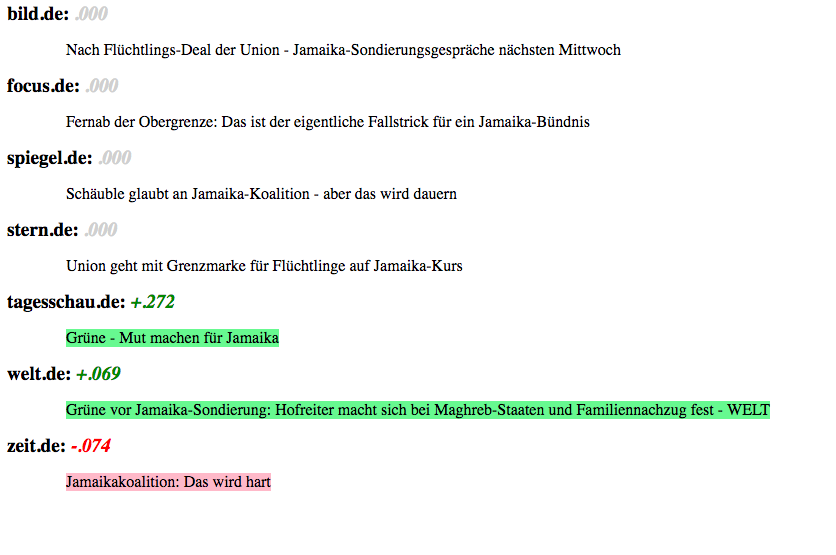
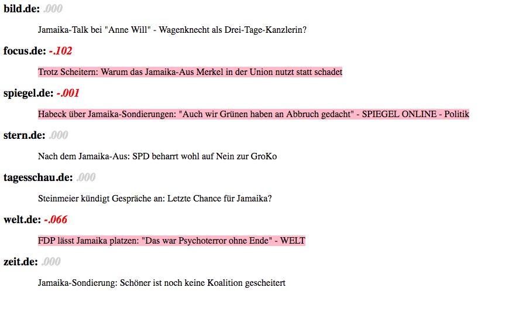

Zur Analyse von "rohem" Text - also Text der keinerlei Bewertungsschema mitliefert - wird häufig die sog. Sentimentanalyse verwendet. Mittels der Sentimentanalyse versucht man, Stimmungen in Texten zu analysieren um zu erkennen, ob ein Text eine positive oder negative Stimmung oder Meinung ausdrückt.

Leider führen viele bestehende Software-Tools nur einen einfachen Wörterbuch-"Lookup" durch, bei dem ein "Sentiment Score" auf Grundlage einer zusammengesetzte Punktzahl berechnet wird, die auf der Anzahl der Vorkommen positiver und negativer Wörter basiert. Das führt aber häufig zu "false positives", denn für eine solche Analyse macht es keinen Unterschied, ob in einem Text "zufrieden" oder "nicht zufrieden" steht. Beispielsweise würde der Satz "Ich bin damit zufrieden" und "Damit bin ich überhaupt nicht zufrieden" gleich bewertet werden. 

Das R-packet [sentimentr](https://github.com/trinker/sentimentr) versucht dieses Problem zu umgehen, indem die Textpolarität auf Satzebene berechnet wird. Optional kann auch nach Zeilen oder Gruppierungsvariablen aggregiert werden. Der Algorithmus von sentimentr versucht, Valenzverschieber (d.h. Negatoren, Verstärker, De-Verstärker (Downtoners) und negative Konjunktionen) zu berücksichtigen. 

In diesem Blogbeitrag untersuche ich, wie gut dieses Paket auch für deutsche Texte verwendet werden kann. Hierfür untersuche ich Überschriften von bekannten deutschen online Nachrichtendiensten zu den Jamaika-Koalitionsverhandlungen zu zwei unterschiedlichen Zeitpunkten:

  1. In der Zeit nach der Bundestagswahl (24.09.2017 -15.10.2017)
  2. In den Tagen nach Bekanntgabe des Scheiterns der Verhandlungen (20.11.2017-22.11.2017)

```{r}
knitr::opts_chunk$set(eval = TRUE, warning = FALSE, message = FALSE)
```

```{r}
# if (!require("pacman")) install.packages("pacman")
# pacman::p_load_current_gh("trinker/lexicon", "trinker/sentimentr")

pacman::p_load(sentimentr)
library(magrittr)
library(dplyr)
library(ggplot2)
library(readr)
library(stringr)
library(RColorBrewer) 
library(plotly)

# Load Data
rm(list=ls())
load("../textmining/paper/output/btw_combined.Rda")

set.seed(5555)
col <- brewer.pal(7,"Dark2")
```

## Datensatz

Der Datensatz beinhaltet online Nachrichten bekannter Nachrichtenplattformen aus dem Ressort "Politik Inland". Zunächst filter ich alle Artikel, die das Wort "Jamaika" im Titel haben für die beiden Zeitpunkte.  
```{r}
btw %>%
  filter(date >= as.Date("2017-09-24")) %>%
  filter(date <= as.Date("2017-10-15")) %>%
  filter(grepl("jamaika", title, ignore.case = TRUE)) %>%
  mutate(title_text = paste(title, text, sep=". ")) %>%
  select(date, site,title, title_text) -> jamaika1

btw %>%
  filter(date > as.Date("2017-11-19")) %>%
  filter(grepl("jamaika", title, ignore.case = TRUE)) %>%
  mutate(title_text = paste(title, text, sep=". ")) %>%
  select(date, site,title, title_text) -> jamaika2
```

Ich habe die Zeiträume so gewählt, dass die Anzahlt der Artikel vergleichbar ist. 

```{r}
p <- bind_rows(jamaika1, jamaika2, .id="time") %>%
  group_by(date, site) %>%
  summarise(obs = n()) %>%
  ggplot(aes(date, obs, fill = site)) +
  geom_col(alpha=.8) +
  scale_fill_manual(values = col) +
  theme(legend.position="none") +
  labs(x="", y="Count",color="")

ggplotly(p, tooltip = c("site"))
```

## Wörterbuch konfigurieren

Das Package bietet einen einfachen Weg, ein neues Wörterbuch zu erstellen um so den Polaritäts- oder Valenzverschieber zu beeinflussen. Ich verwenden das Lexikon der [Leipzig Corpora Collection](http://wortschatz.uni-leipzig.de/de/download)

```{r}
# Load dictionaries (from: http://wortschatz.uni-leipzig.de/de/download)
neg_df <- read_tsv("dict/SentiWS_v1.8c_Negative.txt", col_names = FALSE)
pos_df <- read_tsv("dict/SentiWS_v1.8c_Positive.txt", col_names = FALSE)

sentiment_df <- bind_rows(neg_df,pos_df)
names(sentiment_df) <- c("Wort_POS", "polarity", "Inflektionen")

sentiment_df %>% 
  mutate(words = str_sub(Wort_POS, 1, regexpr("\\|", .$Wort_POS)-1),
         words = tolower(words)
         #POS = str_sub(Wort_POS, start = regexpr("\\|", .$Wort_POS)+1)
         ) %>%
  select(words, polarity) -> sentiment_df

sentiment_df <- rbind(sentiment_df, c("nicht",-0.8))

sentiment_df %>% mutate(polarity = as.numeric(polarity)) %>%
  as_key() -> sentiment_df
```

## Sentimentanalyse mit sentimentr

Zunächst möchte ich überprüfen, ob der Algorithmus des Paketes sinnvolle Ergebnisse liefert. sentimentr bietet zwei Funktionen zur Sentimentanalyse: 1. sentiment_by() und 2. sentiment()

Mit sentiment_by kann ein aggregierter (gemittelter) Sentiment Score für einen gegebenen Text
berechnet werden. Mit sentiment() wird der Gefühlswert auf Satzebene ermittelt. 

Zunächst mal englischer Text mit dem build-in Wörterbuch: 

```{r}
'I am not very happy. He is very happy' %>% sentiment_by(by=NULL)
```

```{r}
'I am not very happy. He is very happy' %>% sentiment()
```

Die Sentimentanalyse auf Satzebene liefert bessere Ergebnisse. Wie sieht es aus, wenn wir einen deutschen Text nehmen, und unser selbst konfiguriertes Wörterbuch verwenden?

```{r}
'Ich bin nicht sehr zufrieden. Er ist sehr zufrieden' %>% sentiment(polarity_dt = sentiment_df)
```

Scheint ebenfalls zu funktionieren. Mit Hilfe der Funktion extract_sentiment_terms() kann überprüft werden, welche Worte negativ und positiv bewertet wurden.  

```{r}
'Ich bin nicht sehr zufrieden. Er ist sehr zufrieden' %>% extract_sentiment_terms(polarity_dt = sentiment_df) -> test

do.call(rbind, test)
```

## Anwendung auf den Datensatz

Ich verwende die Funktion sentiment_by um die Analyse nach den einzelnen Newsplattformen zu aggregieren. Um diese Analyse auf Satzebene durchzuführen, werden die Titel zunächst nach Sätzen aufgespalten. 

Die ermittelte Grafik zeigt den durchschnittlichen Sentimentwert für den Zeitraum (rote Punkte). Wenn man über die Punkte fährt, werden die Titel angezeigt. 

### Zeitraum 1

Zunächst die Titel der online Nachrichten im 1. Zeitraum: 
```{r}
jamaika1 %>% 
  mutate(title_split = get_sentences(title)) %$%
  sentiment(title_split,
               polarity_dt = sentiment_df) -> jamaika_sentiment1
  
jamaika1$element_id <- as.numeric(rownames(jamaika1))
jamaika1 <- left_join(jamaika1, jamaika_sentiment1 %>%
                        select(element_id, sentiment),
                      by="element_id")
jamaika1 %>%
  group_by(site) %>%
  mutate(ave_sentiment = mean(sentiment)) -> plot_jamaika1
```

```{r}
p1 <- plot_jamaika1 %>%
  ggplot(aes(sentiment, site, text=title)) +
  geom_point(color="blue", alpha=.5, shape=1) +
  geom_point(aes(ave_sentiment, site), color="red", size=2) +
  xlim(c(-0.3,0.3)) +
  labs(y="")

ggplotly(p1)
```

We may wish to see the output from sentiment_by line by line with positive/negative sentences highlighted. The highlight function wraps a sentiment_by output to produces a highlighted HTML file (positive = green; negative = pink). Here we look at two random articles

Um du Bewertung durch den Algorithmus Satz für Satz zu überprüfen, können wir die highlight() Funktion vernwenden, welche positive/negative Sätze hervorhebt. Hierfür schaue ich mir zufällig gewählte Titel aus: 

```{r}
jamaika1 %>% 
  group_by(site) %>%
  sample_n(1) %>%
  mutate(title_split = get_sentences(title)) %$%
  sentiment_by(title_split, site,
               polarity_dt = sentiment_df) %>%
  sentimentr::highlight()
```


### Zeitraum 2

```{r}
jamaika2 %>% 
  mutate(title_split = get_sentences(title)) %$%
  sentiment(title_split,
               polarity_dt = sentiment_df) -> jamaika_sentiment2
  
jamaika2$element_id <- as.numeric(rownames(jamaika2))
jamaika2 <- left_join(jamaika2, jamaika_sentiment2 %>%
                        select(element_id, sentiment),
                      by="element_id")
jamaika2 %>%
  group_by(site) %>%
  mutate(ave_sentiment = mean(sentiment)) -> plot_jamaika2
```

```{r}
p2 <- plot_jamaika2 %>%
  ggplot(aes(sentiment, site, text=title)) +
  geom_point(color="blue", alpha=.5, shape=1) +
  geom_point(aes(ave_sentiment, site), color="red", size=2) +
  xlim(c(-0.3,0.3)) +
  labs(y="")

ggplotly(p2)
```

```{r}
jamaika2 %>%
  group_by(site) %>%
  sample_n(1) %>%
  mutate(title_split = get_sentences(title)) %$%
  sentiment_by(title_split, site, 
               polarity_dt = sentiment_df) %>%
  sentimentr::highlight()
```


